# Globus Tutorials for UAB Research Organizations

This tutorial is designed to guide UAB research managers, such as Lab PIs, Core Directors, and their management staff, to help them set up and use Globus Connect Personal (GCP) for secure data sharing on their local/personal computers. GCP allows you to share data with collaborators efficiently meeting security and compliance standards for file sharing.

If you are new to Globus, we recommend starting with our [Globus Tutorials for Individual Researchers](./globus_individual_tutorial.md) first to familiarize yourself with how Globus is used. When those are complete, we then recommend following the tutorials on this page in order from start to finish, as later tutorials assume the previous tutorials have been completed.

Topics covered:

1. [Why Globus?](#why-globus)
1. [How Does Globus Work?](#how-does-globus-work)
1. [Tutorial Prerequisites](#tutorial-prerequisites)
1. [How Do I Get onto the Globus Web App?](#how-do-i-get-onto-the-globus-web-app)
1. [How Do I Install Globus Connect Personal?](#how-do-i-install-globus-connect-personal)
    - [Windows](#installing-gcp-on-windows)
    - [MacOS](#installing-gcp-on-macos)
1. [How Do I Choose Specific Folders to Share Using Globus Connect Personal?](#how-do-i-choose-specific-folders-to-share-using-globus-connect-personal)
    - [Windows](#choose-specific-folders-on-windows)
    - [MacOS](#choose-specific-folders-on-macos)
1. [How Do I Find Collections I Created or Own?](#how-do-i-find-collections-i-created-or-own)
1. [How Do I Enable Sharing for My Globus Account?](#how-do-i-enable-collection-sharing-for-my-globus-account)
1. [How Do I Create a Collection?](#how-do-i-create-a-collection)
1. [How Do I Share a Collection with Others?](#how-do-i-share-a-collection-with-others)
1. [How Do I Share Data with a Research Core Customer?](#how-do-i-share-data-with-a-research-core-customer)

## Why Globus?

Globus is a data transfer ecosystem that simplifies the process of transferring, sharing, and managing large datasets. It is used by research institutions around the world to move research data between different storage devices, computer systems, and institutions. Globus has many research data oriented features, making it ideal for many research data transfer scenarios. Below is a list of features.

- Straight-forward, browser-based interface.
- Compatible with [Long-Term Storage](../../lts/index.md).
- Can be used to share data with Research Core customers.
- Can be used to transfer data between lab workstations, servers, and Cheaha.
- Transfers are automatically retried in the event of network or computer system outages.
- Transfers are encrypted end-to-end. Globus never sees your data.
- Suitable for transferring PHI and HIPAA data. Note: a UAB Enterprise IT risk assessment is required.

## How Does Globus Work?

Globus is an ecosystem of software intended to make research data transfer simpler. The Globus Web Application (Web App) at <https://app.globus.org> allows you to initiate transfers between any two Collections you have authorization to access. The Globus Connect Personal (GCP) and Globus Connect Server (GCS) software let you turn any computer into a Globus Collection. At no point do Globus servers touch your research data. Instead, when you initiate a transfer between two Collections, the Globus application tells the two Collections that they need to talk to each other and data is sent directly between them. The Collections update the application with information you may need to know, such as how much data has transferred so far, how fast the transfer is proceeding, and any errors that occur. If the connection between Collections is interrupted for any reason, the Globus application will attempt to restart the transfer from where it left off.

## Tutorial Prerequisites

For these tutorials, you will need your BlazerID or [XIAS ID](../../../account_management/xias/index.md) and password to authenticate using UAB Single Sign-On (SSO).

## How Do I Get onto the Globus Web App?

To learn how to get onto the Globus Web App [Globus Tutorials for Individual Researchers Page](./globus_individual_tutorial.md#how-do-i-get-onto-the-globus-web-app). Please visit that link and then return here when you have finished.

[Return to the top](#globus-tutorials-for-uab-research-organizations).

## How Do I Install Globus Connect Personal?

Globus Connect Personal (GCP) is available to install on the following Operating Systems. Linux is also available, but we do not cover the installation process here. If you need to install GCP on Linux, please refer to the [official documentation](https://docs.globus.org/globus-connect-personal/install/linux/).

Managing data for a Research Core? Please stop here. You should know that Globus Connect Personal is _not_ suitable for production use with customers. Please [Contact Support](../../../help/support.md#how-do-i-create-a-support-ticket) to discuss setting up Globus Connect Server for your Research Core.

Representing a lab? Globus Connect Personal may be suitable for your use case. If you transfer data infrequently, or transfer small amounts of data, then GCP is probably sufficient. If you frequently transfer large amounts of data, then Globus Connect Server can enable higher data transfer rates through parallelization. Please [Contact Support](../../../help/support.md) if you want to discuss installation of Globus Connect Server.

GCP installation instructions for:

- [Windows](#installing-gcp-on-windows)
- [MacOS](#installing-gcp-on-macos)

[Return to the top](#globus-tutorials-for-uab-research-organizations).

### Installing GCP On Windows

The following steps will guide you to install Globus Connect Personal (GCP) on your computer running Windows.

1. Navigate to the [Globus Connect Personal official page](https://www.globus.org/globus-connect-personal) and scroll down to find the GCP Windows version. Click on the "INSTALL NOW" button in the red box, as shown in the image below, to be taken to the official installation instructions and download link for GCP for Windows. The "INSTALL NOW" button is located below the text "Globus Connect Personal for Windows".

    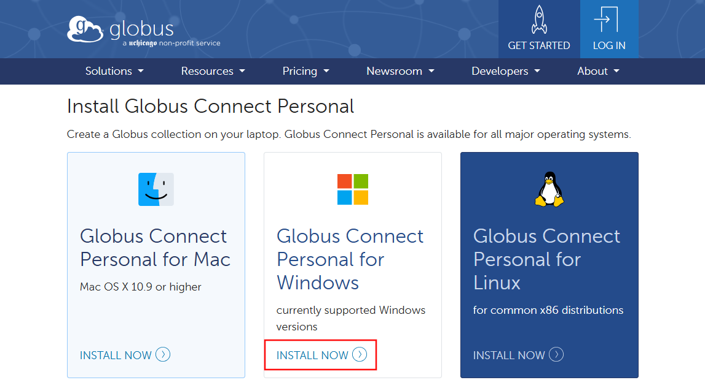

1. Click the "Download Globus Connect Personal" link on the instructions page, as shown below. This will redirect you to the GCP for Windows installer.

    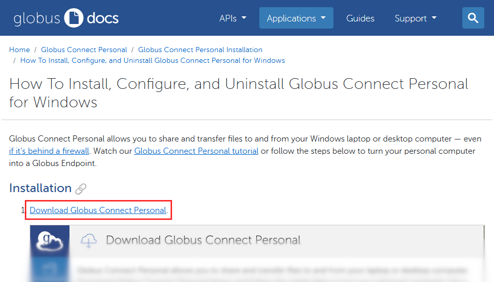

1. As shown in the image below, click the "Download Globus Connect Personal for Windows" button to download the installer to download the installer to your computer.

    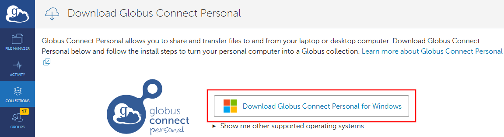

1. Find the installer on your computer and open it. Select where you would prefer to have your GCP installed and click the "Install" button.

    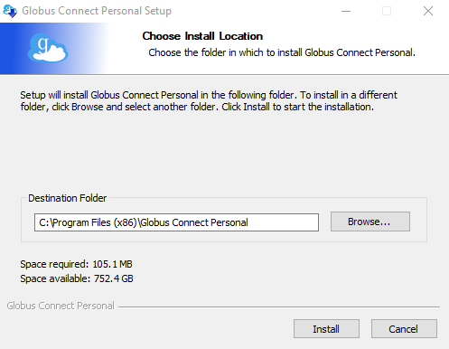

    Please note you must have administrator permissions, to do this. If you are unable to do so, you will need to contact the IT department responsible for managing your computer.

1. When the installation is complete, click the "Finish" button to complete the GCP installation.

    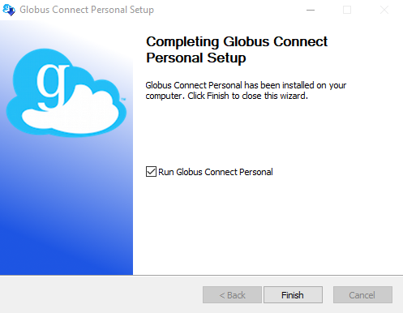

1. Following installation, GCP will launch in a new window. If it does not, look for it in your Start Menu.

    When GCP has started, click the "Log In" button to authenticate with Globus to begin the Collection setup process. This is a one-time setup to configure GCP to allow your machine to act as a Collection, enabling research data transfer with your computer.

    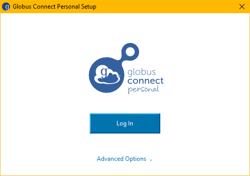

    Note that if you uninstall and reinstall GCP, you will need to complete this process again. You should not need to repeat this process otherwise.

1. Grant the required consents. This is required to set up your computer as a Collection. Also provide a name for your consents. We recommend choosing a name that is short, memorable, and related to the purpose for the Collection.

    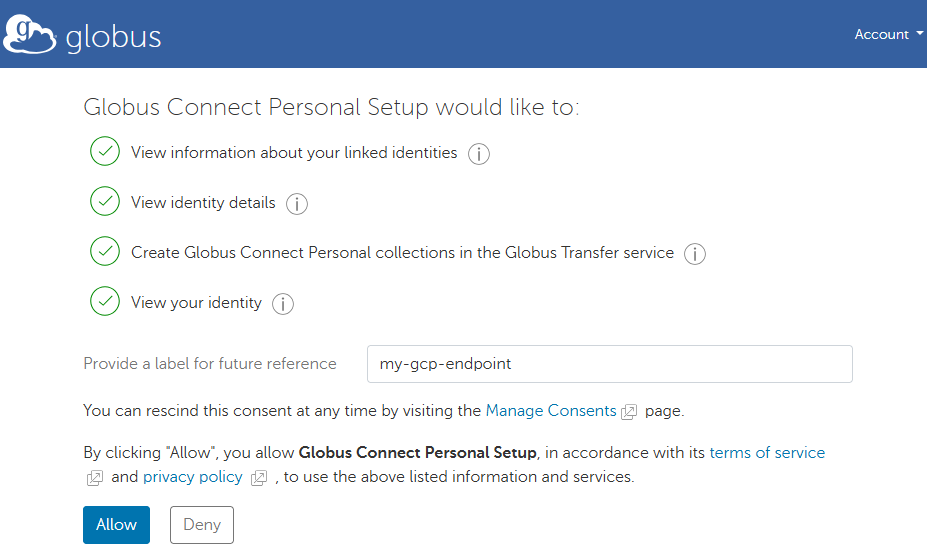

1. Enter the details for your GCP Collection, and click save to continue. The following list describes the fields in the form shown below.

    - **Owner Identity:** is the person responsible for this Collection. This field should already be filled with UAB Campus or XIAS email address. If not, please select that email address here.
    - **Collection Name:** is the name for the Collection. This should be filled with the name of the Collection from the previous step.
    - **Description:** Feel free to enter descriptive information about the Collection here. This information will be displayed in the Globus Web App when the Collection is viewed by others.
    - **High Assurance:** Only check this box if the Collection has or will have PHI, HIPAA, or other protected data. If this is the case, please ensure that you have already completed a risk assessment with UAB Enterprise IT.

    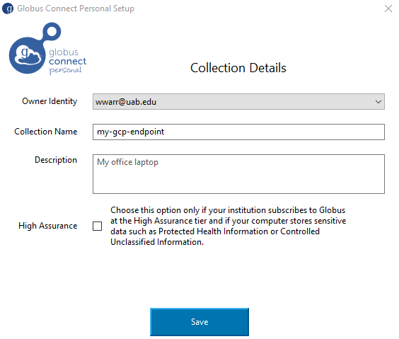

1. GCP Setup is now complete on your computer. Your computer is now serving your new Globus Collection and may be used to transfer data. Click "Exit Setup" to close the window.

1. After installation, locate your Windows System Tray. In it you should see a white lowercase letter "g" in a filled blue circle. If you do not, try finding the Globus Connect Personal application in your start menu and starting the application.

    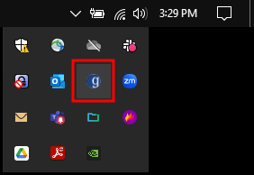

By default your Documents folder (typically `C:/Users/%username%/Documents`) is listed in your new Globus Collection. To change it continue on with [How Do I Choose Specific Folders Using Globus Connect Personal?](#how-do-i-choose-specific-folders-to-share-using-globus-connect-personal)

[Return to the top](#globus-tutorials-for-uab-research-organizations).

### Installing GCP On MacOS

The following steps will guide you to install Globus Connect Personal (GCP) on your computer running MacOS.

1. Navigate to the [Globus Connect Personal official page](https://www.globus.org/globus-connect-personal) and scroll down to find the GCP MacOS version. Click on the "INSTALL NOW" button in the red box in the image below to be taken to the official installation instructions and download link for GCP for MacOS. The "INSTALL NOW" button is located below the text "Globus Connect Personal for Mac".

    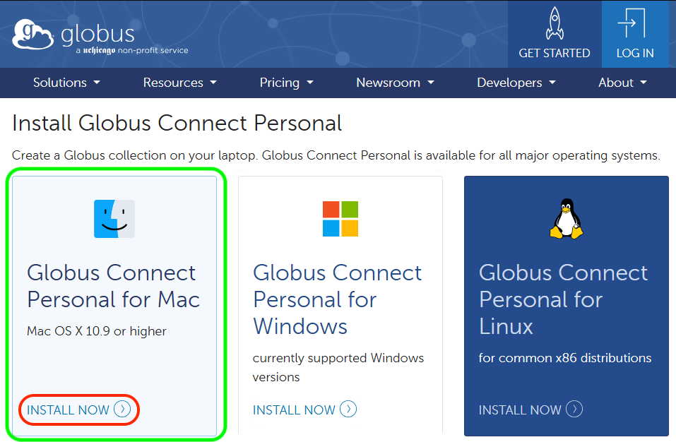

1. Click the "Download Globus Connect Personal" link on the instructions page, as shown below. This will redirect you to the GCP for MacOS installer.

    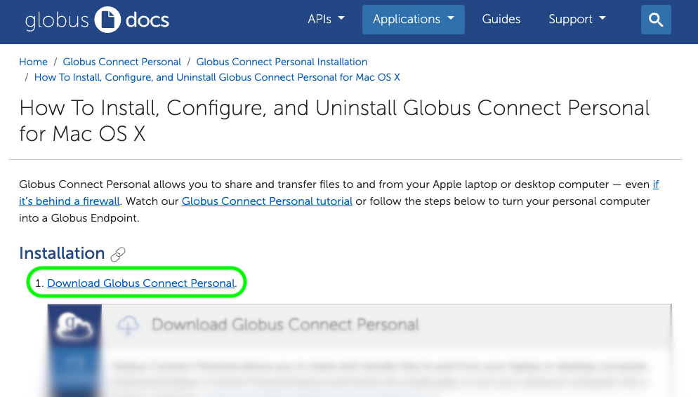

1. As shown in the image below, click the "Download Globus Connect Personal for MacOS" button to download the installer to download the installer to your computer.

    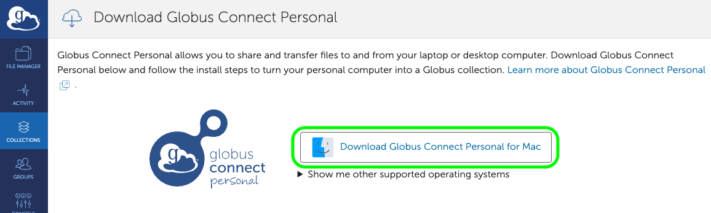

1. Find the installer on your computer and open it. A new window will pop-up asking you to drag the Globus Connect Personal app into the Application folder on your computer. Do so to install GCP.

    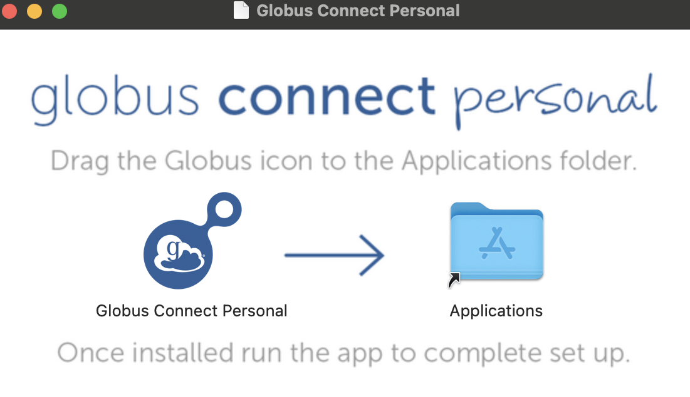

1. When the above step is completed navigate to your Application folder and look for the "Globus Connect Personal" application. Open it to proceed.

    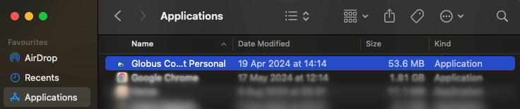

1. When GCP has started, click on "Log In" to authenticate with Globus to begin the Collection setup process. This is a one-time setup to configure GCP to allow your machine to act as a Collection, enabling research data transfer with your computer.

    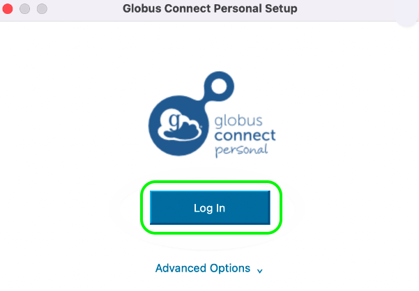

    Note that if you uninstall and reinstall GCP, you will need to complete this process again. You should not need to repeat this process otherwise.

1. Grant the required consents. This is required to set up your computer as a Collection. Also provide a name for your Collection. We recommend choosing a name that is short, memorable, and related to the purpose for the Collection.

    

1. Enter the details for your GCP Collection, and click save to continue. The following list describes the fields in the form shown below.

    - **Owner Identity:** is the person responsible for this Collection. This field should already be filled with UAB Campus or XIAS email address. If not, please select that email address here.
    - **Collection Name:** is the name for the Collection. This should be filled with the name of the Collection from the previous step.
    - **Description:** Feel free to enter descriptive information about the Collection here. This information will be displayed in the Globus Web App when the Collection is viewed by others.
    - **High Assurance:** Only check this box if the Collection has or will have PHI, HIPAA, or other protected data. If this is the case, please ensure that you have already completed a risk assessment with UAB Enterprise IT.

    

1. GCP Setup is now complete on your computer. Your computer is now serving your new Globus Collection and may be used to transfer data. Click "Exit Setup" to close the window.

1. After installation locate your MacOS notification, generally at the top-right of your display. In it you should see a white lowercase letter "g" in a fille black circle.

    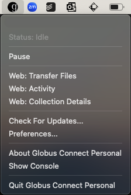

By default the `/Users/` folder is listed in your new Globus Collection. To change it continue on with [How Do I Share Specific Folders Using Globus Connect Personal?](#how-do-i-choose-specific-folders-to-share-using-globus-connect-personal)

[Return to the top](#globus-tutorials-for-uab-research-organizations).

## How Do I Choose Specific Folders to Share Using Globus Connect Personal?

Please follow the instructions in this section to share a folder on your computer with others through your [Globus Connect Personal (GCP) Collection](#how-do-i-install-globus-connect-personal).

We have instructions for the following Operating Systems.

- [Windows](#choose-specific-folders-on-windows)
- [MacOS](#choose-specific-folders-on-macos)

[Return to the top](#globus-tutorials-for-uab-research-organizations).

### Choose Specific Folders on Windows

1. In your Windows system tray, locate the icon that looks like a small letter "g" in a circle. This is the icon for Globus Connect Personal. If you cannot locate the icon in the system tray, then open the Globus Connect Personal app on your computer and look for it again.

    

1. Right-click the icon to open the context menu and click "Options...".

    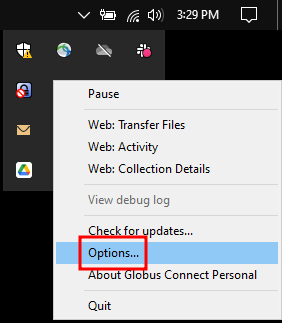

1. A new window will appear with a tab labelled Access. In the Access tab is an interface to configure folders available on your GCP Collection. For most use cases, you should not check the writeable checkbox. Below is a summary of what each part of the menu does.

   - **(1) Accessible Folders** table with Folder, Shareable and Writeable columns. Any folder listed here will appear on your GCP Collection. Your research data folder or directories must be listed here to be shareable.
   - **(2) Shareable** column checkboxes controlling which folders can be shared with other users. Each of your research data directories must have this checkbox ticked to be shareable from the Collection. **Check this box only if you want to share your data with others.**
   - **(3) Writeable** column checkboxes controlling which folders can be written to by other users. If a folder is shared with other users, then they will be able to add, delete, or change the contents. We recommend against ticking these boxes for Research Cores serving data to customers. **Check this box only if you want others to be able to change your data.**
   - **(4) Plus `+` and minus `-` buttons** that allow you to add or remove folders from the list.
   - **(5) Save** button which saves changes made to this tab of the options.

    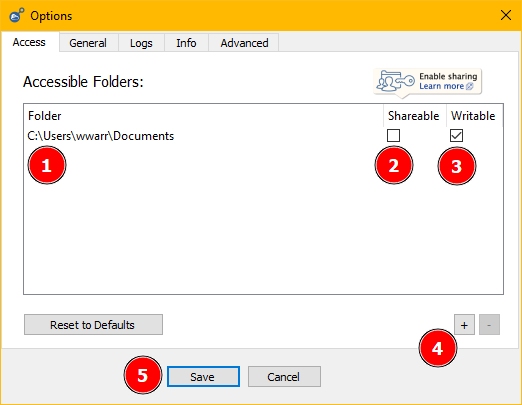

1. Use the plus `+` and minus `-` buttons to add your research data folders and remove other folders, as needed. Click the "Shareable" checkbox next to each research data folder. Click "Save" when finished.

    In this example, we removed the default `C:/Users/%username%/Documents` folder with the minus `-` button and added the `D:/data` folder with the `+` button and check the "Shareable" box. You will want to pick the folder where your research data is stored.

    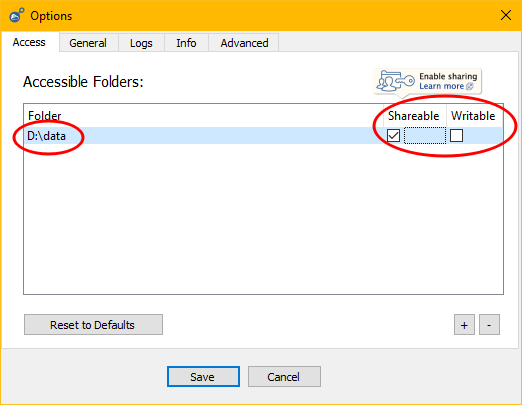

1. Click the "General" tab. The "General" tab enables you to control some settings for the application itself and which folder is the default folder. The default folder will be the first one shown when accessing the Collection.

   - **(1) Run when Windows starts** checkbox enabling starting Globus Connect Personal when you start Windows. **Check this box if GCP should always be on when the computer is on.**
   - **(2) Home Folder** text field that lets you choose which folder will be the default folder for your Collection. We recommend setting this to your primary shared folder from the previous step to simplify navigating your Collection in the Globus Web App.
   - **(3) Save** button which saves changes made to this tab of the options. Be sure to click "Save" if you make changes here.

    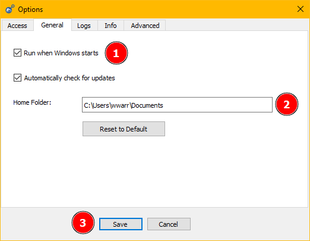

1. Check "Run when Windows starts" if needed. Change the "Home Folder" to match your research data folder. Click "Save" when done.

    In this example, we set the "Home Folder" to match the research data folder, `D:/data` we added in a previous step. If you have multiple research directories to share, you will need to choose just one for this field. Be sure to click save when you are done.

    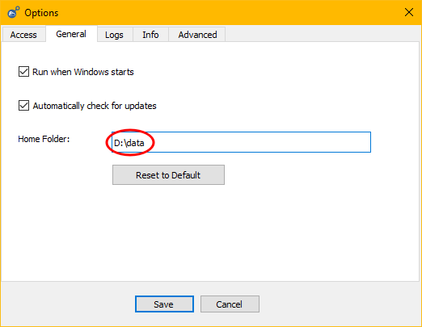

To verify the existence and accessibility of your Collection proceed to [How Do I Find Collections I Created or Own?](#how-do-i-find-collections-i-created-or-own)

[Return to the top](#globus-tutorials-for-uab-research-organizations).

### Choose Specific Folders on MacOS

1. In your MacOS notification area, locate the icon that looks like a small letter "g" in a circle. This is the icon for Globus Connect Personal. If you cannot locate the icon in the notification area, then open the Globus Connect Personal app on your computer and look for it again.

    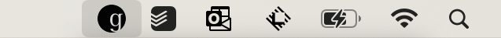

1. Right-click or command-click the icon to open the context menu. Click "Preferences…​".

    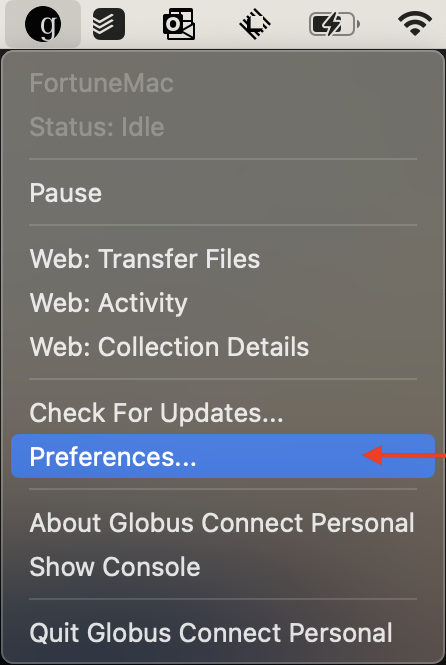

1. A new window will appear with a tab labelled "Access". Click the "Access" tab if it is not already selected. In this "Access" tab is an interface to configure folders available on your GCP Collection. For most use cases, you should not check the writeable checkbox. Below is a summary of what each part of the menu does.

    - **(1) Accessible Directories and Files** table with "Directory or File", Shareable and Writeable columns. Any folder listed here will appear on your GCP Collection. Your research data folder or directories must be listed here to be shareable.

        <!-- markdownlint-disable MD046 -->
        !!! note

            The terms Directories and Folders are synonyms here.

        <!-- markdownlint-enable MD046 -->

    - **(2) Shareable** column checkboxes controlling which folders can be shared with other users. Each of your research data directories must have this checkbox ticked to be shareable. **Check this box only if you want to share your data with others.**
    - **(3) Writeable** column checkboxes controlling which folders can be written to by other users. If a folder is shared with other users, then they will be able to add, delete, or change the contents. We recommend against ticking these boxes for Research Cores serving data to customers. **Check this box only if you want others to be able to change your data.**
    - **(4) Plus `+` and minus `-`** buttons that allow you to add or remove folders from the list.

    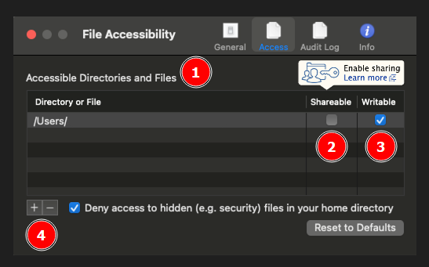

1. Use the plus `+` and minus `-` buttons to add your research data folders and remove other folders, as needed. Click the "Shareable" checkbox next to each research data folder. Click "Save" when finished.

To verify the existence and accessibility of your Collection proceed to [How Do I Find Collections I Created or Own?](#how-do-i-find-collections-i-created-or-own)

[Return to the top](#globus-tutorials-for-uab-research-organizations).

## How Do I Find Collections I Created or Own?

To find a Collection you own, use the following steps.

1. Navigate to the [Globus Web App](#how-do-i-get-onto-the-globus-web-app) using your browser. You should be at the File Manager page.

    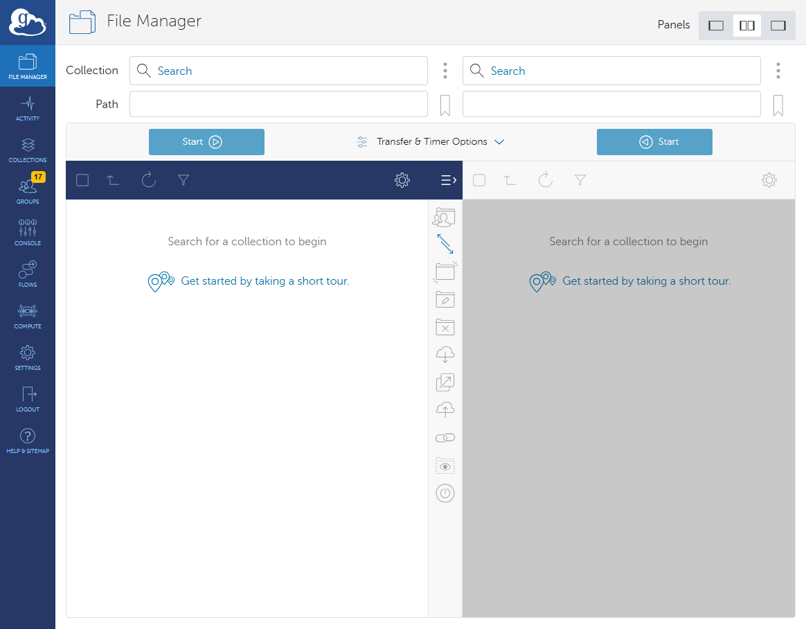

1. Click either of the Collection Search bar at the top of the File Manager page. This will take you to the Collection Search page.

    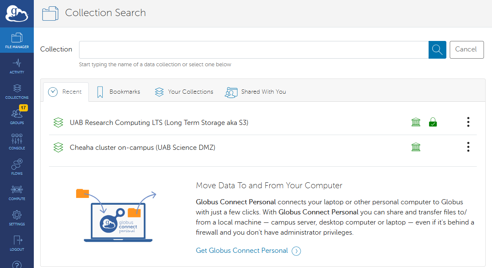

1. Click the Your Collections tab to display a list of Collections you have created or own.

    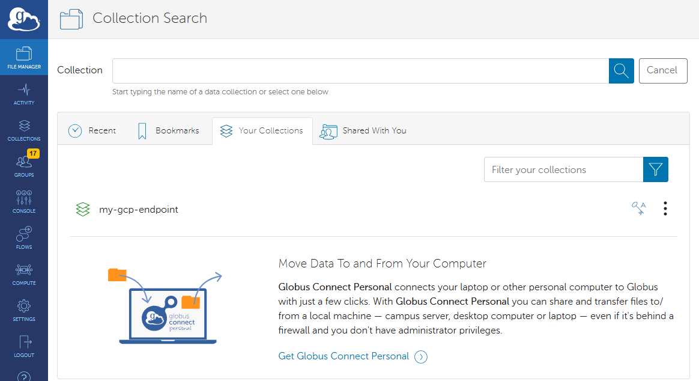

1. From here there are two options:

    1. Click the name of the Collection to select it for a file transfer and be taken back to the File Manager page.

        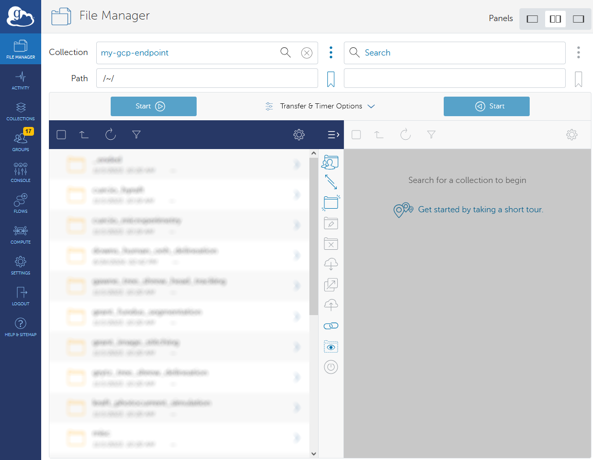

    1. Click the three dots icon at the right side of the entry to be taken to the Collection details page.

        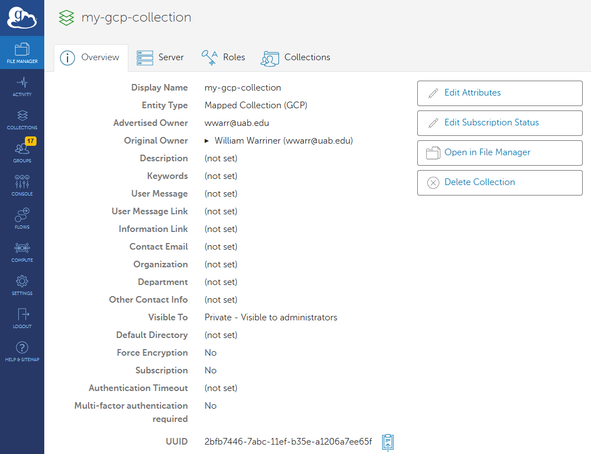

[Return to the top](#globus-tutorials-for-uab-research-organizations).

## How Do I Enable Collection Sharing For My Globus Account?

Before you can share Collections from your Globus Connect Personal (GCP) Collection with others, you must do a one-time setup for your account. You will need to join the "University of Alabama at Birmingham (HA)" (UAB HA) subscription group. Sharing any Collection requires a paid subscription with Globus. UAB Research Computing has a subscription, but Globus does not know your BlazerID is part of our subscription until you join the subscription group. So, Globus also does not know the GCP Collection you created is part of our subscription. By joining our UAB HA group, you and your GCP Collection are confirmed to be part of our subscription, and you can share Collections from the GCP Collection.

To join the UAB HA group, we need to receive both a UAB support request, and a request to join the UAB HA group within the Globus Web App. We need both because we sometimes get spam applications through Globus. Having a Support Request helps us filter the spam. Please use the following steps to join.

1. Submit a [Support Request](../../../help/support.md#how-do-i-create-a-support-ticket). In the request please include the following.

    - Your BlazerID.
    - The text "Please add me to the Globus UAB HA subscription group."
    - The reason you need to be able to share a Collection in Globus. For Research Cores, this would be to share data with your customers.

1. In your browser [get onto the Globus Web App](#how-do-i-get-onto-the-globus-web-app).
1. In the left hand navigation panel click "Groups" to be taken to the Groups page.

    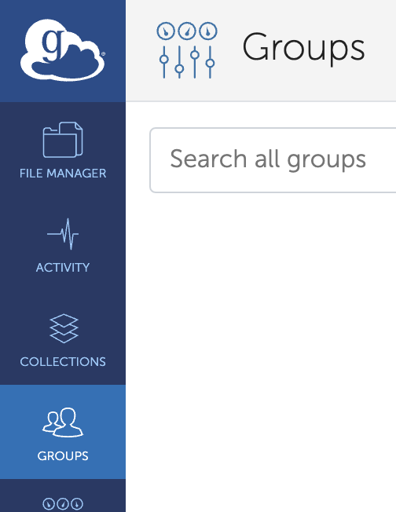

1. Ensure the "MY GROUPS" box is unchecked. In the "Filter groups" search bar enter "University of Alabama at Birmingham" to locate the "University of Alabama at Birmingham (HA)" (UAB HA) group.

    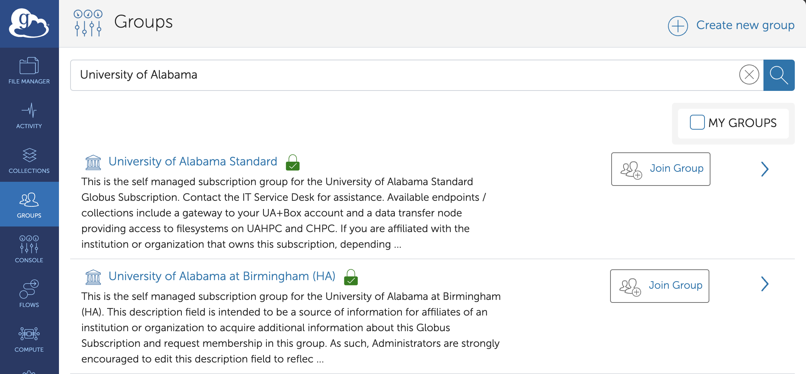

1. Click on the UAB HA group name to be taken to the group details page. The Overview tab should be selected.

    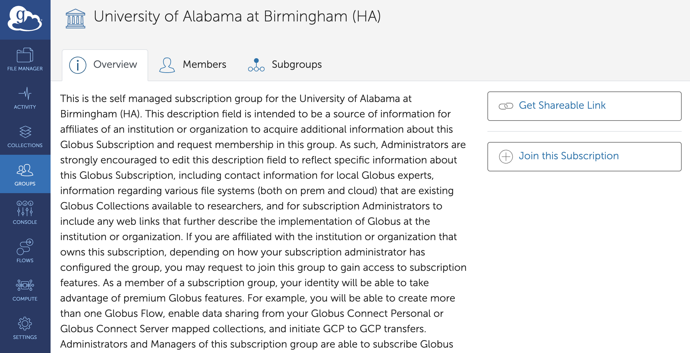

1. Click on the "Join this Subscription" button to be taken to the form to submit a request to join.

    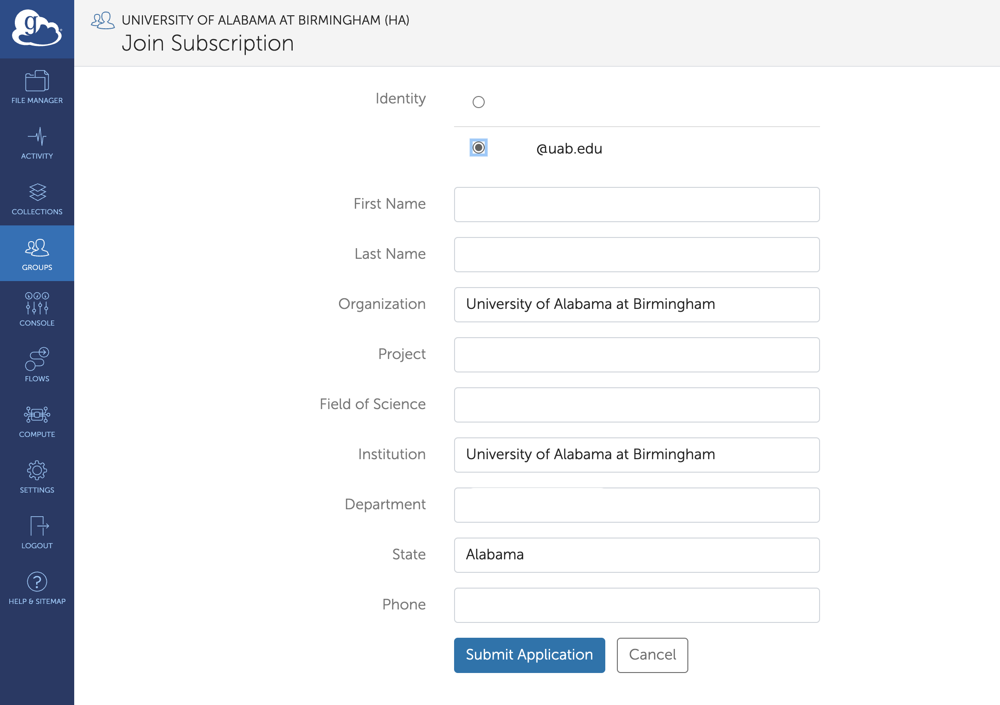

1. Fill in the form fields and click the "Submit Application" button when completed. This will send you to a page notifying you that your membership is pending. A request has been sent to Research Computing, so please wait until you see a reply in the support request.

    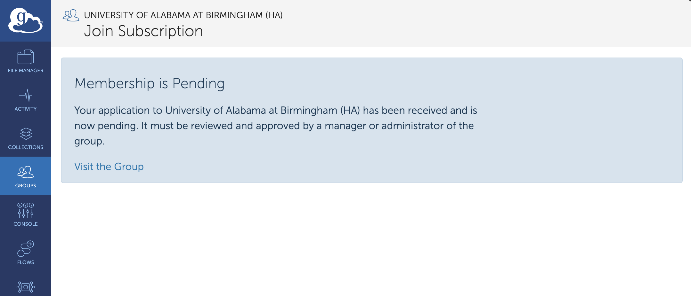

1. When your membership has been accepted, you can verify by [returning to the Globus Web App](#how-do-i-get-onto-the-globus-web-app) and navigating to the Groups page. Check the "MY GROUPS". You should see "University of Alabama at Birmingham (HA)" listed with a green, circled checkmark and the word "ACTIVE".

    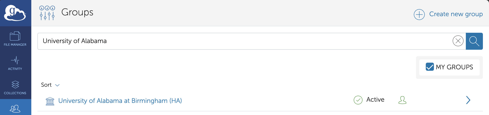

When you have completed the steps in this section, proceed to [creating a Collection](#how-do-i-create-a-collection).

[Return to the top](#globus-tutorials-for-uab-research-organizations).

## How Do I Create a Collection?

There are three ways to create a Collection.

- Start from [an existing Collection you created or own](#how-do-i-find-collections-i-created-or-own).
- [Install Globus Connect Personal](#how-do-i-install-globus-connect-personal) and [share a folder](#how-do-i-choose-specific-folders-to-share-using-globus-connect-personal) to create a Collection.
- Install and configure one or more Collections with Globus Connect Server. To do this, please [Contact Support](../../../help/support.md#how-do-i-create-a-support-ticket) to start a discussion.

The instructions below assume you are starting from an existing Collection. The instructions will work to create a subset of your Globus Connect Personal Collection.

1. [Get onto the Globus Web App](#how-do-i-get-onto-the-globus-web-app).
1. [Find the existing Collection](#how-do-i-find-collections-i-created-or-own) and access its details page.
1. Click the "Collection" tab.

    

1. Click the "+ Add Guest Collection" button to be taken to a form to create the new Collection.

    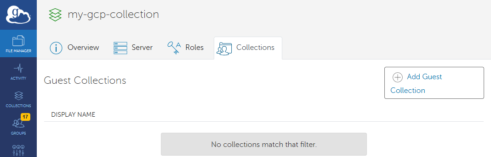

1. Fill out the form.

    - **(1) You Are Sharing**: Shows which Collection you will be sharing all or part of. Helpful to verify you are sharing the right Collection
    - **(2) Path**: Which path you wish to share. By default, the "/" path is the root of the original Collection. This may not be appropriate for your use case. Generally, when creating one Collection from another, you will want to pick a subfolder of the original Collection. Do this with the "Browse" button.
    - **(3) Display Name**: The name people will see when accessing this Collection, and what they will search for when looking for the Collection.
    - **(4) Description**: An optional description for the Collection.
    - **(5) Keywords**: Optional keywords to help locating the Collection. May be useful for broadly or publicly shared data.

    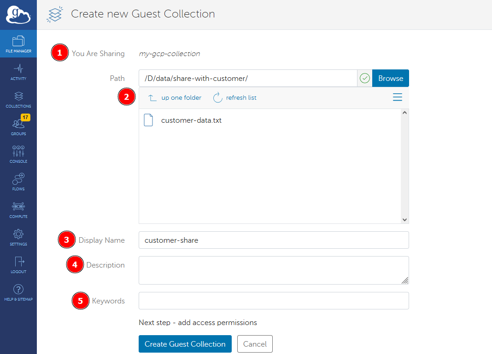

1. Click the "Create Guest Collection" button to create the Collection. You will be taken to the details page of the new Collection, on the Permissions tab.

    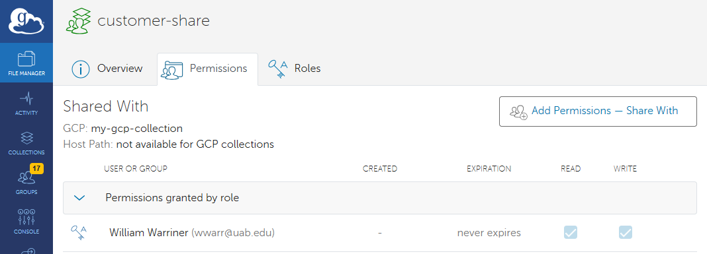

When you have created a Collection, you are ready to [share the Collection with others](#how-do-i-share-a-collection-with-others).

[Return to the top](#globus-tutorials-for-uab-research-organizations).

## How Do I Share a Collection with Others?

Before sharing a Collection with others, you will need to first [create a Collection](#how-do-i-create-a-collection) you administer. If the Collection is a [Globus Connect Personal Collection](#how-do-i-install-globus-connect-personal), then you will also need to [enable Collection sharing for your Globus account](#how-do-i-enable-collection-sharing-for-my-globus-account). If these prerequisites have been met, then you are ready to setup a Collection to be shared with others. Please follow the instructions below.

1. [Get onto the Globus Web App](#how-do-i-get-onto-the-globus-web-app).
1. [Find the Collection](#how-do-i-find-collections-i-created-or-own) you wish to share. In this case we are looking for the "customer-share" Collection.
1. On the "customer-share" Collection details page, click the Permissions tab.

    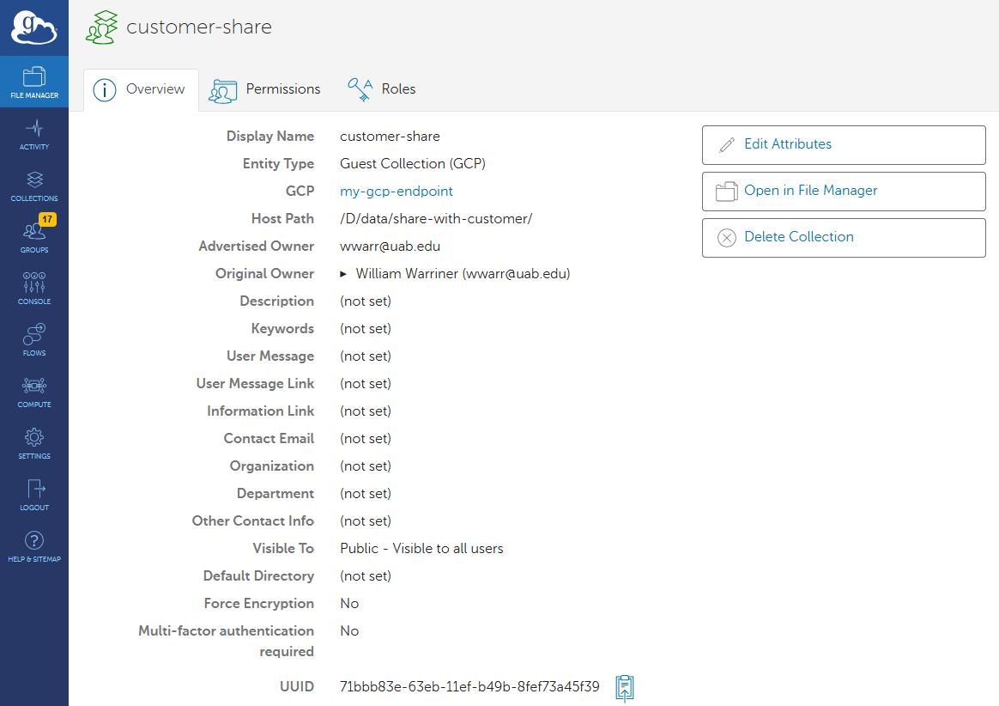

1. Click the "Add Permissions &ndash; Share With" button.

    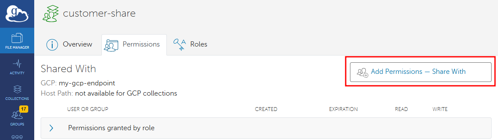

1. Fill in the form.

    - **Path** defaults to the root of the Collection. This may or may not be acceptable for your use case. Be sure to limit access to only the data that needs to be shared. Use the file browser available in the form to find the correct level of access. For now grant permission to the default.
    - **Share With**: radio buttons to provide control over who to share with. In almost all cases, you will want to share with a single user, which is what we will show here.
        - **User**: Use the "User" search bar to find the specific user you wish to share with. If they have never accessed Globus before, they will not appear in the search results. You can safely enter their email address to add them anyway. For now grant permission to yourself for the purposes of experimenting.
    - **Email Notification** checkbox. We recommend sending an email notification as a convenience.
        - **To** entry field: who to send the email to. We recommend the same person as the "User" selected earlier. There may be future cases where you want to notify others, such as a supervisor, as well.
        - **Message** text entry field: the optional content to send in the email message.
    - **Permissions** The "read" permission must be granted, as that is the point of sharing the Collection. You may additionally give "write" permission to create a two-way collaboration. We recommend Research Cores not grant "write" permission. If you are using a Globus Connect Personal Collection, then "write" permission requires you to correctly [configure your Collection](#how-do-i-choose-specific-folders-to-share-using-globus-connect-personal) to make your shared folder writable.

    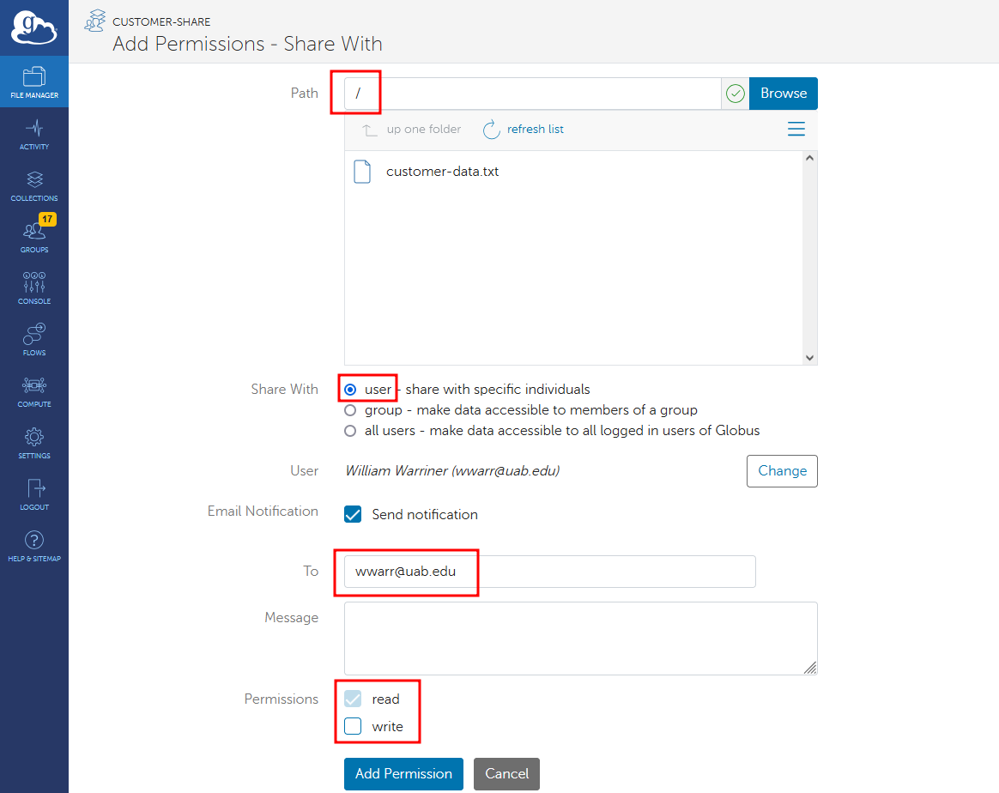

1. Click the "Add Permission" button to grant permission. You should see a notification confirming the permissions granted. At this point permissions have been granted and the Collection is shared with another person. If you need to add more people, click the "Add another Permision" button and repeat the process. Otherwise click "Done". For now click "Done".

    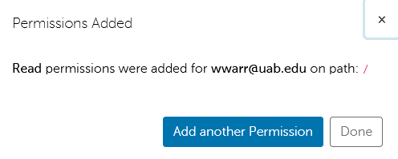

1. When you click "Done" you should be taken back to the Permissions tab of the Customer Share page. You should see a new entry with "Path: /". If you click the drop-down arrow you will see yourself listed with "Read" permission. If you need to revoke permissions, return to this page and click the icon that looks like a trash can.

    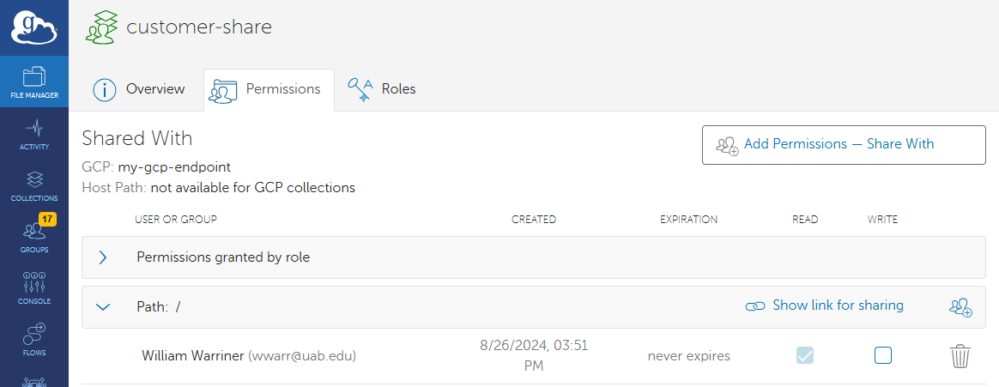

[Return to the top](#globus-tutorials-for-uab-research-organizations).

## How Do I Share Data With a Research Core Customer?

If you manage data for a Research Core, please [Contact Support](../../../help/support.md#how-to-request-support) to start a conversation. The answer to this question is currently being developed, so we will need to work together to find the ideal solution.

[Return to the top](#globus-tutorials-for-uab-research-organizations).
