# Setting up Globus as a Research Manager for your Group

This tutorial is designed to guide UAB research managers, such as Lab PIs, Core Directors, and their management staff, to help them set up and use Globus Connect Personal (GCP) for secure data sharing on their local/personal computers. GCP allows you to share data with collaborators efficiently meeting security and compliance standards for file sharing.

**What You Will Learn:**

1. [What is Globus, and why you should use it?](globus_group_tutorial.md#what-is-globus-and-why-you-should-use-it)
1. [How do you get onto Globus?](globus_group_tutorial.md#how-do-you-get-onto-globus)
1. [Installing Globus Connect Personal on Windows](globus_group_tutorial.md#installing-gcp-on-windows)
1. [Installing Globus Connect Personal on MacOS](globus_group_tutorial.md#installing-gcp-on-macos)
1. [Configuring the GCP endpoint to share specific folders](globus_group_tutorial.md#configuring-the-globus-connect-personal-endpoint-to-share-specific-folders)
1. [Configuring and Sharing a Collection for your endpoint](globus_group_tutorial.md#configuring-and-sharing-a-collection-for-your-endpoint)

## What is Globus, and why you should use it?

We have a guide here(./globus_individual_tutorial.md#what-is-globus) that explains Globus, and its features.

## How do you get onto Globus?

We have a guide here(./globus_individual_tutorial.md#how-do-you-get-on-globus) that shows how to access Globus.

## Installing Globus Connect Personal

Globus Connect Personal is available on the following Operating Systems, Linux, MacOS and Windows. The steps in this tutorial are curated from the Globus docs showing how to install Globus on [Windows](https://docs.globus.org/globus-connect-personal/install/windows/) and [MacOS](https://docs.globus.org/globus-connect-personal/install/mac/).

### Installing GCP On Windows

The following steps will guide you to install GCP on your local machine running the Windows OS.

1. Navigate to the [Globus Connect Personal page](https://www.globus.org/globus-connect-personal), scroll to look for the GCP Windows version. Click on the "INSTALL NOW" button highlighted red in the image below.

    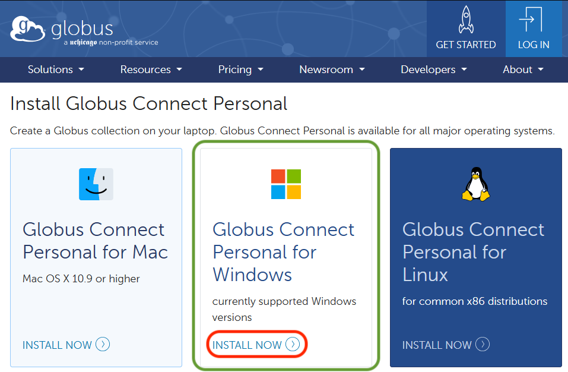

1. Click the `Download Globus Connect Personal` link on this page, it would redirect you to download the GCP Installer.

    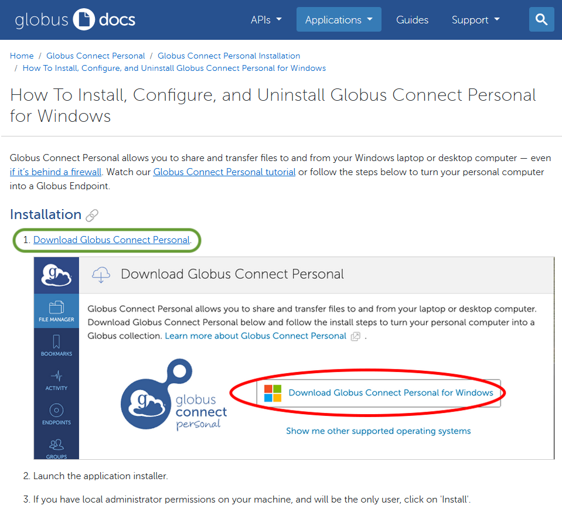

1. As shown in the image below,  click the "Download Globus Connect Personal for Windows" button preceded by the Microsoft/Windows logo to download the installer. This would download the application installer into your local computer.

    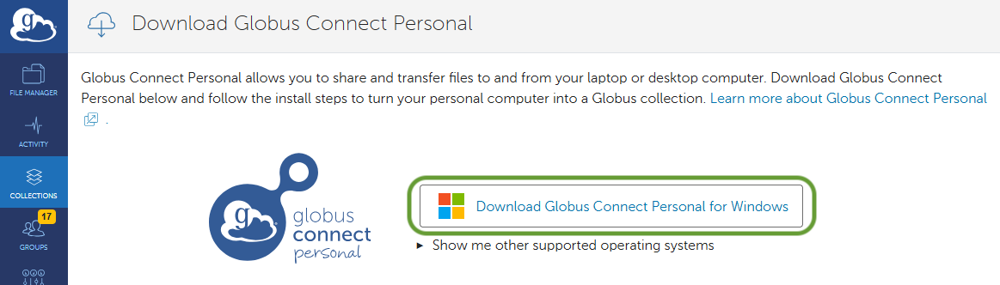

1. Navigate to where the file is downloaded on your local computer. Double click to open the downloaded file named "globusconnectpersonal-latest.exe"

    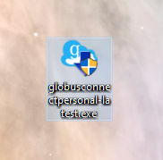

1. Select where you would prefer to have your GCP installed (by default it installs into your C:\ drive), and click the "Install" button.

    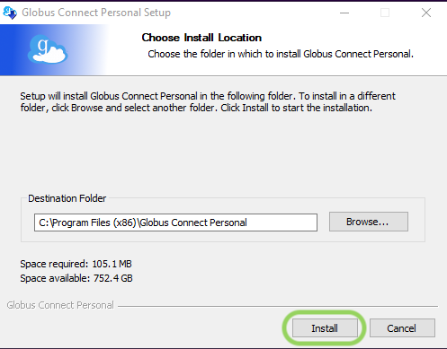

    Please note you must have administrator permissions, to do this. If you see the below image, please contact your local computer's administrator to complete the installation.

    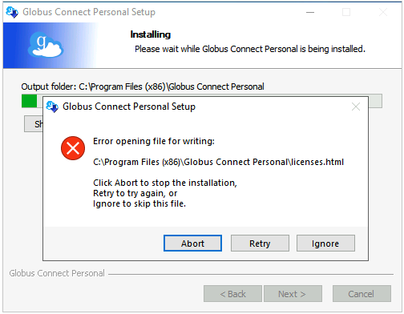

1. Allow the installation to complete, and click on "Finish". This will complete the GCP installation.

    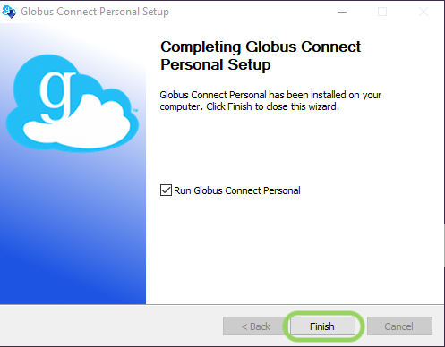

1. Following installation, GCP will launch in a new window, click on "Log In" to authenticate with Globus, to begin the Collection Setup process.

    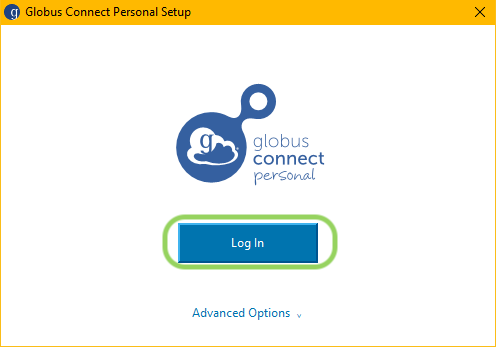

1. Grant the required consents to GCP setup. And include a name of your liking in the highlighted area.

    

1. Enter the details for your GCP Collection, and click save to continue. In the image below,
   - **1** should contain your preferred identity, if using a UAB Computer, please insert your `BlazerID@uab.edu` email address here.
   - **2** Should contain the name for your Collection, already named in the previous step.
   - **3** Should contain optional information to describe the collection, you can include the purpose for which the collection has been created.
   - **4** If your collection would contain Protected Health Information (PHI) or sensitive information, please tick this box. You would need to be part of UAB's subscription to complete this, please send an email to support, so we can complete that process on your behalf.

    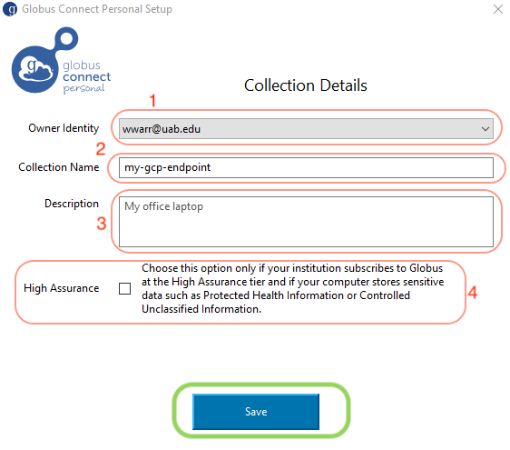

1. We have now completed set up of our GCP for a local computer operating the Windows OS. Exit the setup process, and open the Globus Web App to view collection details or move data to or from your collection.

    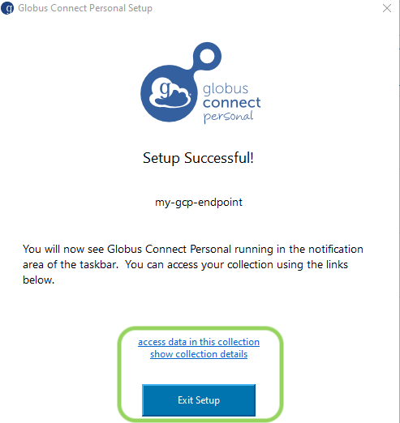

1. After installation, you should now see a "g" Globus icon in the menu bar at the bottom of your screen. This indicates that Globus Connect Personal is running and your new collection is ready to be used.

    

### Installing GCP On MacOS

The following steps will guide you to install "GCP" on your local machine running the "Mac OS".

1. Navigate to the [Globus Connect Personal page](https://www.globus.org/globus-connect-personal), scroll to look for the GCP Mac OS version. Click on the "INSTALL NOW" button highlighted red in the image below.

    

1. Click the "Download Globus Connect Personal" link on this page, it would redirect you to download the GCP Installer.

    

1. As shown in the image below,  click the "Download Globus Connect Personal for Mac" button preceded by the Finder Icon to download the `.dmg` file. This would download the file into your local computer.

    

1. Navigate to where the file is downloaded on your local computer. Double click to open the downloaded file named "globusconnectpersonal-latest.dmg"

    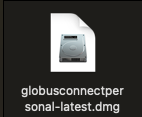

1. A new window will pop-up asking you to drag the Globus app into your Application folder on your Mac.

    

1. When the above step is completed, navigate to your Application folder and look for the "Globus Connect Personal" Application folder to open it.

    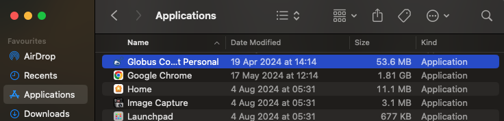

1. Click on Log In button after opening the Globus app.

    

1. Grant the required consents to GCP setup. And include a name of your liking in the highlighted area.

    

1. Enter the details for your GCP Collection, and click save to continue. In the image below,
   - **1** should contain your preferred identity, if using a UAB Computer, please insert your `BlazerID@uab.edu` email address here.
   - **2** Should contain the name for your Collection, already named in the previous step.
   - **3** Should contain optional information to describe the collection, you can include the purpose for which the collection has been created.
   - **4** If your collection would contain Protected Health Information (PHI) or sensitive information, please tick this box. You would need to be part of UAB's subscription to complete this, please send an email to support, so we can complete that process on your behalf.

    

1. We have now completed set up of our GCP for a local computer operating the Mac OS. Exit the setup process, and open the Globus Web App to view collection details or move data to or from your collection.

    

1. After installation, you should now see a "g" Globus icon in the menu bar usually at the top of your screen. This indicates that Globus Connect Personal is running and your new collection is ready to be used.

    

## Configuring the Globus Connect Personal Endpoint to Share Specific Folder(s)

### On Windows

1. Open Globus Connect Personal: Open the GCP App, and/or click on the Globus icon in your taskbar.

    

1. A drop-down menu containing a list of menu options would now be visible, click on "Options...":

    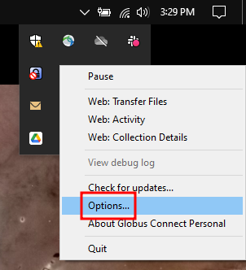

1. A new window will appear showing a tab labelled "Access". In that window you would see an interface that requires configuration, the image has been labelled with numbers to provide details.
   - **(1).** Shows a list of filepath(s)/directory (or directories) you would like to share on Globus as a "Collection".
   - **(2).** and **(3).** Show the "Shareable" and "Writable" options to choose as you desire. The "Shareable" option will allow you to share this path on your local computer as an "Endpoint" that other users can access (This should be ticked, as you intend to share the "Collection"). The "Writable" option gives users permissions to upload, edit, or delete files, dependent on the level of access you grant individual users. These options can be selected for each file, folder or directory selected.
   - **(4).** Gives you the option to add several filepaths or directories to Globus as a Collection.
   - **(5).** Saves your preferred options.

    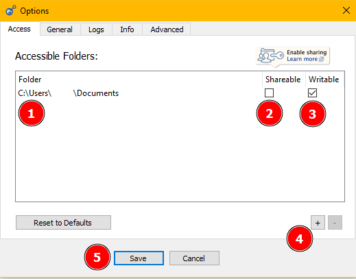

1. The "General" tab should also be configured as shown in the image below.

   - **(1).** This allows you to specify whether you want Globus Connect Personal to run when Windows starts and allows you set, whether the software should automatically check for updates. Globus recommends that you leave the "Automatically check for updates" box checked, to ensure that you are running the most stable and secure version of Globus Connect Personal at all times.
   - **(2).** Allows you set what your "Collections" Home Folder would be.
   - **(3).** saves your selected preferred options.

    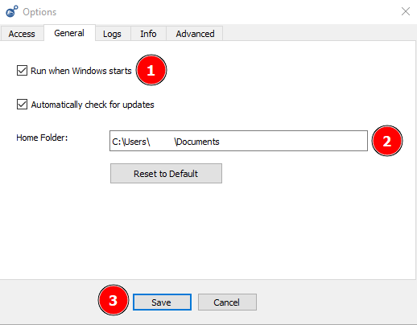

### On MacOS

1. Click the Globus Connect Personal icon "g" in the menu bar at the top right of your screen and select "Preferences…​" to configure Globus Connect Personal.

    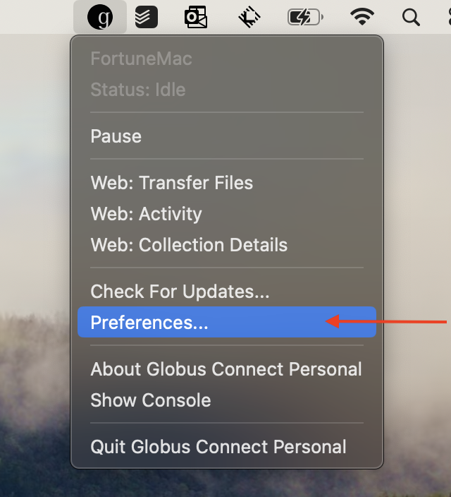

    If you do not see the icon, go to your Applications folder and click on the Globus Connect Personal App. And repeat the above instructions.

    

1. The "General" preferences tab shows a couple of options on how the GCP works on your local Mac computer. You can change the color of the Globus Connect Personal status icon in the menu bar by ticking the "Use black and white menu bar icons". You can also select the appropriate options for "Automatically check for updates" and "Automatically download updates", this way Globus Connect Personal would always run on the newest version. Globus recommends leaving the "Automatically check for update" option selected to automatically make important security updates.

    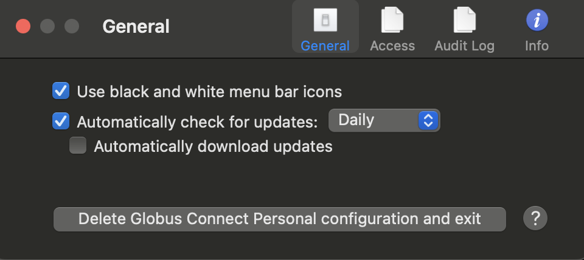

1. The "Access" preferences tab shows a list of folders that are accessible for file transfer and sharing via Globus Connect Personal. This provides more control over what information is accessible on your Globus Connect Personal endpoint. By default, your home directory (e.g.: /Users/`username`) is read/write accessible. The "Deny access to hidden (e.g. security) files in your home directory" option controls whether or not you can access hidden files (i.e. filenames beginning with "."") in your home directory. By default, Globus Connect Personal does not allow access to files like: `~/.globusonline` and `~/.ssh.`

    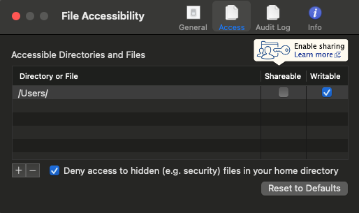

### Accessing your Endpoint from the Web

The below steps apply to all GCP applications on all platforms (Linux, MacOS, and Windows).

1. Navigate to the Globus webpage, and authenticate if you have to. You would see the below image, showing the Globus web app, with all of its options. Click on the "Search" button in front of "Collection" from the "FILE MANAGER" menu option.

    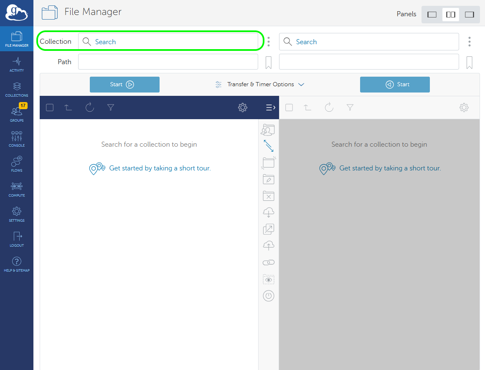

1. This would open up a new interface, please select the "Your Collections" option, and you should see the `Endpoint` you created for your local machine.

    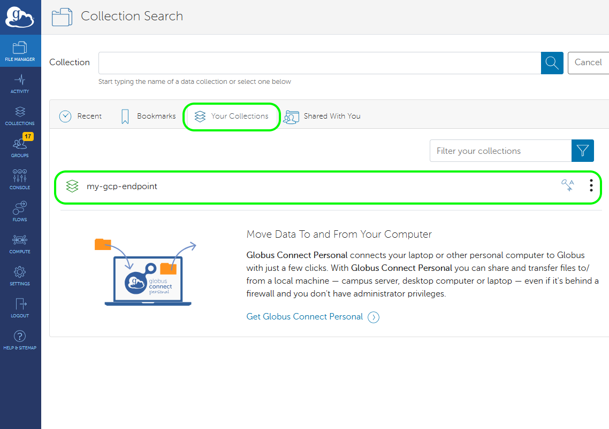

As you begin to use Globus, your recently used "Collections" would appear in the "Recent" tab.

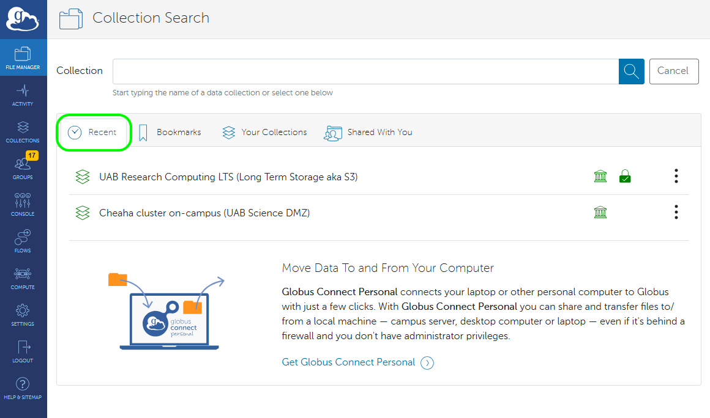

1. Clicking on your `Endpoint` would open a new window showing you content from the `Collection` associated with the `Endpoint`. These will be the folders, directories or files you configured to be accessible to Globus from your local machine.

    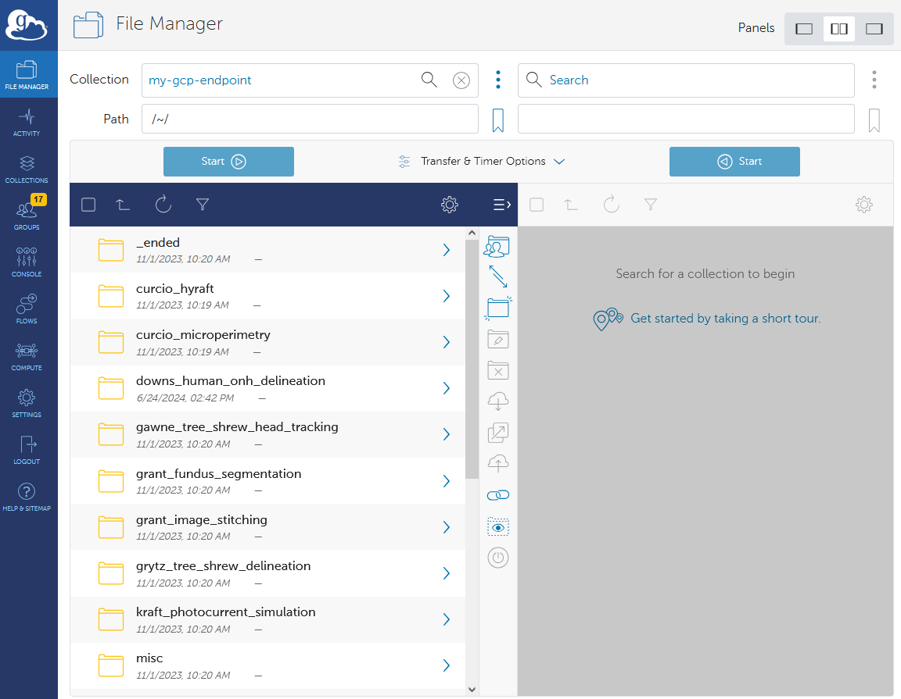

## What do I need to Share a GCP Endpoint?

Before you can share a GCP endpoint, ensure the you have the following:

1. **A Globus Account**: You must have a Globus account associated with UAB. There is a guide on how to do this here(./globus_individual_tutorial.md#how-do-you-get-on-globus)
1. **Membership of UAB High Assurance (HA) Subscription**: You must be added to the UAB High Assurance (HA) subscription group. Create a ticket, by sending an email to UAB Research Computing: <support@listserv.uab.edu> to approve and verify your inclusion in the "UAB HA" subscription group. Your email should state why you should be added to the subscription.

## Configuring and Sharing a Collection for Your Endpoint

1. Navigate to the Globus Web App, and authenticate with your credentials. When you are logged in, click on "Collections".

    

1. Click on the ">" button to the right of your screen.

    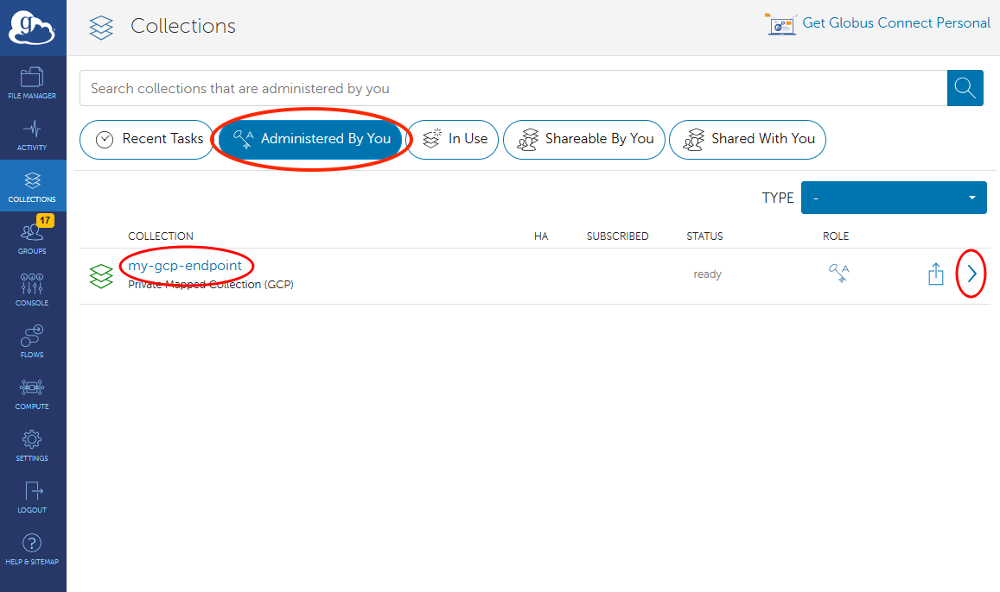

1. This would open an "Overview" page, that contains information specific to your `Endpoint`. You should also see a "Collections" tab, click on this.

    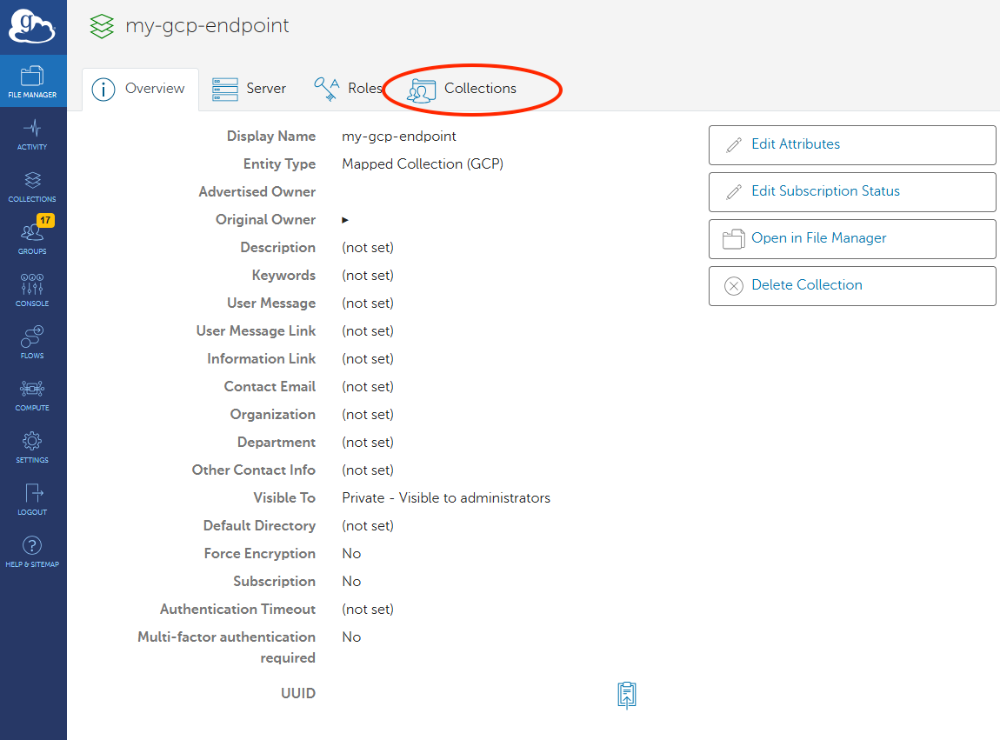

1. Click on the "Add Guest Collection" button in the new window.

    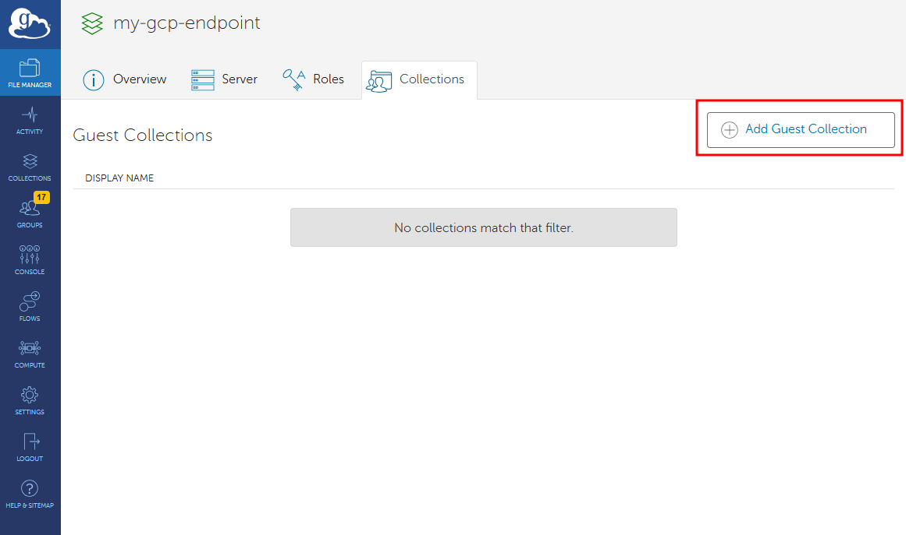

1. Configure the "Collection" in the new window. Leave the path as is, you will include the specific filepath (folder/director or file) for this `Collection` in the next step. Fill out the optional information to properly label the `Collection`.

    

1. In this step, include the filepath in the textbox provided (you can use the browse button to navigate to the appropriate folder), you should also see content for that folder/directory. Name your `Collection` and provide a description. Click on "Create Guest Collection".

    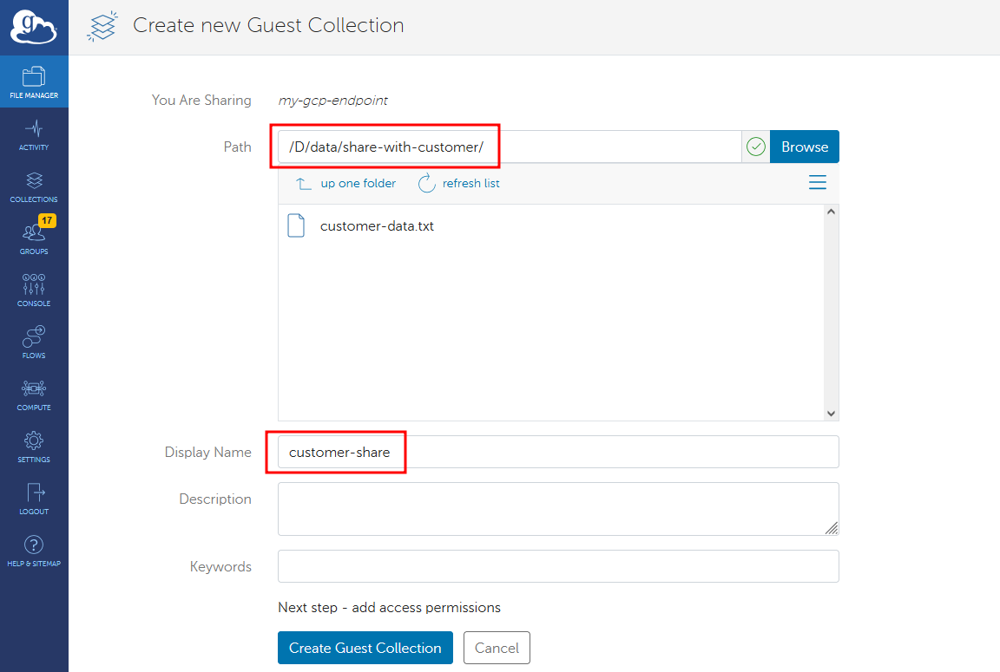

1. Now we have to set and grant permissions to our collaborators. Click the "Add Permissions - Share With" to configure the permissions for your just created `Collection`.

    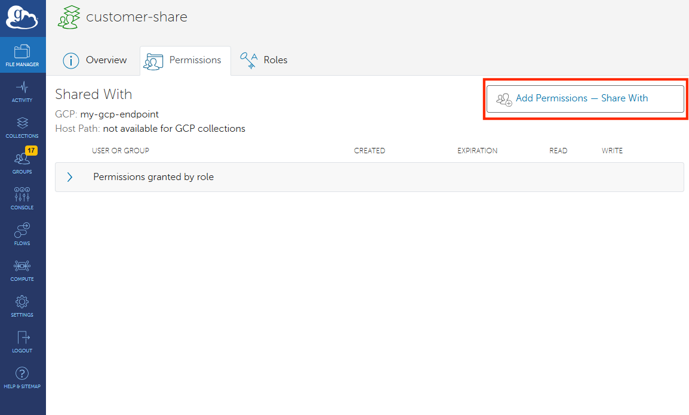

    You can have different permissions for different collaborators accessing the same `Collection`. In the image below,
    - **(1).** Highlights how you can enter the filepath or use the "Browse" button to navigate your local machine to the folder or directory you would like to share.
    - **(2).** Gives you the option for which entities you would like to share your `Collection` with.
    - **(3).** This is where you would enter the Identity details for your collaborators (email address, Globus ID).
    - **(4).** These options grant the collaborator(s) `read` or `write` permissions access to your collection.
    - **(5).** Click the "Add Permission" button to complete the process or press cancel to restart configuration process.

    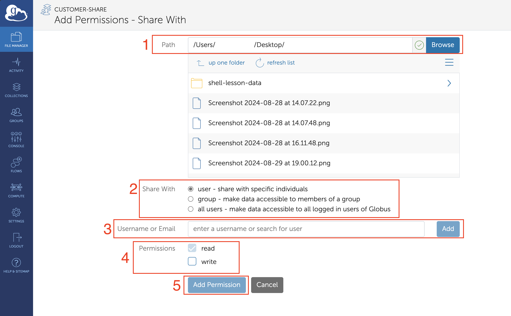
