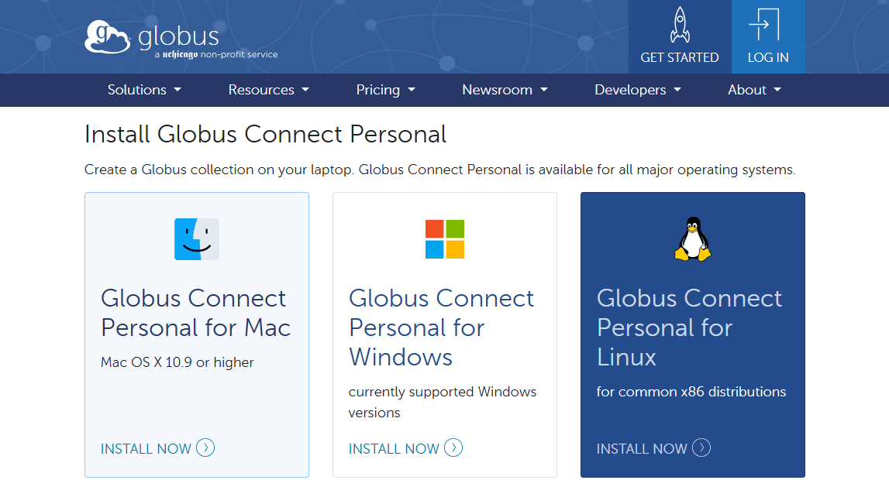
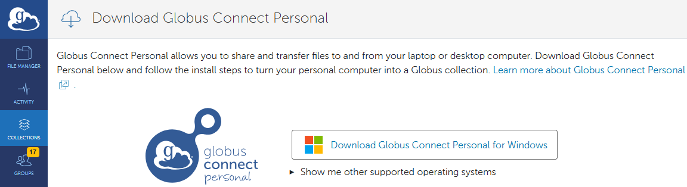
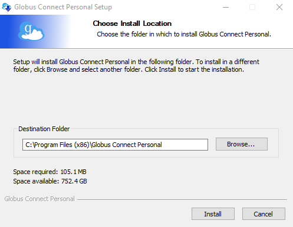
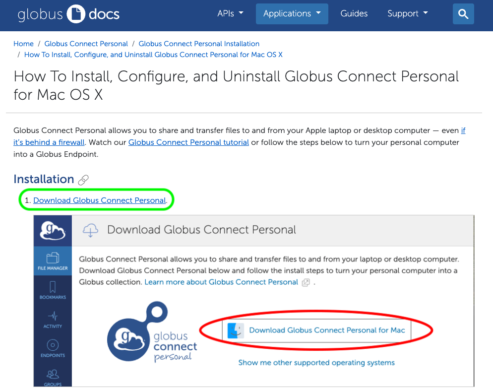
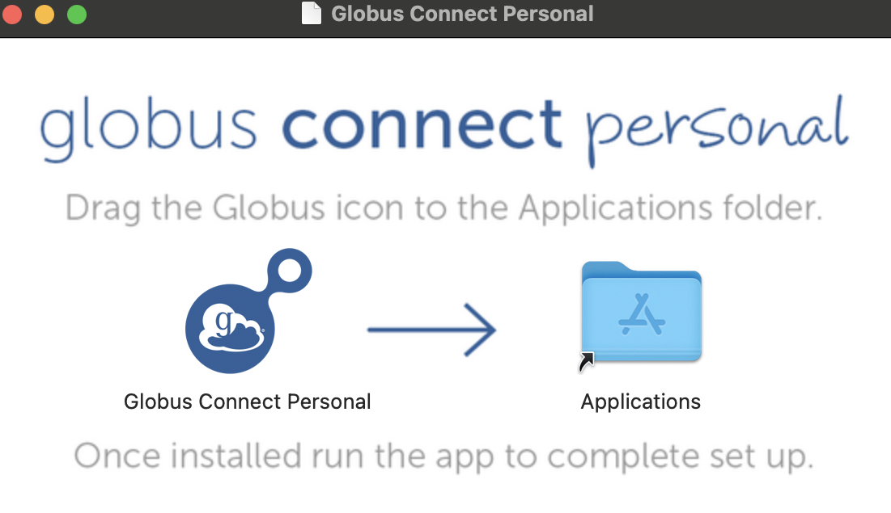
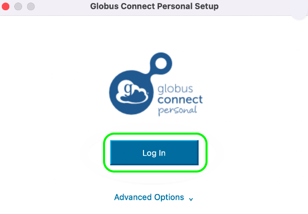
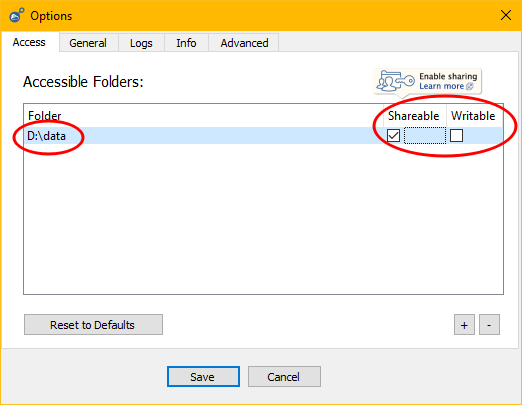
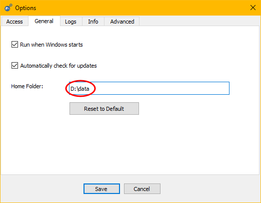

# Globus Tutorials for Research Groups

This tutorial is designed to guide UAB research managers, such as Lab PIs, Core Directors, and their management staff, to help them set up and use Globus Connect Personal (GCP) for secure data sharing on their local/personal computers. GCP allows you to share data with collaborators efficiently meeting security and compliance standards for file sharing.

Topics covered:

1. [Prerequisites](#prerequisites)
1. [What is Globus?](#what-is-globus)
1. [Why Use Globus?](#why-use-globus)
1. [How Does Globus Work?](#how-does-globus-work)
1. [How Do I Get onto the Globus Web App?](#how-do-i-get-onto-the-globus-web-app)
1. [How Do I Install Globus Connect Personal?](#how-do-i-install-globus-connect-personal)
    - [Windows](#installing-gcp-on-windows)
    - [MacOS](#installing-gcp-on-macos)
1. [How Do I Choose Specific Folders Using Globus Connect Personal?](#how-do-i-choose-specific-folders-to-share-through-globus-connect-personal)
    - [Windows](#choose-specific-folders-on-windows)
    - [MacOS](#choose-specific-folders-on-macos)
1. [How Do I Find Collections I Created or Own?](#how-do-i-find-collections-i-created-or-own)
1. [How Do I Share Data with a Research Core Customer?](#how-do-i-share-data-with-a-research-core-customer)
1. [How Do I Share a Collection with Others?](#how-do-i-share-a-collection-with-others)

If you are new to Globus, we recommend starting with our [Globus Tutorials for Individual Researchers](./globus_individual_tutorial.md) first to familiarize yourself with how Globus is used. When those are complete, we then recommend following the tutorials on this page in order from start to finish, as later tutorials assume the previous tutorials have been completed.

## Prerequisites

For these tutorials, you will need your BlazerID or [XIAS ID](../../account_management/xias/index.md) and password to authenticate using UAB Single Sign-On (SSO).

## What is Globus?

Globus is a data transfer ecosystem that simplifies the process of transferring, sharing, and managing large datasets. It is used by research institutions around the world to move research data between different storage devices, computer systems, and institutions.

## Why Use Globus?

Globus has many research data oriented features, making it ideal for many research data transfer scenarios. Below is a list of features.

- Straight-forward, browser-based interface.
- Compatible with [Long-Term Storage](../lts/index.md).
- Can be used to share data with Research Core customers.
- Can be used to transfer data between lab workstations, servers, and Cheaha.
- Transfers are automatically retried in the event of network or computer system outages.
- Transfers are encrypted end-to-end. Globus never sees your data.
- Suitable for transferring PHI and HIPAA data. Note: a UAB Enterprise IT risk assessment is required.

## How Does Globus Work?

Globus is an ecosystem of software intended to make research data transfer simpler. The Globus web application at <https://app.globus.org> allows you to initiate transfers between any two Collections you have authorization to access. The Globus Connect Personal (GCP) and Globus Connect Server (GCS) software let you turn any computer into a Globus Collection. At no point do Globus servers touch your research data. Instead, when you initiate a transfer between two Collections, the Globus application tells the two Collections that they need to talk to each other and data is sent directly between them. The Collections update the application with information you may need to know, such as how much data has transferred so far, how fast the transfer is proceeding, and any errors that occur. If the connection between Collections is interrupted for any reason, the Globus application will attempt to restart the transfer from where it left off.

## How Do I Get Onto the Globus Web App?

Our [Globus Tutorials for Individual Researchers Page](./globus_individual_tutorial.md#how-do-i-get-onto-the-globus-web-app). Please visit that link and then return here when you have finished.

## How Do I Install Globus Connect Personal?

Globus Connect Personal (GCP) is available to install on the following Operating Systems. Linux is also available, but we do not cover the installation process here. If you need to install GCP on Linux, please refer to the [official documentation](https://docs.globus.org/globus-connect-personal/install/linux/).

Managing data for a Research Core? Please stop here. You should know that Globus Connect Personal is _not_ suitable for production use with customers. Please [Contact Support](../../help/support.md#how-do-i-create-a-support-ticket) to discuss setting up Globus Connect Server for your Research Core.

Representing a lab? Globus Connect Personal may be suitable for your use case. If you transfer data infrequently, or transfer small amounts of data, then GCP is probably sufficient. If you frequently transfer large amounts of data, then Globus Connect Server can enable higher data transfer rates through parallelization. Please [Contact Support](../../help/support.md) if you want to discuss installation of Globus Connect Server.

GCP installation instructions for:

- [Windows](#installing-gcp-on-windows)
- [MacOS](#installing-gcp-on-macos)

### Installing GCP On Windows

The following steps will guide you to install Globus Connect Personal (GCP) on your computer running Windows OS.

1. Navigate to the [Globus Connect Personal official page](https://www.globus.org/globus-connect-personal) and scroll down to find the GCP Windows version. Click on the "INSTALL NOW" button in the red box in the image below to be taken to the official installation instructions and download link for GCP for Windows.

    

1. Click the `Download Globus Connect Personal` link on the instructions page, as shown below. This will redirect you to the GCP for Windows installer.

    

1. As shown in the image below, click the "Download Globus Connect Personal for Windows" button to download the installer to download the installer to your computer.

    

1. Find the installer on your computer and open it. Select where you would prefer to have your GCP installed and click the "Install" button.

    

    Please note you must have administrator permissions, to do this. If you are unable to do so, you will need to contact the IT group managing your computer.

1. When the installation is complete, click the "Finish" button to complete the GCP installation.

    

1. Following installation, GCP will launch in a new window. If it does not, look for it in your Start Menu.

    When GCP has started, click on "Log In" to authenticate with Globus to begin the Collection setup process. This is a one-time setup to configure GCP to allow your machine to act as a Collection, enabling research data transfer with your computer.

    

    Note that if you uninstall and reinstall GCP, you will need to complete this process again. You should not need to repeat this process otherwise.

1. Grant the required consents. This is required to set up your computer as a Collection. Also provide a name for your consents. We recommend choosing a name that is short, memorable, and related to the purpose for the Collection.

    

1. Enter the details for your GCP Collection, and click save to continue. The following list describes the fields in the form shown below.

    - **Owner Identity:** is the person responsible for this Collection. This field should already be filled with UAB Campus or XIAS email address. If not, please that email address here.
    - **Collection Name:** is the name for the Collection. This should be filled with the name of the Collection from the previous step.
    - **Description:** Feel free to enter descriptive information about the Collection here. This information will be displayed in the Globus Web App when the Collection is viewed by others.
    - **High Assurance:** Only check this box if the Collection has or will have PHI, HIPAA, or other protected data. If this is the case, please ensure that you have already completed a risk assessment with UAB Enterprise IT.

    

1. GCP Setup is now complete on your computer. Your computer is now serving Globus Collection and may be used to transfer data. Click "Exit Setup" to close the window.

1. After installation, you should see a lowercase letter "g" in a circle in your Windows system tray, typically at the bottom-right of the display. If you do not, try finding the Globus Connect Personal application in your start menu and starting the application.

    

Continue on with [How Do I Choose Specific Folders Using Globus Connect Personal?](#how-do-i-choose-specific-folders-to-share-through-globus-connect-personal) or return to the [Top of the Page](#globus-tutorials-for-research-groups).

### Installing GCP On MacOS

The following steps will guide you to install Globus Connect Personal (GCP) on your computer running MacOS.

1. Navigate to the [Globus Connect Personal official page](https://www.globus.org/globus-connect-personal) and scroll down to find the GCP MacOS version. Click on the "INSTALL NOW" button in the red box in the image below to be taken to the official installation instructions and download link for GCP for MacOS.

    

1. Click the `Download Globus Connect Personal` link on the instructions page, as shown below. This will redirect you to the GCP for MacOS installer.

    

1. As shown in the image below, click the "Download Globus Connect Personal for MacOS" button to download the installer to download the installer to your computer.

    

1. Find the installer on your computer and open it. A new window will pop-up asking you to drag the Globus Connect Personal app into the Application folder on your computer. Do so to install GCP.

    

1. When the above step is completed navigate to your Application folder and look for the "Globus Connect Personal" application. Open it to proceed.

    

1. When GCP has started, click on "Log In" to authenticate with Globus to begin the Collection setup process. This is a one-time setup to configure GCP to allow your machine to act as a Collection, enabling research data transfer with your computer.

    

    Note that if you uninstall and reinstall GCP, you will need to complete this process again. You should not need to repeat this process otherwise.

1. Grant the required consents. This is required to set up your computer as a Collection. Also provide a name for your Collection. We recommend choosing a name that is short, memorable, and related to the purpose for the Collection.

    

1. Enter the details for your GCP Collection, and click save to continue. The following list describes the fields in the form shown below.

    - **Owner Identity:** is the person responsible for this Collection. This field should already be filled with UAB Campus or XIAS email address. If not, please that email address here.
    - **Collection Name:** is the name for the Collection. This should be filled with the name of the Collection from the previous step.
    - **Description:** Feel free to enter descriptive information about the Collection here. This information will be displayed in the Globus Web App when the Collection is viewed by others.
    - **High Assurance:** Only check this box if the Collection has or will have PHI, HIPAA, or other protected data. If this is the case, please ensure that you have already completed a risk assessment with UAB Enterprise IT.

    

1. GCP Setup is now complete on your computer. Your computer is now a Globus Collection and may be used to transfer data. Click "Exit Setup" to close the window.

1. After installation, you should see a lowercase letter "g" in a circle in your MacOS notification area, typically at the top-right of the display.

    

Continue on with [How Do I Share Specific Folders Using Globus Connect Personal?](#how-do-i-choose-specific-folders-to-share-through-globus-connect-personal) or return to the [Top of the Page](#globus-tutorials-for-research-groups).

## How Do I Choose Specific Folders To Share Through Globus Connect Personal?

Please follow the instructions in this section to share a folder on your computer with others through your [Globus Connect Personal (GCP) Collection](#how-do-i-install-globus-connect-personal).

We have instructions for the following Operating Systems.

- [Windows](#choose-specific-folders-on-windows)
- [MacOS](#choose-specific-folders-on-macos)

### Choose Specific Folders on Windows

1. In your Windows system tray, locate the icon that looks like a small letter "g" in a circle. This is the icon for Globus Connect Personal. If you cannot locate the icon in the system tray, then open the Globus Connect Personal app on your computer and look for it again.

    

1. Right-click the icon to open the context menu and click "Options...".

    

1. A new window will appear with a tab labelled "Access". In this "Access" tab is an interface to configure folders available on your GCP Collection. For most use cases, you should not check the writeable checkbox. Below is a summary of what each part of the menu does.

   - **(1)** "Accessible Folders" table with "Folder", "Shareable" and "Writeable" columns. Any folder listed here will appear on your GCP Collection. Your research data directory or directories must be listed here to be shareable.
   - **(2)** "Shareable" column checkboxes controlling which folders can be shared with other users. Each of your research data directories must have this checkbox ticked to be shareable.
   - **(3)** "Writeable" column checkboxes controlling which folders can be written to by other users. If a folder is shared with other users, then they will be able to add, delete, or change the contents. We recommend against ticking these boxes for Research Cores serving data to customers.
   - **(4)** Plus `+` and minus `-` buttons that allow you to add or remove folders from the list.
   - **(5)** "Save" button which saves changes made to this tab of the options.

    

1. Use the plus `+` and minus `-` buttons to add your research data folders and remove other folders, as needed. Click the "Shareable" checkbox next to each research data folder. Click "Save" when finished.

    In this example, we remove the default `C:/Users` directory with the minus `-` button and add `D:/data` with the `+` button and check the "Shareable" box. You will want to pick the directory where your research data is stored.

    

1. Click the "General" tab. The "General" tab enables you to control some settings for the application itself and which folder is the default folder. The default folder will be the first one shown when accessing the Collection.

   - **(1)** "Run when Windows starts" checkbox that enables starting Globus Connect Personal when you start Windows. We recommend checking this box.
   - **(2)** "Home Folder" text field that lets you choose which folder will be the default folder for your Collection. We recommend setting this to your primary shared folder from the previous step.
   - **(3)** "Save" button which saves changes made to this tab of the options. Be sure to click "Save" if you make changes here.

    

1. Check "Run when Windows starts" if needed. Change the "Home Folder" to match your research data directory. Click "Save" when done.

    In this example, we set the "Home Folder" to match the research data directory, `D:/data` we added in a previous step. If you have multiple research directories to share, you will need to choose just one for this field. Be sure to click save when you are done.

    

To verify the existence and accessibility of your Collection proceed to [How Do I Find Collections I Created or Own?](#how-do-i-find-collections-i-created-or-own), or return to the [index](#globus-tutorials-for-research-groups).

### Choose Specific Folders on MacOS

1. In your MacOS notification area, locate the icon that looks like a small letter "g" in a circle. This is the icon for Globus Connect Personal. If you cannot locate the icon in the notification area, then open the Globus Connect Personal app on your computer and look for it again.

    

1. Right-click or command-click the icon to open the context menu. Click "Preferences…​".

    

1. A new window will appear with a tab labelled "Access". Click the "Access" tab if it is not already selected. In this "Access" tab is an interface to configure folders available on your GCP Collection. For most use cases, you should not check the writeable checkbox. Below is a summary of what each part of the menu does.

   - **(1)** "Accessible Folders" table with "Folder", "Shareable" and "Writeable" columns. Any folder listed here will appear on your GCP Collection. Your research data directory or directories must be listed here to be shareable.
   - **(2)** "Shareable" column checkboxes controlling which folders can be shared with other users. Each of your research data directories must have this checkbox ticked to be shareable.
   - **(3)** "Writeable" column checkboxes controlling which folders can be written to by other users. If a folder is shared with other users, then they will be able to add, delete, or change the contents. We recommend against ticking these boxes for Research Cores serving data to customers.
   - **(4)** Plus `+` and minus `-` buttons that allow you to add or remove folders from the list.

    

1. Use the plus `+` and minus `-` buttons to add your research data folders and remove other folders, as needed. Click the "Shareable" checkbox next to each research data folder. Click "Save" when finished.

To verify the existence and accessibility of your Collection proceed to [How Do I Find Collections I Created or Own?](#how-do-i-find-collections-i-created-or-own), or return to the [index](#globus-tutorials-for-research-groups).

## How Do I Find Collections I Created or Own?

The below steps apply to all GCP applications on all platforms (Linux, MacOS, and Windows).

1. Navigate to the [Globus Web App](#how-do-i-get-onto-the-globus-web-app) using your browser. You should be at the "File Manager" page.

    

1. Click either of the "Collection Search" bar at the top of the "File Manager" page. This will take you to the "Collection Search" page.

    

1. Click the "Your Collections" tab to display a list of Collections you have created or own.

    

1. Click the name of an endpoint in the list to return to the "File Manager" page and display its contents, suitable to start a transer.

    

## What do I need to Share a Collection?

Before you can share a GCP endpoint, ensure the you have the following:

1. **A Globus Account**: You must have a Globus account associated with UAB. There is a guide on how to do this here(./globus_individual_tutorial.md#how-do-you-get-on-globus)
1. **Membership of UAB High Assurance (HA) Subscription**: You must be added to the UAB High Assurance (HA) subscription group. Send an email to UAB IT support: <askIT@uab.edu> to approve and verify your inclusion in UAB's HA subscription group.

## How Do I Share a Collection with Others?

1. Navigate to the Globus Web App, and authenticate with your credentials. When you are logged in, click on "Collections".

    

1. Click on the ">" button to the right of your screen.

    

1. This would open an "Overview" page, that contains information specific to your `Endpoint`. You should also see a "Collections" tab, click on this.

    

1. Click on the "Add Guest Collection" button in the new window.

    

## How Do I Share Data With a Research Core Customer?

If you manage data for a Research Core, please [Contact Support](../../help/support.md#how-to-request-support) to start a conversation. The answer to this question is currently being developed, so we will need to work together to find the ideal solution.
