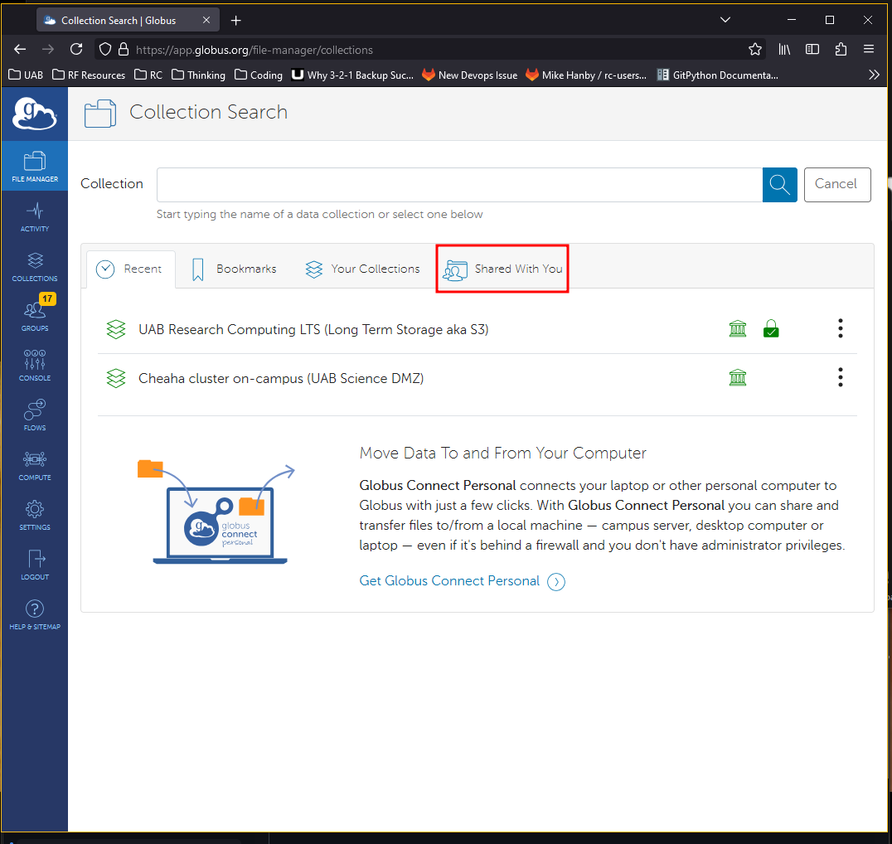
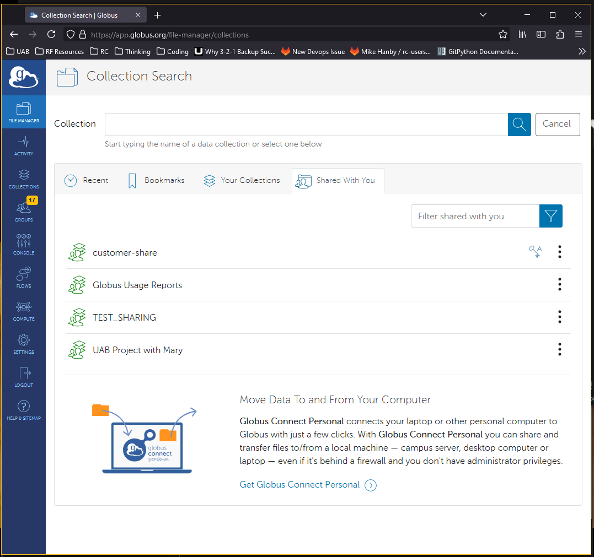
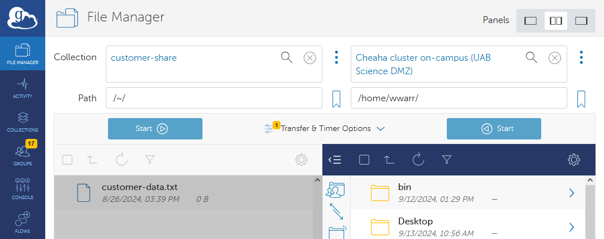
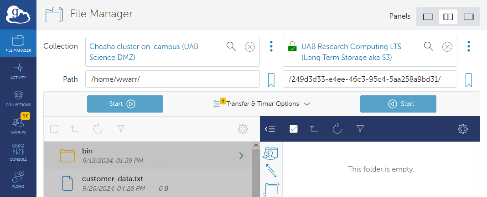
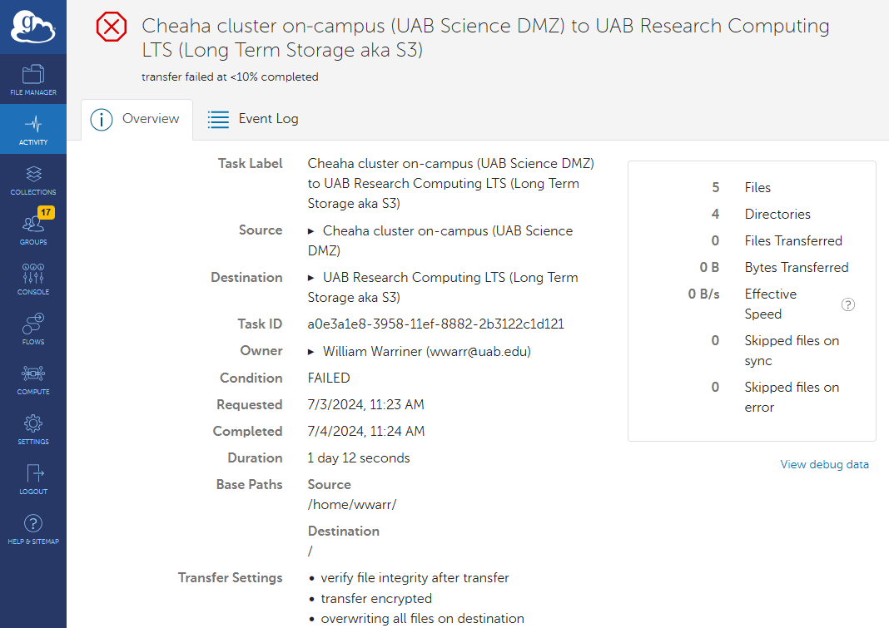

# Globus Tutorials for Individual Researchers

These tutorials are intended for individual researchers who want to use Globus to do the following.

- Transfer research data for their own use or for laboratory use.
- Receive data from other individuals, labs, or Research Cores.

If you need tutorials on using Globus for Research Core data management, please see our [Globus Tutorials for Research Groups](./globus_group_tutorial.md).

The tutorials below will teach you how to effectively use Globus for managing and transferring research data. We will explore what Globus is, why you might use it, and walk you through the essential steps to get started. You will learn how to set up your Globus account, access the Globus application, find collections shared with you, and search for collections by name.

**What You Will Learn:**

1. [Prerequisites](#prerequisites)
1. [What is Globus?](#what-is-globus)
1. [Why Use Globus?](#why-use-globus)
1. [How Does Globus Work?](#how-does-globus-work)
1. [How Do I Get Onto the Globus Web App?](#how-do-i-get-onto-the-globus-web-app)
1. [How Do I Find Collections Shared with Me?](#how-do-i-find-collections-shared-with-me)
1. [How Do I Search for Collections by Name?](#how-do-i-search-for-collections-by-name)
1. [How Do I Transfer from a Collection to Cheaha?](#how-do-i-transfer-from-a-collection-to-cheaha)
1. [How Do I Transfer from a Collection to LTS?](#how-do-i-transfer-from-a-collection-to-lts)
1. [How Do I Transfer between LTS and Cheaha?](#how-do-i-transfer-data-between-lts-and-cheaha)
1. [How Do I Check Transfer Status?](#how-do-i-check-transfer-status)

If you are new to Globus, you are in the right place. If you represent a group looking to share data with others we recommend following these tutorials with our [Globus Tutorials for Research Groups](./globus_group_tutorial.md)

## Prerequisites

For these tutorials, you will need your BlazerID or [XIAS ID](../../account_management/xias/index.md) and password to authenticate using UAB Single Sign-On (SSO).

## What is Globus?

Globus is a data transfer ecosystem that simplifies the process of transferring, sharing, and managing large datasets. It is used by research institutions around the world to move research data between different storage devices, computer systems, and institutions.

## Why use Globus?

Globus has many research data oriented features, making it ideal for many research data transfer scenarios. Below is a list of features.

- Straight-forward, browser-based interface.
- Compatible with [UAB Box](https://www.uab.edu/it/home/tech-solutions/file-storage/box).
- Compatible with [Long-Term Storage](../lts/index.md).
- Can be used with your laptop, desktop, or lab workstation via Globus Connect Personal (GCP).
- Transfers are automatically retried in the event of network or computer system outages.
- Transfers are encrypted end-to-end. Globus never sees your data.
- Suitable for transferring PHI and HIPAA data. Note: a UAB Enterprise IT risk assessment is required.

## How Does Globus Work?

Globus is an ecosystem of software intended to make research data transfer simpler. The Globus web application at <https://app.globus.org> allows you to initiate transfers between any two endpoints you have authorization to access. The Globus Connect Personal (GCP) software lets you turn any computer into a Globus endpoint. At no point do Globus servers touch your research data. Instead, when you initiate a transfer between two endpoints, the Globus application tells the two endpoints that they need to talk to each other and data is sent directly between them. The endpoints update the application with information you may need to know, such as how much data has transferred so far, how fast the transfer is proceeding, and any errors that occur. If the connection between endpoints is interrupted for any reason, the Globus application will attempt to restart the transfer from where it left off.

## How Do I Get Onto the Globus Web App?

1. To get to the Globus web app navigate to <https://app.globus.org>. You should see a page like below.

    

1. Type "UAB" or "University of Alabama at Birmingham" into the search bar to locate UAB in the list. The image below shows the correct choice in a red box.

    

1. Select "University of Alabama at Birmingham" from the drop-down menu and click "Continue" to be taken to the UAB Single Sign-On (SSO) form.

    

1. Enter your BlazerID and password in the SSO form, then click "Log In".

    

1. After logging in, you will be directed to the Globus file manager.

    

1. Enable two-panel view mode by clicking the button located near the top right corner, as shown in the red box below. Of the three available view mode buttons, the two-panel view button is in the center. This is an optional step, but highly recommended. This step will make your life much simpler while using Globus, now and in the future.

    

1. On the file transfer page, you will see two file browser windows: one on the left and one on the right. Each window will have an Endpoint field representing the two systems between which you wish to transfer files. Once set up, you can transfer files in either direction.

    

The file manager will be your most frequently-visited page when using Globus for data transfers. It is central to usage of the Globus web application.Please take some time to familiarize yourself with its look and feel. As you progress in the tutorials, please take time to experiment with transferring data to better understand how the interface works.

[Return to the index.](#globus-tutorials-for-individual-researchers)

## How Do I Find Collections Shared with Me?

Globus allows users to share collections with others. Other researchers, labs, and Research Cores on campus may invite you to their collections to share data with you. The following instructions let you view collections shared with you.

1. [Log in to Globus using your credentials.](#how-do-i-get-onto-the-globus-web-app)

1. In the Globus web app, click "File Manager" in the left navigation panel to go to the file manager page, then click the "Collection Search" bar shown in the red box in the image below.

    

1. You will be taken to the "Collection Search" page. Click the "Shared With You" tab.

    

1. The list of collections will be filtered down to all collections others have granted you access to, which should help you find the collections you need.

    

1. Click the name of the collection to be taken back to the file manager page with the collection filled in.

    

If you can't find a particular collection this way, but know its name, try [searching for collections](#how-do-i-search-for-collections-by-name) or [return to the index](#globus-tutorials-for-individual-researchers).

## How Do I Search For Collections By Name?

Please follow these instructions to search for a specific collection by name.

1. [Log in to Globus using your credentials.](#how-do-i-get-onto-the-globus-web-app).

1. In the Globus web app, click "File Manager" in the left navigation panel to go to the file manager page, then click the "Collection Search" shown in the red box in the image below.

    

1. You will be taken to a collection search page. Enter part or all of the name of the collection you are searching for in the search box on this new page.

    

1. Search results should appear. In the example below, we located the UAB Box collection, which connects to UAB's Box.com service.

    

1. Click the name of the collection to be taken back to the file manager page with the collection filled in.

    

If you can't find a particular collection this way, but know it was shared with you, try [finding collections shared with me](#how-do-i-find-collections-shared-with-me) or [return to the index](#globus-tutorials-for-individual-researchers).

## How Do I Transfer from a Collection to Cheaha?

Please use the following instructions to transfer data from a shared collection to a [bucket on LTS](../lts/index.md). These instructions may also be used for other buckets on LTS, provided you have access and know their file path.

The direction of transfer may also be reversed to transfer data from Cheaha to the shared collection. Note that some shared collections may not allow you to write data, such as Research Cores, in which case you will receive an error.

These instructions can be generalized to any two collections or endpoints you have access to on Globus.

1. [Log in to Globus using your credentials.](#how-do-i-get-onto-the-globus-web-app).

1. Find a shared collection [by filtering](#how-do-i-find-collections-shared-with-me) or [by searching](#how-do-i-search-for-collections-by-name) in the left side "Collection Search" bar.

1. Once you have selected the shared collection you wish to transfer data from, repeat the process to [search](#how-do-i-search-for-collections-by-name) for a Cheaha endpoint in the "Collection Search" bar on the right side of the file manager page. Search for "Cheaha cluster" to find them.

    Pay close attention in choosing which of the two you need. Choosing incorrectly could lead to slow transfers. Answer the following questions to help you decide. Is the first collection you selected...

    - ...part of a lab or Research Core on campus? Select "on-campus".
    - ...on a computer on the UAB Campus Network or UAB Wifi or the UAB VPN? Select "on-campus".
    - ...at a different institution? Select "off-campus".
    - ...on a computer on a home network? Select "off-campus".

1. When you select a Cheaha endpoint, or any other High Assurance (HA) collection or endpoint, you will be prompted to re-authenticate. Click the "Continue" button to do so, then select your UAB email address.

    

    

1. At this point, your file manager page should look something like the following image. Each "Collection Search" bar should have a collection or endpoint filled in. The left side should be the collection you wish to transfer from. The right side should be a Cheaha endpoint. You should see files and folders on both sides.

    

1. Locate the source path on the shared collection side. Either type the path into the Path field manually, or use the graphical selection field to click on folder names to navigate the filesystem.

1. Repeat the process on the Cheaha endpoint side to locate the destination path on the Cheaha endpoint side.

1. Select the file and folders you wish to transfer on the shared collection side. Do so by clicking the checkboxes next to the file and folder names.

    

1. To start the transfer, click the "Start" button on the side you made your selections. A transfer will be started and you should see a green toast notification at the upper-right corner of the web page. Press the "X" button to dismiss the notification or click "View Details" to be taken to the "Activity" page to see more details about the transfer.

    

From here you can proceed to other related tutorials to initiate other transfers or
[return to the index](#globus-tutorials-for-individual-researchers).

- [How do I check transfer status?](#how-do-i-check-transfer-status)
- [How do I transfer from a collection to LTS?](#how-do-i-transfer-from-a-collection-to-lts)
- [How do I transfer data between LTS and Cheaha?](#how-do-i-transfer-data-between-lts-and-cheaha)

## How Do I Transfer from a Collection to LTS?

Please use the following instructions to transfer data from a shared collection to a [bucket on LTS](../lts/index.md). These instructions may also be used for other directories on Cheaha, provided you have access and know their file path.

The direction of transfer may also be reversed to transfer data from LTS to the shared collection. Note that some shared collections may not allow you to write data, such as Research Cores, in which case you will receive an error.

These instructions can be generalized to any two collections or endpoints you have access to on Globus.

1. [Log in to Globus using your credentials.](#how-do-i-get-onto-the-globus-web-app).

1. Find a shared collection [by filtering](#how-do-i-find-collections-shared-with-me) or [by searching](#how-do-i-search-for-collections-by-name) in the left side "Collection Search" bar.

1. Once you have selected the shared collection you wish to transfer data from, repeat the process to [search](#how-do-i-search-for-collections-by-name) for the LTS endpoint in the "Collection Search" bar on the right side of the file manager page. Search for "UAB LTS" to find it.

1. When you select the LTS endpoint, or any other High Assurance (HA) collection or endpoint, you will be prompted to re-authenticate. Click the "Continue" button to do so, then select your UAB email address.

    

    

1. At this point, your file manager page should look something like the following image. Each "Collection Search" bar should have a collection or endpoint filled in. The left side should be the collection you wish to transfer from. The right side should be the Cheaha endpoint. You should see files and folders on both sides.

    

1. Locate the source path on the shared collection side. Either type the path into the Path field manually, or use the graphical selection field to click on folder names to navigate the filesystem.

1. Repeat the process on the LTS endpoint side to locate the destination path on the LTS endpoint side.

1. Select the file and folders you wish to transfer on the shared collection side. Do so by clicking the checkboxes next to the file and folder names.

    

1. To start the transfer, click the "Start" button on the side you made your selections. A transfer will be started and you should see a green toast notification at the upper-right corner of the web page. Press the "X" button to dismiss the notification or click "View Details" to be taken to the "Activity" page to see more details about the transfer.

    

From here you can proceed to other related tutorials to initiate other transfers or
[return to the index](#globus-tutorials-for-individual-researchers).

- [How do I check transfer status?](#how-do-i-check-transfer-status)
- [How do I transfer from a collection to Cheaha?](#how-do-i-transfer-from-a-collection-to-cheaha)
- [How do I transfer data between LTS and Cheaha?](#how-do-i-transfer-data-between-lts-and-cheaha)

## How Do I Transfer Data between LTS and Cheaha?

Please use the following instructions to transfer data from a [bucket on LTS](../lts/index.md) to a project directory on Cheaha. These instructions may also be used for other buckets on LTS and directories on Cheaha, provided you have access and know their file paths.

The direction of transfer may also be reversed to transfer data from Cheaha to LTS.

These instructions can be generalized to any two collections or endpoints you have access to on Globus.

1. [Log in to Globus using your credentials.](#how-do-i-get-onto-the-globus-web-app).

1. Find the LTS endpoint by [searching](#how-do-i-search-for-collections-by-name) in the "Collection Search" bar on the left side of the file manager page. Search for "UAB LTS" to find it.

1. Once you have selected the LTS endpoint, repeat the process to [search](#how-do-i-search-for-collections-by-name) for a Cheaha endpoint in the "Collection Search" bar on the right side of the file manager page. Search for "Cheaha cluster" to find it.

    Pay close attention in choosing which of the two you need. Choosing incorrectly could lead to slow transfers. Answer the following questions to help you decide. Is the first collection you selected...

    - ...part of a lab or Research Core on campus? Select "on-campus".
    - ...on a computer on the UAB Campus Network or UAB Wifi or the UAB VPN? Select "on-campus".
    - ...at a different institution? Select "off-campus".
    - ...on a computer on a home network? Select "off-campus".

1. Both the LTS and Cheaha endpoints are High Assurance (HA) endpoints and you will be prompted to re-authenticate. Click the "Continue" button to do so, then select your UAB email address.

    

    

1. At this point, your file manager page should look something like the following image. Each "Collection Search" bar should have a collection or endpoint filled in. The left side should be the LTS endpoint. The right side should be a Cheaha endpoint. You should see files and folders on both sides.

    

1. Locate the source path on the LTS endpoint side. Either type the path into the Path field manually, or use the graphical selection field to click on folder names to navigate the filesystem.

1. Repeat the process on the Cheaha endpoint side to locate the destination path on the Cheaha endpoint side.

1. Select the file and folders you wish to transfer on the shared collection side. Do so by clicking the checkboxes next to the file and folder names.

    

1. To start the transfer, click the "Start" button on the side you made your selections. A transfer will be started and you should see a green toast notification at the upper-right corner of the web page. Press the "X" button to dismiss the notification or click "View Details" to be taken to the "Activity" page to see more details about the transfer.

    

From here you can proceed to other related tutorials to initiate other transfers or
[return to the index](#globus-tutorials-for-individual-researchers).

- [How do I check transfer status?](#how-do-i-check-transfer-status)
- [How do I transfer from a collection to Cheaha?](#how-do-i-transfer-from-a-collection-to-cheaha)
- [How do I transfer from a collection to LTS?](#how-do-i-transfer-from-a-collection-to-lts)

## How Do I Check Transfer Status?

To check the status of your transfers, please follow the instructions below.

1. [Log in to Globus using your credentials.](#how-do-i-get-onto-the-globus-web-app).

1. In the Globus web app, click "Activity" in the left navigation panel to go to the activity page. There will be a list overview of transfers, with the most recent at the top.

    

1. To see more details about a transfer, click the transfer title. There will be two tabs. The "Overview" tab will have information and statistics about the transfer. The "Event Log" tab will have information about events that occurred during transfer, including start, stop, and any errors. The "Event Log" is useful for diagnosing issues with failed transfers.

    
