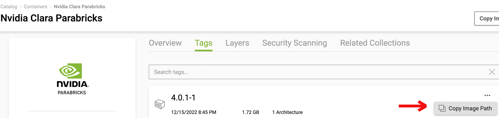

# Case Studies

## Parabricks for Performing GPU-accelerated Genome Sequencing Analysis

A GPU-accelerated genome sequencing analysis with high speedup and more accurate results can be achieved with NVIDIA Clara Parabricks. Pararbricks is a software suite for genomic analysis. Parabricks delivers accelerated analysis of next generation sequencing (NGS) data for researchers, RNA-seq, population studies, and many more usecases. More insights on its performance can be found [here](https://resources.nvidia.com/en-us-genomics-ep/genomics-appliance-for-research?lx=OhKlSJ).

For more information on Cheaha GPUs, please see our [GPU Page](../cheaha/slurm/gpu.md)

### Licensing Policy

A license is no longer required to use Clara Parabricks 4.x and later versions, and is free for the following groups,

1. Academic Research.
1. Research by non-profit institutions.
1. For development, test and evaluation purposes without use in production.

### Minimum Hardware requirements to run Parabricks on Cheaha GPUs

1. Access to the internet.
1. Any GPU that supports CUDA Compute Capability 7.0, 7.5, 8.0, 8.6, 8.9 or 9.0.
1. The GPU has 16 GB of GPU RAM or more. It has been tested on NVIDIA V100, NVIDIA A100, and NVIDIA T4 GPUs. For more information on Cheaha GPUs, please see our [GPU Page](../cheaha/slurm/gpu.md).
1. An NVIDIA driver with version 525.60.13 or greater.

<!-- markdownlint-disable MD046 -->
!!! Note
    The recent versions of Parabricks requires 16GB of GPU RAM or more. If this requirement is not satisfied, it will lead to `out of memory` error. Therefore, `Pascalnodes` partition are not recommended to run Parabricks pipeline as it does not meet the hardware requirement.
<!-- markdownlint-enable MD046 -->

#### System Requirements

- 2 GPU server should have 100GB CPU RAM, at least 24 CPU threads.
- 4 GPU server should have 196GB CPU RAM, at least 32 CPU threads.
- 8 GPU server should have 392GB CPU RAM, at least 48 CPU threads.

## Parabricks Testing on Cheaha

Parabricks software can be installed and used in the Cheaha platform on `amperenodes` partition.

### Parabricks 4.x Installation on Cheaha

Parbaricks 4.x are available as containers in the [NGC Catalog](https://catalog.ngc.nvidia.com/orgs/nvidia/collections/claraparabricks/entities). It has generic container that comprises all the analyses pipeline that are referred in the [Nvidia Documentation](https://docs.nvidia.com/clara/parabricks/latest/toolreference.html). It also has containers for specific tool category. The recent Parabricks 4.x documentation is available [here](https://docs.nvidia.com/clara/parabricks/latest/index.html).

Parabricks 4.x container image can be installed on Cheaha using a Singularity container. More details on usage of Singularity container on Cheaha can be found in the [Containers Page](../workflow_solutions/getting_containers.md).

To install Parabricks using Singulairty, load the `Singularity 3.x` module from Cheaha as,

```bash
module load Singularity/3.5.2-GCC-5.4.0-2.26
```

Go to the NGC catalog page and copy the image path to pull the desired containers of Parabricks using Singularity. Here, the generic container is pulled using Singularity.  The image path is in “nvcr.io/nvidia/clara/clara-parabricks" and the tag is 4.2.0-1. The container image name `parabricks-4.2.0-1.sif` is an user-derived name.



```bash
singularity pull parabricks-4.2.0-1.sif docker://nvcr.io/nvidia/clara/clara-parabricks:4.2.0-1
```

After the image `parabricks-4.2.0-1.sif` is successfully created, you can run singularity image `parabricks-4.2.0-1.sif` with all input and output parameters. Various ways of running singularity image can be found in the [Containers Page](../workflow_solutions/getting_containers.md).

Running `singularity shell` helps to navigate through the containers directory to verify the path of the software executable and later use the path outside the container to run the software. Following are the commands to run the container using `singularity shell` and traverse through the directories inside the contianer.

```bash
singularity shell parabricks-4.2.0-1.sif
```

```bash
Singularity> pbrun version
Please visit https://docs.nvidia.com/clara/#parabricks for detailed documentation

pbrun: 4.2.0-1
```

If the above commands are successfully executed, then the Parabricks software is installed correctly.

### Downloading Parabricks Sample Use Case

Sample test case for Parabricks can be found [here](https://docs.nvidia.com/clara/parabricks/latest/tutorials/gettingthesampledata.html). Download the sample data using `wget`,

```bash
wget -O parabricks_sample.tar.gz https://s3.amazonaws.com/parabricks.sample/parabricks_sample.tar.gz
```

Untar the `parabricks_sample.tar.gz` file,

```bash
tar -xzvf parabricks_sample.tar.gz
```

### Parabricks Testing on `amperenodes` on Cheaha

Once the sample data is downloaded, you can execute the pipeline using the executable `pbrun` within the container.

You will have to load the compatible `CUDA` module to access GPUs as below.

```bash
module load CUDA/11.6.0
```

In the below script, the `--nv` option enables the use of NVIDIA GPUs within the container. The singualrity container `parabricks-4.2.0-1.sif` is executed using the command `singualrity run` over the executable `pbrun`.

```bash
singularity run --nv parabricks-4.2.0-1.sif pbrun fq2bam \
--ref parabricks_sample/Ref/Homo_sapiens_assembly38.fasta \
--in-fq parabricks_sample/Data/sample_1.fq.gz parabricks_sample/Data/sample_2.fq.gz \
--out-bam output.bam
```

You can execute Parabricks on Cheaha using `amperenodes` partition. Maximum number of GPUs you can request in `amperenodes` partition to run Parabricks is 2. Below is a sample job script to run Parabricks on `amperenodes` partition on 2 GPUs.

```bash
#!/bin/bash
#SBATCH --ntasks=24
#SBATCH --mem=100G
#SBATCH --time=2:00:00
#SBATCH --partition=amperenodes
#SBATCH --job-name=parabricks-ampere
#SBATCH --gres=gpu:2
#SBATCH --error=%x-%j_gpu2.ampere.err
#SBATCH --output=%x-%j_gpu2.ampere.out
#SBATCH --mail-user=$USER@uab.edu

#Load the Singularity and CUDA Toolkit modules
module load Singularity/3.5.2-GCC-5.4.0-2.26
module load CUDA/11.6.0

#Run the "pbrun" executable from the singularity image "parabricks-4.2.0-1.sif", and pass the CUDA lib path to make it accessible within the container
singularity run --nv parabricks-4.2.0-1.sif pbrun fq2bam \
--ref parabricks_sample/Ref/Homo_sapiens_assembly38.fasta \
--in-fq parabricks_sample/Data/sample_1.fq.gz parabricks_sample/Data/sample_2.fq.gz \
--out-bam output.bam
```

You can also request the required resources using `srun` using the below command, and execute the commands required to run Parabricks.

```bash
srun --ntasks=24 --mem=100G --time=1:00:00 --partition=amperenodes --job-name=parabricks-ampere --gres=gpu:2 --pty /bin/bash
```

#### Illustration on `fq2bam` tool analyses

The above execution script performs `fq2bam` pipeline analyses. The `fq2bam` tool aligns, sorts (by coordinate), and marks duplicates in pair-ended FASTQ file data. The data files used in this example are taken from the sample data downloaded in the previous section.

If you execute the above batch script using Parabricks sample data on `amperenodes` with 2 GPUs, the results will be reported as below.

```bash
[PB Info 2023-Nov-03 11:54:50] ------------------------------------------------------------------------------
[PB Info 2023-Nov-03 11:54:50] ||                 Parabricks accelerated Genomics Pipeline                 ||
[PB Info 2023-Nov-03 11:54:50] ||                              Version 4.2.0-1                             ||
[PB Info 2023-Nov-03 11:54:50] ||                       GPU-BWA mem, Sorting Phase-I                       ||
[PB Info 2023-Nov-03 11:54:50] ------------------------------------------------------------------------------
[M::bwa_idx_load_from_disk] read 0 ALT contigs
[PB Info 2023-Nov-03 11:54:55] GPU-BWA mem
[PB Info 2023-Nov-03 11:54:55] ProgressMeter    Reads           Base Pairs Aligned
[PB Info 2023-Nov-03 11:55:09] 5043564          600000000
[PB Info 2023-Nov-03 11:55:13] 10087128 1180000000
[PB Info 2023-Nov-03 11:55:18] 15130692 1740000000
[PB Info 2023-Nov-03 11:55:22] 20174256 2320000000
[PB Info 2023-Nov-03 11:55:26] 25217820 2900000000
[PB Info 2023-Nov-03 11:55:30] 30261384 3490000000
[PB Info 2023-Nov-03 11:55:33] 35304948 4050000000
[PB Info 2023-Nov-03 11:55:37] 40348512 4640000000
[PB Info 2023-Nov-03 11:55:41] 45392076 5230000000
[PB Info 2023-Nov-03 11:55:45] 50435640 5790000000
[PB Info 2023-Nov-03 11:57:59]
GPU-BWA Mem time: 184.615934 seconds
[PB Info 2023-Nov-03 11:57:59] GPU-BWA Mem is finished.

[main] CMD: /usr/local/parabricks/binaries//bin/bwa mem -Z ./pbOpts.txt -F 0 /home/prema/projects/parabricks_testing/parabricks_sample/Ref/Homo_sapiens_assembly38.fasta /home/prema/projects/parabricks_testing/parabricks_sample/Data/sample_1.fq.gz /home/prema/projects/parabricks_testing/parabricks_sample/Data/sample_2.fq.gz @RG\tID:HK3TJBCX2.1\tLB:lib1\tPL:bar\tSM:sample\tPU:HK3TJBCX2.1
[main] Real time: 188.762 sec; CPU: 2037.057 sec
[PB Info 2023-Nov-03 11:57:59] ------------------------------------------------------------------------------
[PB Info 2023-Nov-03 11:57:59] ||        Program:                      GPU-BWA mem, Sorting Phase-I        ||
[PB Info 2023-Nov-03 11:57:59] ||        Version:                                           4.2.0-1        ||
[PB Info 2023-Nov-03 11:57:59] ||        Start Time:                       Fri Nov  3 11:54:50 2023        ||
[PB Info 2023-Nov-03 11:57:59] ||        End Time:                         Fri Nov  3 11:57:59 2023        ||
[PB Info 2023-Nov-03 11:57:59] ||        Total Time:                            3 minutes 9 seconds        ||
[PB Info 2023-Nov-03 11:57:59] ------------------------------------------------------------------------------
[PB Info 2023-Nov-03 11:58:00] ------------------------------------------------------------------------------
[PB Info 2023-Nov-03 11:58:00] ||                 Parabricks accelerated Genomics Pipeline                 ||
[PB Info 2023-Nov-03 11:58:00] ||                              Version 4.2.0-1                             ||
[PB Info 2023-Nov-03 11:58:00] ||                             Sorting Phase-II                             ||
[PB Info 2023-Nov-03 11:58:00] ------------------------------------------------------------------------------
[PB Info 2023-Nov-03 11:58:00] progressMeter - Percentage
[PB Info 2023-Nov-03 11:58:00] 0.0       0.00 GB
[PB Info 2023-Nov-03 11:58:05] 52.8      0.00 GB
[PB Info 2023-Nov-03 11:58:10] Sorting and Marking: 10.001 seconds
[PB Info 2023-Nov-03 11:58:10] ------------------------------------------------------------------------------
[PB Info 2023-Nov-03 11:58:10] ||        Program:                                  Sorting Phase-II        ||
[PB Info 2023-Nov-03 11:58:10] ||        Version:                                           4.2.0-1        ||
[PB Info 2023-Nov-03 11:58:10] ||        Start Time:                       Fri Nov  3 11:58:00 2023        ||
[PB Info 2023-Nov-03 11:58:10] ||        End Time:                         Fri Nov  3 11:58:10 2023        ||
[PB Info 2023-Nov-03 11:58:10] ||        Total Time:                                     10 seconds        ||
[PB Info 2023-Nov-03 11:58:10] ------------------------------------------------------------------------------
[PB Info 2023-Nov-03 11:58:11] ------------------------------------------------------------------------------
[PB Info 2023-Nov-03 11:58:11] ||                 Parabricks accelerated Genomics Pipeline                 ||
[PB Info 2023-Nov-03 11:58:11] ||                              Version 4.2.0-1                             ||
[PB Info 2023-Nov-03 11:58:11] ||                         Marking Duplicates, BQSR                         ||
[PB Info 2023-Nov-03 11:58:11] ------------------------------------------------------------------------------
[PB Info 2023-Nov-03 11:58:11] Using PBBinBamFile for BAM writing
[PB Info 2023-Nov-03 11:58:11] progressMeter -  Percentage
[PB Info 2023-Nov-03 11:58:21] 24.9      0.08 GB
[PB Info 2023-Nov-03 11:58:31] 48.1      0.07 GB
[PB Info 2023-Nov-03 11:58:41] 69.8      0.09 GB
[PB Info 2023-Nov-03 11:58:51] 85.9      0.11 GB
[PB Info 2023-Nov-03 11:59:01] 100.0     0.00 GB
[PB Info 2023-Nov-03 11:59:01] BQSR and writing final BAM:  50.044 seconds
[PB Info 2023-Nov-03 11:59:01] ------------------------------------------------------------------------------
[PB Info 2023-Nov-03 11:59:01] ||        Program:                          Marking Duplicates, BQSR        ||
[PB Info 2023-Nov-03 11:59:01] ||        Version:                                           4.2.0-1        ||
[PB Info 2023-Nov-03 11:59:01] ||        Start Time:                       Fri Nov  3 11:58:11 2023        ||
[PB Info 2023-Nov-03 11:59:01] ||        End Time:                         Fri Nov  3 11:59:01 2023        ||
[PB Info 2023-Nov-03 11:59:01] ||        Total Time:                                     50 seconds        ||
[PB Info 2023-Nov-03 11:59:01] ------------------------------------------------------------------------------
```

### Monitoring GPU Usage During Runtime on Cheaha

The `nvidia-smi` command helps to montior the GPU usage during runtime. You need to `ssh` to the assigned GPU node, and type in the following command.

```bash
ssh GPU_node
```

```bash
module load CUDA/11.6.0
nvidia-smi
```

The `nvidia-smi` reports the GPU memory usage and the 2 GPU process running details as shown below.

```bash
$ module load CUDA/11.6.0

$ nvidia-smi

Fri Nov  3 12:38:24 2023
+---------------------------------------------------------------------------------------+
| NVIDIA-SMI 535.86.10              Driver Version: 535.86.10    CUDA Version: 12.2     |
|-----------------------------------------+----------------------+----------------------+
| GPU  Name                 Persistence-M | Bus-Id        Disp.A | Volatile Uncorr. ECC |
| Fan  Temp   Perf          Pwr:Usage/Cap |         Memory-Usage | GPU-Util  Compute M. |
|                                         |                      |               MIG M. |
|=========================================+======================+======================|
|   0  NVIDIA A100 80GB PCIe          Off | 00000000:25:00.0 Off |                    0 |
| N/A   35C    P0             165W / 300W |  16631MiB / 81920MiB |     97%      Default |
|                                         |                      |             Disabled |
+-----------------------------------------+----------------------+----------------------+
|   1  NVIDIA A100 80GB PCIe          Off | 00000000:81:00.0 Off |                    0 |
| N/A   32C    P0             112W / 300W |  16631MiB / 81920MiB |     96%      Default |
|                                         |                      |             Disabled |
+-----------------------------------------+----------------------+----------------------+

+---------------------------------------------------------------------------------------+
| Processes:                                                                            |
|  GPU   GI   CI        PID   Type   Process name                            GPU Memory |
|        ID   ID                                                             Usage      |
|=======================================================================================|
|    0   N/A  N/A     65905      C   .../local/parabricks/binaries//bin/bwa    16594MiB |
|    1   N/A  N/A     65905      C   .../local/parabricks/binaries//bin/bwa    16594MiB |
+---------------------------------------------------------------------------------------+
```

### Runtime Evaluation of Parabricks Sample Test Case on `amperenodes` Partition

Parabricks is tested and works with CUDA version >= 11.6.0 on Cheaha. Empirical results on running Parabricks sample test case on `amperendoes` partitions are illustrated in the below table. For this test case, runtime of 1 GPU is better than 2 GPU. Generally, large-scale data scales well with increase in number of GPUs, and the real-world science simulations may vary in their speedup.

{{ read_csv('education/res/parabricks_exec_time.csv', keep_default_na=False) }}

Applications show 2x performance with Parabricks greater than 4.0 version. You can refer [here](https://docs.nvidia.com/clara/parabricks/latest/bestperformance.html#best-performance-for-germline-pipeline) to performance tuning ideas to achieve best performance with Parabricks.
