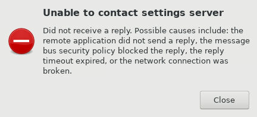
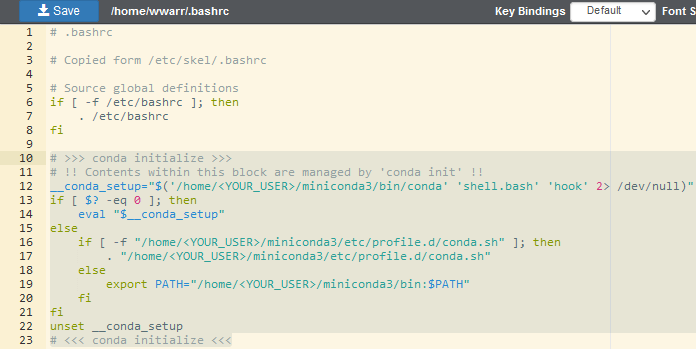

# Frequently Asked Questions (FAQ)

Below are some common issues, their most common causes, and their most common resolutions. If after checking for your issue below, please feel free to reach out to us at <support@listserv.uab.edu>.

## Common Issues

### Why is my job taking a long time to start?

There are a few common reasons why a job can take a long time to start. These apply to jobs on the Open OnDemand web portal, and at the terminal.

#### There is a long queue wait time

If possible, you can move ahead in the queue by canceling and resubmitting your job with fewer requested resources.

#### Your job is requesting more resources than are available or allowed

Double check our resource limits for various situations:

- Requesting many jobs at once? Our [Partitions](/docs/cheaha/hardware.md#partitions) table lists global quotas for each partition. When these limits are reached, no more jobs will be started until some resources are freed from other jobs.
- Requesting jobs on a single node? Our [Node Summary](/docs/cheaha/hardware.md#node-summary) table lists resource limits for each partition. These are physical limits of available hardware, and can't be exceeded.

#### There is a system outage

<!-- markdownlint-disable MD046 -->
!!! note

    Under construction.
<!-- markdownlint-disable MD046 -->

### Why do I get an error when I try to launch an OOD HPC Interactive session?

If you are seeing an error like the following when launching an HPC Interactive job, please read on for the most likely solution.



The most common cause is that the command `conda init` was used, creating a block in your `.bashrc` file that looks like the following section. [Anaconda](../cheaha/conda.md) is managed as a [module](../cheaha/lmod.md), so it is not necessary to use `conda init`. To avoid the issue reoccurring, please do not use `conda init`.

```bash
# >>> conda initialize >>>
# !! Contents within this block are managed by 'conda init' !!
__conda_setup="$('/home/<YOUR_USER>/miniconda3/bin/conda' 'shell.bash' 'hook' 2> /dev/null)"
if [ $? -eq 0 ]; then
    eval "$__conda_setup"
else
    if [ -f "/home/<YOUR_USER>/miniconda3/etc/profile.d/conda.sh" ]; then
        . "/home/<YOUR_USER>/miniconda3/etc/profile.d/conda.sh"
    else
        export PATH="/home/<YOUR_USER>/miniconda3/bin:$PATH"
    fi
fi
unset __conda_setup
# <<< conda initialize <<<
```

To resolve this issue, you'll need to [locate the hidden file](#how-do-i-locate-hidden-dot-files-on-cheaha) `.bashrc` in the file browser pane and select it.


Click the "Edit" button. In the new tab that opens, delete the section shown above and click "Save".



Please try to launch your job again. If it still doesn't work, please [contact us](/docs/index.md#contact-us)

### Why do I get a gray screen for a long time after launching my OOD RStudio Server session?

Most commonly, delays in launching OOD RStudio Server are caused by a large quantities of files referenced in the `.rstudio` directory in the home directory. RStudio Server works through all of the references as part of its loading process, delaying startup. To resolve the issue, you'll need to [locate the hidden directory](#how-do-i-locate-hidden-dot-files-on-cheaha) `.rstudio` in your `$HOME` folder. Once you've found it, delete it, then try recreating your job.

### Why is my OOD RStudio Server session giving me a 502 or 503 error?

See [here](#why-do-i-get-a-gray-screen-for-a-long-time-after-launching-my-ood-rstudio-server-session)

### How do I locate hidden dot files on Cheaha?

Dot files are files or directories that start with the character `.` as in the file `.bashrc` or the `.conda` directory.

If you are using Open OnDemand, please navigate to `https://rc.uab.edu`, login and click the `Files` dropdown in the top navigation menu. Click "Home Directory". More detailed instructions on the file browser can be found at [OOD Files](/docs/cheaha/open_ondemand/ood_files.md). Once you've opened the file browser, check the checkbox labeled "Show Dotfiles" in the top-right of the page.


If you are using the terminal, you'll need to use `cd` to navigate to the appropriate directory and enter use `ls` with the `-a` flag to list all files and directories, including hidden ones.

### What is a segfault error?

A segfault, or segmentation fault, often causes unexpected termination of software. These errors are caused by software attempting to access memory that it isn't allowed to access. An error typically includes a long string of hexadecimal characters like `0x000055ea4064c135`, but with different values, and one or more of `segmentation fault`, `segfault` and/or `SIGSEGV`.

These issues are most commonly caused by programming errors, but can be related to out-of-memory errors. If you encounter a segmentation fault, first try increasing the memory requested for the job. It may help to learn more about [SLURM](/docs/cheaha/slurm/introduction.md) and [job efficiency](/docs/cheaha/job_efficiency.md).

### What is a bus error?

A bus error is almost always related to a process requesting more memory than is available. In other words, the job ran out of memory. The simplest solution is to increase the requested memory for the job. It may help to learn more about [SLURM](/docs/cheaha/slurm/introduction.md) and [job efficiency](/docs/cheaha/job_efficiency.md).
