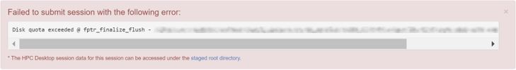
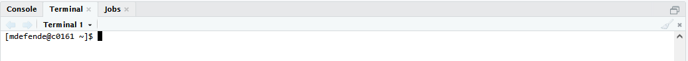
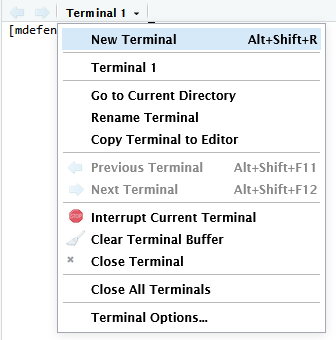

# Frequently Asked Questions (FAQ)

Below are some common issues, their most common causes, and their most common resolutions. If after checking for your issue below, please feel free to reach out to us at <support@listserv.uab.edu>.

## Cheaha

### Authentication Issues

#### Why is my account on hold?

There are a number of reasons your account was placed on hold. Please see [Account on Hold](../account_management/cheaha_account.md#account-on-hold) for more information.

#### Why is my account not authorized?

There are a number of reasons your account may not be authorized. Please see [Account Authorization Error](../account_management/cheaha_account.md#authorization-error) for more information.

### Common Issues

#### Why is my job taking a long time to start?

There are a few common reasons why a job can take a long time to start. These apply to jobs on the Open OnDemand web portal, and at the terminal.

1. There is a long queue wait time. If possible, you can move ahead in the queue by canceling and resubmitting your job with fewer requested resources.

2. Your job is requesting more resources than are available or allowed. Double check our resource limits for various situations:

    - Requesting many jobs at once? Our [Partitions](../cheaha/hardware.md#partitions) table lists global quotas for each partition. When these limits are reached, no more jobs will be started until some resources are freed from other jobs.
    - Requesting jobs on a single node? Our [Node Summary](../cheaha/hardware.md#node-summary) table lists resource limits for each partition. These are physical limits of available hardware, and can't be exceeded.

3. There is a system outage. If this is the case, information will be distributed by Research Computing.

<!-- markdownlint-disable MD046 -->
!!! note

    Under construction.
<!-- markdownlint-disable MD046 -->

#### Why do I get an error when I try to submit an Open OnDemand interactive job?

If you are seeing a "Failed to submit session" error in a red box when you submit an interactive job on Open OnDemand, like the following, please try reading the error text first. If the cause of the error is not obvious from the text, please read on for some common causes. If none of the below common causes apply, please contact [Support](support.md).



- If the error text starts with `Disk quota exceeded` then your storage space in `/data/user/$USER` is likely full. Please see [Storage](../data_management/storage.md) for more information on options for alternative storage locations, or contact [Support](support.md).

#### Why do I get an error when I try to launch an Open OnDemand HPC Interactive session?

If you are seeing an error like the following when launching an HPC Interactive job, please read on for the most likely solution.


The most common cause is that the command `conda init` was used, creating a block in your `.bashrc` file that looks like the following section.

``` bash
# >>> conda initialize >>>
# !! Contents within this block are managed by 'conda init' !!
__conda_setup="$('/home/<YOUR_USER>/miniconda3/bin/conda' 'shell.bash' 'hook' 2> /dev/null)"
if [ $? -eq 0 ]; then
    eval "$__conda_setup"
else
    if [ -f "/home/<YOUR_USER>/miniconda3/etc/profile.d/conda.sh" ]; then
        . "/home/<YOUR_USER>/miniconda3/etc/profile.d/conda.sh"
    else
        export PATH="/home/<YOUR_USER>/miniconda3/bin:$PATH"
    fi
fi
unset __conda_setup
# <<< conda initialize <<<
```

[Anaconda](../cheaha/conda.md) is managed as a [Module](../cheaha/lmod.md) on [Cheaha](../cheaha/getting_started.md), so it is unnecessary to use `conda init`, and can cause issues with [Open OnDemand](../cheaha/open_ondemand/ood_main.md). To avoid the issue reoccurring, please do not use `conda init` on Cheaha.

To resolve this issue, you'll need to [locate the hidden file](#how-do-i-locate-hidden-dot-files-on-cheaha) `.bashrc` in the file browser pane and select it.


Click the "Edit" button. In the new tab that opens, delete the section shown above and click "Save".


Please try to launch your job again. If it still doesn't work, please [contact us](../index.md#contact-us)

#### Why do I get a gray screen after launching my Open OnDemand RStudio Server session?

Most commonly, delays in launching Open OnDemand RStudio Server are caused by a large quantities of files referenced in the `.rstudio` directory in the home directory. This can also commonly occur when a large amount of data was loaded in the workspace in your previous RStudio session. To resolve the issue, you'll need to [locate the hidden directory](#how-do-i-locate-hidden-dot-files-on-cheaha) `.rstudio` in your `$HOME` folder. Once you've found it, delete it, then try recreating your job.

<!-- markdownlint-disable MD046 -->
!!! warning

    Deleting the .rstudio directory will delete the workspace you had open, including any scripts that were unsaved. Saved scripts will be fine.

#### Why is my Open OnDemand RStudio Server session giving me a 502 or 503 error?

See [here](#why-do-i-get-a-gray-screen-after-launching-my-ood-rstudio-server-session).

#### Why is my Anaconda environment not appearing in my Jupyter Notebook kernels?

See [here](../environment_management/anaconda_environments.md#packages-for-jupyter).

#### What is a segfault error?

A segfault, or segmentation fault, often causes unexpected termination of software. These errors are caused by software attempting to access memory that it isn't allowed to access. An error typically includes a long string of hexadecimal characters like `0x000055ea4064c135`, but with different values, and one or more of `segmentation fault`, `segfault` and/or `SIGSEGV`.

These issues are most commonly caused by programming errors, but can be related to out-of-memory errors. If you encounter a segmentation fault, first try increasing the memory requested for the job. It may help to learn more about [SLURM](../cheaha/slurm/introduction.md) and [job efficiency](../cheaha/job_efficiency.md).

#### What is a bus error?

A bus error is almost always related to a process requesting more memory than is available. In other words, the job ran out of memory. The simplest solution is to increase the requested memory for the job. It may help to learn more about [SLURM](../cheaha/slurm/introduction.md) and [job efficiency](../cheaha/job_efficiency.md).

#### I copied a script from a Windows machine to Cheaha and am getting a bad interpreter error

Bad interpreter errors usually mean that there are symbols in the script that the shell interpreter cannot read correctly. This is usually due to the difference in newline symbols used in Windows (`\r\n`) and Unix (`\n`). Once these newline symbols are changed, the script should be able to run on Cheaha.

To convert a script written in Windows to be compatible on Linux, use the `dos2unix` command. Just give it the name of the script to convert and it should convert it correctly.

``` bash
dos2unix example_script.sh
```

If you are using development tools like [Notepad++](https://notepad-plus-plus.org/downloads/) or [VSCode](https://code.visualstudio.com/), there are built-in ways to remove the carriage returns.

- NP++: Go to Edit >> EOL Conversion >> Unix (LF). This must be done for individual files.
- VSCode: Open Settings and search for EoL. Change the default EoL character to `\n`. This will be applied globally if changed in your User Options.

#### Why am I seeing an InvalidAccount error when submitting jobs when I could submit jobs fine previously?

If you see this error when submitting jobs, please [contact support](support.md#how-to-request-support). There are a few causes for this error that will need to be investigated.

### Issues in Progress

This section gives workarounds for some issues that are currently being investigated by the team. Once the issue has been resolved, the section will be updated with the permanent fix.

#### Why are my R Packages Not Installing Correctly Using the RStudio App

When using the RStudio Server app (the non-deprecated version) on [Open OnDemand](https://rc.uab.edu), some packages that need C++ compilation will not install correctly when run directly from either the RStudio console or the Install Packages button. As a temporary workaround, you can install the packages from the terminal inside RStudio.

1. Select the Terminal tab next to the Console tab

    

2. Load the same R module you loaded when requesting the session using the `module load R/<insert version>` command
3. Start R using the `R` command
4. Install the packages you need using R's `install.packages` command (or whichever other package installer you need, such as `BiocManager::install`)

    - For some people, the `utils` package may not be loaded initially causing R to not be able to find the `install.packages` command. Use `library(utils)` first, then use `install.packages`.

5. Once your packages are installed, close the terminal by clicking the dropdown and selecting `Close Terminal`. This will free the resources the terminal R session was using for RStudio to be able to use again.

    

Your R packages should now be available for use.

#### My script uses a Singularity container and seems to freeze until it times out

When using Singularity containers in scripts and the amount of memory used by the container exceeds the amount requested for the job, the script will hang until the time limit is reached. Typically, scripts are immediately killed when memory used exceeds memory requested, but that is not the behavior with containers. If your scripts using containers seem to hang and not produce anything until the job ends, use the `seff` command to investigate the memory usage after the job ends (see [it's entry in our docs](../cheaha/job_efficiency.md#verifying-job-efficiency)). If it is using the full amount of memory requested, try upping the amount of memory and submit the job again. To find the job number for past jobs, look [further down](faq.md#how-do-i-find-my-job-id-number).

### How To

#### How do I locate hidden dot files on Cheaha?

Dot files are files or directories that start with the character `.` as in the file `.bashrc` or the `.conda` directory.

If you are using Open OnDemand, please navigate to `https://rc.uab.edu`, login and click the `Files` dropdown in the top navigation menu. Click "Home Directory". More detailed instructions on the file browser can be found at [Open OnDemand Files](../cheaha/open_ondemand/ood_files.md). Once you've opened the file browser, check the checkbox labeled "Show Dotfiles" in the top-right of the page.


If you are using the terminal, you'll need to use `cd` to navigate to the appropriate directory and enter use `ls` with the `-a` flag to list all files and directories, including hidden ones.

#### How do I find my Job ID number?

All jobs submitted to Slurm on Cheaha are assigned a unique identifier called the Job ID or `jobid`.

- Using [Open OnDemand](../cheaha/open_ondemand/ood_main.md)?
    - If the job is still running see [My Interactive Sessions](../cheaha/open_ondemand/ood_interactive.md#my-interactive-sessions) to locate the Job ID.
    - If the job is no longer running, or the job card is missing, use the last bullet point for `sacct` usage.
- Using the terminal?
    - Just submitted the job?
        - Using `srun <flags> --pty /bin/bash`?
            - If you are still in the job context, type `echo $SLURM_JOB_ID`.
            - Otherwise use the final bullet point for `sacct` usage.
        - Using `srun` without `--pty`? Use the final bullet point for `sacct` usage.
        - Using `sbatch`? The Job ID is printed to the command line automatically on submission.
    - Job still running?
        - Use `squeue -u $USER` to show all your running jobs.
    - Job not running?
        - Use the final bullet point `sacct` usage.
- How to use `sacct` to find a job.
    - If you know the date of the job, use the following command at the terminal. The date following `-s` is the start date, choose the same day the job was submitted. The following `-e` is the end date, choose the day after `-s`. You will be provided with a list of jobs run on the `-s` day, and can sift through them to find your job.

        ```bash
        sacct -u $USER -s YYYY-MM-DD -e YYYY-MM-DD
        ```

    - Otherwise contact [Support](../help/support.md) for assistance.

#### How do I find my Open OnDemand Session Information?

All jobs created using Open OnDemand will create a folder in your home directory containing diagnostic information about those jobs. This information can be helpful for diagnosing issues when using Open OnDemand. To review the folder contents, click the Session ID link in the job card under the [My Interactive Sessions](../cheaha/open_ondemand/ood_interactive.md#my-interactive-sessions) of Open OnDemand.

If asked, the simplest way to give us the information is the following. Please visit the [File Browser](../cheaha/open_ondemand/ood_files.md) page for a visual guide to the features of the Open OnDemand File Browser, which will help with the following instructions. Please also visit the [My Interactive Sessions](../cheaha/open_ondemand/ood_interactive.md#my-interactive-sessions) page to familiarize yourself with job cards.

1. Find the card for the appropriate job.
2. Click the Session ID link of the card from (1) to open the [File Browser](../cheaha/open_ondemand/ood_files.md). Make note of the Session ID value, which should be something like `bbd7ad60-a37c-47aa-a8fb-d7ca6cf39b3c` but with different characters.
3. In the "Working Directory" section of the interface, click the parent folder name to go up one directory level.
4. In the "File List" locate the folder with the matching Session ID from step (2).
5. Click that folder once to select it.
6. Click the "Download" button in the "File Command Menu" to download a zipped copy of the folder and its contents.
7. Pass the downloaded Zip file to [Support](support.md).

## UAB Cloud

### Why is my instance returning an error of "Host not found"

The "Host not found" error is typically due to the amount of requested resources not being available when the instance is initializing. This is especially common for instances requesting GPUs, when no GPUs are free.

When your instances are not being used, please suspend them to free resources for other people who need them.
<!-- markdownlint-disable MD046 -->
!!! note

    Under construction
<!-- markdownlint-enable MD046 -->

## Globus

### Why can't other users access data I transferred to a project space on Cheaha?

When transferring using Globus, file permissions from the source file are not transferred with the file due to limitations purposefully placed by Globus. When transferring to any space on Cheaha, the most likely permission sets are user read and write only with no group permissions. Researchers will need to manually change permissions for the files they transfer using Globus to add group permissions if desired. You can use the `chmod` command for this:

``` bash
# If you transferred a single file, you can do this
chmod g+rw <path/to/file>

# If you transferred a directory and need to give permissions to all files in the directory, you can use this
chmod -R g+rw <path/to/file>
```

The `g+rw` adds group read and write permissions. You can add only read permissions by omitting the `w` if desired.

For more information on Globus file permissions, you can read [their FAQ entry](https://docs.globus.org/faq/transfer-sharing/#how_do_i_control_file_permissions_during_transfers).

## Long-Term Storage

### Why do I need to add the trailing / to the end of path names in my S3 commands?

In the Unix file system, the `/` is a protected character the specifies a branch in the file tree, and so `/` cannot be used in the name of a file or folder. This is not the case for S3 storage. Everything in S3 storage is stored at the top level of the bucket no matter the source's file and folder structure. However, people have become so used to having a folder structure and how it provides an organization system, so S3 interfaces pretend to have one. When a folder is uploaded, the files in the folder will have that folder name appended to the beginning of the file name along with the `/` separator. Same for if files are uploaded to existing "folders" in S3. These paths are called prefixes in S3 terms. Because `/` is not protected in S3, all of the `/` characters in a path are included with the prefix, so if you want to perform a command on a prefix in S3, you must include the trailing `/` because it is actually a part of the prefix name.

## GitLab

### Why am I not able to remove researchers from repositories?

If you are not able to remove one or more researchers from a given repository, please check the following. Individual researchers can be members of a group, of a subgroup, of a repository inside groups and subgroups, or any combination. Be aware that GitLab repositories can inherity membership from groups.

- Is the affected repository part of a group or subgroup?
    - If yes, try removing the researcher from the group or subgroup. Work your way up any nested subgroups if it continues to fail.
    - If no, please contact [Support](support.md).
