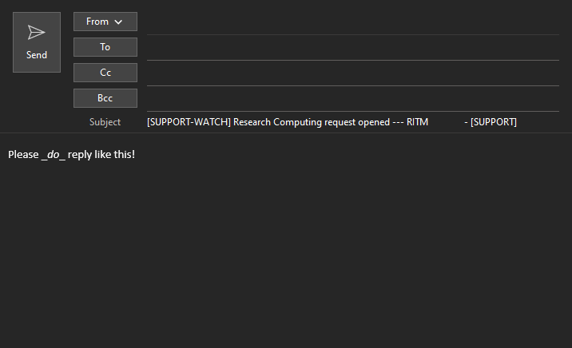
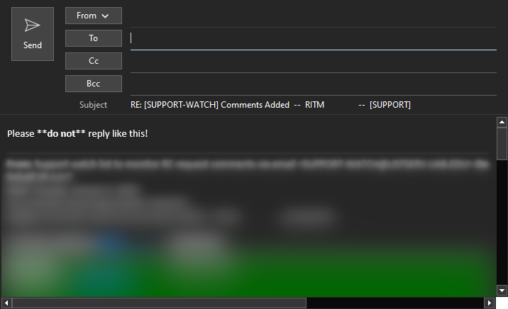
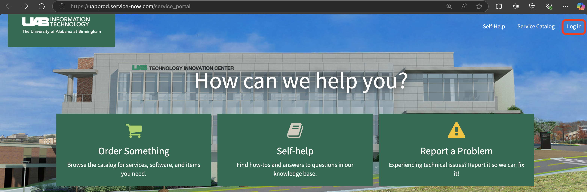
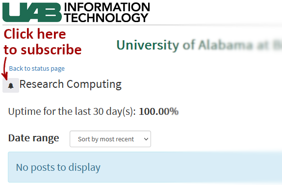

# How to Request Support

Before reaching out to us, try searching this documentation for keywords related to your issue. If you aren't able to find anything, please try checking our FAQ located on [ask.cyberinfrastructure](https://ask.cyberinfrastructure.org/c/locales-data-centers-and-campus-rc/uab/52). If you still need help, please read on for how to send in a ticket and how to work with our ticketing system.

## How Do I Create a Support Ticket?

To Create a support ticket, send a descriptive email to <support@listserv.uab.edu> to create a ticket. Bonus points for including the following details.

For general issues:

1. What is your goal?
1. What steps were taken?
1. What was expected?
1. What actually happened?
1. How was the cluster accessed? Web Portal, SSH, VNC, etc.?
1. What software were you using? Please be as specific as possible. The command `module list` can be helpful here.

For outages:

1. What part of the cluster is affected? Please list any relevant affected nodes or other hardware that is not accessible. If you are unable to access the cluster please state that instead.
1. What were you working on when you noticed the outage?
1. How were you accessing the cluster? Web Portal, SSH, VNC, etc.?

### How Do I Work With Tickets I've Created?

UAB IT and Research Computing use ServiceNow for ticket management. When any email is sent to <support@listserv.uab.edu>, AskIT is notified and a ticket is created in ServiceNow and the ticket details are forwarded by email to every member of Research Computing staff.

When any email is sent to <support@listserv.uab.edu> the following happens:

1. An RITM ticket is created in ServiceNow and assigned to Research Computing.
1. The email is routed to Research Computing staff and the ticket creator from the `support@listserv.uab.edu` email list. Please **do not reply**. Replies create additional tickets and cause service delays.
1. A monitoring email is sent from `support-watch@listserv.uab.edu` to Research Computing staff and the ticket creator. Please **do not reply** to this email. Your email will not make it through, because the email address is closed to Research Computing staff.
1. A ticket creation email is sent from `askit@uab.edu` to Research Computing staff and the ticket creator. Please _do reply_ to this email. Replies to `askit@uab.edu` with the correct subject line format will add your reply as a comment to the ticket. Before replying, please delete all previous quoted replies to avoid the accumulation of noise in the ticket. The images below show how to, and how not to, reply to `askit@uab.edu` emails.

    - Please reply like this:
        

    - Not like this:
        

If you prefer to use email to manage your ticket, please use the method of replying to emails from `askit@uab.edu`. Note that you will not be able to see any attachments this way. They are stripped off and added to the ticket in the ServiceNow web interface, available through the `RITM0000000` link in the emails you've received.

If you prefer to use the ServiceNow web interface, please click the `RITM0000000` link in the email replies.

<!-- markdownlint-disable MD046 -->
!!! important

    The UAB email server strips all potentially executable files from emails. This includes attachments with `.log`, `.sh`, `.py` and `.exe` suffixes. Zip files containing those files will also be stripped. If you need to send script examples to us please rename the files to have a `.txt` suffix and inform us of their original nature.
<!-- markdownlint-enable MD046 -->

### What Types of Files Can I Attach to Tickets?

Certain common file extensions are filtered when sent via email or attached to tickets. Generally, any file that is potentially executable is filtered. Below is a list of file extensions known to be filtered, and there may be others.

- Executable files: `.exe`, `.dat`, `.cab`
- Windows registry files: `.reg`
- Code and script files: `.sh`, `.bash`, `.py`, `.m`, `.r`
- Log files: `.log`
- Rich document files containing macros. Essentially, any file extension from Microsoft Office ending with `m`, e.g., `.docm`.
- Files with special characters in the filename.

To ensure your files are attached to tickets as expected, try the following.

- Images, use `.png` or `.jpg`.
- Log files, rename `output.log` to `output.txt`
- Code files, rename `code.sh` or `code.py`, etc., to `code.txt`.
- Change the name to only use ASCII letters, numbers, hyphen, and underscore.

Please do not try to attach executable files to tickets. If you have a legitimate need to give us executable files, mention it in the ticket and we can find a path forward on a case-by-case basis.

## How Can I Follow Up on ServiceNow Tickets?

If you are unable to find a reference or correspondence for your already submitted ServcieNow ticket, you can now visit UAB's [ServiceNow portal](https://uabprod.service-now.com/service_portal) to track and follow up your submitted tickets. At the website, click the "Log in" button to sign in with your UAB SSO (Single Sign On) credentials.

When logged in you will see in the top right corner a "My tickets" button. Click on this and you will see two options: "View all open tickets" and "View all tickets".

Select the option appropriate for your need. The "View all open tickets" will show you a list of tickets you currently have open (i.e. unresolved), while the "View all tickets" option would show you a list of tickets you have ever submitted, open or closed.

## How Do I Request or Change Shared Storage?

Please see our [Storage page](../data_management/index.md) for more information.

## How Do I Request New Software Installed?

Before making a request for new software on Cheaha, please try searching our [modules](../cheaha/software/modules.md) or searching for packages on [Anaconda](../workflow_solutions/using_anaconda.md).

If you are not able to find a suitable module or package and would like software installed on Cheaha, please [create a ticket](#how-do-i-create-a-support-ticket) with the name of the software, the version number, and a link to the installation instructions.

## Office Hours

For our office hours links please see [Contact Us](../index.md#how-to-contact-us).

## Status Updates

For status updates affecting our systems or services please visit <https://uabstatus.statuscast.com/#!/incidentlist?componentId=34990>.

At this page you can subscribe to notifications using the bell icon next to the name "Research Computing" near the top-left of the page.

