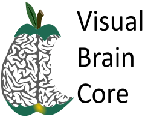

CINL Brain Core is an arm of the [Civitan International Neuroimaging Laboratory](https://www.uab.edu/medicine/cinl). The original "Visual Brain Core" was made possible by a generous grant from UAB's HSF/GEF grant program. Given that our resources ended up being used by a broader base of users than just vision researchers, we've dropped the "visual" from our name. Also, we're continuing our work in collaboration with UAB's Civitan International Neuroimaging Lab, and so we're officially the CINL Brain Core now.

## CINL Brain Core Mission

Our mission is to help produce high quality, cutting edge research examining the visual brain. To achieve this, we will help investigators overcome some common barriers to performing high quality vision research, and provide forums to discuss new ideas and research techniques.

**The 5 aims of the Brain Core**

The study of vision and visual plasticity using a human model requires expertise from multiple domains, from recruitment and dealing with patients and participants, to writing sophisticated computer code for analysis of functional MRI data. The visual brain core will facilitate research in 5 ways:

1. The core will facilitate interactions among investigators through a regularly scheduled “methods” workshop, centered around the development and implementation of state-of-the-art methods for analysis of brain data.

2. Help set up project workflows to efficiently process data. To do this, the core will help labs develop a coherent framework for computing resources, storage, and backup for the large datasets required by neuroimaging studies and help provide computer systems support.

3. Investigators will have access to an imaging researcher for assistance developing and learning complex data analysis tools used in the analysis of high dimensional, large-scale vision and brain datasets, and designing appropriate analysis protocols. This researcher will not perform your data analysis, but will consult with you about how to implement the analysis and experiment.

4. An efficient and accessible system for investigators will be set up to recruit and retain participants for visual neuroscience research, including persons with specific disorders impacting vision and those in normal health.

5. Visual Brain Core will purchase equipment to generate visual displays allowing defined and controlled stimulus characteristics for studies for use in functional MRI experiments.

Our goal is to create a sustainable resource for facilitating research into the visual brain. As such, we ask that all users of the resource include some percentage of support for core resources in their grant proposals. Without consistent support of this type, the core will not be able to be maintained. Please see our website for information you can cut and paste into your grant application regarding the components of the visual brain core. Also, please cite the Visual Brain Core when publishing work based on help from the core. The correct citation in published work is “This work was supported by a grant from the General Endowment Fund of the University of Alabama Health Services Foundation.”

[Visual Brain Core Poster](Visual_Brain_Core_Poster.pdf)

## Information For CINL Brain Core

### CINL Brain Core Personnel and Office Hours

- **Office Hours:**
  - **Monday, 10:00 am - noon, Civitan International Research Center, Second floor outside room 210.**
- Ravi Tripathi, MS: Computer Systems Specialist. Consultation on high performance computing and algorithm issues.
  - **Thursday, 10:00 am - noon, Edge of Chaos in Lister Hill Library.**
- Mark Bolding, Ph.D. will discuss MR physics related questions. Ravi Tripathi, MS: Computer Systems Specialist. Consultation on high performance computing and algorithm issues.

### CINL Brain Core Seminar Series and Neuroimaging Journal Club

Brain Core seminar series includes high level speakers usually from outside UAB. Every second Friday at noon in CIRC 120. We will discuss new ideas and techniques in brain imaging. During other fridays at noon in CIRC 120, we have Neuroimaging Journal Club. The Neuroimaging journal club is for UAB and Auburn researchers to share their work, or journal articles of their interest with our neuroimaging community. Information about this colloquium is here: [CINL page ](https://www.uab.edu/medicine/cinl/seminars).

### For Use in Grant Proposals

The CINL Brain Core is supported by users. For this reason, we ask that you include use of the Brain Core resources in the budget of your upcoming grants. Quotations from previous proposals are provided here: [Grant Proposal Language](https://docs.rc.uab.edu/grants/overview/).

### Mailing List

Please follow these instructions to subscribe to the ‘CINL-NOTICE’ listserv:

Click here, or alternatively, send an email to listserv@listserv.uab.edu with the email body as sub cinl-notice. After which you’ll receive an email to confirm your email address.

After confirming your email address, you would start receiving cancellation emails from others on the list as well as be able to send your own notifications .

### [Brainhack](https://brainhack.org/global2021/)

## Neuroimaging at UAB

### UAB Neuroimaging Facilities

[Alabama Advanced Imaging Consortium](http://www.alabamaadvancedimaging.org/) 

[Civitan International Neuroimaging Laboratory](https://www.uab.edu/medicine/cinl)

UAB-HSF MEG Laboratory

Small Animal Imaging Shared Facility

### Neuroimaging and Systems Neuroscience Labs at UAB

- [a partial list of researchers who use the CINL](https://www.uab.edu/medicine/cinl/about/researchers)

*UAB folks, please let us know if your lab should be included on this list, or add more information about it!*

Here is a [partial list of manuscripts](https://docs.uabgrid.uab.edu/wiki/Partial_list_of_manuscripts) that have resulted from CINL and Visual Brain Core resources.

### Cluster Computing Environment at UAB Cheaha

- [Cheaha_GettingStarted](https://docs.rc.uab.edu/cheaha/getting_started/) - information on getting an account and learning about how to use the cluster
- [Cheaha](https://docs.rc.uab.edu/grants/overview/) - background information on the cluster useful for grants and publications

### UAB-Auburn University Collaboration for Neuroimaging

**[Auburn University MRI Research Center](http://www.eng.auburn.edu/research/centers/mri/)**
Siemens Magnetom 7T

**UAB & Auburn Neuroimaging Colloquium**

- Neuroimaging journal Club. Shared across campuses via GoToMeeting.

To get on our mailing list, [click here](https://docs.google.com/forms/d/e/1FAIpQLSdNi8bGzhQleGUg5h3hLZtXTDL-vAJMyf-n5W6i_ohdedISbw/viewform)

**UAB & Auburn Neuroimaging Retreat**

## How To...

### Computer and coding related how-to's

[Using Linux](https://linuxjourney.com/)

[Unix shortcuts](https://docs.rc.uab.edu/workflow_solutions/shell/)

[Matlab](https://docs.rc.uab.edu/cheaha/open_ondemand/ood_interactive/#matlab)

[Psychtoolbox](http://psychtoolbox.org/)

[Saving Data in Box](https://docs.rc.uab.edu/data_management/transfer/rclone/)

### fMRI related how-to's and important links

### [Tools](https://docs.rc.uab.edu/cheaha/software/modules/) 

Check what modules are available on cheaha with
`module avail`

**Analysis Tools**

- [SPM ](https://en.wikibooks.org/wiki/SPM)
   `module avail spm`
- [FSL](https://fsl.fmrib.ox.ac.uk/fsl/fslwiki/FSL)
   `module avail fsl`
- [AFNI](https://afni.nimh.nih.gov/) 
  `module avail afni`

**Visualization Tools**

- [Workbench](https://www.humanconnectome.org/software/get-connectome-workbench)
- [FREESURFER](https://surfer.nmr.mgh.harvard.edu/fswiki/FreeSurferWiki)
- [MRIcro](https://people.cas.sc.edu/rorden/mricro/mricro.html)

**Brain atlases**

- [Talairach](http://www.talairach.org/)
- [thehumanbrain.info](thehumanbrain.info/brain/locator.php)

**Cool Websites for Beginners**

- [Chris Rordens Neuropsychology Lab](https://crnl.readthedocs.io/)
- [VISTA Lab at Stanford](http://web.stanford.edu/group/vista/cgi-bin/wandell/talks-and-tutorials/)
- [Van Essen Lab at Washington University](https://sites.wustl.edu/vanessenlab/resources/)

### UAB Neuroimaging Tools and How-To's (some require blazer id)

[Imaging Protocols](https://www.uab.edu/medicine/cinl/for-researchers/policies-and-procedures)

**Analysis Scripts**

- **To run a local gyrification index (LGI) for several runs in parallel**

  - ```bash
    #!/bin/bash
    
    #Make a jobs directory in your scratch space to store all the job scripts and results 
    mkdir $USER_SCRATCH/jobs
    
    #Define some variables to be used later
    jobs=$USER_SCRATCH/jobs
    sub=PATH_TO_SUBJECTS_DIRECTORY
    
    for patient in `ls -1 $sub`
    do
    
    SUBJECTS_DIR=PATH_TO_SUBJECTS_DIRECTORY
    
    echo "#!/bin/bash
    #$ -S /bin/bash
    #$ -cwd
    #
    #$ -N recon-all-$patient
    # Set the hard and soft run time limits (ex: 1hour/58 min)
    #$ -l h_rt=36:00:00,s_rt=30:55:00,vf=3000M
    #$ -j y
    #$ -M YOUR_EMAIL_ADDRESS
    #$ -m eas
    
    module load matlab/R2012a
    module load freesurfer/freesurfer-5.3.0
    SUBJECTS_DIR=PATH_TO_SUBJECTS_DIRECTORY
    recon-all -s $patient -localGI" >> $patient.job
    
    qsub $patient.job
    done
    ```

**Behavioral data analysis techniques**

**Institutional Review Board**