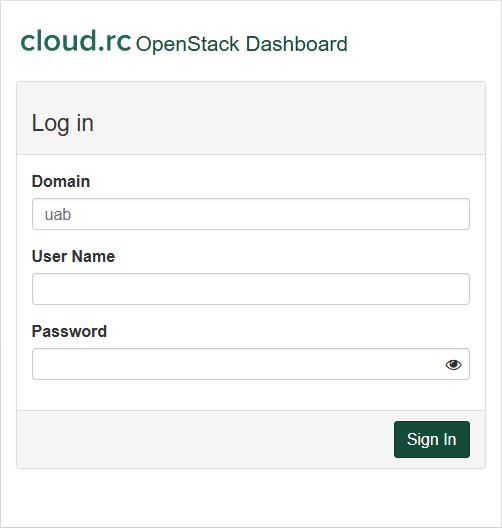
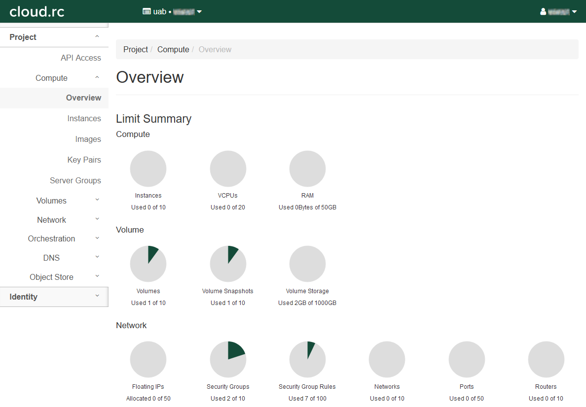

# UAB Cloud

Our [cloud.rc](https://dashboard.cloud.rc.uab.edu) portal, based on [OpenStack](https://www.openstack.org/) cloud software, provides a home for more permanent research applications such as web pages and database hosting, as well as a place where researchers can more fluidly develop applications for high performance compute.

Resource quotas are set to ensure that every researcher has a fair share. Please be sure to free up resources when they are no longer needed by deleting instances and volumes.

Currently, access to cloud.rc must be made while on the UAB Campus Network or on the UAB Campus Virtual Private Network (VPN). For more information about using the UAB Campus VPN, please visit [VPN - UAB IT](https://www.uab.edu/it/home/tech-solutions/network/vpn). The UAB Campus VPN requires [Duo 2FA](https://www.uab.edu/it/home/security/2-factor).

## First Steps

To get started using cloud.rc, please navigate to <https://dashboard.cloud.rc.uab.edu/>. You will be taken to a login page that looks like below. To login you will need an account, please request one by contacting [Support](../help/support.md). When requesting an account, please tell us how you intend to use the service. Some reasonable use-cases are listed in [Cloud Usage Philosophy](#cloud-usage-philosophy) below.

There are three fields that must be filled out:

- Domain: must always be `uab`, lowercase.
- User Name: your BlazerID or XIAS email.
- Password: whatever your current password is, not necessarily the same as your Single Sign-On password. If you have forgotten your password please contact [Support](../help/support.md).

Once these fields are filled, click "Sign In" to login.

Once logged in, you will see the OpenStack dashboard. An example is shown below.

To get the most out of cloud.rc, you'll want to make sure you have a working familiarity with the [Linux terminal](../workflow_solutions/shell.md).

Cloud.rc runs on Openstack. If you are new to Openstack or to cloud.rc, it is highly recommended to follow our [Tutorial](tutorial/index.md) to learn how to set up all of the necessary components of a virtual machine (VM) setup. The tutorial is intended to be followed in order. Doing it out of order may result in errors and issues. If you encounter any unexpected issues, unclear instructions or have questions or comments, please contact [Support](../help/support.md).

## Cloud Usage Philosophy

An important philosophy of cloud services is that virtual machines are disposable, and cloud platforms are designed to facilitate this philosophy. If a virtual machine fails, breaks or becomes misconfigured, it is designed to be destroyed and recreated from scratch.

With that in mind, there are many possible use-cases for cloud.rc. Broadly speaking, a few common ones:

1. Experimental workflow development prior to [Containerization](../workflow_solutions/getting_containers.md) and batch processing on [Cheaha](../cheaha/getting_started.md) or a [National Cyberinfrastructure platform](../national_ci/index.md).
1. Packaging software into [Containers](../workflow_solutions/getting_containers.md#create-your-own-docker-container).
1. Temporary hosting of server software for scientific development or workflows.

The downside to disposable machines is losing configuration specifics. Software exists that can assist with reproducible virtual machine configuration, including [Ansible](https://www.redhat.com/en/ansible-collaborative?intcmp=7015Y000003t7aWQAQ), or even just a custom shell script. We are unable to provide assistance with deployment of virtual machine internals.

## Naming Conventions

Entities on cloud.rc must be named a certain way or difficult-to-diagnose errors may occur. Entities includes instances, volumes, networks, routers, and anything else that you are allowed to give a name to.

Please use the following rules when naming entities:

- Must: use only letters, numbers, dash `-` and underscore `_`.
- Must: have the first character in the name be a letter.
- Should: use short, descriptive, memorable names.
