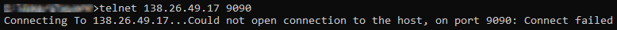
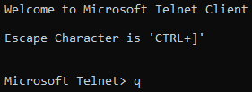
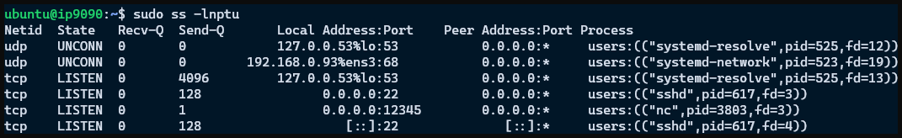

# Installing Software on Instances

An important part of managing instances is the installation of software. This page assumes you have a working instance and can [SSH](./tutorial/instances.md#ssh-into-the-instance) into it. This page assumes you are using an Ubuntu image.

We highly recommend building your research software stack into a [Container](../workflow_solutions/getting_containers.md). While there is a learning curve and some setup time, containers make replicating and sharing environments simpler. Everything you develop is packaged into a self-contained unit that can be run on virtually any modern Linux system.

A particular command `sudo` will be used extensively. Be warned that `sudo` grants any commands used administrator privileges. If you use `sudo` with untrustworthy software, you may be allowing an attacker to compromise your system.

<!-- markdownlint-disable MD046 -->
!!! danger

    The `sudo` command should be used carefully and judiciously, as it creates security risks. Use with caution.
<!-- markdownlint-enable MD046 -->

<!-- markdownlint-disable MD046 -->
!!! important

    Much of the information and examples on this page require a working knowledge of terminal commands and the shell. If you are unfamiliar with the terminal then please see our [Shell page](../workflow_solutions/shell.md) for more information and educational resources.
<!-- markdownlint-enable MD046 -->

## Before Installing Software

Before installing software, good practice is updating and upgrading operating system packages. For some software this is required. These updates often include critical security and bug fixes. To update the instance operating system, enter the following at the command line.

```bash
sudo apt update
sudo apt upgrade
```

## Installing Software

Most common software packages and NVIDIA drivers are available as `apt` packages. Some packages are available using custom installers. Be sure the website and installer author are trustworthy before installing!

### Finding Packages

1. Try using Google to locate the name of the package with something like `ubuntu apt <keywords>`
1. Try using <https://packages.ubuntu.com>
1. Try `apt-cache search <keyword>`
1. Ask [Support](../help/support.md) for help

### Installing Packages

If the software is available via `apt` then use `sudo apt install <package>`. An example would be `sudo apt install git` to install git software.

If the software uses a custom installer, then follow the instructions provided by the software's documentation. An example would be [Miniconda](#installing-miniconda), where a shell script is downloaded and then executed using `bash installer.sh`.

### Installing Server Software

If you wish to set up server software, you'll need to open ports for that software by creating [Security Groups](tutorial/security.md#creating-a-security-group). Then you may want to test the ports are open and verify your software is listening. It is highly recommended to verify the ports are configured properly and remotely accessible before you spend time setting up and configuring the server software.

#### Testing Server Ports

If you intend to use your instance as a server host, you'll likely need to set up additional [Security Groups](tutorial/security.md#creating-a-security-group) for any ports the server expects to communicate on. It can be helpful to verify that those ports are open before configuring the server software. Assuming you know which ports are needed, the simplest way to do this is outlined below.

1. Set up [Security Groups](tutorial/security.md#creating-a-security-group) for the ports your server will need to communicate on.
1. [SSH](remote_access.md#setting-up-a-configuration-file) into the instance.
1. Prepare the `netcat` software command `nc`:
    - For Ubuntu, the command `nc` should already be available.
    - For other OSes, you may need to [Install](./installing_software.md) `nc` or `netcat`.
1. For one of your `<port>` of interest, start a TCP listener with `nc -l <port>`.

    <!-- markdownlint-disable MD046 -->
    !!! note

        `nc -l <port>` will only listen for a single connection attempt, and then close. To emulate indefinite listening behavior, use it within a loop like so.

        ``` bash
        while true; do nc -l <port>; done
        ```
    <!-- markdownlint-enable MD046 -->

1. Open a new terminal on your local machine.
1. Probe the `<port>`:
    - Using the Windows command prompt:
        1. Enter the command `telnet <floating-ip> <port>`.
        1. If the terminal window goes blank, then the connection was successful.

            

            Otherwise you will see a message like `Could not open connection to the host`.

            

        1. To exit `telnet` press ++ctrl+bracket-right++, then type `q`, then press ++enter++.

            

    - Using any Linux-based prompt, MacOS, or Git Bash on Windows:
        1. Ensure `nc` is installed locally.
        1. Enter the command `nc -nvz <floating-ip> <port>`.
            - `n` uses numeric output, which minimizes unhelpful warnings about hostname lookups. It is also faster.
            - `v` uses verbose output, i.e., print the output we care about.
            - `z` scans for listeners on the remote.
        1. If the connection is successful you should see something close to the following, with `<floating-ip>` and `<port>` replaced by the values you supplied earlier.

            ```text
            (UNKNOWN) [<floating-ip>] <port> (?) open
            ```

            

            If the connection is unsuccessful you will see `Connection refused` instead of `open`.

            

Now you should have more information on whether your VM port configuration was successful. Feel free to repeat the steps above for each port, as needed.

#### Verify Server Software Is Listening

Once you have the server set up, you can check which processes are listening on which ports using the following command.

```bash
sudo ss -lnptu
```

The program is `ss` for "socket statistics", which can display information linking ports and processes. The flags are

- `l` displays only listening sockets
- `n` uses numeric output, which minimizes unhelpful warnings about hostname lookups. It is also faster.
- `p` shows which process is using each socket.
- `t` displays tcp sockets.
- `u` displays udp sockets.

An example of the output is shown below. The most useful columns for us are `Local Address:Port`, to verify they match the configured [Security Group](tutorial/security.md#creating-a-security-group) ports, and `Process`, to verify the server software is listening on the correct ports.



### Common Examples

Below are a few examples of installing certain common softwares that may be useful to scientific applications. We are not able to provide diagnostic or troubleshooting support for installation of any software. If you believe these instructions are outdated or in error, please [reach out and let us know](../contributing/reporting_errors.md#how-do-i-report-inaccurate-information).

#### Installing NVIDIA Drivers

1. Run the commands in [Before Installing Software](#before-installing-software).
1. `sudo apt install ubuntu-drivers-common`
1. `ubuntu-drivers devices`
1. Find the line with "recommended" and install the package on that line with `sudo apt install nvidia-driver-###`
1. Reboot the instance

#### Installing Miniconda

Miniconda is a lightweight version of Anaconda. While Anaconda's base environment comes with Python, the Scipy stack, and other common packages pre-installed, Miniconda comes with no packages installed. This is an excellent alternative to the full Anaconda installation for environments where minimal space is available or where setup time is important. We recommend installing [Miniconda](https://docs.conda.io/en/latest/miniconda.html) on cloud.rc instances, as opposed to Anaconda, to conserve storage space. For more information on how to use Anaconda see the [Using Anaconda](../workflow_solutions/using_anaconda.md#using-anaconda). Need some hands-on experience, you can find instructions on how to install PyTorch and TensorFlow using Anaconda in this [tutorial](../cheaha/tutorial/pytorch_tensorflow.md).

1. Run the commands in [Before Installing Software](#before-installing-software).
1. `wget https://repo.anaconda.com/miniconda/Miniconda3-latest-Linux-x86_64.sh`
1. `bash Miniconda3-latest-Linux-x86_64.sh`

#### Installing Singularity

Follow the instructions located at <https://docs.sylabs.io/guides/3.9/user-guide/quick_start.html#install-system-dependencies> under "Debian-based systems".

1. Run the commands in [Before Installing Software](#before-installing-software).
1. Run the following

    ```bash
    sudo apt-get install -y \
    build-essential \
    libseccomp-dev \
    pkg-config \
    squashfs-tools \
    cryptsetup
    ```

1. Install Go language using the following

    ```bash
    export VERSION=1.17.2 OS=linux ARCH=amd64 && \  # Replace the values as needed
    wget https://dl.google.com/go/go$VERSION.$OS-$ARCH.tar.gz && \ # Downloads the required Go package
    sudo tar -C /usr/local -xzvf go$VERSION.$OS-$ARCH.tar.gz && \ # Extracts the archive
    rm go$VERSION.$OS-$ARCH.tar.gz    # Deletes the ``tar`` file

    echo 'export PATH=/usr/local/go/bin:$PATH' >> ~/.bashrc && \
    source ~/.bashrc
    ```

1. Download SingularityCE

    ```bash
    export VERSION=3.9.5 && # adjust this as necessary \
    wget https://github.com/sylabs/singularity/releases/download/v${VERSION}/singularity-ce-${VERSION}.tar.gz && \
    tar -xzf singularity-ce-${VERSION}.tar.gz && \
    cd singularity-ce-${VERSION}
    ```

1. Compile SingularityCE

    ```bash
    ./mconfig && \
    make -C builddir && \
    sudo make -C builddir install
    ```

<!-- markdownlint-disable MD046 -->
!!! note

    For other versions of the Singularity documentation, visit <https://sylabs.io/docs/>.
<!-- markdownlint-enable MD046 -->

#### Installing Jupyter Server

Jupyter Notebooks are a staple of modern research computing, especially when developing new workflows or evaluating the usefulness of software packages.

The setup process for [cloud.rc](index.md) is more involved than for [Cheaha](../cheaha/getting_started.md). Before using cloud.rc for Jupyter Notebooks, be sure that [Open OnDemand on Cheaha](../cheaha/open_ondemand/ood_jupyter.md) does not meet your needs.

To install, you will need the following pre-requisites. If you are unfamiliar with the terminology or new to cloud.rc, it is highly recommended to first start with our [Introduction](index.md) and follow the tutorial completely.

1. Run the commands in [Before Installing Software](#before-installing-software).
1. A [Cloud Instance](tutorial/instances.md) with attached [Floating IP]network_setup_basic.md#floating-ips).
1. A [Security Group](tutorial/security.md#creating-a-security-group) for the intended Jupyter Server port. For the purposes of this tutorial, the port will be set to `9999`.
1. [Miniconda installed](#installing-miniconda) on the instance. Miniconda is a lightweight version of Anaconda.

Once the prerequisites are complete, the following steps must be performed to install and setup Jupyter Notebook Server. It is highly recommended to build an [Anaconda Environment](../workflow_solutions/using_anaconda.md#create-an-environment) using a reproducible [Environment File](../workflow_solutions/using_anaconda.md#creating-an-environment-from-a-yaml-file). The steps below belong to the official Jupyter documentation available at <https://jupyter-server.readthedocs.io/en/stable/operators/public-server.html>.

<!-- markdownlint-disable MD046 -->
!!! warning

    Leaving your Jupyter Notebook Server unsecured may mean that other people on the UAB Campus Network are able to access your notebooks and other files stored on that cloud instance.
<!-- markdownlint-enable MD046 -->

1. [Install](../workflow_solutions/using_anaconda.md#install-packages) Jupyter Notebook Server using [Miniconda](../workflow_solutions/using_anaconda.md). You will need the following packages.

    - `conda-forge` channel
        - `notebook`
        - `nb_conda_kernels`
        - [Optional] `jupyter_contrib_nbextensions`
    - `anaconda` channel
        - `ipykernel` for python users
        - `r-irkernel` for R users
        - [Optional] `pip`

1. Because floating IPs are, by default, reachable by anyone on the UAB Campus Network, you'll need to secure the server using the steps below.
    1. Generate a notebook config file using `jupyter notebook --generate-config`. [[official docs](https://jupyter-server.readthedocs.io/en/stable/operators/public-server.html#prerequisite-a-jupyter-server-configuration-file)]
    1. Prepare a password using `jupyter notebook password`. [[official docs](https://jupyter-server.readthedocs.io/en/stable/operators/public-server.html#automatic-password-setup)]
    1. Set up SSL for an encrypted connection. For now create a self-signed certificate using the following command. [[official docs](https://jupyter-server.readthedocs.io/en/stable/operators/public-server.html#using-ssl-for-encrypted-communication)]

        ```bash
        openssl req -x509 -nodes -days 365 -newkey rsa:2048 -keyout mykey.key -out mycert.pem
        ```

        <!-- markdownlint-disable MD046 -->
        !!! warning

            When you connect to your Jupyter Server, your browser will warn you that the connection may be insecure. This is because self-signed certificates are not trusted by your operating system's root certificates. It is possible to fix this with some additional work using notes at the [official docs](https://jupyter-server.readthedocs.io/en/stable/operators/public-server.html#using-ssl-for-encrypted-communication). Generally the security warning can be bypassed without issue _in this case_.
        <!-- markdownlint-enable MD046 -->

1. Configure the notebook server by locating lines like the following in `~/.jupyter/jupyter_notebook_config.py` and updating them with the right-hand side of each variable assignment (equals sign `=`). This file was created as part of the first step of these instructions. [[official docs](https://jupyter-server.readthedocs.io/en/stable/operators/public-server.html#running-a-public-notebook-server)]

    <!-- markdownlint-disable MD046 -->
    !!! note

        If you used `jupyter notebook password` the hashed password will be located in `jupyter_notebook_config.json` instead of `.py`.
    <!-- markdownlint-enable MD046 -->

    <!-- markdownlint-disable MD046 -->
    !!! note

        The lines below may not appear together depending on the version of Jupyter installed. The file `jupyter_notebook_config.py` contains over a thousand lines. You may need to search using a text editor search or find feature. If you are using `nano` please visit our [nano page](../workflow_solutions/shell.md#searching-for-text-in-nano) to learn how to search.
    <!-- markdownlint-enable MD046 -->

    ```python
    c.NotebookApp.certfile = u'/absolute/path/to/your/certificate/mycert.pem'
    c.NotebookApp.keyfile = u'/absolute/path/to/your/certificate/mykey.key'
    c.NotebookApp.ip = '*'
    c.NotebookApp.password = u'sha1:bcd259ccf...<your hashed password here>'
    c.NotebookApp.open_browser = False

    # It is a good idea to set a known, fixed port for server access
    c.NotebookApp.port = 9999
    ```

1. Start the server with `jupyter notebook`.
1. Access the server with the browser on your local machine by navigating to `https://<floating-ip>:<port>`. In this case the port was set to be `9999`, and `<floating-ip>` comes from the prerequisites for this section. The port must match that used for the security group to allow traffic between your local machine and the cloud instance. You must also be on the UAB Campus VPN.

<!-- markdownlint-disable MD046 -->
!!! important

    Some browsers may default to using `http` instead of `https` when given a raw IP address. Make sure to fully type out `https://<floating-ip>:<port>`.
<!-- markdownlint-enable MD046 -->
