# Instance Setup and Tutorial

Instances are the basic unit of compute on cloud.rc. Requesting an instance involves a number of steps, and requires that a [Network](./network_setup_basic.md) has already been setup, along with certain [Security](./security_setup_basic.md) settings and features. It is also possible to attach persistent reusable [Volumes](./volume_setup_basic.md) to instances.

<!-- markdownlint-disable MD046 -->
!!! important

    If you are viewing this page as part of the cloud.rc tutorial, please follow the steps in order from top to bottom. Ignore any sections on deleting or releasing resources unless you need to correct a mistake.
<!-- markdownlint-enable MD046 -->

## Creating an Instance

Creating an instance is possibly a step you'll perform often, depending on your workflow. There are many smaller steps to create an instance, so please take care to check all the fields when you create an instance.

These instructions require that you've set up a [Network](./network_setup_basic.md) and followed all of the instructions on the linked page. You should have a Network, Subnet, Router and Floating IP. You will also need to setup a
[Key Pair](./security_setup_basic.md#creating-a-key-pair) and an [SSH Security Group](./security_setup_basic.md#creating-a-security-group).

1. Click "Compute" in the left-hand navigation pane to open the fold-out menu.

    

2. Click "Instances".

    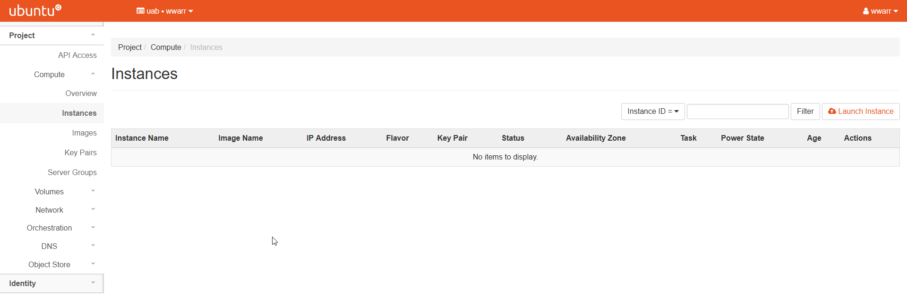

3. Click "Launch Instance" to open a dialog box.

4. Fill out the dialog box completely. There are several tabs that will need to be completed.

    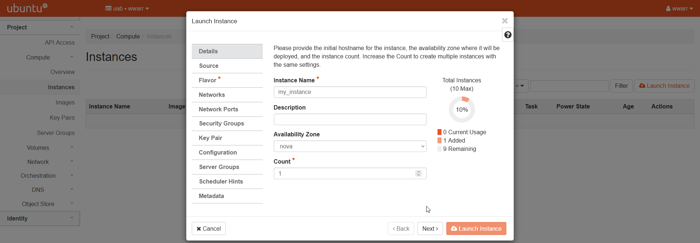

5. "Details" tab.

    1. Enter an "Instance Name". See [Naming Conventions](introduction.md#naming-conventions).
    2. Enter a "Description".
    3. Select "nova" in the "Availability Zone" drop down box.
    4. Select "1" in the "Count" field.
    5. Click "Next \>" to move to the "Source" tab.

6. "Source" tab. Sources determine what operating system or pre-defined image will be used as the starting point for your operating system (OS).

    1. Select "Image" in the "Select Boot Source" drop down box.
    2. Select "Yes" under "Create New Volume".
    3. Choose an appropriate "Volume Size" in `GB`. Note that for many single-use instances, `20 GB` is more than enough. If you need more because you have persistent data, please create a `persistent volume<volume_setup_basic>`.
    4. Select "Yes" or "No" under "Delete Volume on Instance Delete"
        1. "Yes" is a good choice if you don't care about reusing the OS.
        2. "No" is a good choice if the OS volume will be reused.

        

    5. Pick an image from the list under the "Available" section.
        1. Use the search box to help find the image that best suits your research needs.
        2. When you find the best image, click the button with an up arrow next to the image.
        3. The image will move to the "Allocated" section above the "Available" section.

        

    6. Click "Next >" to move to the "Flavor" tab.

7. "Flavor" tab. Flavors determine what hardware will be available to your instance, including cpus, memory and gpus.

    1. Pick an instance flavor form the list under the "Available" section.
        1. Use the search box to help find the flavor that best suits your needs.
        2. When you find the best flavor, click the button with an up arrow next to the flavor.
        3. The flavor will move to the "Allocated" section above the "Available" section.

        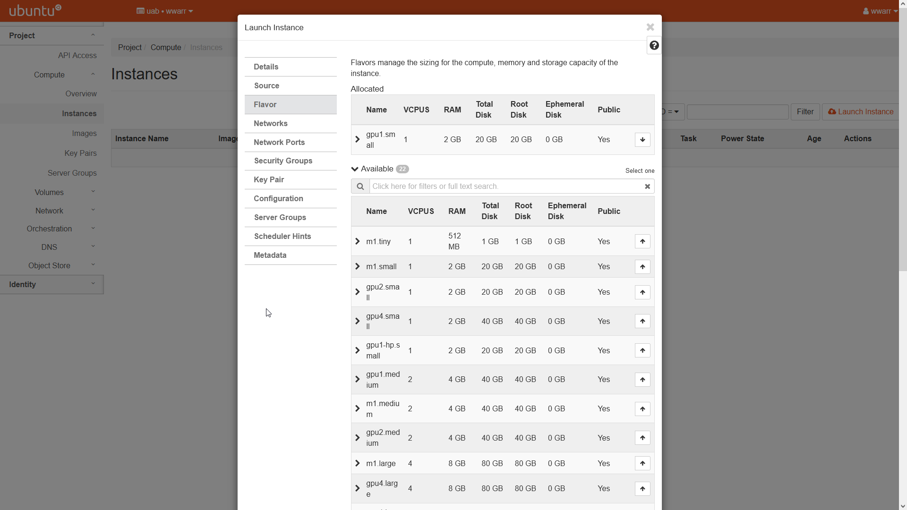

    2. Click "Next >" to move to the "Networks" tab.

8. "Networks" tab. Networks determine how your instance will talk to the internet and other instances. See [Network](./network_setup_basic.md) for more information.

    1. Pick a network from the list under the "Available' section.
        1. A Network may already be picked in the "Allocated" section. If this is not the correct Network, use the down arrow next to it to remove it from the "Allocated" section. If the Network is correct, skip (ii.) through (iv.).
        2. Use the search box to help find the Network that best suits your needs.
        3. When you find the best Network, click the button with an up arrow next to the Network.
        4. The Network will move to the "Allocated" section above the "available" section.

        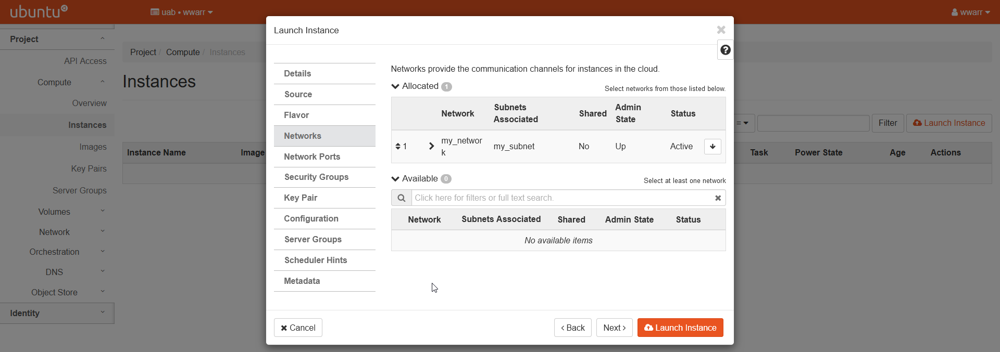

    2. Click "Next >" to move to the "Network Ports" tab.

9. "Network Ports" tab. *Coming Soon!*

    1. Leave this tab empty.

        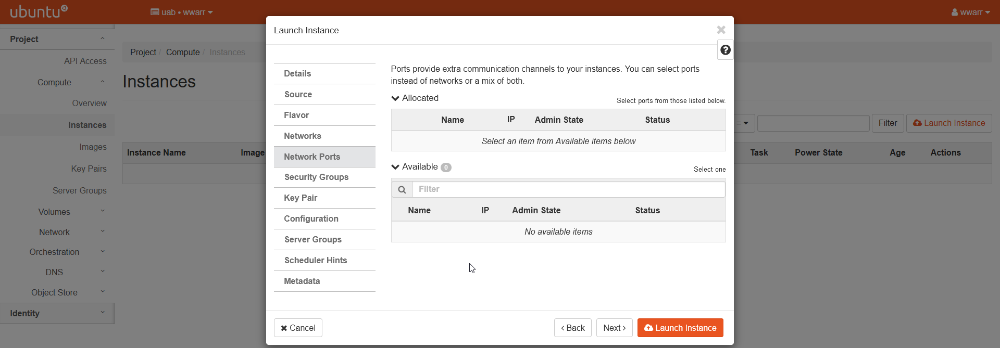

    2. Click "Next >" to move to the "Security Groups" tab.

10. "Security Groups tab. Security Groups allow for fine-grained control over external access to your instance. For more information see [Creating a Security Group](./security_setup_basic.md#creating-a-security-group) for more information.

    1. Pick the "ssh" Security Group from the "Available" section by pressing the up arrow next to it.
    2. The "default" Security Group should already be in the "Allocated" section.

        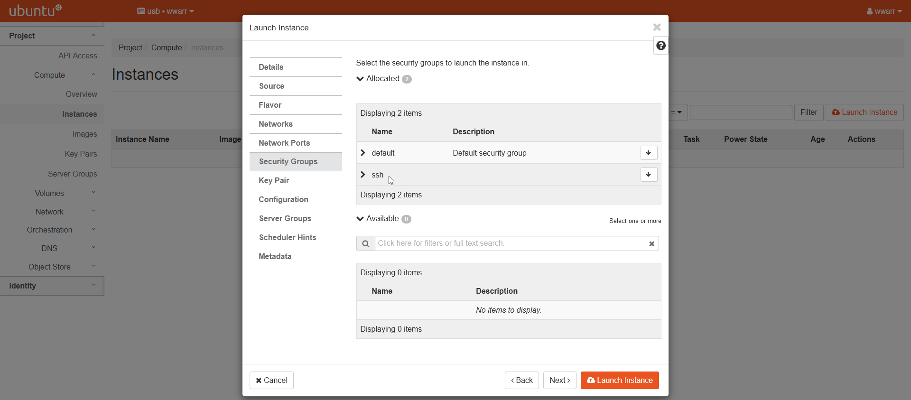

    3. Click "Next >" to move to the "Key Pair" tab.

11. "Key Pair" tab. Key Pairs allow individual access rights to the
    instance via SSH. For more information see [Creating a Key Pair](./security_setup_basic.md#creating-a-key-pair).

    1. Pick one or more key pairs from the list under the "Available"
        section.
        1. A Key Pair may already be picked in the "Allocated" section. If this is not the correct "Key Pair", use the down arrow next to it to remove it form the "Allocated" section. If the Key Pair is correct, skip (ii.) through (iv.).
        2. Use the search box to help find the Key Pair that best suits your needs.
        3. When you find the best Key Pair(s), click the button with an up arrow next to the Key Pair(s).
        4. The Key Pair(s) will move to the "Allocated" section above the "Available" section.

        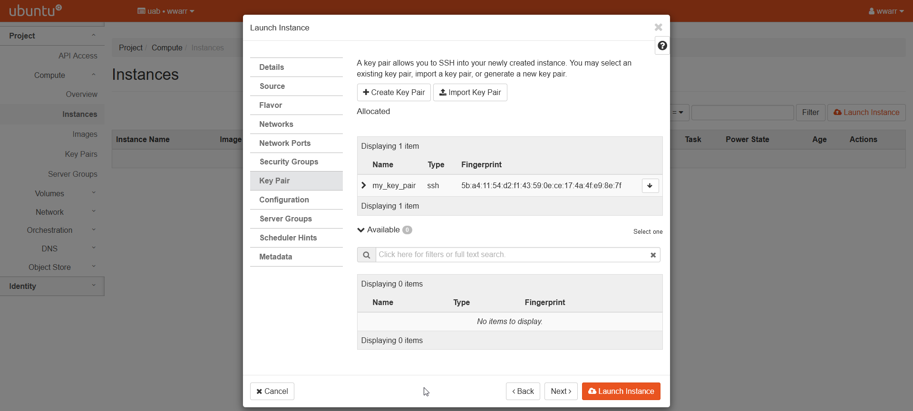

    2. Click "Next >" to move to the "Configuration" tab.

12. "Configuration" tab. *Coming Soon!*

    1. Skip this tab.
    2. Click "Next >" to move to the "Server Groups" tab.

13. "Server Groups" tab. *Coming Soon!*

    1. Skip this tab.
    2. Click "Next >" to move to the "Scheduler Hints" tab.

14. "Scheduler Hints" tab. *Coming Soon!*

    1. Skip this tab.
    2. Click "Next >" to move to the "Metadata" tab.

15. "Metadata" tab. *Coming Soon!*

    1. Skip this tab.

16. Click "Launch Instance" to launch the instance.

    1. Redirects to the "Instances" page.
    2. There should be a new entry in the table.
    3. The instance will take some time to build and boot. When the
        Status column entry says "Active" please move to the next steps.

        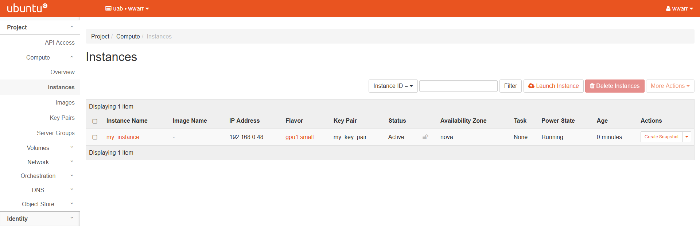

17. Associate Floating IP.

    1. In the "Actions" column entry, click the drop down triangle and select "Associate Floating IP".
    2. A dialog box will open.
    3. Select an IP address in the "IP Address" drop down box.
    4. Select a port in the "Port to be associated" drop down box.
    5. Click "Associate" to return to the "Instances" page and associate the selected IP.

        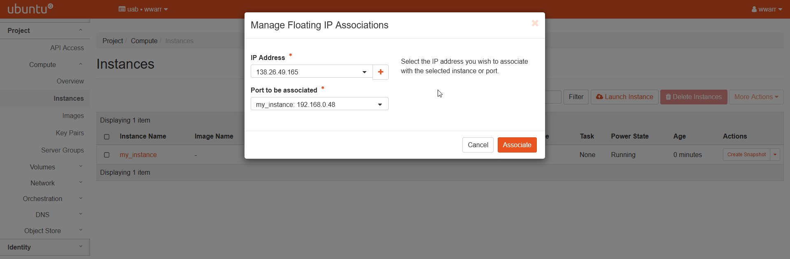

At this stage you should be able to SSH into your instance from on campus or on the UAB VPN. You can also [Transfer Data](remote_access.md#data-transfer) to the instance.

<!-- markdownlint-disable MD046 -->
!!! important

    Please be considerate of other users. When you no longer need instances for processing or development, please [delete](#deleting-an-instance) them to free up resources.
<!-- markdownlint-enable MD046 -->

## Instances Failing to Start

There are a number of reasons an instance might fail. We are able to provide direct support for instances which fail to start for reasons outside the instance itself. To help us correct the error, you'll need to have information from the instance page. Below is an example of a failed instance in the "Instances" table, helpfully named `failed_instance`. Note the "Error" label under the "Status" column.


In the "Instances" table, click the name of your failed instance. You should see a page like below, with some basic metadata about the instance as well as a "Fault" section.

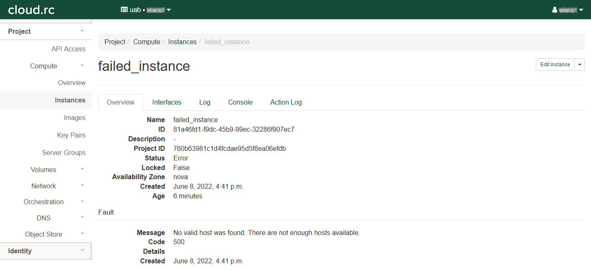

We will need to "ID" and the reason for the fault. In this case, the instance failed because it could not allocate a GPU, as all GPUs were allocated at the time of its creation. It is not possible to diagnose the specifics without consulting us, so please feel free to contact [Support](../help/support.md).

Instances can fail for other reasons as well, please contact [Support](../help/support.md) with the "ID" and "Fault" information.

For instances which fail due to internal reasons, i.e. while using SSH or an application, we are still able to provide support but it will have to be on a case-by-case basis. Be prepared to walk us through the steps you took to set up the instance and any software, as well as any data processing steps, leading up to the failure.

## SSH Into the Instance

If you are following the tutorial, then at this stage you should be able to SSH into your instance from on campus or on the UAB VPN. If you haven't done this before, or you need a refresher, the following list will help guide you through setting up SSH connections.

1. [Install an SSH Client](./remote_access.md#install-an-ssh-client) to use SSH from your local machine to your cloud instance.
2. [Manage Your Private Key](./remote_access.md#managing-keys)
    - [Start the SSH Agent](./remote_access.md#starting-the-ssh-agent-for-a-single-session) to enable your system to remember your private key.
    - [Add a Private Key](./remote_access.md#add-a-private-key) to the ssh agent to remember it for future use.
3. [Verify the SSH Client Works](./remote_access.md#ssh-client-usage). Use the following command to connect

    ``` bash
    ssh ubuntu@<floating ip> -i ~/.ssh/<private_key_file>
    ```

    - If your image uses an operating system other than Ubuntu, such as CentOS, replace the user `ubuntu` with `centos`, or whatever may be appropriate.
    - The value `<floating ip>` should be whatever IP was assigned in [Creating a Floating IP](./network_setup_basic.md#creating-a-floating-ip).
    - The value `<private_key_file>` should be whatever your key pair file was named from [Creating a Key Pair](./security_setup_basic.md#creating-a-key-pair).

    

4. (optional, but helpful) [Set Up a Configuration File](./remote_access.md#setting-up-a-configuration-file) to simplify the command used to make a connection.

<!-- markdownlint-disable MD046 -->
!!! note

    Reusing a floating IP for a new instance can result in a "Remote Host Identification Has Changed" error, preventing connection. Please see [Remove an Invalid Host Fingerprint](./remote_access.md#remove-an-invalid-host-fingerprint).
<!-- markdownlint-enable MD046 -->

### Streamlining SSH

Refer to [Setting up a Configuration File](./remote_access.md#setting-up-a-configuration-file) in [Cloud Remote Access](./remote_access.md).

## Next Steps

Now you are ready to [Install Software](./installing_software.md) and, optionally, [Create a Persistent Volume](./volume_setup_basic.md).

## Deleting an Instance

<!-- markdownlint-disable MD046 -->
!!! note

    Deleting Instances is not part of the tutorial, and is here as a reference.
<!-- markdownlint-enable MD046 -->

To delete an instance, return to the "Instances" page using the left-hand navigation pane. In the table, find the row with the instance you wish to delete, and click the drop-down arrow under "Actions" in that row. Then click "Delete Instance" to open a confirmation dialog.


Click "Delete Instance" again to delete the instance permanently.

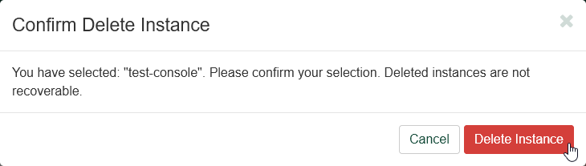

<!-- markdownlint-disable MD046 -->
!!! Warning

    It is highly recommended to shut off an instance before deleting it.
<!-- markdownlint-enable MD046 -->

## Continuing the Tutorial

Now that you have set up a [Network](network_setup_basic.md), [Security Policies](security_setup_basic.md) and an [Instance](instance_setup_basic.md), you are done with the tutorial, congratulations! There is one remaining optional step. If you need a persistent data volume to move between instances, please check our [Volumes](volume_setup_basic.md) page.
