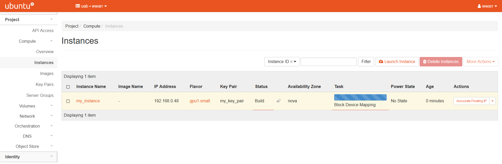

# Basic Instance Setup

Instances are the basic unit of compute on OpenStack. Requesting an instance involves a number of steps, and requires that a [Network](./network_setup_basic.md) has already been setup. It is also possible to attach persistent reusable [Volumes](./volume_setup_basic.md) to instances.

## Creating an Instance

Creating an instance is possibly a step you'll perform often, depending on your workflow. There are many smaller steps to create an instance, so please take care to check all the fields when you create an instance.

These instructions require that you've set up a [Network](./network_setup_basic.md) and followed all of the instructions on the linked page. You should have a Network, Subnet, Router and Floating IP. You will also need to setup a
[Key Pair](./security_setup_basic.md#creating-a-key-pair) and an [SSH Security Group](./security_setup_basic.md#creating-a-security-group).

1. Click "Compute" in the left-hand navigation pane to open the fold-out menu.

    

2. Click "Instances".

    

3. Click "Launch Instance" to open a dialog box.

4. Fill out the dialog box completely. There are several tabs that will need to be completed.

    

5. "Details" tab.

    1. Enter an "Instance Name".
    2. Enter a "Description".
    3. Select "nova" in the "Availability Zone" drop down box.
    4. Select "1" in the "Count" field.
    5. Click "Next \>" to move to the "Source" tab.

6. "Source" tab. Sources determine what operating system or pre-defined image will be used as the starting point for your operating system (OS).

    1. Select "Image" in the "Select Boot Source" drop down box.
    2. Select "Yes" under "Create New Volume".
    3. Choose an appropriate "Volume Size" in `GB`. Note that for many single-use instances, `20 GB` is more than enough. If you need more because you have persistent data, please create a `persistent volume<volume_setup_basic>`.
    4. Select "Yes" or "No" under "Delete Volume on Instance Delete"
        1. "Yes" is a good choice if you don't care about reusing the OS.
        2. "No" is a good choice if the OS volume will be reused.

        

    5. Pick an image from the list under the "Available" section.
        1. Use the search box to help find the image that best suits your research needs.
        2. When you find the best image, click the button with an up arrow next to the image.
        3. The image will move to the "Allocated" section above the "Available" section.

        

    6. Click "Next >" to move to the "Flavor" tab.

7. "Flavor" tab. Flavors determine what hardware will be available to your instance, including cpus, memory and gpus.

    1. Pick an instance flavor form the list under the "Available" section.
        1. Use the search box to help find the flavor that best suits your needs.
        2. When you find the best flavor, click the button with an up arrow next to the flavor.
        3. The flavor will move to the "Allocated" section above the "Available" section.

        

    2. Click "Next >" to move to the "Networks" tab.

8. "Networks" tab. Networks determine how your instance will talk to the internet and other instances. See [Network](./network_setup_basic.md) for more information.

    1. Pick a network from the list under the "Available' section.
        1. A Network may already be picked in the "Allocated" section. If this is not the correct Network, use the down arrow next to it to remove it from the "Allocated" section. If the Network is correct, skip (ii.) through (iv.).
        2. Use the search box to help find the Network that best suits your needs.
        3. When you find the best Network, click the button with an up arrow next to the Network.
        4. The Network will move to the "Allocated" section above the "available" section.

        

    2. Click "Next >" to move to the "Network Ports" tab.

9. "Network Ports" tab. *Coming Soon!*

    1. Leave this tab empty.

        

    2. Click "Next >" to move to the "Security Groups" tab.

10. "Security Groups tab. Security Groups allow for fine-grained control over external access to your instance. For more information see [Creating a Security Group](./security_setup_basic.md#creating-a-security-group) for more information.

    1. Pick the "ssh" Security Group from the "Available" section by pressing the up arrow next to it.
    2. The "default" Security Group should already be in the "Allocated" section.

        

    3. Click "Next >" to move to the "Key Pair" tab.

11. "Key Pair" tab. Key Pairs allow individual access rights to the
    instance via SSH. For more information see [Creating a Key Pair](./security_setup_basic.md#creating-a-key-pair).

    1. Pick one or more key pairs from the list under the "Available"
        section.
        1. A Key Pair may already be picked in the "Allocated" section. If this is not the correct "Key Pair", use the down arrow next to it to remove it form the "Allocated" section. If the Key Pair is correct, skip (ii.) through (iv.).
        2. Use the search box to help find the Key Pair that best suits your needs.
        3. When you find the best Key Pair(s), click the button with an up arrow next to the Key Pair(s).
        4. The Key Pair(s) will move to the "Allocated" section above the "Available" section.

        

    2. Click "Next >" to move to the "Configuration" tab.

12. "Configuration" tab. *Coming Soon!*

    1. Skip this tab.
    2. Click "Next >" to move to the "Server Groups" tab.

13. "Server Groups" tab. *Coming Soon!*

    1. Skip this tab.
    2. Click "Next >" to move to the "Scheduler Hints" tab.

14. "Scheduler Hints" tab. *Coming Soon!*

    1. Skip this tab.
    2. Click "Next >" to move to the "Metadata" tab.

15. "Metadata" tab. *Coming Soon!*

    1. Skip this tab.

16. Click "Launch Instance" to launch the instance.

    1. Redirects to the "Instances" page.
    2. There should be a new entry in the table.

        

    3. The instance will take some time to build and boot. When the
        Status column entry says "Active" please move to the next steps.

        

17. Associate Floating IP.

    1. In the "Actions" column entry, click the drop down triangle and select "Associate Floating IP".
    2. A dialog box will open.
    3. Select an IP address in the "IP Address" drop down box.
    4. Select a port in the "Port to be associated" drop down box.
    5. Click "Associate" to return to the "Instances" page and associate the selected IP.

        

At this stage you should be able to SSH into your instance from on
campus or on the UAB VPN.

## SSH Into the Instance

If you are following the steps from top to bottom, then at this stage you should be able to SSH into your instance from on campus or on the UAB VPN. You will need to [Install an SSH Client](./cloud_remote_access.md#install-an-ssh-client) To do so be sure your local machine has ssh and then use the following command If you are using a different operating system, such as CentOS, replace the user `ubuntu` with `centos` or whatever is appropriate. The value `<floating ip>` should be whatever IP was assigned in [Creating a Floating IP](./network_setup_basic.md#creating-a-floating-ip), and the value `<private_key_file>` should be whatever your key pair file was named from [Creating a Key Pair](./security_setup_basic.md#creating-a-key-pair).

``` bash
ssh ubuntu@<floating ip> -i ~/.ssh/<private_key_file>
```


<!-- markdownlint-disable MD046 -->
!!! note

    Reusing a floating IP for a new instance can result in a "host key changed" error. To resolve this issue, please use the command below with the hostname given by the error, which should be the affected floating IP.
<!-- markdownlint-enable MD046 -->

``` bash
ssh-keygen -R <hostname>
```


<!-- markdownlint-disable MD046 -->
!!! danger

    Using the above command is potentially dangerous when connecting to machines or instances controlled by other people. Be absolutely certain you trust the source of the key change before using the command above.
<!-- markdownlint-enable MD046 -->

### Streamlining SSH

Refer to [Setting up a Configuration File](./cloud_remote_access.md#setting-up-a-configuration-file) in [Cloud Remote Access](./cloud_remote_access.md).

## Next Steps

Now you are ready to [Install Software](./installing_software.md) and, optionally, [Create a Persistent Volume](./volume_setup_basic.md).
