# Basic Network Setup

Networking setup should be a one-time setup. Security Groups can and
should be added as needed. While Floating IPs fall under the Networking
fold-out, they should be allocated and released together with instances
to maximize security.

## Creating a Network

1. Click "Network" in the left-hand navigation pane to open the fold-out menu.

    

2. Click "Networks" in the fold-out menu.

    1. The "Networks" page will open.
    2. The "uab_campus" network entry should already be in the table.

        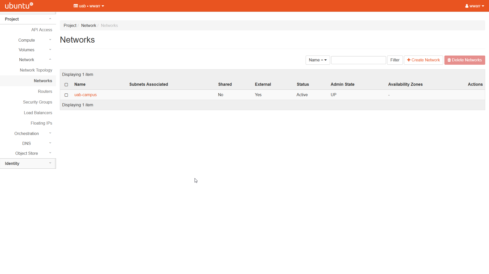

3. Click "+ Create Network" to open a dialog box.

4. Fill out the dialog box. Only the "Network" tab is important, we
    will create a subnet as a separate step.

    1. Enter a "Network Name".
    2. Leave "Enable Admin State" checked.
    3. Uncheck "Create Subnet". We will do this as a separate step. The other tabs should be removed.
    4. Leave the "Availability Zone Hints" box empty.

        

5. Click "Create".

    1. Redirects to the "Networks" page.
    2. There should be a new entry in the table with the name given in (4.a)

        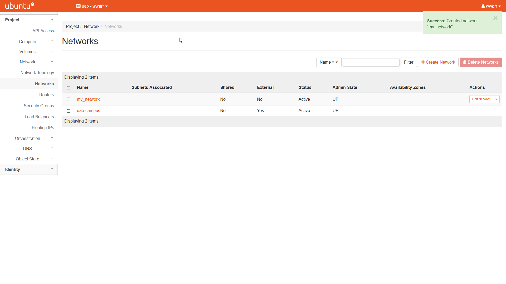

## Creating a Subnet

1. Click "Network" in the left-hand navigation pane to open the
    fold-out menu.

    

2. Click "Networks" in the fold-out menu.

    1. The "Networks" page will open.
    2. The "uab_campus" network should already be an entry in the table.
    3. At least one other entry must be in the table. See `Creating a Network`.

        

3. Under the "Actions" column, select the drop-down triangle button in the row corresponding to the network you want to add a subnet to.

    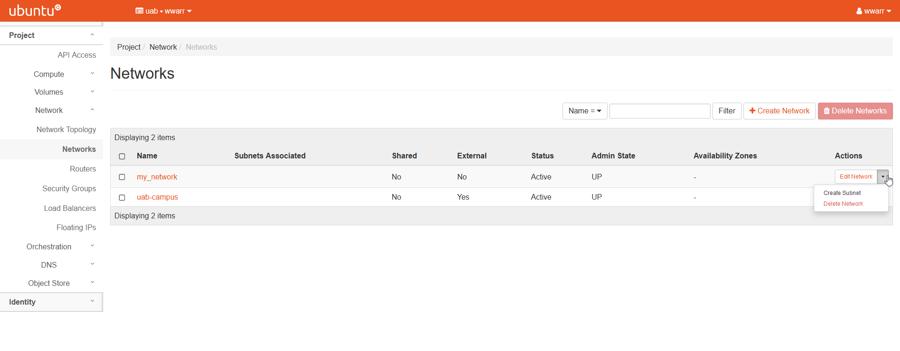

4. Click "Create Subnet" in the drop-down to open a dialog box.

5. Fill out the dialog box.

    1. The "Subnet" tab.

        1. Enter a "Subnet Name".
        2. Enter `192.168.0.0/24` as the "Network Address". The trailing `/24` allocates the entire range from `192.168.0.0` through `192.168.0.255` to the subnet.
        3. Ensure "IPv4" is selected in the "IP Version" drop-down box.
        4. Leave "Gateway IP" empty to use the default value of `192.168.0.0`.
        5. Leave "Disable Gateway" unchecked.
        6. Click the "Next \>\>" button to move to the "Subnet Details" tab.

            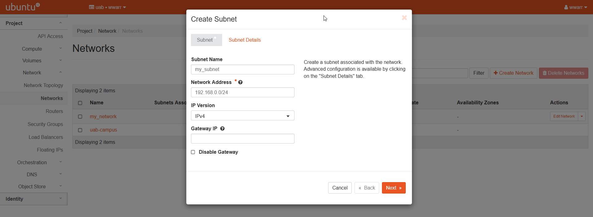

    2. The "Subnet Details" tab.

        1. Leave "Enable DHCP" checked.
        2. Enter `192.168.0.20,192.168.0.100` in the "Allocation Pools" box. The IP addresses in that range will be assigned to instances on this subnet.
        3. Leave "DNS Name Servers" empty.
        4. Leave "Host Routes" empty.

            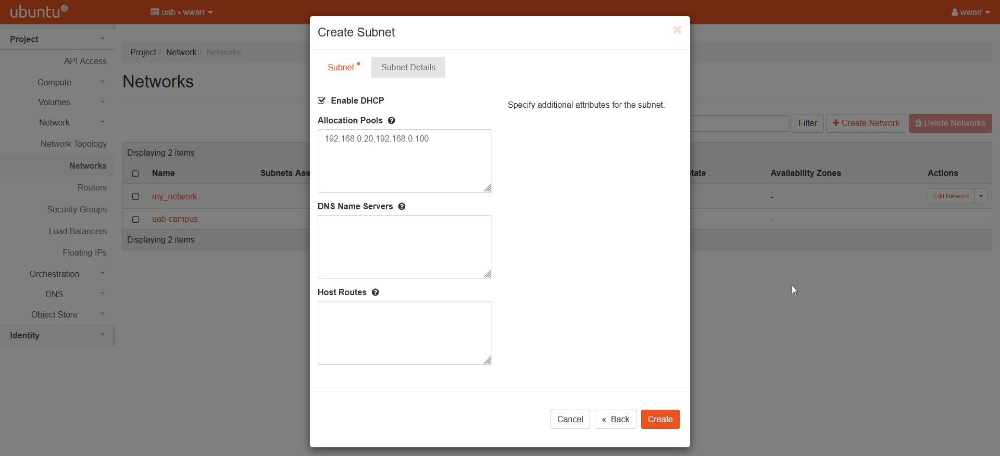

6. Click "Create".

    1. Redirects to the "Overview" page for the network the subnet was added to.

        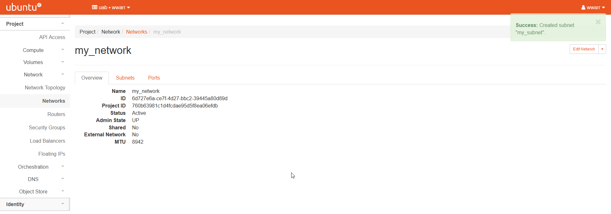

    2. Click the "Subnets" tab next to "Overview" to verify the subnet was added to the table for this network.

        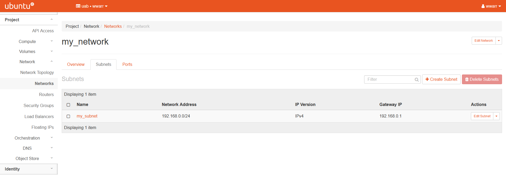

## Creating a Router

To follow these directions for creating a router, a `network<Creating a Network>` and `subnet<Creating a Subnet>` must already exist.

1. Click "Network" in the left-hand navigation pane to open the fold-out menu.

    

2. Click "Routers" in the fold-out menu.

    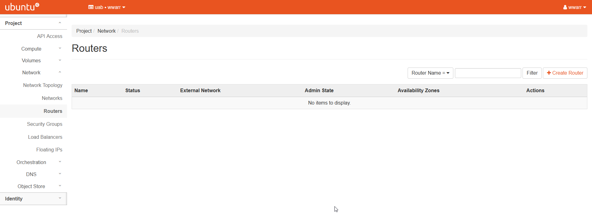

3. Click "+ Create Router" to open a dialog box.

4. Fill out the dialog box.

    1. Enter a "Router Name".
    2. Leave "Enable Admin State" checked.
    3. Select "uab-campus" in the "External Network" drop down box.
    4. Leave the "Availability Zone Hints" box empty.

    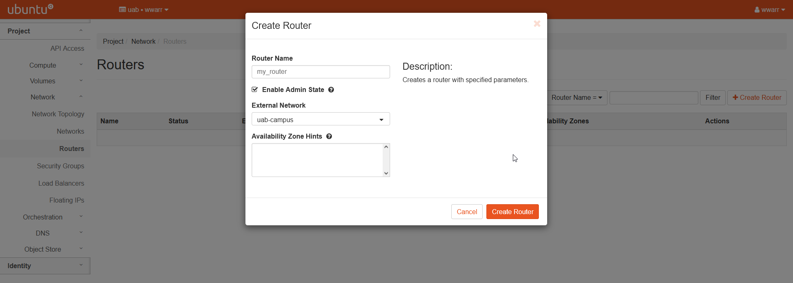

5. Click "Create Router".

    1. Redirects to the "Routers" page.
    2. There should be a new entry in the table with the name given in (4.a)

    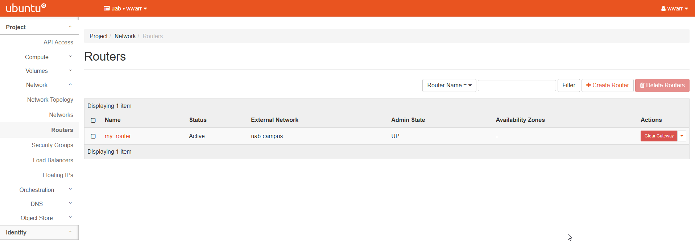

6. Now we need to connect the router to our subnet. Click the name of the new entry under the "Name" column to open the router "Overview" page.

    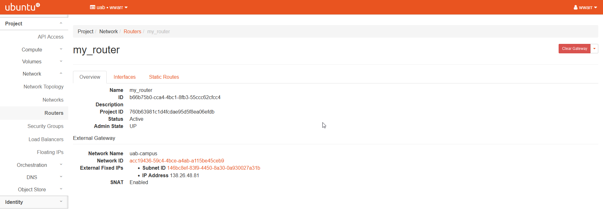

7. Click the "Interfaces" tab.

    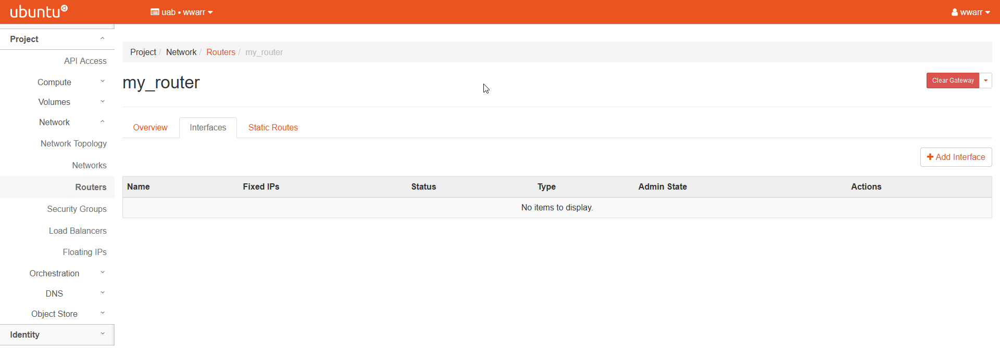

8. Click "+ Add Interface" to open a dialog box.

9. Fill out the dialog box.

    1. Select an existing network-subnet pair in the "Subnet" drop down box.
    2. If this is your only router on the selected subnet, leave "IP Address" empty to use the subnet gateway.

    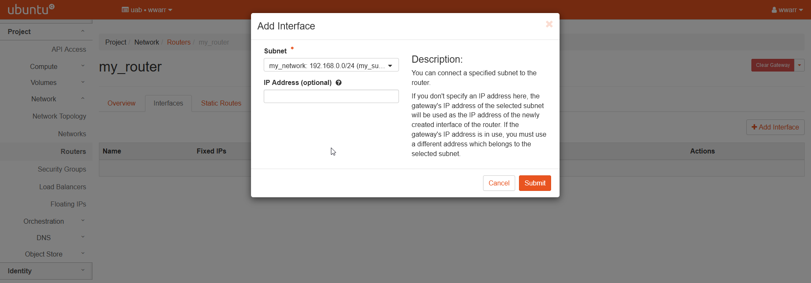

10. Click "Submit"

    1. Redirects to the "Interfaces" page for the router.
    2. There should be a new entry in the table.

    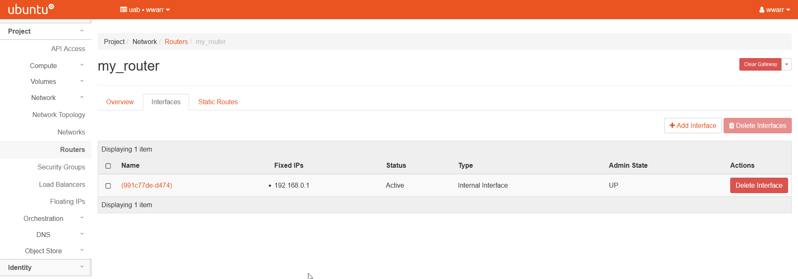

## Creating a Security Group

These instructions show you how to prepare to use SSH with your instances. Security Groups are used to set rules for how external devices can connect to our instances. Here we will create an SSH Security Group using a method that can be applied to other types of connections. The method used can be applied to other types of Security Groups as well.

1. Click "Networks" in the left-hand navigation pane to open the fold-out menu.

    

2. Click "Security Groups" in the fold out menu.

    

3. Click "+ Create Security Group" to open a dialog box.

4. Fill out the dialog box.

    1. Under "Name" enter `ssh`.
    2. Leave "Description" empty.

    

5. Click "Create Security Group".

    1. Redirects to the "Manage Security Group Rules: ssh" page.
    2. There should be an entry for "Egress IPv4" and "Egress IPv6". Leave these alone.

    

6. Click "+ Add Rule" to open a dialog box.

    1. Select "SSH" in the "Rule" drop down box. This will change the remaining fields.
    2. Leave "Description" empty.
    3. Select "CIDR" in the "Remote" drop down box.
    4. Type `0.0.0.0/0` in the "CIDR" box. **WARNING!** This is **NOT** good practice! For your research instances, you'll want to constrain the CIDR value further to a narrower range of IP addresses. The rule we have shown here leaves the SSH port open to all IP addresses world-wide.

    

7. Click "Add".

    1. Redirects to the "Manage Security Group Rules: ssh" page.
    2. There should be a new entry in the table.

    
