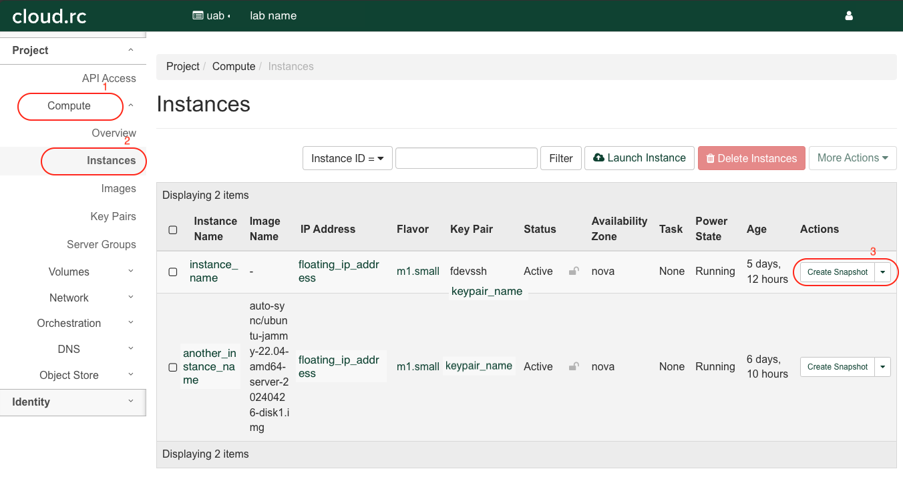

# UAB Cloud Project Space

UAB's cloud infrastructure is based on [OpenStack](https://www.openstack.org/) cloud software. Our Cloud.rc platform supports project spaces that provide a platform for collaboration on research projects using allocated cloud resources. By default, a Cloud RC user gets their own project space with a standard quota, named after their blazer ID, where they can create and deploy `Instances` effectively for use. Labs can also request their own project spaces, with this project space serving as a platform for members of your Lab to create and use `Instances` collaboratively. For example, Virtual Machines (VMs) can be created from `Instances` that package the research needs of your lab. These `Instances` can be configured to include specialized research software designed to use particular Operating Systems (OS) that support a lab's requirements. The resources the cloud project space would offer, provide opportunities for effective collaboration that improve your research outcomes.

## Why Do I Need a Project Space

The dedicated project spaces available on UAB Cloud.rc offer research Labs a number of solutions for managing their various and intensive computational needs. These project spaces will provide a secure and collaborative environment where members of your Lab can access, share, and manage resources efficiently. By using this resource, your Lab can ensure that their research projects have the necessary computational power and flexibility to advance scientific inquiry, facilitate collaboration, and optimize resource utilization. The benefits of having a project space on UAB Cloud.rc are;

1. Improved collaborations between members of your lab, as they all have access to the same resources and data to facilitate research.
1. Specific environments can be created from `Instances` that support highly specialized research tools only available on particular OS, and hardware. These specific environments can be created to significantly improve compute times for your research.
1. Use of the Cloud.rc platform can help your Lab save on a number of operations costs, particularly around the procurement and maintenance of resources.
1. Your Lab can scale their project resources down or up dependent on research needs with ease and without significant delays, this way you avoid incurring additional costs for purchasing new hardware or under utilize already purchased resources.
1. Created `Instances` in your project spaces provide security and privacy that can help to further protect your research data.

The benefits of creating and using a project space for your Lab are way more than those mentioned, they are all geared towards improving your collaboration in producing high quality research.

## How Do I Create a Project Space for My Research Lab

To use the resources available on UAB Cloud.rc, you will need to send in a request to the UAB IT Research Computing Team via email [support@listserv.uab.edu](mailto:support@listserv.uab.edu). In the email, please state clearly your needs and the resources you would require for your lab. Your request should also include members of your lab to be included in the project space, and a preferred name (usually same as lab project folder on Cheaha). Please follow the naming conventions for requesting a [shared storage](../data_management/storage.md#how-do-i-request-shared-storage) on our platforms.

## How Do I Switch Project Spaces?

As a UAB Cloud.rc user, you can easily switch between your personal project space and other Lab project spaces you are a part of. From the dashboard of the homepage after login, navigate to the `Domain` and `Projects` drop down button, located in the top pane (upper left quadrant of the page) as shown in the image below. You can then select from the list of project spaces you belong to. The project space in your `blazerID` is your personal project space, other project spaces listed are the project spaces for Labs or Projects you are a part of. As of this time only a Lab Principal Investigator (PI), and/or a Research Core Director can request for a shared project space on Cloud.rc.


## Creating an Instance in a Shared Project Space

The steps for creating an `Instance` in a project are the same as creating an `Instance` in your personal project space, you can find a detailed guide here in our [Cloud Tutorial](tutorial/index.md). You would however, need to contact us to create a project space for your lab, as well as users who would be members of the shared project space.

All members of a project space can see (and manage) all `Instances` within the shared project space on UAB Cloud.rc. They can do this by navigating through the landing page that doubles as the dashboard, the image below highlights the exact section. While members can see and create images or snapshots of an `Instance`, not all members can access the `Instance`. To do this, `SSH` key pairs would have to be created and added, see section on [Using a Key Pair to SSH](#using-a-key-pair-to-ssh).


When in the project space, select `Compute` and then `Instances` to see available `Instances` in your project space.

<!-- markdownlint-disable MD046 -->
!!! note

    Please note, all members of your project space, can create, and delete Instances. In essence, all members of the project space, have the same user privileges.
<!-- markdownlint-enable MD046 -->

## Sharing an Instance in a Project Space

There are a couple of ways to collaborate while using an `Instance`, this article would focus on some easy-to-use ways to use an `Instance` in a shared project space.

### Creating an Image From an Instance Using Snapshots

Snapshots in OpenStack are used like Images, thereby making it relatively easy to create Images from an `Instance`. To create an Image that can then be shared with other members of your project space, so they can replicate your `Instance`, please follow the below steps;

1. Go to the `Compute` pane and then navigate to the `Instances` tab in your project space dashboard. You will then see a list of available `Instances`.

    

1. Select the `Instance` you want to create an Image for. Under the Actions, click on `Create Snapshot`.

    

1. Insert a name for the Snapshot, and then click `Create Snapshot`.

    

1. You will be redirected to the `Images` page, where you newly created Image will appear amongst a list of other available images.

    

The created Image can then be launched, following the same instructions for creating an [`Instance`](../uab_cloud/tutorial/instances.md). This method would be most ideal if you want to recreate an environment for performing an analysis, but would prefer the workflow be run on different VMs, or to separate datasets or create some form of access restriction on particular research.

### Creating an Image From a Volume

There are detailed instructions here on how to create an image from a Volume, [here](snapshots.md#creating-a-volume-snapshot).

### Using a Key Pair to SSH

Another way to access a created `Instance` would be to create a public key and private key for your local machine, and then share this public key with the creator of the `Instance`. As creator of the `Instance` you would need to add individual public keys of persons who you would want to access the created VM into the `authorized_keys` file. You can edit this file by using the command below, add the shared public key in a new line inside the file (copy and paste). Save the file and follow instructions here for remote accessing your `Instance` using [`SSH`](remote_access.md). Alternatively you can share the public and private key file you created for the instance following the same steps.

```bash
# access and edit the file using

nano cd ~/.ssh/authorized_keys

```
