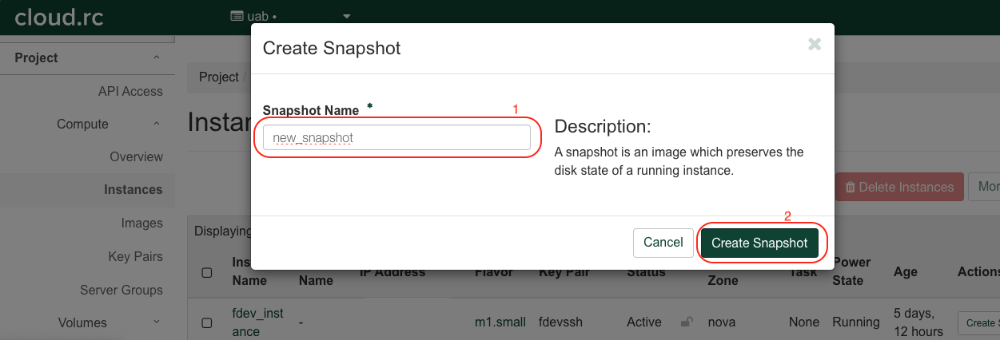

# UAB Cloud Project Space

UAB's cloud infrastructure is based on [OpenStack](https://www.openstack.org/) cloud software, this supports project spaces that provide a platform for collaboration on projects using allocated resources from enforced quotas. By default, a Cloud RC user upon a sent in request for account creation, gets their own project space with a standard quota, named after their blazer ID, where they can create and deploy instances. A lab can also request for a project space, with this project space serving as a platform for members of the lab to create and use instances collaboratively. For example, Virtual Machines (VMs) can be created from instances that package the research needs of your lab. For example Specialized research software designed to perform optimally using particular OS. For this to happen, you would need to have a project space created for your lab, with members of your lab included in the project space. Instances created in this project space can then be accessed by other members of your lab.

## Creating an Instance in a Shared Project Space

The steps for creating an instance in a project are the same as creating an instance in your personal project space, you can find a detailed guide here in our [Cloud Tutorial](tutorial/index.md). You would however, need to contact us to create a project space for your lab, as well as users who would be members of the shared project space.

All members of a project space can access all instances within the shared project space on UAB Cloud RC. They can do this by navigating through the landing page that doubles as the dashboard, the image below highlights the exact section.


When in the project space, select `Compute` and then `Instances` to see available instances in your project space.

<!-- markdownlint-disable MD046 -->
!!! note

    Please note, all members of your project space, can create, and delete instances. In essence, all members of the project space, have the same user privileges.
<!-- markdownlint-enable MD046 -->

## Sharing an Instance in a Project Space

There are a couple of ways to collaborate while using on an instance, this article would focus on some easy-to-use ways to use an instance in a shared project space.

### Creating an Image From an Instance Using Snapshots

Snapshots in OpenStack are used like Images, thereby making it relatively easy to create Images from an Instance. To create an Image that can then be shared with other members of your project space, so they can replicate your Instance, please follow the below steps;

1. Go to the `Compute` pane and then navigate to the `Instances` tab in your project space dashboard. You will then see a list of available instances.


1. Select the Instance you want to create an Image for. Under the Actions, click on `Create Snapshot`.


1. Insert a name for the Snapshot, and then click `Create Snapshot`.



1. You will be redirected to the `Images` page, where you newly created Image will appear amongst a list of other available images.


The created Image can then be launched, following the same instructions for creating an [Instance](../uab_cloud/tutorial/instances.md). This method would be most ideal if you want to recreate an environment for performing an analysis, but would prefer the workflow be run on different VMs, or to separate datasets or create some form of access restriction on particular research.

### Creating an Image From a Volume

### Using a Key Pair to SSH

Another way to access a created instance would be to create a public key and private key for your local machine, and then share this public key with the creator of the instance. As creator of the instance you would need to add individual public keys of persons who you would want to access the created VM into the `authorized_keys` file. You can edit this file by using the command below, add the shared public key in a new line inside the file (copy and paste). Save the file and follow instructions here for remote accessing your instance using [`SSH`](remote_access.md).

```bash
# access and edit the file using

nano cd ~/.ssh/authorized_keys

```
