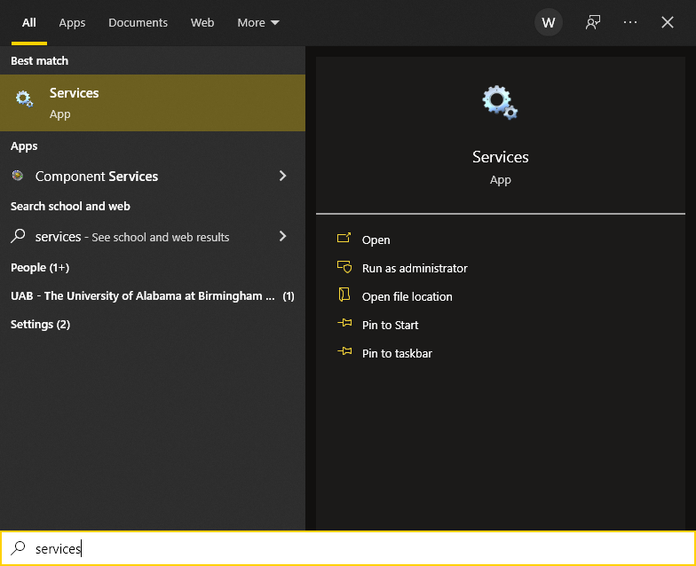
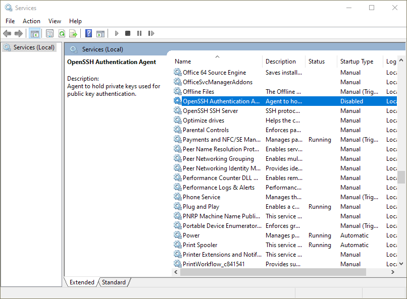
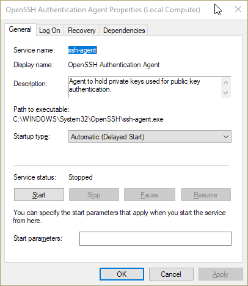
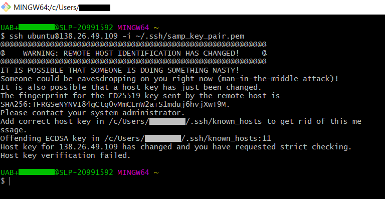
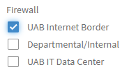

# Remote Access to Instances

All of the access methods described below are built on top of `ssh` and require completion of the steps in [Basic Security Setup](tutorial/security.md) to use with `cloud.rc`. Some of these steps are referenced in that document.

## Command Line via SSH

SSH stands for **S**ecure **SH**ell and is a powerful tool for executing terminal commands on remote machines. It is widely used and ubiquitous, and a number of other technologies are built on top of SSH, like `sftp` and `scp` for transferring files. It is also the primary mode of command line communication with Research Computing technologies like Cheaha and cloud.rc.

### Install an SSH Client

There are two main steps to working with SSH efficiently. The first is to ensure you have an SSH client installed, which will let your local machine communicate with remote machines. The second is to ensure you have `ssh-agent` running in each terminal window to automate management of key files. The `ssh-agent` software comes with most SSH clients, but does not always run automatically. How to start the `ssh-agent` software automatically varies depending on operating system and shell flavor, which we will describe below.

#### Terminal Multiplexers

Terminal multiplexers are software that aggregate multiple SSH client sessions into one location. They often have the added benefit of keeping sessions alive on the remote machine, so short internet outages won't require you to log in again.

- For Linux, try using `tmux`: <https://github.com/tmux/tmux/wiki/Installing#installing-tmux>
- For Windows, try using Windows Terminal: <https://apps.microsoft.com/detail/9n0dx20hk701?hl=en-us&gl=US>

### Install an SSH Client (Linux)

Virtually all Linux distributions come with SSH preinstalled and configured appropriately for ease of use, including automatically starting the `ssh-agent`.

### Install an SSH Client (MacOS)

MacOS comes with an SSH client installed.

If you are on version Leopard `10.5.1` or lower, you may want to have the `ssh-agent` start automatically using the command `sudo touch /var/db/useLS` at a terminal window. Versions newer than Leopard `10.5.1` start the `ssh-agent` automatically.

### Install an SSH Client (Windows)

There are several options for installing an SSH client on Windows, described below. It is highly recommended to install Windows Subsystem for Linux (WSL) as it provides a complete Linux environment within Windows.

#### Windows Subsystem for Linux (WSL)

Follow the [Windows Subsystem for Linux installation instructions](https://learn.microsoft.com/en-us/windows/wsl/about) to install WSL.

WSL shells do not automatically start or share the `ssh-agent`. To fix this we recommend installing `keychain` to automatically manage the `ssh-agent`. Run the following command depending on your Linux distribution.

- DEB-based (Debian, Ubuntu): `sudo apt install keychain`
- RPM-based (CentOS, Fedora, openSUSE): `sudo yum install keychain`

Then modify the `.*rc` file for your shell, generally `.bashrc` or `.zshrc`, to automate the `ssh-agent` by adding the following line.
        - ```eval `keychain -q --eval --agents ssh` ```

<!-- markdownlint-disable MD046 -->
!!! tip

    You can access WSL files from within Windows in two ways.

    In the WSL terminal, enter `explorer.exe .` to open a File Explorer window in the current directory.

    In Windows, open a File Explorer window, click in the top navigation bar and enter `\\wsl$`. Then select your distribution from the file window to access the filesystem of that WSL operating system.
<!-- markdownlint-enable MD046 -->

#### OpenSSH for Windows

Follow the [OpenSSH for Windows installation instructions](https://learn.microsoft.com/en-us/windows-server/administration/openssh/openssh_install_firstuse) to install the OpenSSH client. The client software is all that is needed to connect with instances from your Windows PC. Only install the OpenSSH server if you are sure you need it (this is very uncommon). The instructions at the link should work for Windows 10 and Windows 11.

Once the OpenSSH client is installed, you'll want to enable the OpenSSH Agent service on your local machine to streamline adding and using keys.

- Open the Start Menu and search for "Services", and open the result shown in the image.
    
- Find the "OpenSSH Authentication Agent" service in the list. Double click it, or right-click it and select "Properties".
    
- In the dialog box, under the "General" tab, look for "Startup Type". Click the drop-down menu and select "Automatic (Delayed Start)". Click "Apply" at the bottom-right corner. This will cause the `ssh-agent` service to start when Windows starts.
- The "Start" button under the horizontal line should become enabled. Click it to start the `ssh-agent` service now.
    

#### Git Bash Terminal (Git for Windows)

The fine folks at Git have worked very hard to package everything needed to use Git on Windows into one installer. This includes a Linux command line interface emulator, Bash and SSH. Visit <https://git-scm.com> to download and install. Follow the installer instructions. It is recommended to use all of the default installation options. Once installed, locate "Git Bash" on your machine to open the Bash terminal. It should be searchable in the Start Menu.

To automate running `ssh-agent` add the following block to the file `.bash_profile` in the `~` directory within Git Bash. Then use `source .bash_profile` to start the `ssh-agent`, or open a new terminal.

<!-- markdownlint-disable MD046 -->
!!! note

    If such a file does not exist, please add it using `nano .bash_profile` to create a new file in the nano text editor. Copy and paste the block below into the text editor window. The character `^` means ++ctrl++. Use `^x` (++ctrl+x++) to exit, and continue following the prompts to save the file, using ++ctrl++ shortcuts as needed.
<!-- markdownlint-enable MD046 -->

```bash
env=~/.ssh/agent.env

agent_load_env () { test -f "$env" && . "$env" >| /dev/null ; }

agent_start () {
    (umask 077; ssh-agent >| "$env")
    . "$env" >| /dev/null ; }

agent_load_env

# agent_run_state: 0=agent running w/ key; 1=agent w/o key; 2= agent not running
agent_run_state=$(ssh-add -l >| /dev/null 2>&1; echo $?)

if [ ! "$SSH_AUTH_SOCK" ] || [ $agent_run_state = 2 ]; then
    agent_start
    ssh-add
elif [ "$SSH_AUTH_SOCK" ] && [ $agent_run_state = 1 ]; then
    ssh-add
fi
```

### Generating Key Pairs

The instructions for generating key pairs are identical for all operating systems. [GitHub](https://docs.github.com/en/authentication/connecting-to-github-with-ssh/generating-a-new-ssh-key-and-adding-it-to-the-ssh-agent) maintains excellent documentation on generating key pairs. The gist of those instructions follows.

1. Open a terminal window.
1. Use the command `ssh-keygen -t ed25519 -C "your_email@example.com"`
1. You will be prompted to choose a location to store the key, including a file name.
1. You will be prompted to enter a passphrase to secure the key. It is highly recommended to secure your key pair with a passphrase to minimize risk.

### Managing Keys

The instructions below are the same for all operating systems with one small exception noted below.

<!-- markdownlint-disable MD046 -->
!!! important

    If at any point you encounter an error like below, please check to be sure your `ssh-agent` is running based on how you [Installed your SSH Client](#install-an-ssh-client).

    ```bash
    Could not open a connection to your authentication agent.
    ```
<!-- markdownlint-enable MD046 -->

#### Starting the SSH Agent for a Single Session

If `ssh-agent` isn't already running and you encounter an error, use the following commands to start the `ssh-agent` depending on your environment. It is highly recommended to use the most appropriate method described in [Install an SSH Client](#install-an-ssh-client) to have `ssh-agent` start automatically.

- Linux, MacOS, Git Bash, WSL: `eval $(ssh-agent -s)`
- Windows OpenSSH: `start-ssh-agent`

#### Add a Private Key

- Move the key file to the `.ssh` directory under your home directory.
- Navigate to the `.ssh` folder in a terminal window.
- Run `ssh-add <private_key_file>`

    

    <!-- markdownlint-disable MD046 -->
    !!! bug

        For Linux users and [WSL](https://learn.microsoft.com/en-us/windows/wsl/about) on Windows users. If you experience a `Warning: Unprotected Private Key File` error when using `ssh-add`, your `ssh` file and directory permissions may be incorrect. To fix, please use the following commands.

        ```bash
        sudo chmod 600 ~/.ssh/<private_key_file>
        sudo chmod 644 ~/.ssh/known_hosts  # if you have ever connected to a remote machine
        sudo chmod 644 ~/.ssh/config  # if you have a config file
        sudo chmod 755 ~/.ssh
        ```
    <!-- markdownlint-enable MD046 -->

    <!-- markdownlint-disable MD046 -->
    !!! tip

        MacOS allows storing passphrases to the builtin Keychain with a special flag. Use `ssh-add -K <path/to/private_key_file>` to permanently store the passphrase that goes with the key file.
    <!-- markdownlint-enable MD046 -->

#### Remove a Private Key

Run `ssh-add -d <path/to/private_key_file>`

#### Push a New Public Key File to a Remote Machine

To push a new public key file to a remote machine, please use the `ssh-copy-id` command. If your `ssh-agent` is running and has a known-good private key added, then the command below will work as expected and add the `<new_public_keyfile>.pub` to the remote machine. You must also have the private key counterpart `<new_private_keyfile>` with the same name as the public key file, without the `.pub` extension.

```bash
ssh-copy-id -i ~/.ssh/<new_public_keyfile> <user>@<remote_ip>
```

The value `<user>` should be replaced with the remote user you will login as. The value `<remote_ip>` should be replaced with the IP address of the remote machine.

To verify, use `ssh -i ~/.ssh/<new_private_keyfile>.pub <user>@<remote_ip>`.

#### Remove an Invalid Host Fingerprint

<!-- markdownlint-disable MD046 -->
!!! danger

    The following command should **only** be run when reusing a floating IP for a new instance in a cloud context. Using it arbitrarily for remote machines you do not control can result in a security breach. Be absolutely certain you trust the source of the key change.
<!-- markdownlint-enable MD046 -->

A "Remote Host Identification Has Changed" error can be resolved by using the following command. It looks like the image below.

Run `ssh-keygen -R <hostname>` where `<hostname>` is the URL or IP address of the remote machine.



### Setting Up a Configuration File

SSH configuration files help streamline the process of logging in to remote terminals by storing commonly-used arguments and flags for each host. To create a configuration file, navigate to your `.ssh` directory. Create a new plain text file called `config` with no extension. Open the file and add content like the following. Note that indent matters. Variable values in `<>` will be replaced with appropriate values before saving.

```ssh-config
Host <host>
  HostName <remote_ip>
  User <user>
  IdentityFile <absolute_path_to_private_key_file>
```

- Be sure to give a meaningful name under `<host>` so you can easily refer back to this config later and for ease of typing when using `ssh` with this configuration. Only letters, numbers, dashes and underscores are allowed, and it must start with a letter.
- The value `<remote_ip>` can be any remote machine relevant to your work. For cloud.rc it should be whatever IP was assigned in [Creating a Floating IP](tutorial/networks.md#creating-a-floating-ip).
- The value `<user>` should be whatever user name you will log in as. For cloud.rc, `ubuntu` or `centos` are typical, depending on instance operating system.
- The value `<path_to_private_key_file>` is the absolute path to the private key file, e.g. the path to your `.ssh` folder followed by the `<private_key_file>` file name. For cloud.rc this will be whatever private key file was generated in [Creating a Key Pair](tutorial/security.md#creating-a-key-pair).

Save the `config` file. Start a new terminal and use the command `ssh <host>`, with no other flags, to test.

### SSH Client Usage

If you've [Set up a Configuration File](#setting-up-a-configuration-file), simply use `ssh <host>`, using the configuration name, to connect.

If you haven't set up a configuration file, use the following.

```bash
ssh <user>@<remote_ip> -i <private_key_file>
```

Where `user` is the remote username, `remote_ip` is the IP address of the remote machine, and `<private_key_file>` is the private key file used for access the remote machine. See [Generating Key Pairs](#generating-key-pairs) for general instructions on creating a key pair, or [Creating a Key Pair](tutorial/security.md#creating-a-key-pair) for cloud.rc specific instructions.

## Make Instances Publicly Accessible From the Internet

It is possible to make [instances](./tutorial/instances.md) publicly accessible from the external internet. [Floating IPs](./tutorial/networks.md#floating-ips) are pulled from a limited and fixed pool of public IP addresses assigned from the overall UAB IP pool. By default, these IP addresses are unable to communicate beyond the UAB Internet Border firewall, for security reasons. To make your instance publicly accessible, a Firewall Security Exception must be filed. The result of the security exception is to create a firewall rule to allow traffic between the internet and an application on your instance. This section will go over how to make your instance publicly accessible.

### Expectations

The expectation of making an instance publicly accessible is to advance UAB's mission, so be sure you've configured and thoroughly tested your instance in the UAB Campus Network before proceeding. The following list is intended as a helpful reminder.

- Have an instance with some research application or server that advances UAB's mission.
- The instance is configured with a floating IP address.
- The server and any applications follow [appropriate UAB IT policies](../policies.md).
- For public-facing portions of the server which requiring login information, each authorized user must have their own independent credentials.
- Thoroughly test your application on the UAB Campus Network prior to requesting public access.

### Process for Granting Public Access

Proceed to the [UAB IT Security Exception (Firewall Rule Change) form](https://uabprod.service-now.com/service_portal?id=sc_cat_item&sys_id=daf70746374ce3c0daa253b543990e7f) at UAB ServiceNow and fill it in. You may need to login with your UAB BlazerID credentials. We have included information on a few of the

- For the Section "Firewall" there are three checkbox options:UAB Internet Border; Department/Internal; UAB IT Data Center. Be sure only "UAB Internet Border" is checked.

    

- For the Section "System/Application Information" there are two checkbox options.
    - Be sure "Is this a mission critical system?" is left unchecked. For IT purposes, mission critical systems include things like the Outlook Exchange server, BlazerNet, Taleo, and other similar systems affecting University operations.
    - If your application involves the storage, processing or acquisition of [sensitive or restricted/PHI data](https://www.uab.edu/it/home/policies/data-classification/classification-overview) then you must check "Does this system/application store or process sensitive/restricted data?".
        - If you checked this box, please select the type or types in the next section "What type of sensitive or restricted data is stored or processed?"
        - **IMPORTANT** As of Feb 29, 2024, Cloud.rc is not suitable for use with restricted/PHI data.
- For the Section "Justification/Description", in addition to your own description, be sure to mention that your application "Involves one or more virtual machine instances on the UAB IT Research Computing Cloud.rc platform".

When you have completed the form, press the "Submit" button to make the request.

### Configuring Security Groups for Server Software

Remotely accessing server software, publicly or otherwise, requires configuration of [Security Groups](tutorial/security.md#creating-a-security-group) to open ports the server will communicate on. Please see our information on [Installing Server Software](installing_software.md#installing-server-software) for more details.

### Special Notes for Web Page Servers and Apps

Dynamic web pages may be served from OpenStack instances. Doing so requires the instance and its floating IP being [granted public access](#process-for-granting-public-access). Additionally, web page servers require an [SSL Certificate](#https-and-web-page-applications-require-an-ssl-certificate). It may also interest reseachers to know that [Custom Domains](#custom-domains-for-https-and-web-page-applications) are possible for your applications.

#### HTTPS and Web Page Applications Require an SSL Certificate

If your application serves a web page over HTTPS, you will need to obtain an SSL Certificate. UAB IT provides this service at no additional cost. To obtain a certificate, please visit the [UAB IT SSL Server Certificate service page](https://uabprod.service-now.com/service_portal?id=sc_cat_item&sys_id=500f425737109b0024a67c1643990e80) and follow the instructions there.

#### Custom Domains for HTTPS and Web Page Applications

For applications serving a web pages over HTTPS, it is possible to request a custom domain name like "department.uab.edu". This type of domain name is called a third-level domain, and there is a one-time fee charged by UAB IT to set this up. Once the third-level domain is set up, fourth-level domains like "group.department.uab.edu" may be set up at no additional cost.

To learn more about setting up a third-level domain, please have your department's IT Network Contact visit the [ServiceNow Knowledge Base Article](https://uabprod.service-now.com/service_portal?sys_kb_id=b0a8301637ff8200daa253b543990e5e&id=kb_article_view&sysparm_rank=2&sysparm_tsqueryId=0d90b0aa97240e100917316bf253af4e).

<!-- markdownlint-disable MD046 -->
!!! note

    The above information about costs is true as of March 2024. Specifics may change over time.
<!-- markdownlint-enable MD046 -->

## Data Transfer

### SCP

SCP stands for **S**ecure **C**o**P**y and works like the `cp` command, but allows transferring files and directories with remote machines. SCP is built on top of SSH and is installed with most SSH Clients. To install SCP, see [Install an SSH Client](#install-an-ssh-client).

<!-- markdownlint-disable MD046 -->
!!! warning

    The OpenSSH developers recommend using SFTP instead of SCP. Future releases of OpenSSH will have SCP use SFTP protocol.
<!-- markdownlint-enable MD046 -->

The value `<user>` is the user you will login as on the remote machine `<hostname>`. Note that if you are using an [SSH Configuration File](#setting-up-a-configuration-file) with Host `<host>`, then replace all of `<user>@<hostname>` with just `<host>`, as you would with SSH.

```bash
scp <source_file> <user>@<hostname>:<destination_file>  # single file
scp <source_file> <user>@<hostname>:  # retains the file name

scp -r <source_directory> <user>@<hostname>:<destination_directory>  # full directory
scp -r <source_directory> <user>@<hostname>:  # retains the directory name
```

Examples:

```bash
# file
scp script.py cheaha:
scp script.py user@cheaha.rc.uab.edu:~/existing/shared_script.py
scp script.py user@<cloud_vm_ip>:

# directory
scp -r my_scripts/ user@cheaha.rc.uab.edu:
scp -r my_scripts/ cheaha:my_shared_scripts/
```

### SFTP

SFTP stands for **S**ecure **F**ile **T**ransfer **P**rotocol and allows transferring files and directories with remote machines. SFTP is built on top of SSH and is installed with most SSH Clients. To install SFTP, see [Install an SSH Client](#install-an-ssh-client).

SFTP works differently from [SCP](#scp), as it has an interactive prompt. When connected to a remote, the prompt `sftp>` will appears and enable use of SFTP commands. SFTP can also be used in batch mode with the `-b <batch_file>` argument. The plaintext `<batch_file>` should contain one SFTP command per line.

To connect, use `sftp <user>@<hostname>` where `<user>` is the user you will login as on the remote machine `<hostname>`. If you are using an [SSH Configuration File](#setting-up-a-configuration-file) with Host `<host>`, you may use `sftp <host>`. You may optionally use `sftp <host>:/path/to/dir` to start in a specific directory.

Some examples of commands are given below. A more complete list is available at <https://linux.die.net/man/1/sftp>

```bash
# general commands
sftp> pwd  # remote current directory
sftp> lpwd  # local current directory

sftp> ls  # contents of remote pwd
sftp> lls  # contents of local pwd

sftp> mkdir my_dir  # create my_dir on remote
sftp> lmkdir my_dir  # create my_dir on local

sftp> cd my_dir  # change directory on remote
sftp> lcd my_dir  # change directory on local


# copy to remote
sftp> put <local_file> <optional_remote_path>
sftp> put -r <local_directory> <optional_remote_path>
# if optional remote path is not supplied, uses pwd

# file
sftp> put script.py  # copies file to pwd, same name
sftp> put script.py shared_script.py  # copies file to pwd, renames
sftp> put script.py all_scripts/  # copies to pwd existing subdirectory of pwd

# directory, must use trailing '/' character!
sftp> put -r my_scripts/  # copies directory to pwd
sftp> put -r my_scripts/ all_scripts/  # copies to existing subdirectory of pwd


# copy from remote, same syntax as put, reversed direction
sftp> get <remote_file> <optional_local_path>
sftp> get -r <remote_directory> <optional_local_path>
# if optional local path is not supplied, uses lpwd
```

### RClone

Please see our [RClone](../data_management/transfer/rclone.md) page for more information on using RClone with the SFTP remote option.
