# Basic Security Setup

Using SSH with your instances requires following the steps on this page. At a minimum, an SSH security group and at least one keypair must be created. Other security groups can and should be added as needed.

## Creating a Security Group

These instructions show you how to prepare to use SSH with your instances. Security Groups are used to set rules for how external devices can connect to our instances. Here we will create an SSH Security Group using a method that can be applied to other types of connections. The method used can be applied to other types of Security Groups as well.

1. Click "Networks" in the left-hand navigation pane to open the fold-out menu.

    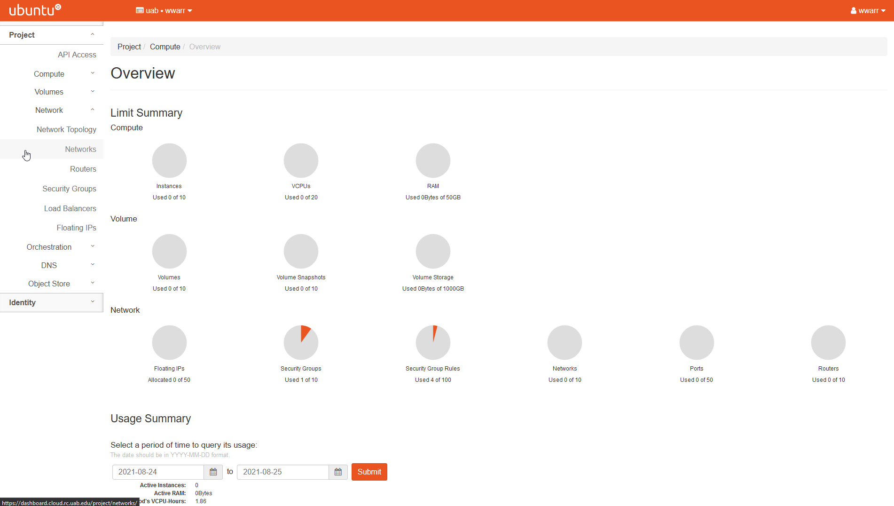

2. Click "Security Groups" in the fold out menu.

    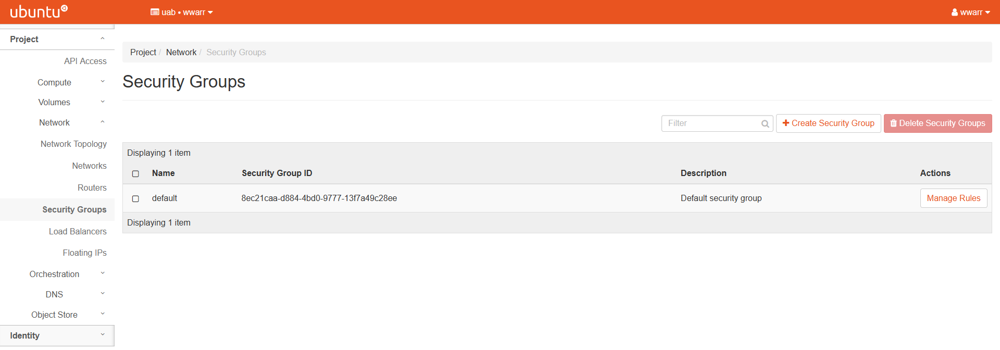

3. Click "+ Create Security Group" to open a dialog box.

4. Fill out the dialog box.

    1. Under "Name" enter `ssh`.
    2. Leave "Description" empty.

    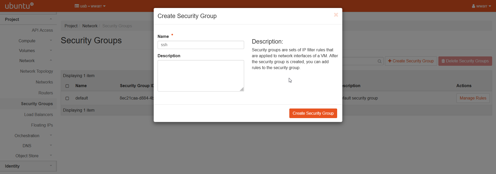

5. Click "Create Security Group".

    1. Redirects to the "Manage Security Group Rules: ssh" page.
    2. There should be an entry for "Egress IPv4" and "Egress IPv6". Leave these alone.

    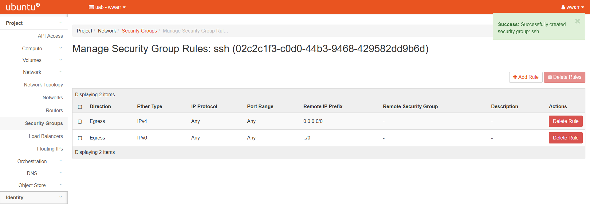

6. Click "+ Add Rule" to open a dialog box.

    1. Select "SSH" in the "Rule" drop down box. This will change the remaining fields.
    2. Leave "Description" empty.
    3. Select "CIDR" in the "Remote" drop down box.
    4. Type `0.0.0.0/0` in the "CIDR" box. **WARNING!** This is **NOT** good practice! For your research instances, you'll want to constrain the CIDR value further to a narrower range of IP addresses. The rule we have shown here leaves the SSH port open to all IP addresses world-wide.

    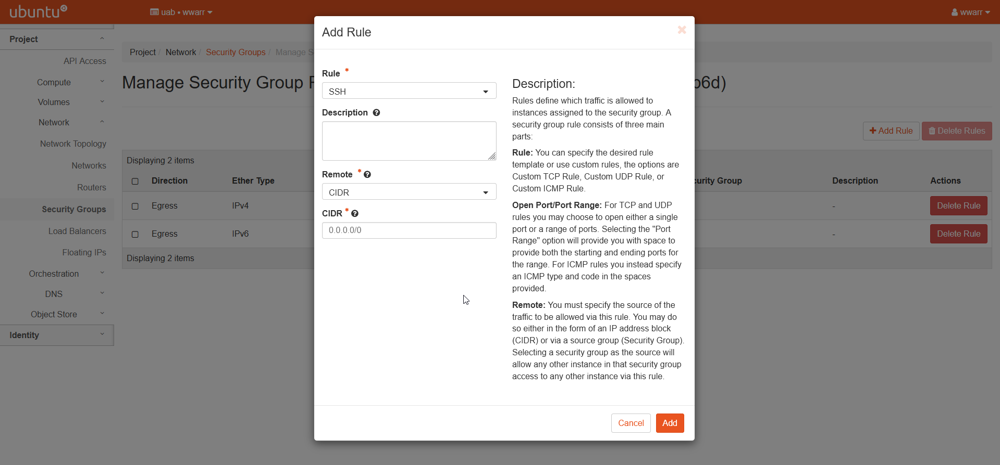

7. Click "Add".

    1. Redirects to the "Manage Security Group Rules: ssh" page.
    2. There should be a new entry in the table.

    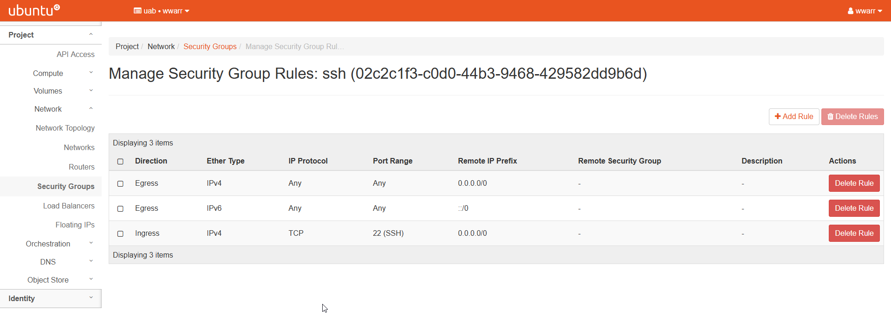

## Creating a Key Pair

A Key Pair is required for SSH access to OpenStack instances for security reasons. Key Pairs are security devices used to authenticate and connect to a remote machine, like Cheaha or cloud.rc instances, and use [Public-key cryptography](https://en.wikipedia.org/wiki/Public-key_cryptography) to encrypt the connection. As the name suggests, there are two parts: a public key which is placed on the remote machine, and a private key which is kept secret on your personal machine.

There are two ways to create a key pair:

1. [Use the cloud.rc interface to generate a key pair remotely and download the private key file](#generating-a-key-pair-on-cloudrc).
2. [Use your personal computer to generate a key pair locally and upload the public key file.](#generating-a-key-pair-locally)

### Good Practices

Good practice is to only use one key pair per person and per local machine. So if you have two computers, each one will need its own key pair. If you have two users, each will need their own key pair. Private keys are secrets and should not be passed around. Copying the key increases the risk of the system being compromised by an attacker.

Using a password protected Key Pair is highly recommended for additional security, as it buys time to revoke a key if it is compromised by an attacker. Currently, this is only possible by uploading a custom public key generated on your local machine.

### Generating a Key Pair on cloud.rc

1. Click "Compute" in the left-hand navigation pane to open the fold-out menu.

    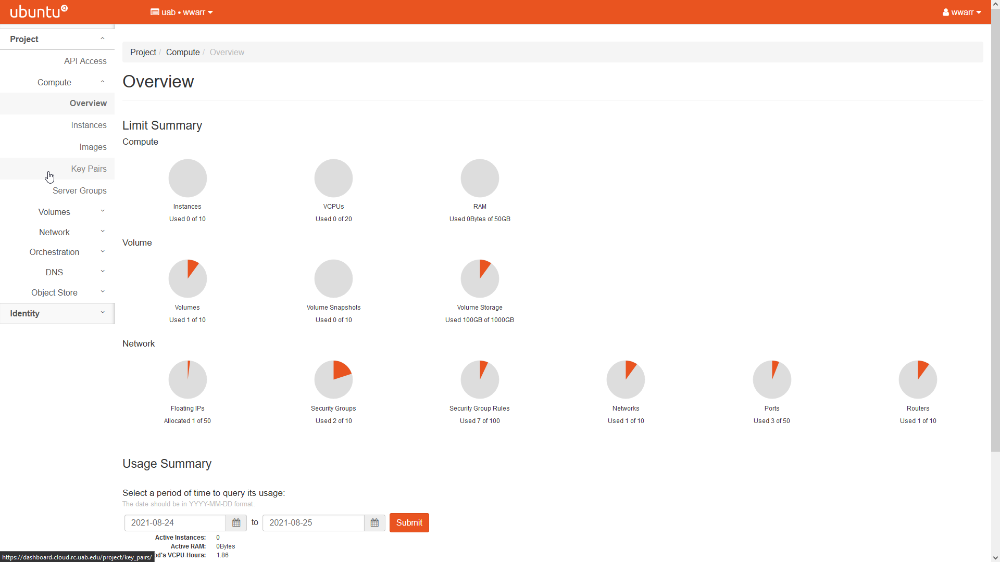

2. Click "Key Pairs".

    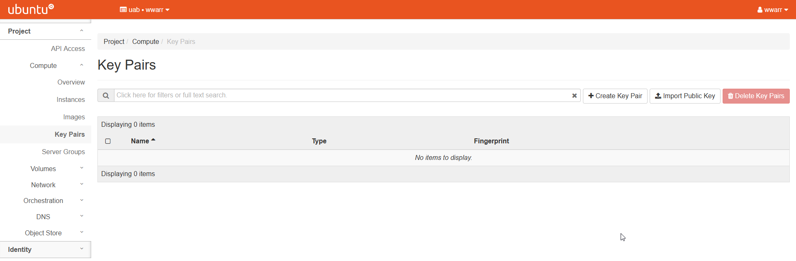

3. Click "+ Create Key Pair" to open a dialog box.

4. Fill out the dialog box.

    1. Enter a "Key Pair Name".
    2. Select "SSH Key" in the "Key Type" drop down box.

        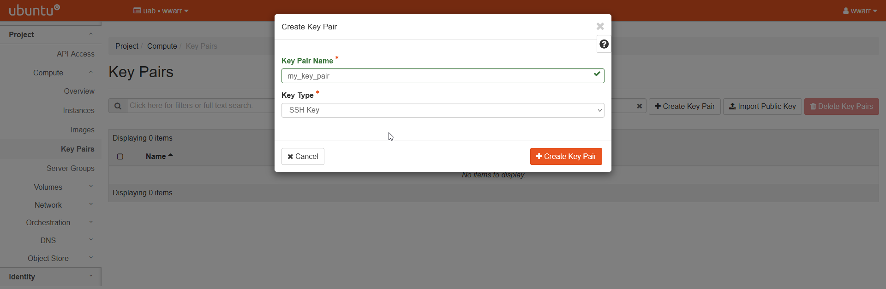

5. Click "+ Create Key Pair"

    1. Opens a download file dialog box in your browser to download a file containing the secret private key. The file may have extension `.pem` or `.crt` depending on your operating system.
    2. Download the private key file. For security reasons this will be your only chance to ever obtain the private key from cloud.rc. If you lose this file you will have to generate a new Key Pair.

        

    3. Redirects to the "Key Pairs" page.
    4. There should be a new entry in the table.

        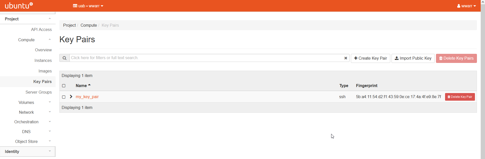

6. To use the private key on your local machine.

    1. `mv` the private key file to the `.ssh` directory under your home directory. If you are on a Windows machine, you'll first need to install an SSH client software like [OpenSSH](https://docs.microsoft.com/en-us/windows-server/administration/openssh/openssh_install_firstuse).
    2. `cd` to the `.ssh` directory under your home directory.
    3. Start the `ssh-agent` by running the command ``eval `ssh-agent``.
    4. `ssh-add <priate_key_file>` to add the private key to the ssh keyring for use by ssh.

        

<!-- markdownlint-disable MD046 -->
!!! note

    It is alternately possible to use a custom key pair created on your local machine. We assume you know how to create a key pair on your local machine and have already done so. To upload a key pair, replace steps 3 and 4 above with the following, perform step 5 from above, and skip step 6.

    3\. Click "Import Public Key" to open a dialog box.

    4\. Fill out the dialog box.

    - Enter a "Key Pair Name".
    - Select "SSH Key" in the "Key Type" drop-down box.
    - Click "Browse..." to upload a public key file from your custom key pair **OR** copy-paste the content of that key file into the "Public Key" box.

    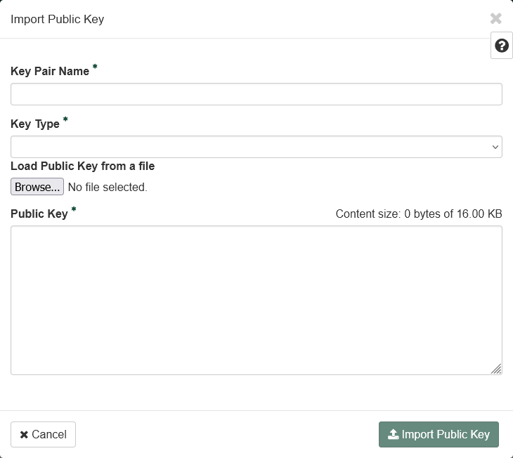
<!-- markdownlint-disable MD046 -->
