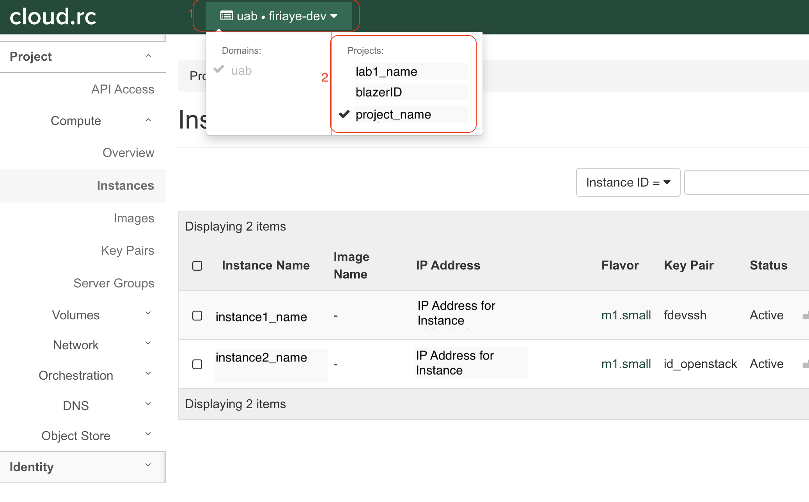
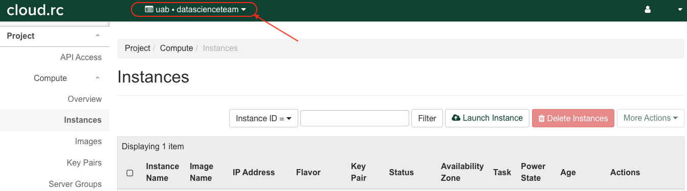
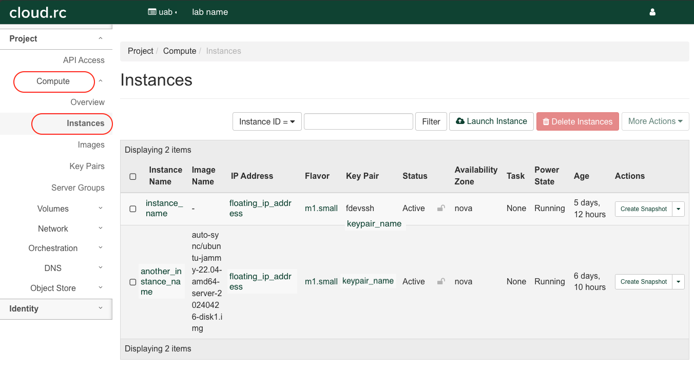
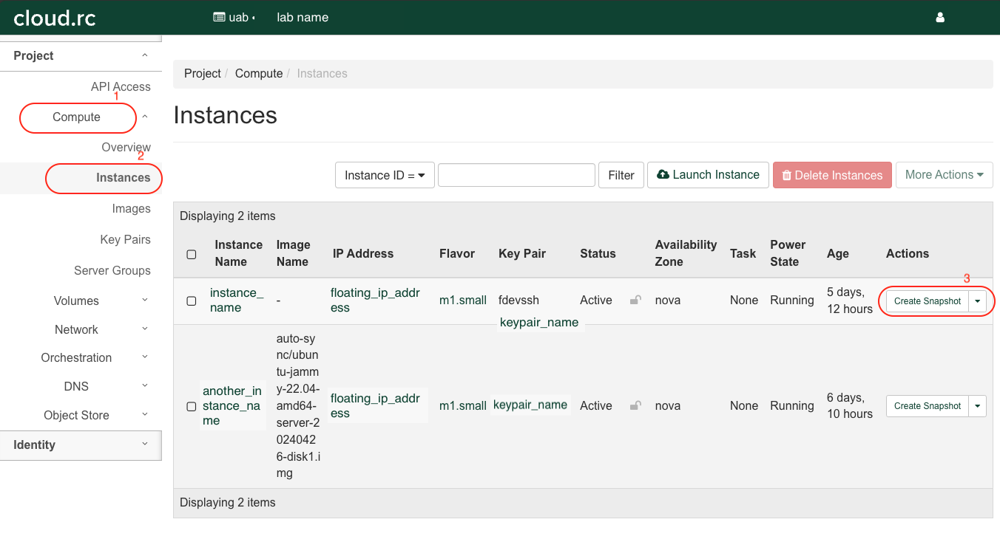
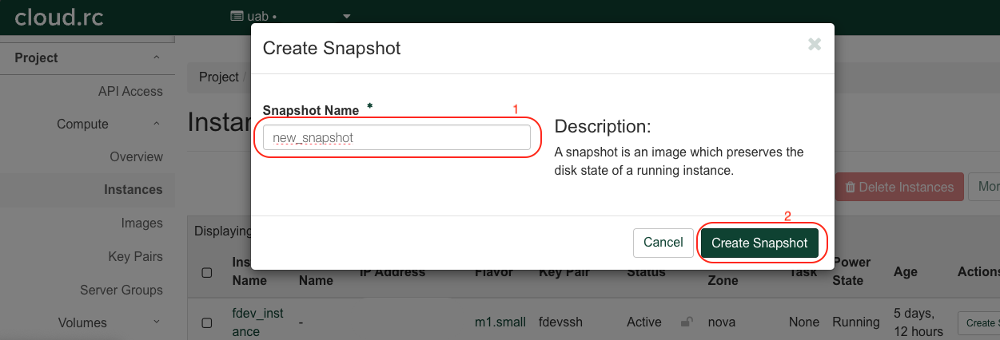
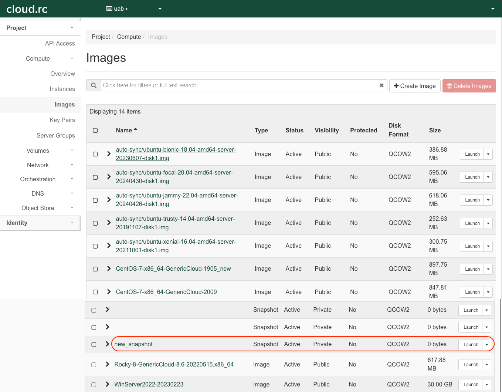

# What Is a Project Space?

UAB's cloud infrastructure is based on [OpenStack](https://docs.openstack.org/2024.1/) cloud software. A project space is referred to as the cloud environment that houses projects on OpenStack. Providing the platform to manage cloud resources for storage, security and networking via a web interface. Every UAB Cloud user has their Individual Cloud Environment that is their personal project space. An individual can also be part of a shared project space which is referred to as a Shared Cloud Environment. Both environments are OpenStack Project Spaces, with the exception that the shared cloud environment allows multiple UAB cloud users to collaborate in the shared project space. Dependent on an individual's UAB status, they can request that a Shared Cloud environment be created for their Lab and/or Core, this shared project space will include members of their research lab, or persons they want to collaborate with. This article provides information on why using a shared cloud environment is important, how to get an additional shared OpenStack Project (Shared Cloud Environment) and how best to utilize this environment.

## Why Do I Need a Shared Cloud Environment

The dedicated Shared Cloud Environment available on UAB Cloud offer research Labs and/or Cores a number of solutions for managing their various and intensive computational needs. These Shared Cloud Environments will provide a secure and collaborative environment where members can access, share, and manage resources efficiently. By using this resource, your organization can ensure that their research projects have the necessary computing power and flexibility to advance scientific inquiry, facilitate collaboration, and optimize resource utilization. The benefits of having a Shared Cloud Environment on UAB Cloud are;

1. Improved collaborations between members of your lab, as they all have access to the same resources and data to facilitate research.
1. Specific environments can be created from Instances that support highly specialized research tools only available on particular OS, and hardware. These specific environments can be created to significantly improve compute times for your research.
1. Use of the Cloud platform can help your Lab save on a number of operations costs, particularly around the procurement and maintenance of resources.
1. Your Lab can scale their project resources down or up dependent on research needs with ease and without significant delays, this way you avoid incurring additional costs for purchasing new hardware or under utilize already purchased resources.
1. Created Instances in your Shared Cloud Environment, provide security and privacy that can help to further protect your research data.

The benefits of creating and using a Shared Cloud Environment for your Lab/Core are way more than those mentioned above, but the above capture the purpose to which this resource helps to improve your collaboration in producing high quality research.

## How Do I Create a Shared Cloud Environment for My Lab/Core

To use the shared cloud resources available, you will need to send in a request to the UAB IT Research Computing Team via email <support@listserv.uab.edu>. In the email, please state clearly your needs and the resources you would require for your lab. Your request should also include members of your lab to be included in the Shared Cloud Environment, and a preferred name (usually same as lab project folder on Cheaha). Please follow the naming conventions for requesting a [shared storage](../data_management/index.md#how-do-i-request-shared-storage) on our platforms in your request.

## How Do I Switch Project Spaces?

As a UAB Cloud user, you can easily switch between your Individual Cloud Environment and other Shared Cloud Environments you are a part of. From the dashboard of the homepage after login, navigate to the "Domain" and "Projects" drop down button, located in the top pane (upper left quadrant of the page) as shown in the image below. You can then select from the list of project spaces you belong to.



The project space with your `BlazerID` is your Individual Cloud Environment, other project spaces listed are the Shared Cloud Environments for Labs, Cores or Projects you are a part of. As of this time only a Lab Principal Investigator (PI), and/or a Research Core Director can request for a shared Shared Cloud Environment.

## Creating an Instance in a Shared Cloud Environment

The steps for creating an Instance in a project are the same as creating an Instance in your Individual Cloud Environment, you can find a detailed guide here in our [Cloud Tutorial](tutorial/index.md). You would however, need to contact us to create a Shared Cloud Environment for your lab, as well as add users who you would like to be members of the Shared Cloud Environment.

All members of a Shared Cloud Environment can see (and manage) all Instances within the Shared Cloud Environment. They can do this by navigating through the landing page that doubles as the dashboard, the image below highlights the exact section. While members can see and create images or snapshots of an Instance, not all members can access the Instance. To do this, SSH key pairs would have to be created and added, see section on [Using a Key Pair to SSH](#using-a-key-pair-to-ssh).



When in the Shared Cloud Environment, select "Compute" and then "Instances" to see available Instances in your Shared Cloud Environment.

<!-- markdownlint-disable MD046 -->
!!! note

    Please note, all members of your Shared Cloud Environment, can create, and delete Instances. In essence, all members of the Shared Cloud Environment, have the same user privileges.
<!-- markdownlint-enable MD046 -->

## Sharing an Instance in a Shared Cloud Environment

There are a couple of ways to collaborate while using an Instance, the sections below show some easy-to-use ways to use an Instance in a Shared Cloud Environment.

### Creating an Image From an Instance Using Snapshots

Snapshots in OpenStack are used like Images, thereby making it relatively easy to create Images from an Instance. To create an Image that can then be shared with other members of your Shared Cloud Environment, so they can replicate your Instance, please follow the below steps;

1. Go to the Compute pane and then navigate to the "Instances" tab in your Shared Cloud Environment dashboard. You will then see a list of available Instances.

    

1. Select the Instance you want to create an Image for. Under the Actions, click on "Create Snapshot".

    

1. Insert a name for the Snapshot, and then click "Create Snapshot".

    

1. You will be redirected to the `Images` page, where you newly created Image will appear amongst a list of other available images.

    

The created Image can then be launched, following the same instructions for creating an [Instance](../uab_cloud/tutorial/instances.md). This method would be most ideal if you want to recreate an environment for performing an analysis, but would prefer the workflow be run on different VMs, or to separate datasets or create some form of access restriction on particular research.

### Creating an Image From a Volume

Please see [detailed instructions on how to create an image from a Volume](snapshots.md#creating-a-volume-snapshot).

### Using a Key Pair to SSH

Another way to access a created Instance would be to create a public key and private key for your local machine, and then share this public key with the creator of the Instance. As creator of the Instance you would need to add individual public keys of persons who you would want to access the created VM into the `authorized_keys` file. You can edit this file by using the command below, add the shared public key in a new line inside the file (copy and paste). Save the file and follow instructions here for remote accessing your Instance using [SSH](remote_access.md).

```bash
# access and edit the file using

nano cd ~/.ssh/authorized_keys

```

Alternatively you can share the private key file you created for the Instance, with members of your Shared Cloud Environment. But in this case, your project members would have to save the shared private key (usually a `.pem` file) in their `$HOME/.ssh` folder. Members of your Shared Cloud Environment can SSH into the shared Instance, by doing the following;

1. Add the private key into your `~/.ssh` folder and run the command below.

    ```bash

        ssh-add ~/.ssh/<keypair_filename>.pem

    ```

1. Change the file permission.

    ```bash

        sudo chmod 600 ~/.ssh/<keypair_filename>.pem

    ```

<!-- markdownlint-disable MD046 -->
!!! note

    Please note Images created from an Instance would inherit the key-pair of the parent Instance.
<!-- markdownlint-enable MD046 -->
