# Working With Snapshots

Snapshots are instances or volumes frozen at a moment in time, able to be used in the future. Think of snapshots as a photograph of the state of an instance or volume. Anything done to an instance or volume after the snapshot is taken won't affect the snapshot. We can also create a new instance or volume from an existing snapshot, and continue from that point in time.

An instance snapshot is referred to as an image. Volume snapshots do not have a special name.

## Images or Instance Snapshots

### Creating an Image

Images are a helpful way to store the state of an instance for later use. Repeating tedious tasks like [Software Installs](./installing_software.md) can be avoided by taking a snapshot at a known-good point during set up of an instance environment, saving time in the future if something goes wrong. Images may also be shared with other users to simplify workflows and onboarding new collaborators. To create an image please follow the steps below. We assume you are already logged in at [cloud.rc](index.md)

1. Navigate to "Compute" and then "Instances" in the left-hand navigation menu to open the "Instances" page.
1. To take a snapshot of a particular instance, click the drop down menu under the "Actions" column in the row of the desired instance. Then click "Create Snapshot".

    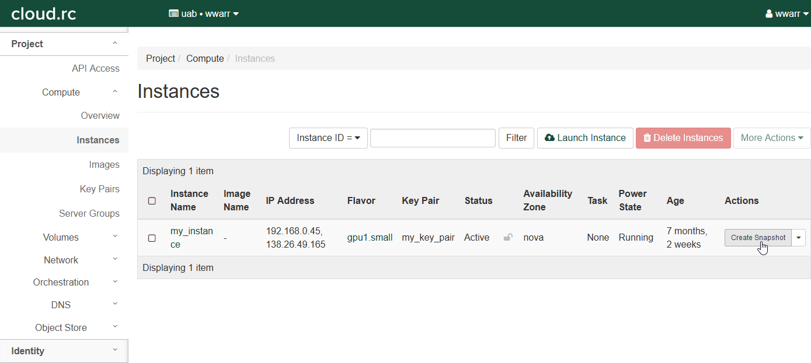

1. A dialog box will open. Fill in the "Snapshot Name" with a memorable name suitable for future reference, then click "Create Snapshot". See [Naming Conventions](index.md#naming-conventions).

    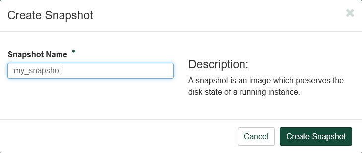

1. You will be taken to the "Images" page, where your new image will appear in its own row in the table.

    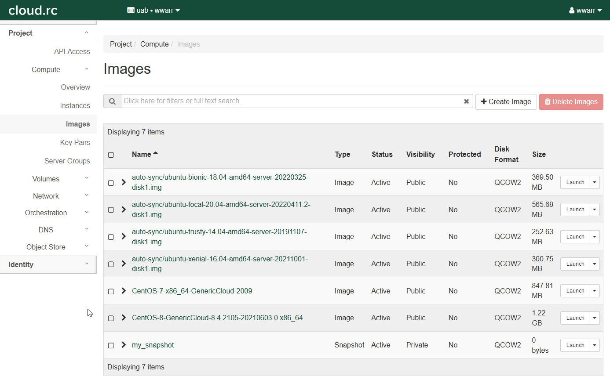

    <!-- markdownlint-disable MD046 -->
    !!! note

        Notice the image has a size of zero bytes, which is expected and does not affect the ability to create instances. Images are a convenience pointer to the underlying volume snapshot, so they have no size themselves. The underlying volume snapshot does have a fixed size. To see the size of the underlying volume snapshot, click "Volumes" and then "Snapshots" in the left hand navigation menu.
    <!-- markdownlint-enable MD046 -->

### Creating an Instance From an Image

To create an instance from an image, follow the directions below, assuming you have [Created an Image](#creating-an-image).

1. Navigate to "Compute" and then "Instances" in the left-hand navigation menu to open the "Instances" page.
1. Click the "Launch Instance" button.

    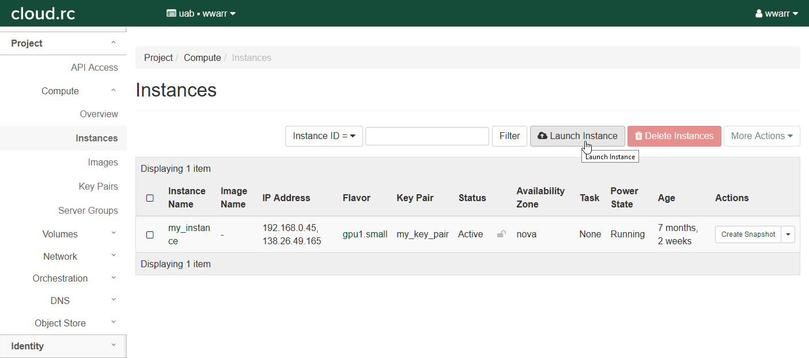

1. A dialog box will open. Follow the instructions at [Basic Instance Setup](tutorial/instances.md) until you get to the "Source" tab.
1. In the "Source" tab, select "Instance Snapshot" under the "Select Boot Source" drop down menu.

    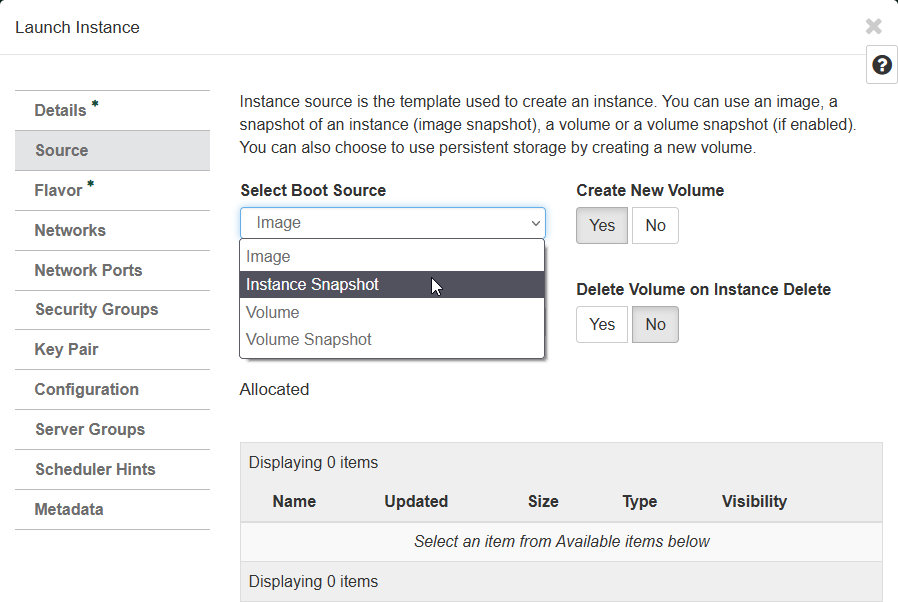

1. The "Available" table will change, and should contain your previously created instance snapshots.
1. Press the up arrow in the appropriate row of the "Available" table to move that instance snapshot to the "Allocated" table.

    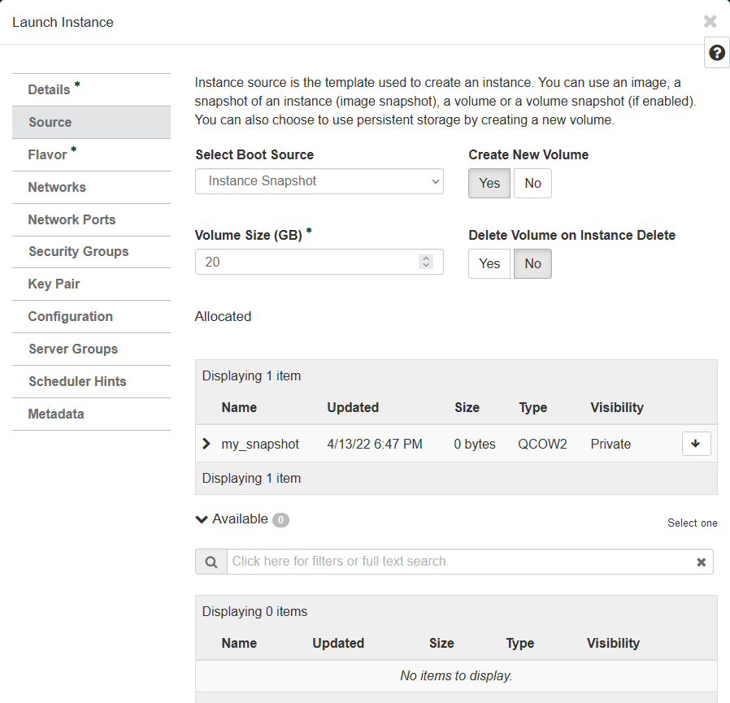

    <!-- markdownlint-disable MD046 -->
    !!! note

        On the "Flavor" tab, only flavors with large enough disk capacity to hold the snapshot will be allowed. Flavors that are too small will show a yellow triangular caution symbol. Examples are shown below for a 40 GB instance snapshot.

        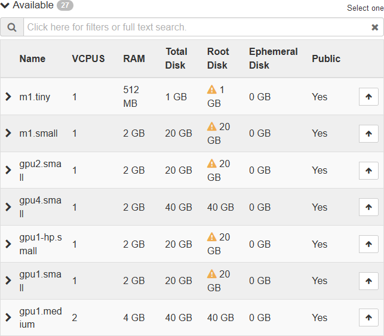
    <!-- markdownlint-enable MD046 -->

1. Continue following the instructions at [Basic Instance Setup](tutorial/instances.md) to start the instance.

### Deleting an Image

To delete an image, return to the "Images" page using the left-hand navigation pane. In the table, find the row with the image you wish to delete, and click the drop-down arrow under "Actions" in that row. Then click "Delete Image" to open a confirmation dialog.

Click "Delete Image" again to delete the image permanently.

<!-- markdownlint-disable MD046 -->
!!! important
    You will not be able to delete the image if it has an associated [volume snapshot](#volume-snapshots) or [volume](tutorial/volumes.md). They will need to be removed or deleted first.
<!-- markdownlint-enable MD046 -->

## Volume Snapshots

### Creating a Volume Snapshot

Volume snapshots are a helpful way to store the state of a volume for later use. They are used as the backing for [Images, or Instance Snapshots](#images-or-instance-snapshots), and have the same benefits. Most volume snapshots are created as part of an instance, but to create a volume snapshot directly please follow the steps below. We assume you are already logged in at [cloud.rc](index.md)

1. Navigate to "Volumes" and then "Volumes" in the left-hand navigation menu to open the "Volumes" page.
1. To take a snapshot of a particular volume, click the drop down menu under the "Actions" column in the row of the desired volume. Then click "Create Snapshot".

    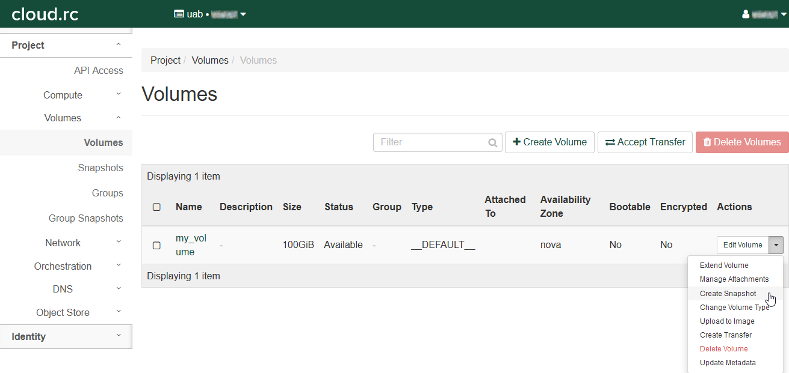

1. A dialog box will open. Fill in the "Snapshot Name" with a memorable name suitable for future reference, then click "Create Snapshot". See [Naming Conventions](index.md#naming-conventions).

    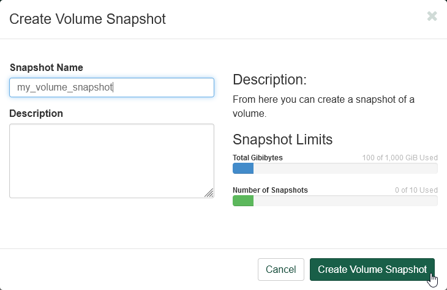

1. You will be taken to the "Volume Snapshots" page, where your new snapshot will appear in its own row in the table.

    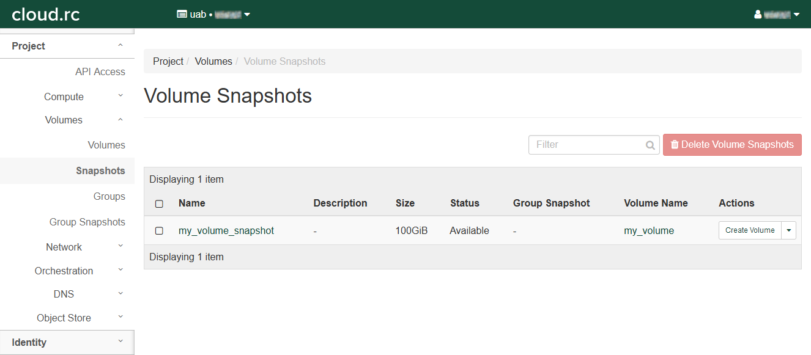

### Deleting a Volume Snapshot

To delete a volume snapshot, return to the "Volume Snapshots" page using the left-hand navigation pane. In the table, find the row with the volume snapshot you wish to delete, and click the drop-down arrow under "Actions" in that row. Then click "Delete Volume Snapshot" to open a confirmation dialog.

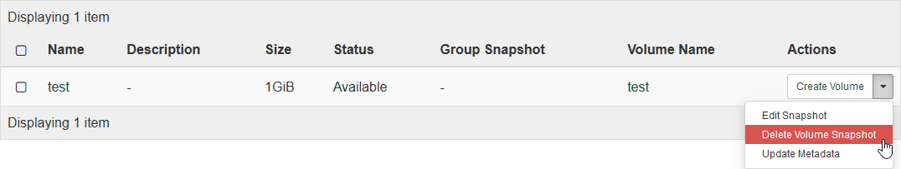

Click "Delete Volume Snapshot" again to delete the volume snapshot permanently.

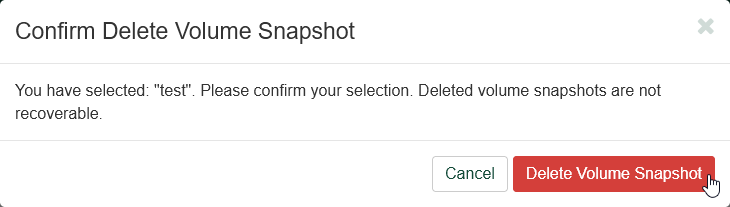
