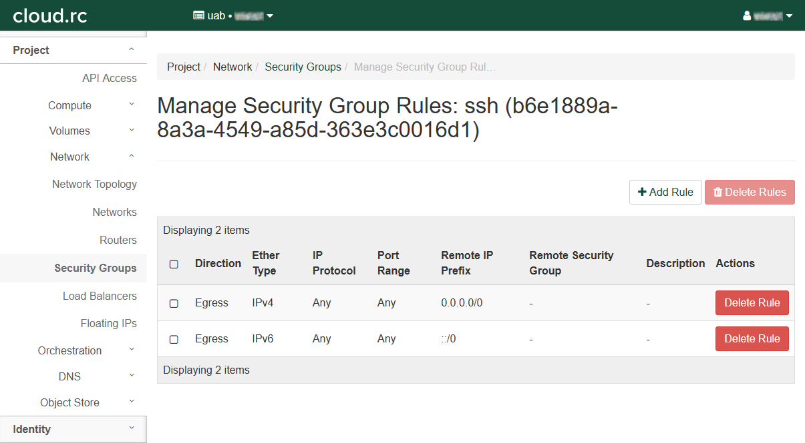
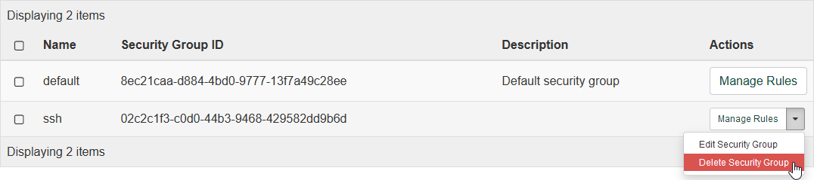
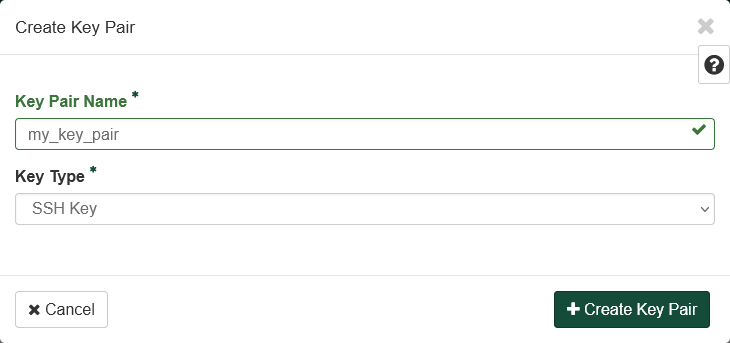
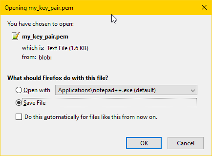

# Security Policy Setup and Tutorial

These instructions show you how to prepare to use SSH with your instances. At a minimum, an SSH security group and at least one key pair must be created. Other security groups can and should be added as needed for additional services.

<!-- markdownlint-disable MD046 -->
!!! important

    If you are viewing this page as part of the cloud.rc tutorial, please follow the steps in order from top to bottom. Ignore any sections on deleting or releasing resources unless you need to correct a mistake.
<!-- markdownlint-enable MD046 -->

<!-- markdownlint-disable MD046 -->
!!! note

    Virtual machines are disposable! If you get stuck at any point, or things don't seem like they're working as expected, etc., feel free to delete the instance and start over.
<!-- markdownlint-enable MD046 -->

## Creating a Security Group

Security Groups are used to set rules for how external devices can connect to your instances. Here we will create an SSH Security Group using a method that can be applied to other types of connections. Applications you develop may need other ports opened, so you may need to create additional security groups to handle those. Security groups may be reused across multiple instances.

1. Click "Networks" in the left-hand navigation pane to open the fold-out menu.

    

1. Click "Security Groups" in the fold out menu.

    

1. Click "+ Create Security Group" to open a dialog box.

1. Fill out the dialog box.

    1. Under "Name" enter `ssh`.
    1. Leave "Description" empty.

    

1. Click "Create Security Group".

    1. Redirects to the "Manage Security Group Rules: ssh" page.
    1. There should be an entry for "Egress IPv4" and "Egress IPv6". Leave these alone.

    

1. Click "+ Add Rule" to open a dialog box.

    1. Select "SSH" in the "Rule" drop down box. This will change the remaining fields.
    1. Leave "Description" empty.
    1. Select "CIDR" in the "Remote" drop down box.
    1. Type `0.0.0.0/0` in the "CIDR" box. For the sake of this tutorial, this value is fine. For properly securing virtual machines, see the "Warning" below for more information on better practice.

    

    <!-- markdownlint-disable MD046 -->
    !!! warning

        Using the value `0.0.0.0/0` for CIDR is short-hand for saying "All possible IP addresses". While cloud.rc is protected from external sources by the UAB firewall, using `0.0.0.0/0` does expose your virtual machine to all machines on the UAB internal network. Using the value `0.0.0.0/0` is the same as saying "I trust the UAB firewall to protect my VM, and I trust UAB faculty, staff and students to not harm my VM".

        Better practice is to limit the CIDR scope to only the IP address ranges that are relevant to your goals. As with all of cybersecurity, there is a security/convenience tradeoff to be made, and properly scoping CIDR will take more work than just using `0.0.0.0/0`. CIDR calculators are available on the internet to assist with calculation, just search for `CIDR Calculator`.
    <!-- markdownlint-enable MD046 -->

1. Click "Add".

    1. Redirects to the "Manage Security Group Rules: ssh" page.
    1. There should be a new entry in the table.

    

<!-- markdownlint-disable MD046 -->
!!! important

    If you plan to [Install Server Software](../installing_software.md#installing-server-software), you will need to revisit this section to set up additional security groups for server ports.
<!-- markdownlint-enable MD046 -->

## Deleting a Security Group

<!-- markdownlint-disable MD046 -->
!!! note

    Deleting Security Groups is not part of the tutorial, and is here as a reference.
<!-- markdownlint-enable MD046 -->

To delete a security group, return to the "Security Groups" page using the left-hand navigation pane. In the table, find the row with the security group you wish to delete, and click the drop-down arrow under "Actions" in that row. Then click "Delete Security Group" to open a confirmation dialog.

Click "Delete Security Group" again to delete the security group permanently.

## Creating a Key Pair

A Key Pair is required for SSH access to cloud.rc instances for security reasons. To use a Key Pair and SSH, you will need to [Install an SSH Client](../remote_access.md#install-an-ssh-client) on your local machine.

Key Pairs are security devices used to authenticate and connect to a remote machine, like Cheaha or cloud.rc instances, and use [Public-key cryptography](https://en.wikipedia.org/wiki/Public-key_cryptography) to encrypt the connection. As the name suggests, there are two parts: a public key which is placed on the remote machine, and a private key which is kept secret on your personal machine.

While key pairs can be reused between instances, we highly recommend using a new key pair with each instance to minimize risk if a private key becomes compromised. See [Good Practices](#good-practices) for more information.

There are a number of pitfalls and potential issues that can arise during this process. For information on these pitfalls and for more information on managing key pairs, see [Managing Keys](../remote_access.md#managing-keys).

There are two ways to create a key pair:

1. [Use the cloud.rc interface to generate a key pair remotely and download the private key file](#generating-a-key-pair-on-cloudrc).
1. [Use your personal computer to generate a key pair locally and upload the public key file.](#generating-a-key-pair-locally)

### Good Practices

Good practice is to only use one key pair per person and per local machine. So if you have two computers, each will need its own key pair. Using the same key pair for multiple machines means that they all become compromised when that key is compromised. Using different key pairs for each means only one machine becomes compromised.

If you have two people, each will need their own key pair. Private keys are secrets and should not be passed between people, because there is no way to control it once it has been shared with even one other person. Copying the key increases the risk of the system being compromised by an attacker. If the key has to be revoked, you revoke access for every user at once. If you must share access, create a key pair for each additional person to increase security and convenience.

Using a password protected Key Pair is highly recommended for additional security, as it buys time to [revoke a key pair](#revoking-a-key-pair) if it is compromised by an attacker. Currently, this is only possible by uploading a custom public key generated on your local machine.

### Generating a Key Pair on cloud.rc

1. Click "Compute" in the left-hand navigation pane to open the fold-out menu.

    

1. Click "Key Pairs".

    

1. Click "+ Create Key Pair" to open a dialog box.

1. Fill out the dialog box.

    1. Enter a "Key Pair Name". See [Naming Conventions](../index.md#naming-conventions).

    1. Select "SSH Key" in the "Key Type" drop down box.

        

1. Click "+ Create Key Pair"

    1. Opens a download file dialog box in your browser to download a file containing the secret private key. The file may have extension `.pem` or `.crt` depending on your operating system.
    1. Download the private key file. For security reasons this will be your only chance to ever obtain the private key from cloud.rc. If you lose this file you will have to generate a new Key Pair.

        

    1. Redirects to the "Key Pairs" page.
    1. There should be a new entry in the table.

        

1. To add the private key on your local machine please see "Add key" under [Add a Private Key](../remote_access.md#add-a-private-key).

### Generating a Key Pair Locally

To generate a key pair, see instructions located at [Generating Key Pairs](../remote_access.md#generating-key-pairs).

1. Click "Import Public Key" to open a dialog box.

1. Fill out the dialog box.

    1. Enter a "Key Pair Name". See [Naming Conventions](../index.md#naming-conventions).
    1. Select "SSH Key" in the "Key Type" drop-down box.
    1. Click "Browse..." to upload a public key file from your custom key pair **OR** copy-paste the content of that key file into the "Public Key" box.

    

<!-- markdownlint-disable MD046 -->
!!! danger

    Do not upload your private key file! The private key file must stay secret to ensure proper security, and it should never leave the computer it was generated on.
<!-- markdownlint-enable MD046 -->

### Using the Key Pair

Please see [SSH Into the Instance](instances.md#ssh-into-the-instance) for more information on using the Key Pair.

### Revoking a Key Pair

<!-- markdownlint-disable MD046 -->
!!! note

    Revoking Key Pairs is not part of the tutorial, and is here as a reference.
<!-- markdownlint-enable MD046 -->

Revoking a key pair from cloud.rc is simple. First, log on to the interface.

1. Click "Compute" in the left-hand navigation pane to open the fold-out menu.

    

1. Click "Key Pairs".

    

1. Find the key pair you wish to revoke and click the "Delete Key Pair" button in that row.

1. Optionally, [Remove the Private Key](../remote_access.md#remove-a-private-key) from your local machine. This step is not necessary to ensure security, but can help maintain a clean environment.

## Continuing the Tutorial

Now that you've set up a [Network](networks.md) and [Security Policies](security.md), you're ready to create a virtual machine (VM) [Instance](instances.md) to work with. To continue the tutorial, please visit [Instances](instances.md) next.
