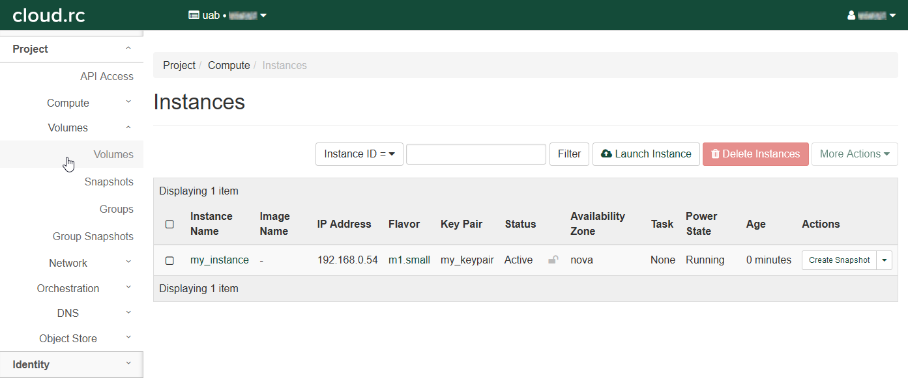
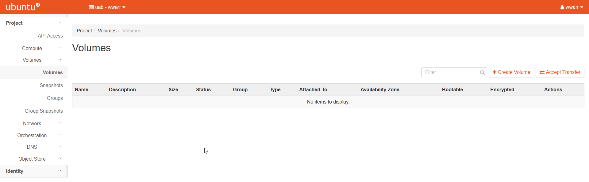
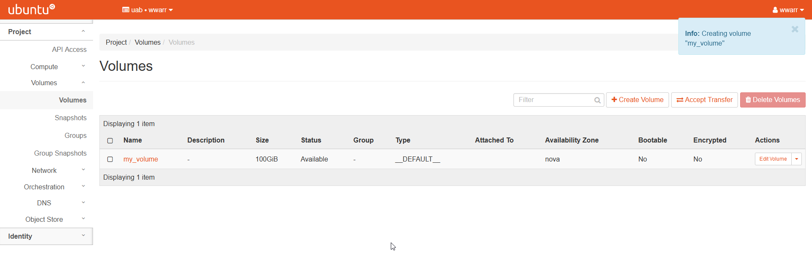
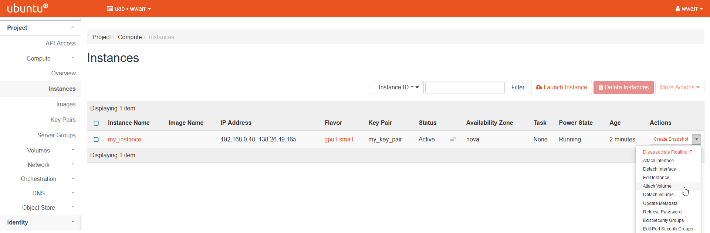
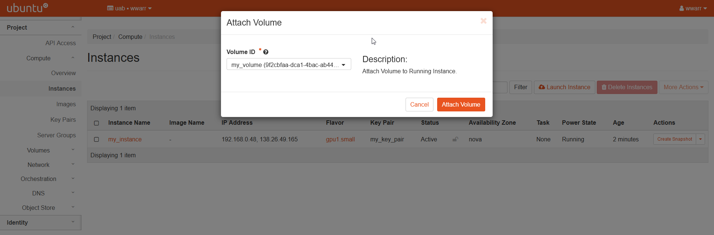
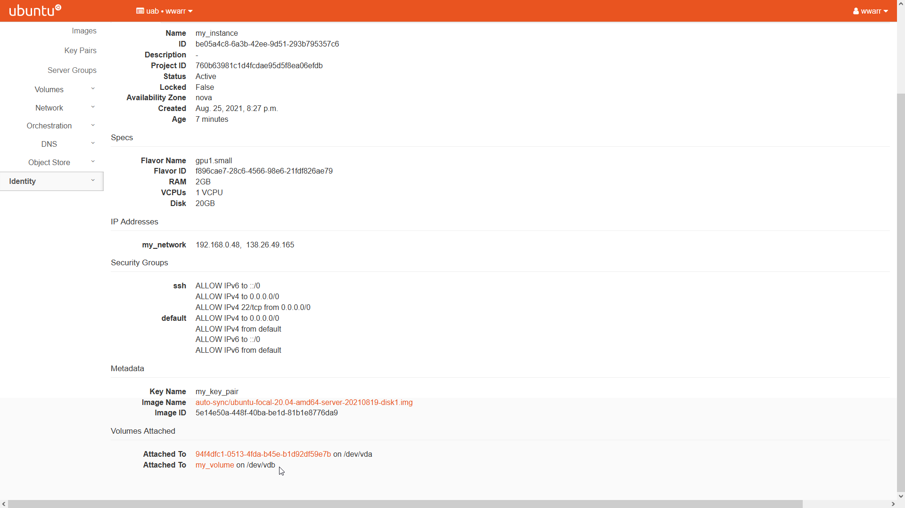
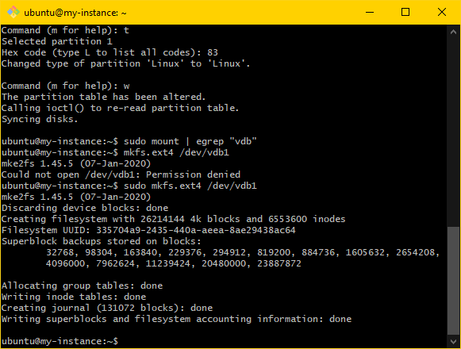

# Basic Volume Setup

These instructions are intended for users who want to setup a persistent volume for use across instances. To follow these instructions you'll need to have already setup an [Instance](instance_setup_basic.md).

## Creating a Volume

1. Click the "Volumes" fold-out in the left-hand navigation pane - the fold-out should open.

    

    

2. Click "Volumes" within the fold-out to open the "Volumes" table page.

    

3. Click "+ Create Volume" to open a dialog box.

4. Fill out the dialog box.

    1. Enter a "Volume Name".
    2. Enter a "Description".
    3. Select "No source, empty volume" in the "Volume Source" drop-down box to create an empty volume.
    4. Select "\_\_DEFAULT\_\_" in the "Type" drop down box.
    5. Select a size in GB appropriate for your needs.
    6. Select "nova" in the "Availability Zone" drop down box.
    7. Select "No group" in the "Group" drop down box.

    

    

5. Click "Create Volume"

    1. Returns to the "Volumes" table page.
    2. There will be a new entry in the "Volumes" table.

        

## Attaching a Volume to a Running Instance

To attach a volume you must have already created at least one using the OpenStack interface. More information can be found in \[link\]

1. Open the instances table by clicking "Compute" in the left-hand navigation pane and clicking "Instances".

2. In the "Actions" column entry, click the drop down triangle button and select "Attach Volume".

    

    

3. A dialog box will open.

4. Select a volume in the "Volume ID" drop down box.

    

    

5. Click "Attach Volume".

Now the volume should be attached to the instance. From here you may format the volume and mount it.

## Formatting a Volume

To format a volume, you must have created a volume and attached it to an instance capable of formatting it correctly. These instructions assume a Linux operating system.

1. Click "Compute" in the left-hand navigation pane, then open the "Instances" menu. Click the name of any instance you wish to use to format the volume. Then click "Overview".

2. Scroll down to "Volumes Attached" and make note of the `<mount>` part of `<volume-name> on <mount>` for your attached volume as it will be used in later steps.

    

    

3. SSH into the instance from your local machine or from Cheaha.

4. Verify the volume is attached by using `sudo fdisk -l | egrep "<mount>""`

    

5. Format the volume using `sudo fdisk "<mount>"`

    1. You will be in the `fdisk` utility.
    2. Enter `n` to create a new partition.
    3. Enter `p` to make it the primary partition.
    4. Enter numeral `1` to make it the first partition.
    5. Press enter to accept the default first sector.
    6. Press enter to accept the default last sector.
    7. Enter `t` to change partition type.
    8. Enter numerals `83` to change to Linux partition type.
    9. Enter `p` to display the partition setup. Note that the partition will be labeled `<mount>1`. This literally whatever `<mount>` was from earlier followed by the numeral `1`. Further steps will refer to this as `<pmount>`
    10. Enter `w` to execute the setup prepared in the previous substeps.

    

6. Verify the volume is not mounted using `sudo mount | egrep "<mount>"`. If there is no output, then move to the next step. If there is some output then use `sudo umount -l "<mount>"` to unmount the volume and verify again.

    

7. Create the filesystem using `sudo mkfs.ext4 "<pmount>"`. Ensure that the output looks like the following:

    ```bash
    ubuntu@my-instance:~$ sudo mkfs.ext4 /dev/vdb1
    mke2fs 1.45.5 (07-Jan-2020)
    Discarding device blocks: done
    Creating filesystem with 26214144 4k blocks and 6553600 inodes
    Filesystem UUID: 335704a9-2435-440a-aeea-8ae29438ac64
    Superblock backups stored on blocks:
          32768, 98304, 163840, 229376, 294912, 819200, 884736, 1605632, 654208,
          4096000, 7962624, 11239424, 20480000, 23887872
    
    Allocating group tables: done
    Writing inode tables: done
    Creating journal (131072 blocks): done
    Writing superblocks and filesystem accounting information: done
    ```

    

The volume is now formatted and ready for mounting within an attached instance OS. You will need to make note of `<pmount>` for when you are ready to mount the volume to an instance.

## Mounting a Volume in an Instance

Mounting a volume needs to be done once per instance it will be attached to. It is assumed you've already created and formatted a volume and attached it to some instance. You'll need the `<pmount>` label from when you formatted the volume.

1. SSH into the instance from your local machine or from Cheaha.

2. Obtain the uuid of the volume using `sudo blkid | egrep "<pmount>"`. This will be referred to as `<uuid>` in future steps.

    

3. Create a directory to mount the volume as. A good choice is `sudo mkdir /mnt/<volume-name>` where `<volume-name>` is something meaningful for you or your project. This directory will be referred to as `<directory>` in future steps.

4. Mount the volume to the directory using `sudo mount -U <uuid> <directory>`.

5. Verify the volume is mounted using `df -h | egrep <pmount>`

    <!-- markdownlint-disable-next-line MD033 -->
    

6. Edit the `fstab` file to make mounting persistent across instance reboots.

    1. Edit the file using `sudo nano /etc/fstab`.
    2. Add the following line to the file:

    ``` bash
    /dev/disk/by-uuid/<uuid> <directory> auto defaults,nofail 0 3
    ```

    

7. Verify _fstab_ was modified correctly by soft rebooting the instance and verifying the mount again using `df -h | egrep "<pmount>"`.

    

8. Set access control using the following commands:

    ``` bash
    sudo apt install acl # or yum install, etc., if not already installed
    sudo setfacl -R -m u:<username>:rwx <directory>
    ```

    

9. Verify the access controls were modified correctly by creating a test file and then listing files in `<directory>` to ensure the file was created. The following commands will achieve this:

    ``` bash
    cd <directory>
    touch testfile
    ls
    ```

    

The volume is now mounted to your instance and ready for use and re-use across sessions and reboots.
