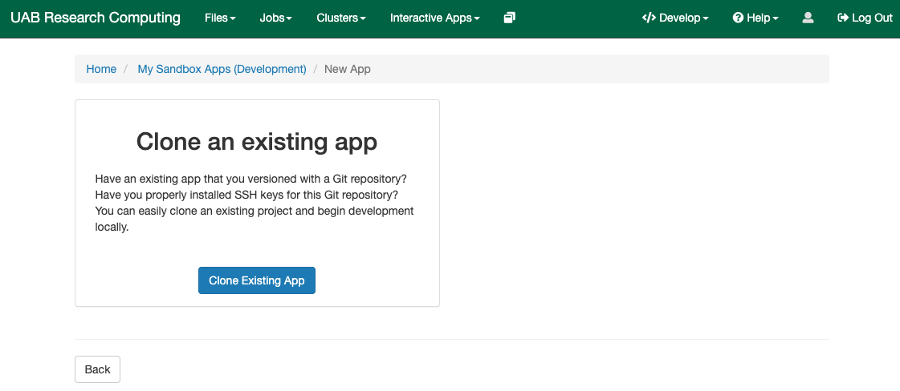
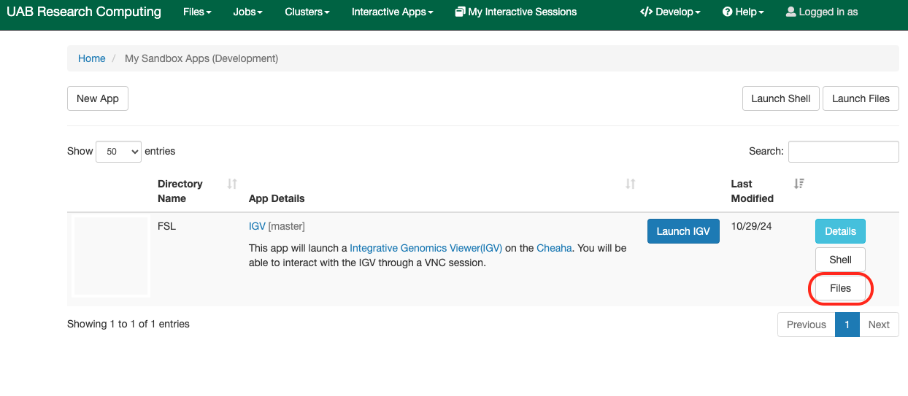
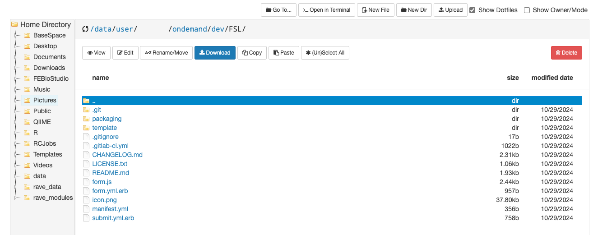

# Open OnDemand

[Open OnDemand](https://rc.uab.edu) (OOD) is the web interface to Cheaha HPC resources. We have setup multiple general purpose apps, such as HPC Desktop, Jupyter Notebook, JupyterLab, RStudio etc, on Cheaha, to make the process of accessing these basic softwares easier. OOD also allows users to setup their own personal applications, as Sandbox apps.

This article will walk you through how to set up an OOD Sandbox app. For ease of understanding, the article is split into the following sections:

1. [Setting up OOD Sandbox for your Cheaha Account](#setting-up-ood-sandbox-for-your-cheaha-account)
1. [Building your first dev app](#building-your-first-dev-app)
   - Tutorial: [FSL](#fsl)
1. [Launching your OOD Sandbox App](#launching-your-ood-sandbox-app)
1. [More info](#more-info)

## Setting Up OOD Sandbox for Your Cheaha Account

The following steps will guide you to set up Sandbox for your Cheaha account.

<!-- markdownlint-disable MD046 -->
!!! note
    This is a one time setup, and will not need to be repeated for subsequent apps you would like to create.
<!-- markdownlint-enable MD046 -->

Create a dev folder in your `$USER/ondemand` folder by following these steps:

1. Create an HPC Desktop Interactive Job on Cheaha. [Please see our detailed guide](../cheaha/open_ondemand/ood_layout.md#creating-an-interactive-job) for details on how to do this.

1. Access the terminal within your HPC Desktop Job. [Please see our guide on how to access the terminal](../cheaha/tutorial/pytorch_tensorflow.md#installing-anaconda-environments-using-the-terminal) for details on how to do this.

    

1. Create the folder within the terminal using the command `mkdir -p $USER_DATA/ondemand/dev`.

1. Go to the [Cheaha](https://rc.uab.edu) Open OnDemand homepage.

1. When logged in, click on the "Help" button, you should see the button in the top-right corner of the landing page of Cheaha, click on "Restart Web Server".

    

1. When the page reloads, you should see a new "Develop" tab.

    

## Building Your First Dev App

Now that Sandbox is set up on your account, the next step is to create an App. Follow the instructions in the subsection below to create the FSL application using a container. If there are additional options or applications you’d like to explore, refer to the appropriate sections below.

### FSL

This example using the FSL (FMRIB Software Library) App, shows how to create a simple Sandbox App on Cheaha.

1. Under the "Develop" tab , click on "My SandBox Apps (Development)"

    

1. Clicking the "New App" button should direct you to a new page giving you an option to Clone an Existing App.

    

    <!-- markdownlint-disable MD046 -->
    !!! note
        You can ignore the message "No SSH key was found. You will need to generate a locally installed SSH key to clone the git repo using SSH" since you can clone the repo using https. The warning would apply if you would like to clone the repo using SSH's authentication.
    <!-- markdownlint-enable MD046 -->

1. Now import the already existing git repo for an app by clicking on the "Clone Existing App". A form (shown below) requiring your input will display. For the FSL App we will use a template we already created (you can use this template to prepare your app as well).

    

    We will add the following values in the form:
    - **Directory Name:** FSL
    - **Git Remote:** `https://code.rc.uab.edu/rc/bc_uab_igv.git`
    After completing the above steps, then click "**Submit**"

1. When this is done successfully, you should see the below screen also showing your new FSL Sandbox App.
    

    <!-- markdownlint-disable MD046 -->
    !!! note
        You can also check the option "Create a new Git Project from this?", about creating a new git repo, if you want to use it to maintain your own instance of the app. In this tutorial, we will not be selecting this option.
    <!-- markdownlint-enable MD046 -->

1. Click on "Files" to take a look at the app files (local git repo working directory) you just cloned. We will modify some of the files here, because its contents are not relevant to FSL.

    

    1. We first modify "manifest.yml" file (highlight the file, and click on edit) to change metadata for the sandbox app. Change the variables appropriately. In this case we will change the following:

        

    1. Next, select "form.yml.erb" and click on "Edit" . Replace the content of this file with the .yml file below. Here we are specifying what the form for the app is going to look like.

    <!-- markdownlint-disable MD046 -->
    !!! note
        In this tutorial we used the OOD file editor to make changes to the files, but you will be better served to use an IDE like VSCode to efficiently edit the files you have to make changes to.
    <!-- markdownlint-enable MD046 -->

    ``` yaml

            <%-
        partitions = OodAppkit.clusters[:SLURM_CLUSTER].custom_config[:partitions]
        -%>
        ---
        cluster: "SLURM_CLUSTER"
        attributes:
        bc_num_hours:
            value: 1

        bc_num_slots:
            widget: "number_field"
            label: Number of CPU
            value: 1
            min: 1
            max: 24
            step: 1

        bc_num_mems:
            widget: "number_field"
            label: Memory per CPU (GB)
            value: 4
            min: 1
            max: 128
            step: 1

        bc_num_gpus:
            widget: "number_field"
            label: Number of GPUs
            value: 1
            min: 0
            max: 4
            step: 1

        bc_partition:
            widget: select
            label: Partition
            options:
            <%- partitions.each do |p| -%>
            - [ "<%= p %>", "<%= p %>" ]
            <%- end -%>

        version:
            widget: select
            label: "FSL version"
            help: "This defines the version of FSL you want to load."
            options:
            - [ "6.0.3", "FSL/6.0.3" ]

        form:
        - version
        - bc_num_hours
        - bc_partition
        - bc_num_gpus
        - bc_num_slots
        - bc_num_mems
        - bc_email_on_started

    ```

1. Next, we edit the "script.sh.erb" file. This file can also be found in the "template" folder. Edit this file by adding the lines below to the end of the file. This is the actual job script that will be submitted to the cluster, just like you would submit a job with "sbatch" from the command line.

    ``` YAML
    module load FSL/6.0.3
    source /share/apps/rc/software/FSL/6.0.3/fsl/etc/fslconf/fsl.sh
    fsl
    ```

Save the file, and close the tab. This script runs the app executable after loading the appropriate module, based on the version you choose in the form.


### Launching Your OOD Sandbox App

Click on Launch FSL, and submit the job with desired parameters. You should have your first dev app (FSL) running.


### More Info

[Contact us](../index.md#how-to-contact-us) if you run into any issues, or to discuss any new app.
