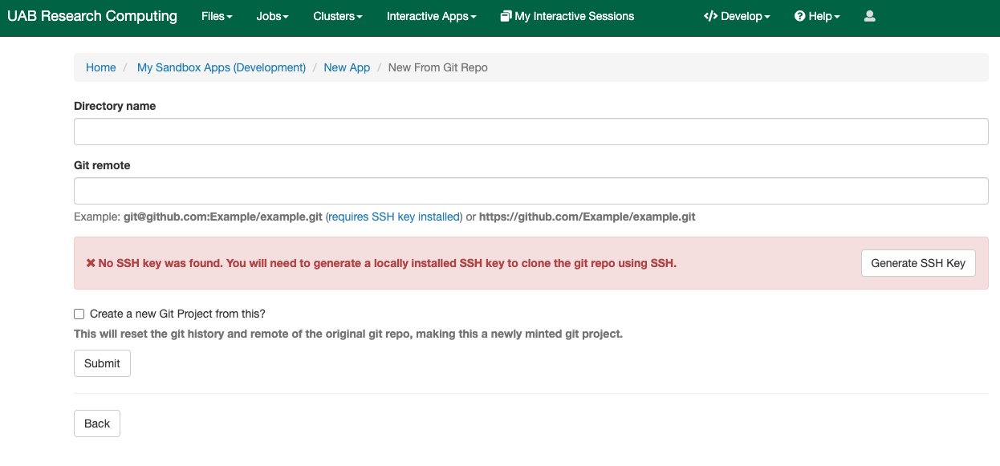
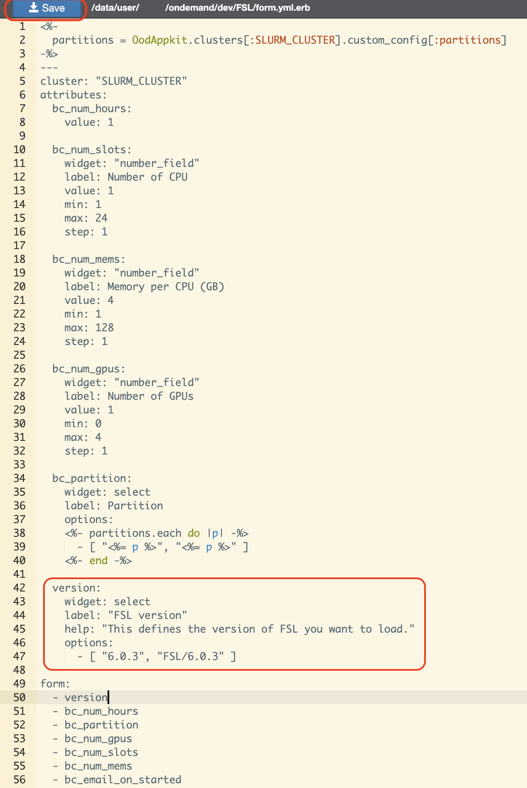

# Open OnDemand

[Open OnDemand](https://rc.uab.edu) is the web interface to Cheaha HPC resources. We have setup multiple general purpose apps, such as HPC Desktop, Jupyter, RStudio etc, on Cheaha, to make the process of accessing these basic softwares easier. OnDemand also allows users to setup their own personal applications, as Sandbox apps.

This article will walk you through how to set up a Sandbox app. For ease of understanding, the article is split into the following sections:

1. [Setting up Sandbox for your Cheaha Account](#setting-up-sandbox-for-your-cheaha-account)
1. [Building your first dev app](#building-your-first-dev-app)
   - [FSL](#fsl)
1. [Launching your Sandbox App](#launching-your-sandbox-app)
1. [More info](#more-info)

## Setting up Sandbox for your Cheaha Account

The following steps would guide you to set up Sandbox for your Cheaha account.

You need to create a dev folder in your `$USER/ondemand` folder by following these steps:

1. Create a HPC Desktop Interactive Job on Cheaha. There is a detailed guide [here](../cheaha/open_ondemand/ood_layout.md#creating-an-interactive-job) on how to do this.

1. Access the terminal within your HPC Desktop Job. There is a guide on how to access the terminal [here](../cheaha/tutorial/pytorch_tensorflow.md#installing-anaconda-environments-using-the-terminal)

    

1. Create the folder within the terminal using the command `mkdir -p $USER_DATA/ondemand/dev`.

1. Go to the [Cheaha](https://rc.uab.edu) Open OnDemand homepage.

1. When logged in, click on the "Help" button, you should see the button in the top-right corner of the landing page of Cheaha, click on "Restart Web Server".

    

1. When the page reloads, you should see a new "Develop" tab have successfully enabled Sandbox for your environment, and you should see a new "Develop" tab.

    

<!-- markdownlint-disable MD046 -->
!!! note

    This is a one time setup, and would not need to be repeated for subsequent apps you would like to create.
<!-- markdownlint-enable MD046 -->

## Building your first dev app

Now that Sandbox is set up on your account, we can create an App. The instructions below detail how to create your first example dev app via a container:

### FSL

This example using the FSL (FMRIB Software Library) shows how to create a simple Sandbox App on Cheaha.

1. Under "Develop" tab , click on "My SandBox Apps (Development)"

    

1. Clicking the "New App" button, should direct you to a new page giving you an option to Clone an Existing App.

    

1. Now we are going to import an already existing git repo for an app, by clicking on the "Clone Existing App". A form (shown below) requiring your input will display. For the FSL App we will use a template we already created (you can use this template to prepare your app as well).

    

    We will add the following values in the form:

    **Directory Name:** FSL

    **Git Remote:** <https://gitlab.rc.uab.edu/rc/bc_uab_igv.git> and then click "**Submit**"

    When this is done successfully, you should see the below screen also showing your new FSL Sandbox App.
    

    <!-- markdownlint-disable MD046 -->
    !!! note

        You can also check the option "Create a new Git Project from this?", about creating a new git repo, if you want to use it to maintain your own instance of the app. In this tutorial, we would not be selecting this option.
    <!-- markdownlint-enable MD046 -->

1. Now click on "Files" to take a look at the files for the app (local git repo working directory), that you just cloned. We will modify some of the files, as you will notice the cloned app, provides a context and environment not relevant to FSL.

    

    1. We first modify "manifest.yml" file (highlight the file, and click on edit) to change metadata for the sandbox app.
       Change the variables appropriately. In this case we will change the following:

        

    1. Next, select "form.yml.erb" and click on "Edit" . Uncomment version section in the file, and change that section as follows:
  version:
    widget: select
    label: "FSL version"
    help: "This defines the version of FSL you want to load."
    options:
      - [ "6.0.3", "FSL/6.0.3" ]
and save the file, and close the tab.

        

    Here we are specifying what the form for the app is going to look like, and changing available parameters for Cheaha.

1. Next we edit the "script.sh.erb", this file can be found in the "template" folder. by adding following lines at the end of the file. This is the actual job script that will be submitted to the cluster, just like you would submit with sbatch from the command line.

    ``` bash
    module load FSL/6.0.3
    source /share/apps/rc/software/FSL/6.0.3/fsl/etc/fslconf/fsl.sh
    fsl
    ```

Save the file, and close the tab. This script runs the app executable after loading the appropriate module, based on the version you choose in the form.


### Launching your Sandbox App

Click on Launch FSL, and submit the job with desired parameters. You should have your first dev app (FSL) running.


### More info

[Contact us](../index.md#how-to-contact-us) if you run into any issues, or to discuss any new app.
