# Software Containers

Containers help to manage software installations and all their dependencies in a single large image. These containers are a self-contained operating system along with any software the container creator added. Containers avoid software conflicts due to versioning as well as OS incompatibility and can be run on most, if not all, operating systems.

The most common container engine is called Docker. Docker is an open-source platform for building, deploying, running, updating, and managing containers and has distributions for Linux, Windows, and Mac. Singularity is another common container engine specialized for use on HPC systems such as Cheaha where Docker cannot be used.

## Fantastic Containers and Where to Find Them

Docker containers are available in <https://hub.docker.com/>. This docker hub repository allows to share containers and use pre-existing docker images.

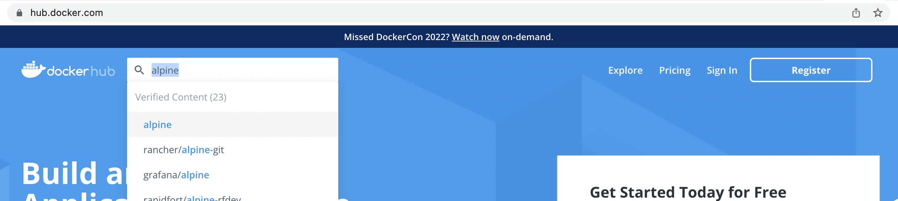

It is often a good idea to search the Github repo for an application or pipeline to see if a container has already been provided by the authors.

## Containers on Cheaha

Using containers on Cheaha bypasses the need to message support to install necessary software. Containers can be downloaded by any user into their personal space and used immediately without admin permission. as mentioned above, you will need to use Singularity containers on Cheaha. You can find all of the Singularity modules using the following command:

``` bash
module spider Singularity
```

It's highly recommended to only use Singularity versions 3+.

### Pull Singularity Images

Singularity can pull images from a variety of sources, including Dockerhub, and convert them to the proper format automatically. In order to download an image, use the `pull` subcommand followed by the output image name and the URI of the image. The general form of the command for pulling from Dockerhub is as follows:

``` bash
singularity pull <output.sif> docker://<account>/<image>[:<version_tag>]
```

For example, if we wanted to pull the [lolcow container](https://hub.docker.com/r/godlovedc/lolcow):

``` bash
singularity pull lolcow.sif docker://godlovedc/lolcow
```

We now have the `lolcow.sif` image we can run or share with other researchers. It's important to remember that containers are just independent files that can be moved, copied, or deleted the same as any other file.

### Running Singularity Images

There are 3 ways to run Singularity images, all with their unique purposes and are as follows:

1. `singularity run`: run a container using a default command set by the author. Generally, this will be used when a container encompasses a full pipeline controlled by a single command. The general form for this command is `singularity run <image.sif> [options]` where `[options]` are defined by the default command. You can use `singularity run <image.sif> --help` to see what those options are.
1. `singularity exec`: run any command available in the container. This provides more flexibility than `run` and would be useful in the cases where a container has more modular components as opposed to a single control script. The general form for this would be `singularity exec <image.sif> <command> [options]`. You can add the `--help` option to see what a given command does and its inputs.
1. `singularity shell`: allow interactive use of the container through the terminal. This changes your active environment to that in the container. You can traverse the container's directory tree and search for various files and commands as if it was a virtual machine. This is very useful for interactive development as well as investigation of a container's contents. The general form of the command is `singularity shell <image.sif>`.

It's important to note that both `run` and `exec` enter the container as part of their execution and then exit back to the original shell environment afterwards whereas `shell` keeps you in the container until you either close the terminal or use the `exit` command.

<!-- markdownlint-disable MD046 -->
!!! important

    `singularity shell` is not executable via shell scripts. Any singularity commands in a batch script should be `run` or `exec` instead.
<!-- markdownlint-enable MD046 -->

### Singularity Paths

By default, Singularity containers have limited access to the general filesystem. Containers get default access to the `/home` directory as well as the directory the container was run from. If you run the container from `$HOME` but try to access files in `$USER_DATA`, you will see an error. In order to give a container access to other directories, use the `-B` or `--bind` option when invoking the container. For instance, if I wanted to use `run` on a container that had an input option called `-i` and give the container access to a subfolder called `my_data` in a project space called `UABRC`, the singularity command would look like:

``` bash
singularity run --bind /data/project/UABRC/my_data image.sif -i /data/project/UABRC/my_data
```

You can also alias the bind path to a shorter name and use it in the command. In that case, the bind option would look like `--bind </directory_path>:</alias>`. For example, if I was running a container and was giving the `my_data` directory as an input, I could alias it to `/input_data` and use it in the command like so:

``` bash
singularity run --bind /data/project/UABRC/my_data:/input_data image.sif -i /input_data
```

These bind paths can be used in both `exec` and `shell` subcommands as well.

<!-- markdownlint-disable MD046 -->
!!! note

    Bind paths cannot grant access to folders and files your account does not have access to. For instance, you cannot use a container to access data in another user's account unless that user has explicitly given you the correct permissions via `chmod` or ACLs.
<!-- markdownlint-enable MD046 -->

## Using Containers on UAB RC Cloud (cloud.rc.uab.edu)

To access docker containers, install `Docker` in your system. To install docker desktop on your computer, follow this link: [Docker Desktop Page](https://www.docker.com/products/docker-desktop/).

### Docker Installation on UAB RC Cloud

Following are the installation instructions to install `Docker` on UAB RC Cloud with Ubuntu operating system. Tested the installation on Ubuntu 20.04. Setting up UAB RC Cloud account can be found in [UAB RC Cloud](../uab_cloud/index.md).

```bash
sudo apt-get update
sudo apt install docker.io
```

### Using a Docker Container From DockerHub

We can start pulling a container named `alpine` from the Docker hub. `alpine` is a general-purpose Linux distribution. Look for the container `alpine` in the docker hub, copy the pull command, and paste it into your terminal.

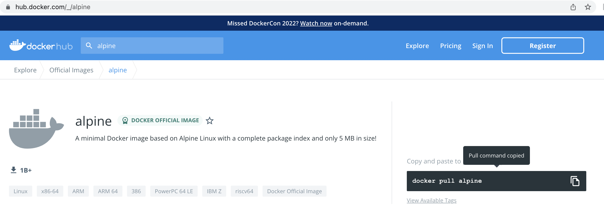

```bash
sudo docker pull alpine
```

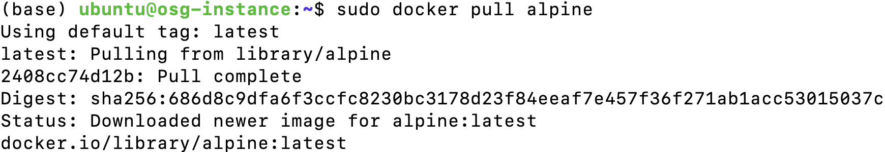

Once the image is pulled, you can verify if the image exists using the below command. Note that if you do not specify the tag/version of the container, the recent version is built, and the tag is listed as `latest`.

```bash
sudo docker images
```

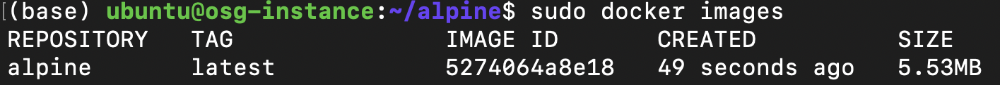

If you prefer to pull a particular version of the `alpine` container, you need to mention the tag details in your pull command. You can see the available tags/versions of `alpine` from the Docker hub.

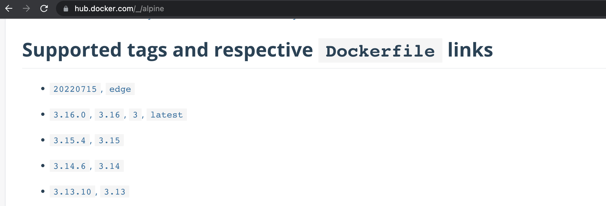

To pull particular version of `alpine` container, use the below syntax.

```bash
sudo docker pull container_name:tag
```

Here the `container_name` is `alpine`, and the tag is `3.14`.

```bash
sudo docker pull alpine:3.14
```

The existing image looks like,

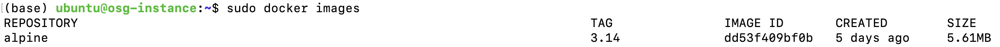

## Create Your Own Docker Container

You can create your own Docker container, build it, and upload/share them in the Docker hub or UAB GitLab container registry.

Let us take a synthetic python code and formulate the packages/dependencies required to build your software container. Below is a python script that requires packages, namely, numpy, scipy, and matplotlib. Next, the steps to create a `Dockerfile` is illustrated. Let us name this script `python_test.py`.

```bash
import numpy as np
import matplotlib
import pylab
import matplotlib.pylab as plt
import scipy.integrate as integrate

a = np.array([0, 10, 20, 30, 40])
print(a)

b = np.arange(-5, 5, 0.5)
print(b)

t = np.arange(0,20.5,0.5)
print(t)

result = integrate.quad(np.sin, 0, np.pi)
print(result)

plt.plot([1, 2, 3, 4], [1, 4, 9, 16])
plt.show()
plt.savefig('testing.png')
```

### Create a Dockerfile That Has Miniconda Installed

We require numpy, scipy, and matplotlib libraries to execute the above Python script. Following are the steps to create a specification file and build a container image.

1. Create an empty directory `miniconda`.

    ```bash
    mkdir miniconda
    ```

1. Create a `Dockerfile` within the `miniconda` directory with the following contents. The file name `Dockerfile` is case-sensitive.

    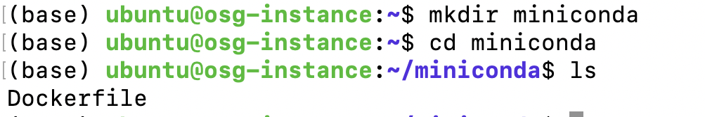

    ```bash
    # You may start with a base image
    # Always use a specific tag like "4.10.3", never "latest"!
    # The version referenced by "latest" can change, so the build will be
    # more stable when building from a specific version tag.
    FROM continuumio/miniconda3:4.12.0

    # Use RUN to execute commands inside the miniconda image
    RUN conda install -y numpy">=1.16.5, <1.23.0"

    # RUN multiple commands together
    # Last two lines are cleaning out the local repository and removing the state
    # information for installed package
    RUN apt-get update \
    && conda install -y scipy=1.7.3 \
    && conda install -y matplotlib=3.5.1 \
    && apt-get --yes clean \
    && rm -rf /var/lib/apt/lists/*
    ```

    This is the specification file. It provides Docker with the software information, and versions, it needs to build our new container. See the Docker Container documentation for more information <https://docs.docker.com/reference/dockerfile/>.

    In the Dockerfile, we start with an existing container `continuumio/miniconda3:4.12.0`. This container is obtained from Dockerhub; here, `continuumio` is the producer, and the repo name is `continuumio/miniconda3`.

    

    You may specify the required version from the `Tag` list. Here the tag/version is `4.12.0`. Also its a very good practice to specify the version of packages for numpy, scipy, and matplotlib for better reproducibility.

    !!! note "Containers and Reproducibiliy"
        Always include version numbers for Anaconda, package managers, software you are installing, and the dependencies for those software. Containers are not by nature scientifically reproducible, but if you include versions for as much software in the container as possible, they can be reproducible years later.

1. To build your container, change the directory to `miniconda` and use the below syntax to build the `Dockerfile`. Here we use `.` to say "current directory." This will only work if you are in the directory with the `Dockerfile`.

    ```bash
    sudo docker build -t repository_name:tag .
    ```

    Here the repository_name is `py3-miniconda` and the tag is `2022-08`.

    ```bash
    cd miniconda
    sudo docker build -t py3-miniconda:2022-08 .
    ```

    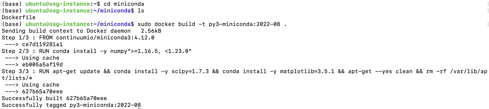

!!! note
    The `.` at the end of the command! This indicates that we're using the current directory as our build environment, including the Dockerfile inside. Also, you may rename the `repository_name` and `tag` as you prefer.

```bash
sudo docker images
```

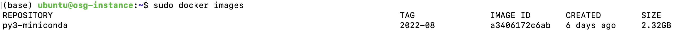

### Running the Built Miniconda Docker Container Interactively

To run docker interactively and execute commands inside the container, use the below syntax. Here `run` executes the command in a new container, and `-it` starts an interactive shell inside the container. After executing this command, the command prompt will change and move into the bash shell.

```bash
sudo docker run -it repository_name:tag /bin/bash
```

To execute your container `py3-miniconda` interactively, run this command with the tag `2022-08'.

```bash
sudo docker run -it py3-miniconda:2022-08 /bin/bash
cd /opt/conda/bin/
```

The `python` executables to execute our synthetic python script are within the directory structure `/opt/conda/bin`.


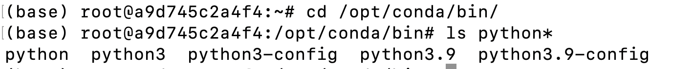

### Mounting Data Onto a Container

Before we mount data onto a container, remember you initially created the python script `python_test.py` when creating your own container. Move `python_test.py` within `miniconda` directory. Now you have your `miniconda/python_test.py` outside the container. To access the files outside the container you should mount the file path along with the `docker run` command.


To mount a host directory into your docker container, use the `-v` flag.

```bash
sudo docker run -v /host/directory/:/container/directory  -other-options
```

So the command for our example will be,

```bash
sudo docker run -v /home/ubuntu/:/home  -it py3-miniconda:2022-08 /bin/sh
```

Here we are mounting the $HOME directory `/home/ubuntu` from a host into containers' $HOME directory. Note that you may mount a particular directory according to your preference. The following shows the list of files in containers' $HOME directory with and without mounting.

Before mounting, there are no files found within the $HOME directory.

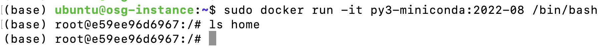

After mounting using `-v` flag, files show up within the $HOME directory. The highlighted `miniconda` is our working directory with python script.


We can now execute the script, python_test.py using this command.

```bash
python python_test.py
```

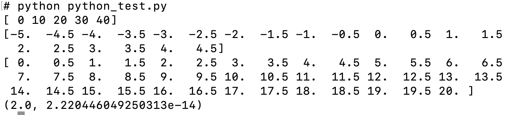

More lessons on Docker can be found in this link: [Introduction to Docker](https://christinalk.github.io/docker-introduction/) and [Docker Documentation](https://docs.docker.com/reference/dockerfile/).

## How to Access and Use Community Containers in the GitLab Container Registry

In the UAB Research Computing [GitLab instance](../account_management/gitlab_account.md#uab-gitlab-registration), we provide prebuilt community containers. These containers are standardized environments that grant you access to a variety of software tools. In the sections below we share information for what you will find in the gitlab community container project, and how you can access them.

### Software We Support in Building Community Containers

We provide community containers that cover a broad range of software to support your research needs. In general, the containers we have in our container registry are for software and applications with the following.

1. Specific licensing restrictions to ensure compliance with licensing terms.
1. Compatibility/dependency issues: for example, when software require package or kernel versions that are incompatible with Cheaha, or have other system-specific dependencies.
1. Software not available on Docker Hub: when you need to containerize software and its dependencies for sharing within your group or organization, and you are unable to get one anywhere open-source containers can be found (DockerHub, etc).

### Where Can I Find UAB Research Computing Community Containers

Our community containers are housed in our GitLab repository. You can access them at <https://gitlab.rc.uab.edu/rc-data-science/community-containers>

Each container is organized into a folder within the registry repository, making it easy to locate specific software or environments. Every container also includes a README file that provides documentation on its purpose, which software is included, and instructions for setting it up. If you have a container you would like to add to the container registry, please contact us at <support@listserv.uab.edu>, and we will gladly facilitate its inclusion.

### How to Run UAB RC Community Containers

To use a container from the registry, navigate to the preferred container. On the left navigation pane, you will see an option "Deploy", select this and a list of options will show up.

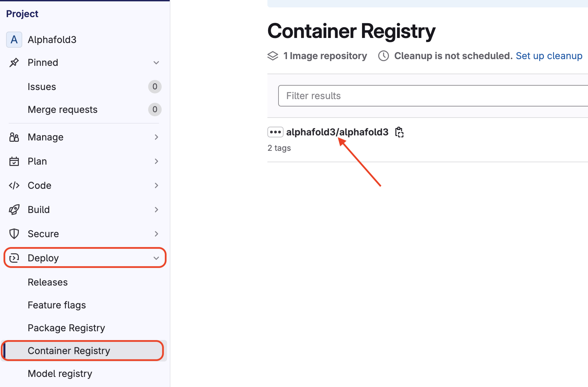

Click on "Container Registry" and then click the container, usually in the format "`containername/containername`", this will open a new page displaying the tag(s) (usually the `Commit SHA`). Use the copy icon next to the tag to copy the container's image path.

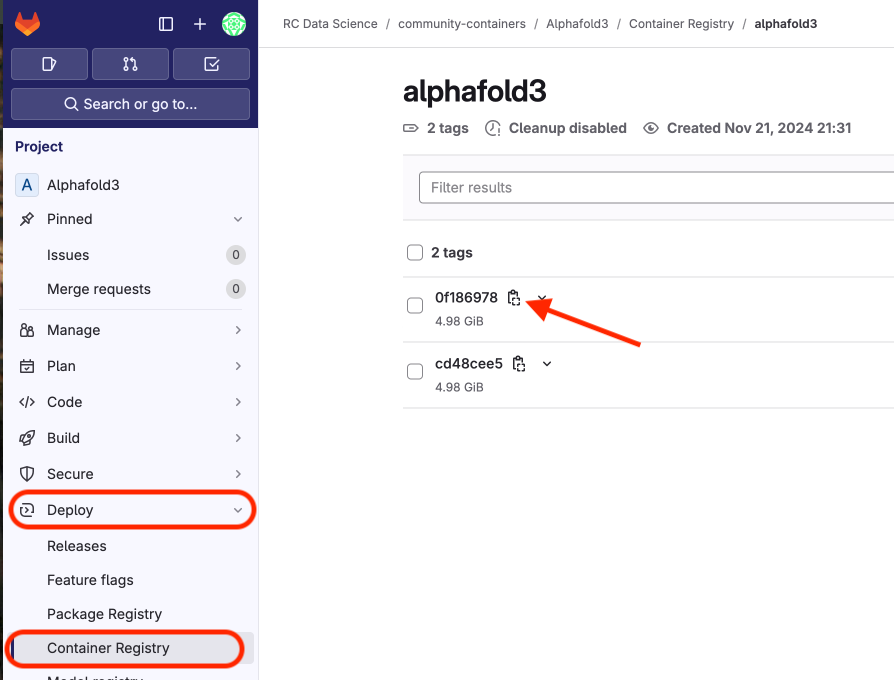

The next set of instructions will guide you through how to complete the install process for the container on Cheaha or on other platforms.

#### Run UAB RC Community Containers on Cheaha Using Singularity

On Cheaha, you can pull a container using Singularity by running the `singularity pull` command, an example is shown below. Ensure you are in the preferred location you would like to use the container from.

``` bash
singularity pull <preferredName.sif> docker://gitlab.rc.uab.edu:4567/rc-data-science/community-containers/<name of container/name of container:tag>
```

In the above command, `<preferredName.sif>` is a file name placeholder you should replace with your preferred container image filename. For example you can rename the file as "`alphafold3.sif`". The **`4567`** is the specific port for our GitLab container registry. For the `<name of container/name of container:tag>` placeholder, you will need to replace this placeholder with the specific path with the image name and tag of the container you want to pull.

A sample code is shown below

``` bash
singularity pull alphafold3.sif docker://gitlab.rc.uab.edu:4567/rc-data-science/community-containers/alphafold3/alphafold3:cd48cee5
```

After the singularity file (.sif) is created, you can run your container using the `singularity run` or `singularity exec` commands with the appropriate options. Please refer to the `README` file provided in the container repository or look for documentation specific to the container. Please see our [guide for using Containers (with singularity) on Cheaha](#containers-on-cheaha).You should see an output like in the image below.

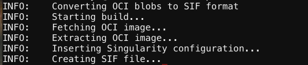

#### Run UAB RC Community Containers on a Virtual Machine (e.g. cloud.rc) or on Windows Using Docker

You can also pull this container using either Docker or Singularity, assuming you are running a Virtual Machine (VM) on a cloud instance or on a Windows machine. You will need to have either Docker or Singularity installed, then pull a container from the registry by running the command in your machine's terminal. The instructions for using Singularity are same as for running [Singularity on Cheaha](#run-uab-rc-community-containers-on-cheaha-using-singularity). See instructions on how to pull a container using Docker in your VM's terminal.

``` bash
docker pull docker://gitlab.rc.uab.edu:0000/rc-data-science/community-containers/<name of container>
```

This will pull the image and setup the container for use. As with all containers, `docker run` along with the right flags/option will run the container. Please refer to the `README` file provided in the container repository, or look for documentation specific to the container. Please see our documentation for [using Singularity on a cloud instance](#using-containers-on-uab-rc-cloud-cloudrcuabedu).

## Sharing Containers Using UAB GitLab Container Registry

If you prefer to share your container with a particular team/group, then the UAB GitLab container registry is the best and most secure option.

The following steps help you to create a container registry in UAB GitLab:

1. Create a UAB Gitlab account following the guidelines from the [UAB GitLab page](../account_management/gitlab_account.md).
1. Create a `new_project` on UAB GitLab and click `Package and Registries`, and then go to `Container Registry`. Initially, the container registry looks empty because there are no container images in the registry.

    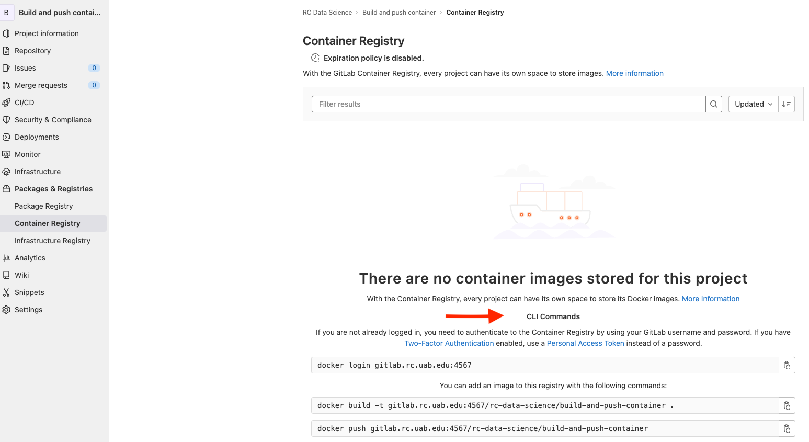

    !!! note
        Copy these CLI commands for future reference. It contains commands (1) to login to your project UAB GitLab container registry (2) Add an image to the registry using the push/build command. We will use the `push` command as we already have the existing container in our system.

1. Login to UAB GitLab Registry using your `registry_name:ID`.

    ```bash
    sudo docker login gitlab.rc.uab.edu:4567
    ```

    !!! note
        The registry_name and ID shown in this examples are for understanding and not meant for testing. Please use your GitLab registry name and ID for testing.

    Note: For securing concerns, use an access token to log in. Create an access token in UAB GitLab to push/pull the docker container in the container registry (Secure token and guidelines to follow are shown next).

    ```bash
    sudo docker login gitlab.rc.uab.edu:4567 -u username –p access_token
    ```

1. Creating an Access Token: From the UAB GitLab page, you can create an access token instead of using a password to log in to the UAB GitLab registry. Goto Edit profile -> Click `Access Tokens`. Then enter:

      - **Token name.**:Suggestion: "container"_"repository-name"

      - **Expiry date.** Suggestion: Default is 30 days. You can set your expiry date 3 months from the date you are making it.

      - Under select scopes, check read and write registry  (to push images to the registry) -> Then click `create personal access token`.

Once you create the token, copy the new personal access token since it’s a one-time step and hard to retrieve after a refresh. Use the personal access token for login.

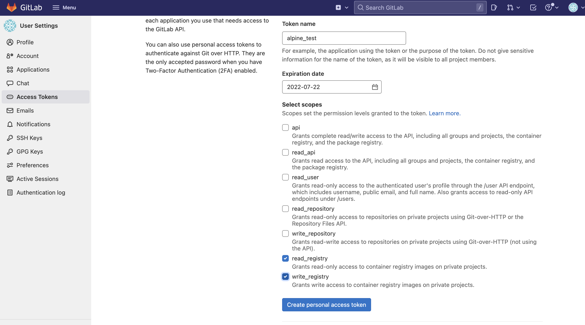

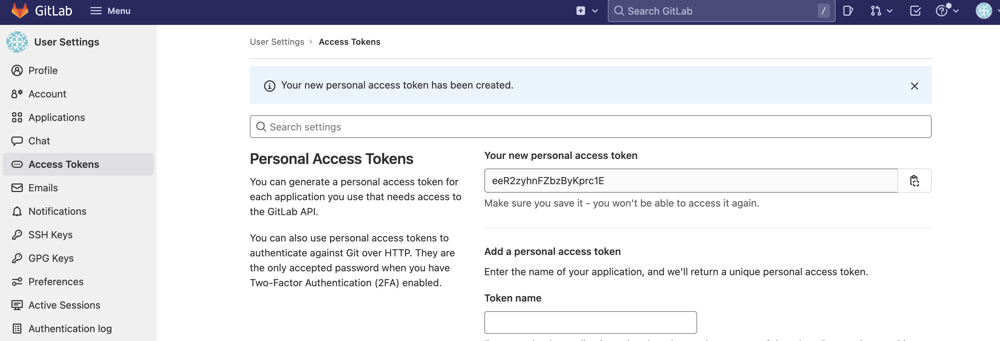

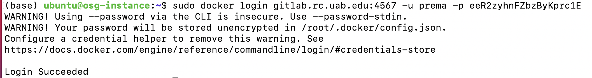

!!! warning
    Running `docker login` leads to a warning message that your password is stored unencrypted in `/root/.docker/config.json` (or) `$HOME/.docker/config.json`. To ignore this warning, follow the instructions in this [Github page](https://leimao.github.io/blog/Docker-Login-Encrypted-Credentials/) or the [Docker credentials store page](https://docs.docker.com/reference/cli/docker/login/#credentials-store).

### Push Alpine Container From Your System to UAB GitLab Container Registry

- List the docker images on your local computer using the `docker images` command. An `alpine` image exists already on this computer. Your container will likely have a different name.

```bash
sudo docker images
```

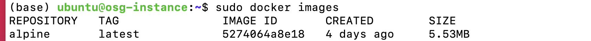

- Tag `alpine` to push into UAB GitLab registry. We need to have the UAB GitLab registry name to push. It will show the default command on the container registry page. Copy these commands for future reference. The tag is `test` here.

```bash
sudo docker tag alpine:latest gitlab.rc.uab.edu:4567/rc-data-science/build-and-push-container/alpinegitlab:test
```

You can see the tag `test` associated with the `alpine` image.

```bash
sudo docker images
```

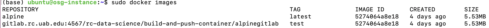

The below first command is the syntax to push the Docker image to the UAB GitLab container registry from your computer. The second command is an example of pushing a Docker image to the UAB GitLab container registry from your computer.

!!!note
    The registry_name,ID, and gitlab_group_name shown in this examples are for understanding and not meant for testing. Please use your GitLab registry name and ID for testing.

```bash
sudo docker push gitlab_registry_name:ID/gitlab_group_name/project_name:tag

sudo docker push gitlab.rc.uab.edu:4567/rc-data-science/build-and-push-container/alpinegitlab:test
```

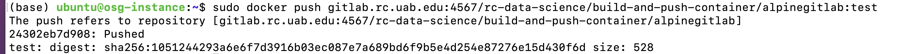

In your GitLab's page container registry, refresh to view the `alpine` container is pushed to the registry.

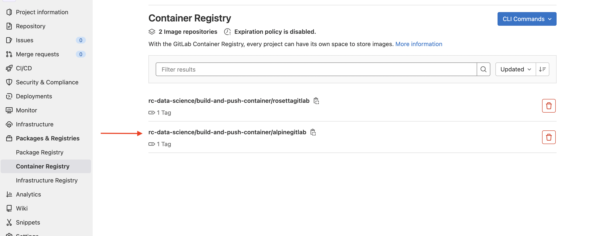

Now lets pull the `alpine` container from GitLab's page container registry to your system. Before that, remove the previous image from the system, which already has a `test` tag, to avoid discrepancies.

```bash
sudo docker rmi -f image_id
```

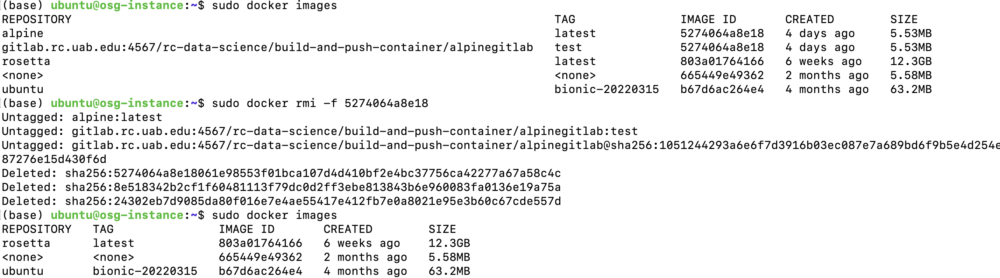

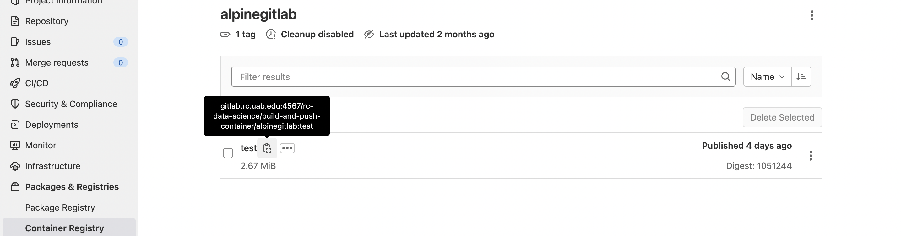

 In your GitLab's page container registry, copy the pull command from the `test` container registry, and use it to pull the docker container to your system. You can see the image is reflected in the image list.

```bash
sudo docker pull gitlab.rc.uab.edu:4567/rc-data-science/build-and-push-container/alpinegitlab:test
```

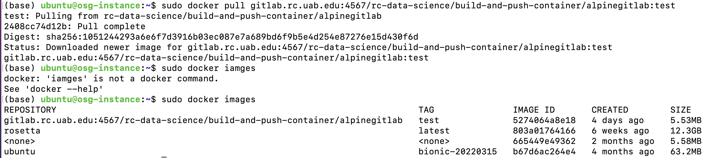

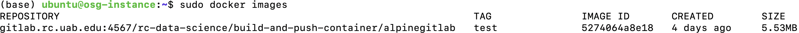
