# Git

## Introductory Guides

Above all else, git is a software and document collaboration tool.

It may be used to record and manage changes to projects. Git allows users to commit changes to branches in a repository. Those changes and branches are recorded and may be shared with other users who have clones of the project.

Git can be thought of as a combination of a timeline and a tree. Git is a timeline because it records change history on a timeline. It is a tree because changes can be meaningfully grouped into branches, each of which is an independent set of related commits. The branches can fork from or merge into each other as changes are recorded along the timeline. An example of part of the state of the repository for this documentation can be seen below (visualized using VSCode and <https://github.com/mhutchie/vscode-git-graph>).

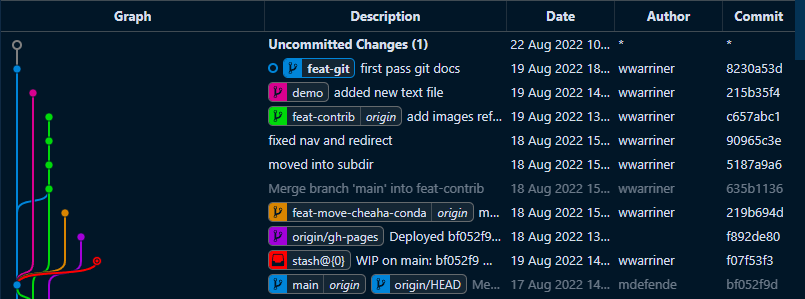

Each row is a single commit, or set of changes. The vertical threads in the "Graph" column are branches which can be seen to fork and merge with one another. Each branch tip is labeled with the branch name under the "Description" column, along with a message describing the commit. The "Date" column shows when a commit was made, "Author" by whom, and "Commit" a partial hash that uniquely identifies the commit.

### Educational Resources

The internet has many guides for using git. Rather than devise our own complete lesson plan for using git, we recommend finding and using one of the high-quality lessons available on the internet. The Software Carpentries group offers a number of high-quality online lesson plans for introductory computing and data science tools. While these lesson plans are intended to be delivered by an instructor in a classroom setting, they can be still be useful to follow solo. For the git lesson, see <https://swcarpentry.github.io/git-novice/>.

Denser and more complete documentation is available at <https://git-scm.com/doc>.

## Reference

### Glossary

- A **repository** is the largest unit of information that git keeps track of.
    - A useful model for a repository is a single coding or documentation project.
    - A repository is composed of a collection of files, a working tree and index, and all of the change history associated with those things. Change history includes branches and commits.
    - Repositories are decentralized, so that two people can work independently on parts of the same project and then merge their changes later.
    - A **local repository** is a repository that is housed on the same machine you are working on.
    - A **remote repository** or **remote** is a repository that is housed on a machine other than the one you are working on.
    - Remotes are often housed on internet repository services like <https://github.com> and <https://about.gitlab.com>. UAB Research Computing also maintains an on-premises Gitlab instance at <https://code.rc.uab.edu>.
- The **working tree** is the structure used to model repository contents and history.
- The **index** contains changes since the most recent commit.
- The **staging area**, a subset of the index, contains changes ready to be committed.
- A **branch** is a single thread of commits made to the working tree. Branches are independent of each other until they are merged. A repository can have one or many branches. Branches can be set up to track remote branches, facilitating pushing and pulling.
- A **commit** is a collection of changes that have been made to the working tree. Commits have associated messages. Repositories and branches are structured collections of commits. A repository may have many commits, distributed among branches.
- A **branch tip** is the most recent commit on a branch.
- The **HEAD** is the most recent commit on the currently selected branch.
- **Cloning** means creating a complete, but independent, copy of a repository and its history.
- **Fetching** means retrieving changes in from a remote repository.
- **Merging** is the process of incorporating changes from a source branch into a target branch.
- **Pulling** is fetching followed by merging.
- **Pushing** means communicating changes out to a remote repository.

### How Should I Configure Git?

Good practice for configuring git includes adding your name and email globally on your local machine so that you received proper attribution when making changes to repositories.

To add your name and email enter the following two lines, replacing `<name>` and `<email>` as appropriate.

```bash
git config --global user.name <name>
git config --global user.email <email>
```

More information is available at the [official git webbook](https://git-scm.com/book/en/v2/Customizing-Git-Git-Configuration).

[Full documentation](https://git-scm.com/docs/git-config).

### How Do I Obtain Git Repositories?

Obtaining repositories is how projects start, or how you might start working on someone else's repository. Substantially more information is available from the [official git webbook](https://git-scm.com/book/en/v2/Git-Basics-Getting-a-Git-Repository)

#### Start a Local Repository (Init)

Starting a local repository is also known as "initializing" a repository. It can be done with an empty folder, or a folder with existing code. Navigate to the folder and use the following command to initialize a repository.

```bash
git init
```

#### Forking

Forking a repository is not a git concept, but a concept of remote repository hosting services like GitHub and GitLab. Forking is cloning a repository from another users account to your own account on GitHub or GitLab.

[GitHub fork documentation](https://docs.github.com/en/pull-requests/collaborating-with-pull-requests/working-with-forks/fork-a-repo).

[GitLab fork documentation](https://docs.gitlab.com/user/project/repository/forking_workflow/).

#### Cloning

Cloning a repository means making an independent copy of a remote repository on your local machine. To clone a repository you will need the remote URL where the repository is available. Navigate to the directory where you would like the repository located. Use the following to create a new subdirectory containing the clone.

```bash
git clone <remote-url>
```

<!-- markdownlint-disable MD046 -->
!!! note

    Clones may be made from GitHub and GitLab using either `https` or `ssh`. To use `ssh` you will need to set up SSH Keys.
<!-- markdownlint-enable MD046 -->

<!-- markdownlint-disable MD046 -->
!!! note

    Best practice for the remote URL is to ensure it ends with `.git`. While the URL for this documentation's repository is <https://github.com/uabrc/uabrc.github.io> you should instead use `https://github.com/uabrc/uabrc.github.io.git` when cloning.

    Using the `.git` suffix is optional for GitHub, but required for GitLab.
<!-- markdownlint-enable MD046 -->

[Full documentation](https://git-scm.com/docs/git-clone).

### How Do I Interact With Remotes?

A key part of git's usefulness is facilitating collaboration on code and documentation projects. Interacting with independent, remote copies of a repository is central to the purpose of git. Substantially more information is available at the [official git webbook](https://git-scm.com/book/en/v2/Git-Basics-Working-with-Remotes).

#### Managing Remotes

- Check what remotes are available using `git remote -v`

    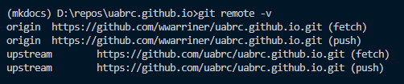

- Add a new remote with `git remote add <remote-name> <remote-url>`

    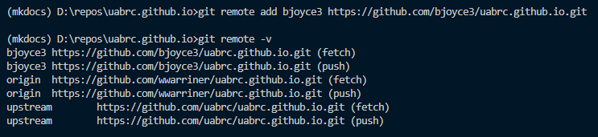

- Change the url of an existing remote with `git remote set-url <remote-name> <new-remote-url>`

    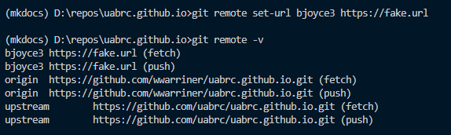

- Remove a remote with `git remote remove <remote-name>`

    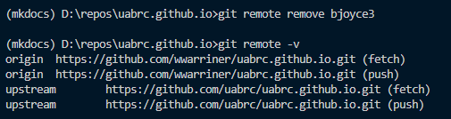

[Full documentation](https://git-scm.com/docs/git-remote).

#### Fetching and Pulling

Fetching changes from remote repositories without incorporating them:

- Check and download changes for all remotes using `git fetch --all`.

    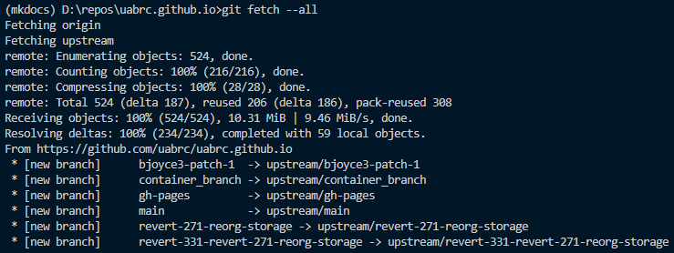

- Check and download changes for a remote using `git fetch <remote-name>`.

    

Pull (fetch and merge) changes from a branch using `git pull <remote-name> <remote-branch-name>.` These changes are merged to the current [HEAD](#glossary), so be sure to [checkout](#how-do-i-manage-branches) the correct branch first.

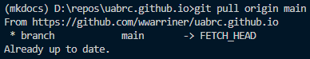

[Full documentation of `git fetch`](https://git-scm.com/docs/git-fetch).

[Full documentation of `git pull`](https://git-scm.com/docs/git-pull).

#### Pushing

Push changes to a remote branch on a remote repository using `git push <remote-name> <remote-branch-name>`.

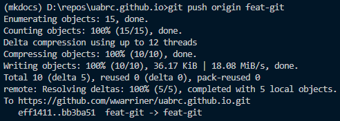

[Full documentation](https://git-scm.com/docs/git-push).

### How Do I Record Changes?

The key part of git's function is recording changes. Substantially more information is available at the [official git webbook](https://git-scm.com/book/en/v2/Git-Basics-Recording-Changes-to-the-Repository).

#### Checking Status of Changes

Use `git status`. It will show your current branch, staged files and unstaged files.

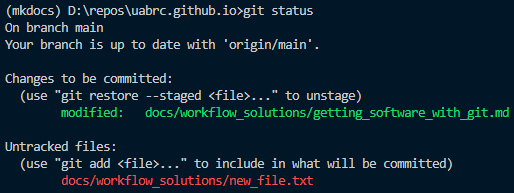

[Full documentation](https://git-scm.com/docs/git-status).

#### Staging and Committing Changes

Staging files is done with the `git add` command, committing files with `git commit`.

```bash
git add new_file.txt
git commit -m "added new text file"
```

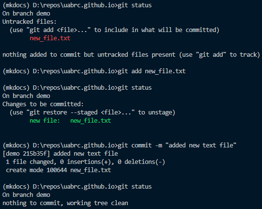

[Full documentation of `git add`](https://git-scm.com/docs/git-add).

[Full documentation of `git commit`](https://git-scm.com/docs/git-commit).

#### Stop Tracking Files

Use `git rm <file>` if the file has no changes. Despite the name this will not delete the file, only stop git from tracking any future changes. Specifically, it will stage a removal of the file from git tracking, which you will need to commit to stop tracking that file.

If the file has changes:

- Use `git rm --cached <file>` to keep the changes
- Use `git rm -f <file>` to remove the changes

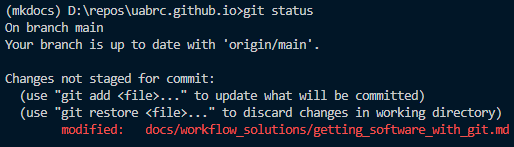

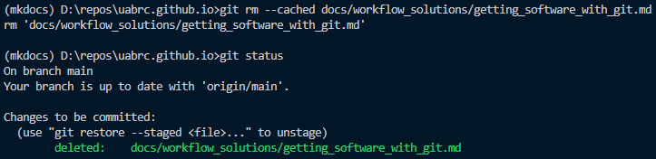

[Full documentation](https://git-scm.com/docs/git-rm).

#### Ignore Files

Place a file called `.gitignore` at the root directory of your repository. A modified form of [Glob Syntax](shell.md#glob-syntax) may be used, one pattern per line, to indicate files that should be ignored by git. Any files or directories matching a line in the `.gitignore` file will not be tracked, unless the file has already been committed to the working tree.

- `*`: a wildcard meaning any number of any characters except for a slash
- `**`: a wildcard for matching directories
- `!`: negates a pattern, causing inclusion instead of exclusion
- The last pattern in the file takes precedence

```.gitignore
# ignores all files with extension .txt
*.txt

# includes file despite previous rule
!included.txt

# ignores all directories called test
**/test/

# ignores all directories called build in site
site/**/build

# ignores all files in ouptut, but not in subdirectories
output/*

# recursively ignores all files in output, including subdirectories
output/**
```

[Full documentation](https://git-scm.com/docs/gitignore).

### How Do I Manage Branches?

#### Listing Branches

To list local branches use `git branch`.

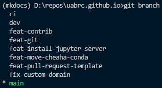

To list remote branches use `git branch -r`.

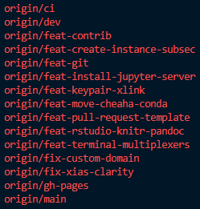

#### Checking Out Existing Branches

To checkout an existing local branch use `git checkout <branch-name>`.


To checkout and track a remote branch use `git checkout --track <remote-name>/<branch-name>`.

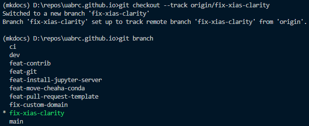

#### Creating New Branches

To create a new local branch use `git branch <branch-name>`.

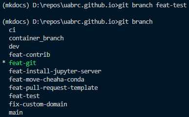

To create and checkout a new local branch use `git checkout -b <branch-name>`.

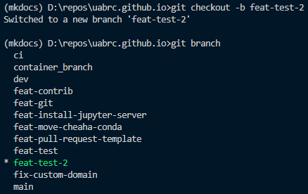

<!-- markdownlint-disable MD046 -->
!!! note

    Branches are always created from the HEAD.
<!-- markdownlint-enable MD046 -->

#### Deleting Branches

To delete a local branch use `git branch --delete <branch-name>`.

<!-- markdownlint-disable MD046 -->
!!! warning

    Deleting remote branches can be destructive if active pull requests depend on them. Be sure you are deleting the correct remote branch.
<!-- markdownlint-enable MD046 -->

To delete a remote branch use `git push <remote-name> --delete <branch-name>`.

#### Merging Branches

To merge branch `A` into branch `B`, first select branch `B` using `git checkout B`, then merge `A` into `B` using `git merge A`.

Some merges may cause conflicts. Conflict resolution is part art, part science, and beyond the scope of this document. Several strategies exist to minimize conflict frequency and scope. The general gist requires making smaller but more frequent commits of complete units.

More information on merging is available at the [official git webbook](https://git-scm.com/book/en/v2/Git-Branching-Branches-in-a-Nutshell).

### How Do I Reset Changes?

<!-- markdownlint-disable MD046 -->
!!! danger

    `git reset` can be highly destructive if used improperly. If you are unsure then please do not use `git reset --hard`.
<!-- markdownlint-enable MD046 -->

Use `git reset <mode> <commit>`. There are several modes:

- `--hard` is destructive
    - changes since `<commit>` in the working tree and index are discarded
    - all untracked files "in the way" of those changes are deleted
- `--mixed` (default) is non-destructive
    - changes since `<commit>` in the index are tracked but not staged
- `--soft` is non-destructive
    - changes since `<commit>` in the index are staged

If `<commit>` is left empty then the most recent commit on the working branch is used. If you wish to specify a commit, then provide enough characters at the start of the commit hash (7 characters is usually enough for unique identification).

<!-- markdownlint-disable MD046 -->
!!! danger

    Using `git reset --hard` is destructive. All changes since the last commit are discarded and are most likely lost.

    Use `git reset --mixed` (default) or `git reset --soft` instead.
<!-- markdownlint-enable MD046 -->

More information is available at the [official git webbook](https://git-scm.com/book/en/v2/Git-Basics-Undoing-Things).

[Full documentation](https://git-scm.com/docs/git-reset).

### How Do I Tag a Commit?

Use `git tag`. Tags are useful for tracking software versions or milestones in the history. There are two types, lightweight and annotated. Here we only discuss lightweight tags.

- Tag HEAD: `git tag <tag-label>`
- Tag a specific commit by hash: `git tag <tag-label> <commit-hash>`
- Push tag to remote: `git push <remote-name> <tag-label>`
- Delete tag: `git tag -d <tag-label>`
- Delete tag from remote: `git push origin --delete <tag-label>`

More information is available at the [official git webbook](https://git-scm.com/book/en/v2/Git-Basics-Tagging).

[Full documentation](https://git-scm.com/docs/git-tag).

## Help! Something Went Wrong

Stop. Breathe. Don't panic. It's likely that your changes are still cached by git. Don't make any additional changes or run any git commits as this may cause cached files to be deleted. If you have some experience with git, then chances are good you can recover your lost changes. If you do not have much experience with git or do not feel confident recovering, then please contact [Support](../help/support.md).

If you wish to proceed without assistance, then please visit the following two pages depending on your situation.

### I Need to Undo a Change That I've Made

<!-- markdownlint-disable MD046 -->
!!! warning

    Do not use `git reset --hard` if you are not sure of what you are doing!
<!-- markdownlint-enable MD046 -->

Please visit: <https://wwarriner.github.io/gitfix/>, read each card carefully, and answer the questions until you arrive at a solution. Do not use `git reset --hard` unless you are sure of what that command will do.

More information is available at the [official git webbook](https://git-scm.com/book/en/v2/Git-Basics-Undoing-Things).

### I've Lost Changes I Made

The changes may be lost permanently, or they may be partially recoverable. Git has a garbage collector for old versions of files that is emptied periodically as new commands are run. If you have not run any commands since losing changes, the old versions should still be available.

To recover the changes:

- In a terminal, navigate to the repository directory.
- Use the command `git fsck --lost-found`.
- Navigate to the subdirectory `.git/lost-found/other`.
- **Highly recommended**: make a backup of the `.git/lost-found/other` folder before proceeding.

The recovery will only be partial. File content should all be recoverable. However, directory structure and file names will be lost. This solution will require considerable manual or scripted work to identify files and restore directory structure and file names.
