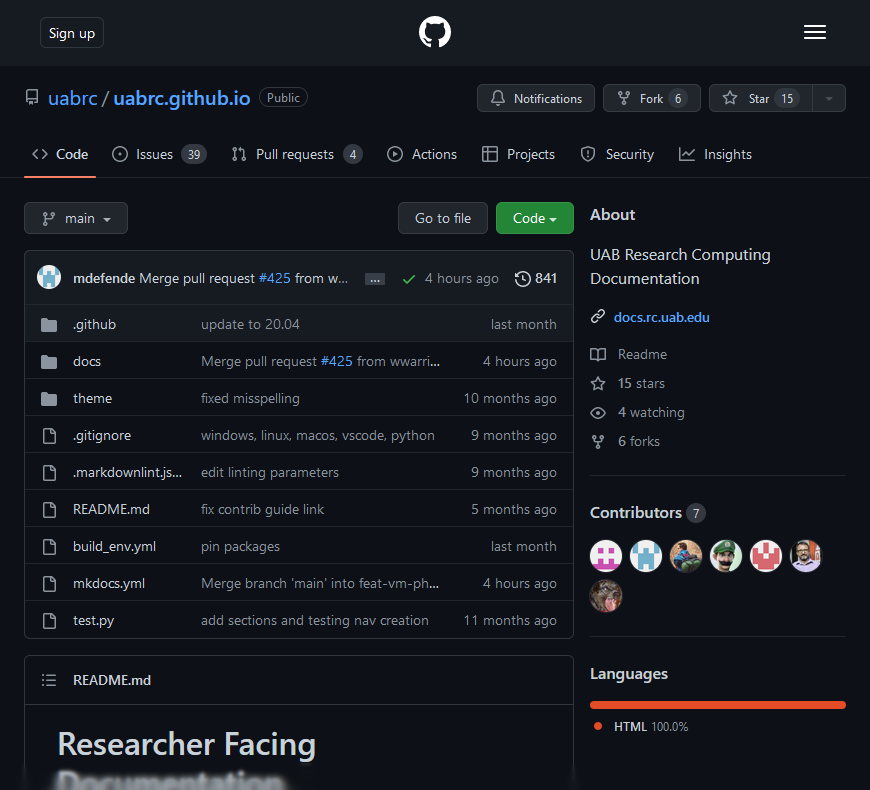
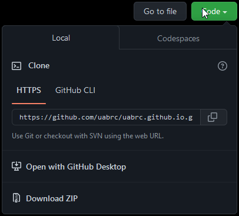
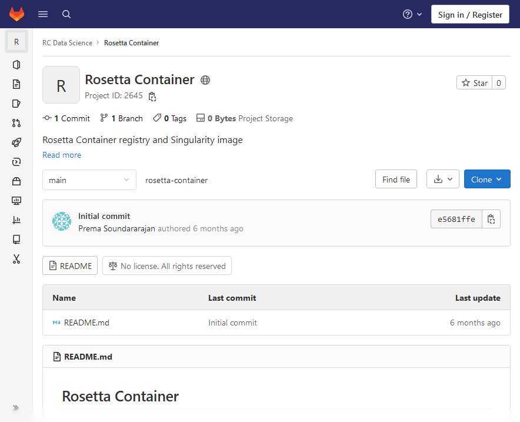
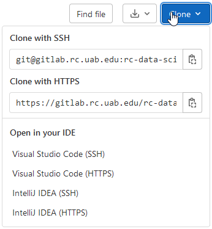

# How to Collaborate With Git

[Git](git.md) is a powerful tool for version control of software and other plain-text information. However, Git alone is not ideal for enabling and facilitating collaboration between many users working on the same research software project. Be sure to check the [Important Note on Terms](#important-note-on-terms) if you aren't familiar with Git.

If you are here because you need to know how to get software from either instance, please see [Obtaining Software](#for-obtaining-software) below.

If you are here because you need a place to collaborate with others on a software project, please see [Collaborating](#for-collaborating) below.

## Important Note on Terms

On most pages in this documentation, we use "local" to refer to your laptop or desktop computer, and "remote" to refer to [Cheaha](../cheaha/getting_started.md) or a [Cloud.rc](../uab_cloud/index.md) virtual machine.

When dealing with Git and repository hosting services like GitHub and GitLab we use remote to refer to repositories that are on a repository hosting site like GitHub or GitLab, and local to refer to repositories that are not on a repository hosting site.

To summarize:

- Git, GitHub, GitLab context
    - `local` - the repository on a computer where you work on your code (laptop, desktop, Cheaha)
    - `remote` - a remote server or service that stores code (github, gitlab, etc)
- Cheaha and Cloud.rc context
    - `local` - the machine (laptop, desktop) you use to access Cheaha or the Cloud.rc VM
    - `remote` - Cheaha or the Cloud.rc VM

## For Obtaining Software

### Cloning From GitHub

To do anything with GitHub, you will first need to navigate to their website <https://github.com> and [create an account](https://docs.github.com/en/get-started/start-your-journey/creating-an-account-on-github).

To clone a repository, be sure you have the repository URL. Then, using `git` at a terminal, [clone](git.md#cloning) the repository using whatever settings are appropriate. GitHub repository pages look something like the page for this documentation, shown below.

You may also use the "Code" button on the page to see instructions for cloning the repository.

More in-depth instructions, including for SSH cloning, are provided at the [official documentation](https://docs.github.com/en/repositories/creating-and-managing-repositories/cloning-a-repository).

### Cloning From GitLab

To do anything with our GitLab instance, you will first need to create an account. Please see our [GitLab Account Management page](../account_management/gitlab_account.md).

To clone a repository, be sure you have the repository URL. Then, using `git` at a terminal, [clone](git.md#cloning) the repository using whatever settings are appropriate. Be sure to append `.git` to the end of the repository or the clone will note be successful. For example, if the URL is `https://code.rc.uab.edu/user/repository` then you will clone `https://code.rc.uab.edu/user/repository.git`. GitLab repository pages look like the example shown below.

You may also use the "Clone" button on the page to see instructions for cloning the repository.

More in-depth instructions, including for SSH cloning, are provided at the [official documentation](https://docs.gitlab.com/topics/git/commands/#clone-a-repository).

## For Collaborating

GitHub and GitLab can both be used for software project management, and have helpful tools to facilitate group collaboration within projects and across multiple projects.

Both services use organizations to manage projects across a team of people: [GitHub docs page](https://docs.github.com/en/organizations), [GitLab docs page](https://docs.gitlab.com/topics/set_up_organization/). Within a GitHub organization, people and repositories can be arranged into [teams](https://docs.github.com/en/organizations/organizing-members-into-teams/about-teams). GitLab allows arrangement of people and repositories with [projects](https://docs.gitlab.com/user/project/).

An important feature, used extensively for this documentation's GitHub repository, is the issue tracker. Both [GitHub](https://docs.github.com/en/issues/tracking-your-work-with-issues/about-issues) and [GitLab](https://docs.gitlab.com/user/project/issues/) have per-repository issue trackers. Collaborators can create and manage issues, label them, and resolve them.

### How Do I Choose Between GitHub and GitLab?

- Want to collaborate publicly and outside UAB? Consider using GitHub.
- Want your project private or internal to UAB? Consider using our GitLab instance.

It is possible to collaborate publicly using GitLab, but there may be additional challenges. While external collaborators can see a public GitLab repository on our instance, they can't make any changes or create issues without a [XIAS Account](../account_management/xias/index.md).

It is possible to collaborate privately using GitHub with no additional hurdles, but if your project contains sensitive or protected information of any kinds, it should not be posted to GitHub, even in private repositories. Please consult with us via [Support](../help/support.md) before

### Good Practice for Organizing a Lab Space

Below is a bulleted list of good practices for organizing a lab space. Each bullet is followed by links to relevant GitHub and GitLab documentation pages, as appropriate.

- Have an organization for your lab space. [GitHub](https://docs.github.com/en/organizations/collaborating-with-groups-in-organizations/about-organizations), [GitLab](https://docs.gitlab.com/topics/set_up_organization/)
    - The organization should have its PI or PIs as owners, i.e., the owner role. [GitHub](https://docs.github.com/en/organizations/managing-peoples-access-to-your-organization-with-roles/roles-in-an-organization), [GitLab](https://docs.gitlab.com/user/permissions/#permissions-and-roles)
    - Other trusted individuals can be made administrators as needed, to delegate important and sensitive tasks that require elevated permissions.
- For each software project, create a repository within your organization. [GitHub](https://docs.github.com/en/repositories/creating-and-managing-repositories/quickstart-for-repositories), [GitLab](https://docs.gitlab.com/user/project/repository/)
    - By default, organization members will have access at their assigned role level. These can be changed by managing roles and using teams effectively, if needed. For smaller labs this is often not necessary.
    - The created repository is the central one for the organization and should not be changed directly.
- For every individual, including owners and admins, work should be performed on a personal fork of the repository and then merged by submitting pull/merge requests.
    - Forks are copies of repositories made as a snapshot at the moment they are created. From that point on they are independent repositories with some features to facilitate collaborative workflows. [GitHub](https://docs.github.com/en/pull-requests/collaborating-with-pull-requests/working-with-forks/about-forks), [GitLab](https://docs.gitlab.com/user/project/repository/forking_workflow/)
    - Pull/merge requests allow individuals to contribute to a central repository. They allow reviewers to check the changes to ensure code quality, and to provide reviews or request changes. They are the primary means of controlling how code changes over time, and who is allowed to make those changes. [GitHub](https://docs.github.com/en/pull-requests/collaborating-with-pull-requests/proposing-changes-to-your-work-with-pull-requests/about-pull-requests), [GitLab](https://docs.gitlab.com/user/project/merge_requests/creating_merge_requests/)
    - See the [Fork-Pull/Merge Request Workflow Section](#the-fork-pullmerge-request-workflow) for more details on this valuable method of change management.

### The Fork-Pull/Merge Request Workflow

The Fork-Pull/Merge Request workflow is a central concept to effective collaboration on individual repositories. It allows code owners and admins to effectively control how code changes, while giving accountability and credit to code maintainers and programmers. Every person working on a project has an effective means of working independently while being able to pull their changes together in a central location. It also neatly ties into issue tracking, which is discussed in the [Issue Tracking Section](#effective-issue-tracking).

The workflow assumes a central repository already exists within an organization on either GitHub or GitLab. The workflow is written from the point of view of a new programmer who wants to work on the repository. The programmer must have a local machine where they will do their work and it must have Git installed.

- One-time setup
    1. Fork an individual repository (downstream) from the central organization repository (upstream). [GitHub](https://docs.github.com/en/pull-requests/collaborating-with-pull-requests/working-with-forks/about-forks), [GitLab](https://docs.gitlab.com/user/project/repository/forking_workflow/)
    1. [Clone](git.md#cloning) the downstream fork to the local machine where the programming will happen.
- Workflow
    1. Decide on a set of changes to make. Good practice is only working on one conceptual unit at a time. One feature, one bug fix, or one documentation page. Prefer fixing bugs before adding features.
    1. Synchronize your downstream fork with the upstream fork to minimize risk of merge conflicts. [GitHub](https://docs.github.com/en/pull-requests/collaborating-with-pull-requests/working-with-forks/syncing-a-fork), [GitLab](https://docs.gitlab.com/user/project/repository/forking_workflow/#update-your-fork)
    1. [Pull the downstream fork main branch](git.md#fetching-and-pulling) to your local clone main branch.
    1. [Create a working branch](git.md#creating-new-branches) for intended changes. Give it a short, descriptive name like `feature-add-button` or `fix-broken-link`.
    1. [Checkout the working branch](git.md#checking-out-existing-branches).
    1. Make changes to the code on the local machine using your preferred editor. Make small units of change at a time, try not to commit too much, but make sure your changes don't break the code. There is an art to this that comes with practice, but don't be afraid of trying.
    1. [Commit those changes](git.md#staging-and-committing-changes) to the working branch. Keep making changes and committing until the set of changes is complete.
    1. When all needed changes have been made, [push the working branch](git.md#pushing) to your fork.
    1. Create a pull/merge request from the downstream working branch to the upstream main branch. [GitHub](https://docs.github.com/en/pull-requests/collaborating-with-pull-requests/proposing-changes-to-your-work-with-pull-requests/about-pull-requests), [GitLab](https://docs.gitlab.com/user/project/merge_requests/creating_merge_requests/)
    1. Wait for reviews, make needed changes, and hopefully merging of your request.

Sometimes merging will be blocked because of a merge conflict. One programmer may make changes to code being worked on by another, and the two changes come into conflict. If this occurs, below are some steps that may help resolve the issue. In some cases, conflict resolution is straightforward, but in other cases thought will be necessary to disentangle what code should be kept, what should be discarded, and what should be modified.

- The downstream programmer should try synchronizing their fork, pulling it to their local main branch, and [merging] the main branch into their working branch. The conflict may still occur on their local machine, but they will be able to more easily see and test the effects of various conflict resolution attempts.
- Use a three-way diff program or editor which will let you see both sets of conflicting code, and facilitate making changes and selections. [VSCode](https://code.visualstudio.com) has a built-in three-way merge editor.
- Be sure everyone is using the same formatting rules in their editors. Sometimes spurious conflicts can occur as a result of inconsistent formatting.
- To minimize risk of conflict, don't have more than one programmer work on the same section of code if possible.

### Effective Issue Tracking

Effective use of issue tracking can greatly reduce cognitive load and simplify code management. It gives a central location where users and maintainers can report bugs, make feature requests, and ask for clarifications on usage and documentation. These issues are tracked over time, can be labeled and organized, and closed and reopened. [GitHub](https://docs.github.com/en/issues/tracking-your-work-with-issues/about-issues), [GitLab](https://docs.gitlab.com/user/project/issues/)

The typical issue lifecycle, at a high level, is something like below.

1. Create an issue. [GitHub](https://docs.github.com/en/issues/tracking-your-work-with-issues/using-issues/creating-an-issue), [GitLab](https://docs.gitlab.com/user/project/issues/create_issues/)
1. Ask for clarifications and discuss as needed.
1. Use the [Fork-Pull/Merge Request Workflow](#the-fork-pullmerge-request-workflow) to resolve the issue. In the Pull Request description, put the text `Fixes #...` where `...` should be replaced by the issue's number. When the request is merged, the issue will automatically be linked to the request and closed.

## Common Scenarios

### Uploading an Existing Code Folder

The process for this has a few intricate steps that may be unfamiliar even to regular users of git, and has a few pitfalls.

1. Use `git init` in the top-level code folder on the local machine, if it is not already a git repository. If it already is a repository, be sure the primary branch is called `main`. Use `git branch -m <oldname> main`.
1. Create a repository on the remote server [GitHub](https://docs.github.com/en/repositories/creating-and-managing-repositories/quickstart-for-repositories), [GitLab](https://docs.gitlab.com/user/project/repository/#create-a-repository)
1. Use `git remote add origin <url>` to add the remote URL to the local repository with the name `origin`.
1. Verify the URL is correct with `git remote -v`. Fix it with `git remote set-url origin <url>` if needed.
1. Checkout the main branch without `git checkout main`.
1. Use `git pull origin main --allow-unrelated-histories` to combine the main branches of the remote and local repository, within your local repository.
1. Use `git push origin main` to push the combined histories to the remote repository.
1. Be sure to verify the repository looks good at the GitHub/GitLab repository page (depending on which you used).

<!-- markdownlint-disable MD046 -->
!!! note

    `--allow-unrelated-histories` is necessary because Git considers the remote repository to be a completely distinct entity from the local repository. Their histories are unrelated.
<!-- markdownlint-enable MD046 -->

## HTTPS vs SSH Access

For most beginners using Git, GitHub and GitLab, HTTPS (hypertext transfer protocol secure) is probably a sufficient method for accessing in early stages. It is the default mode of accessing GitHub and GitLab when using Git at the command line. HTTPS is less secure than SSH (secure shell). We recommend learning to use SSH as soon as possible to minimize security risks. Below are links to GitHub and GitLab documentation for using SSH.

[GitHub SSH documentation](https://docs.github.com/en/authentication/connecting-to-github-with-ssh)
[GitLab SSH documentation](https://docs.gitlab.com/user/ssh/)
