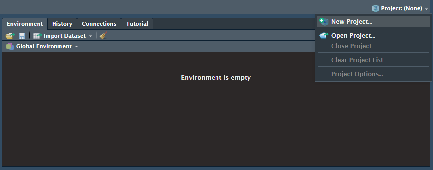
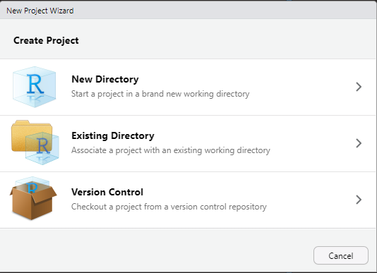
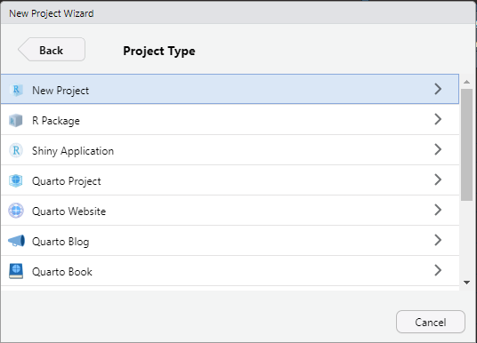
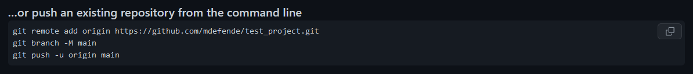
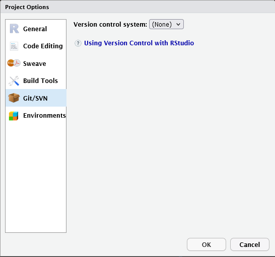
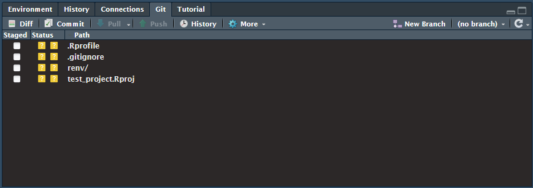
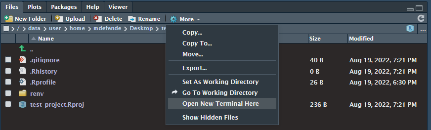

# R Projects and Environments

When working on multiple projects, it's likely that different sets of external analysis packages and their dependencies will be needed for each project. Managing these different projects is simple in something like [Anaconda](using_anaconda.md) by creating a different virtual environment for each project, but this functionality is not fully built into RStudio by default.

Instead, we suggest to take advantage of [R Projects](https://support.posit.co/hc/en-us/articles/200526207-Using-RStudio-Projects) and the [renv](https://rstudio.github.io/renv/articles/renv.html) package to keep environments separate for each project you start.

<!-- markdownlint-disable MD046 -->
!!! important

    If you are planning to use the `renv` package for environment management, you should install it before creating a project.
<!-- markdownlint-enable MD046 -->

## R Projects

RStudio and Hadley Wickham have [written extensively](https://r4ds.had.co.nz/workflow-projects.html) on using Projects to organize different research projects, so please read through that documentation. These docs will give a condensed overview of how to set up Projects.

### Creating a Project

To begin, projects start at a parent or root directory within which most, if not all, files associated with that project should be stored. To create a project, find the Project dropdown at the top-right of RStudio, above the Environment window.

1. Click New Project... This will open up a screen to select whether you want to create a new folder for your project, use an existing folder, or clone an existing Git repository. The following instructions assume you choose to create a new directory.

    

1. Next you will need to choose your project type. There are a number of different preset projects for R packages, Shiny applications, and different implementations of Quarto. The top option will open a generic project, but any of these options can be converted to any other type of project.

    

1. Finally, you will choose your project name, the location for the project directory, as well as choose whether you want to initialize a git repo for the project. In addition, you can choose to use `renv` for package dependency management. More information is available at the [renv section](#renv). It's highly suggested to use `renv` for future environment reproducibility.

    

Afterwards, RStudio will reset, change the working directory to the project root, and create a .RProj file that controls the project settings. The project dropdown will have the newly created project name now.

### Project Settings

At this point, you can start writting scripts as normal, but it would be useful to change some of the settings for the projects to help with some RStudio performance and set up Git and renv.

#### General Settings

Click the project dropdown again and select Project Options at the bottom. A window will appear with general settings. We advise to change the general settings to the following:

This will create a clean environment each time you open the project and does not save environment variables when exiting RStudio. In our experience, trying to automatically load variables from a previous session can cause RStudio to open very slowly or crash depending on the amount of data being used. All variables can be recreated by running your scripts or by purposefully saving and loading selected variables from other data files such as csv or RData.

#### Git Settings

Another useful part of Projects is Git integration. Normally, you would need to manage git using the command line even though your development is in RStudio, but with Projects you can link a remote git repository to your Project. It then provides a graphical interface for creating branches, committing changes, and generally managing a remote code repository.

<!-- markdownlint-disable MD046 -->
!!! note

    To read more about how to get started with Git, please read our [git documentation](git_collaboration.md)
<!-- markdownlint-enable MD046 -->

1. To begin, you should create an empty repository either at [Github](https://github.com/) or [UAB's Gitlab](https://gitlab.rc.uab.edu/users/sign_in) where your project will be stored. this will open a new page with instructions on linking this remote repository with your local project. Keep these instructions open for later. A picture of the important piece can be seen below.

    

1. Then open the Git/SVN tab in the Project Settings. It will have no option set:

    

1. Click the Version Control dropdown menu and select Git. RStudio will ask you if you want to initialize a new git repository. Click Yes. Restart RStudio if it asks you to. Now a new Git tab will be available in the upper right pane

    

1. You will then need to add a link to the remote repository as the origin.
    1. Click the More dropdown in the Files tab in the bottom right pane and select Open New Terminal Here

        

    1. Copy the instructions for pushing an existing repository from the Git repo into your terminal. You can see an example of these instructions under step 1, and commands specific to your repository were given after you created your repository. Run these commands to link the local Project to the remote repository. Afterwards, the Origin field in the Git/SVN options will have changed to your remote repository address.

        

### Project Paths

Projects are designed to be portable and so use relative paths the vast majority of the time. This means any folder or file should be referenced using the top level of the project as the root directory. For example, if I wanted to load the `subj01.csv` file from the `data` directory in the top level of the project, I would do that using `read.csv('data/subj01.csv')`. Absolute paths will cause scripts to break if the project is moved to a different location within the filesystem or onto another computer entirely.

As well, opening a project will automatically set the working directory to be at the top level of the project. It's inadvisable to the change the working directory location while a project is open.

## `renv`

Most, if not all, projects will use some combination of the thousands of packages available in R such as the `tidyverse`. The `renv` package helps manage all of your project's package dependencies as well as provide a way to easily share package environments with other researchers. This functionality is very similar to `conda` and `virtualenv` environments for Python users. More information about `renv` can be found on [their site](https://rstudio.github.io/renv/articles/renv.html). It's suggested to keep a record of the packages your project uses with either `renv` or another tool for general reproducibility.

In order to use `renv`, you should install it either through the package install tool in RStudio or using the `install.packages` command before creating an environment. If you already have an existing project but want to use `renv`,you can install it and manually intialize the environment useing `renv::init()`.

`renv` manages package versions and dependencies separately for each project. All downloaded packages are, by default, stored in `$HOME/.cache/R/renv/cache/` and symlinks are created to these folders within a created `renv` folder in the project directory. If multiple projects use different versions of the same package, each individual version is installed and kept separate from the other versions. If a package has already been installed for one project, any future projects that use that same package version will automatically add a symlink to the existing package install saving on package installation and compilation time.

### Installing Packages

You can make a change to your package environment at any point using a variety of installation methods. `renv` keeps track of packages installed from the following locations:

1. CRAN using `install.packages` or the RStudio package installation interface
1. Bioconductor using `BiocManager::install()`
1. Github using `devtools::install_github()` or `remotes::install_github()`
1. Gitlab using `devtools::install_gitlab()` or `remotes::install_gitlab()`
1. Bitbucket

### Saving an Environment

Once your environment is set to your satisfaction, you can save the state of the environment in an `renv.lock` file saved in the top level of your project directory using the `renv::snapshot()` command. This will save information such as the repository the packages was installed from (CRAN, github, etc.), the version, and the requirements. It will also store which version of R the project was using.

### Loading an Environment

Once an environment has been saved to a lockfile, it can be loaded again using the `renv::restore()` command. This is useful in a number of situations. For instance, if you have installed a package that you are not happy with and do not want to keep, you can revert to the previous environment save state to remove that package and all of its dependencies. Another situation this is useful is when you want to rebuild the environment on another computer or when you are sharing your environment with another researcher.
