# Shell Reference

## Introductory Guides

The shell is a powerful tool, and with great power comes great responsibility. The following warnings are not intended to frighten, but to give a sense of respect for the power of shell commands.

Most commands are perfectly safe, and often when they do something unexpected it can be fixed with some work. We will do our best to warn you of commands with greater potential for destruction, but no documentation is perfect.

We are not responsible for accidental deletions or overwrites caused inadvertently, or otherwise, by any commands run by researchers. Be warned that directories, files and file contents that are deleted or overwritten cannot be restored by us under any circumstances. Researchers are responsible for maintaining backups of their files. If in doubt about a command please contact [Contact Us](../index.md#how-to-contact-us) for guidance.

If you would prefer additional information or a tutorial to guide your use of the Shell, please see our [page](../education/training_resources.md#the-carpentries) containing links to educational content on Shell and other tools you may need.

### Educational Resources

The internet has thousands of guides for using the shell. Rather than devise our own complete lesson plan for using the shell, we recommend finding and using one of the high-quality lessons available on the internet. The Software Carpentries group offers a number of high-quality online lesson plans for introductory computing and data science tools. While these lesson plans are intended to be delivered by an instructor in a classroom setting, they can be still be useful to follow solo. For the shell lesson, see <https://swcarpentry.github.io/shell-novice/>.

There are also additional resources that aid in learning and verifying shell commands and scripts:

- [Explain Shell](https://explainshell.com/): An educational tool providing detailed explanations of individual commands in relatively reasonably-plain English. This tool doesn't explain what a command does at a high level nor its purpose or intent, only the details of the parts making up the command.
- [ShellCheck](https://www.shellcheck.net/): An online tool for conducting static analysis checks on shell scripts. The Git repository for this tool can be found [here](https://github.com/koalaman/shellcheck ) and it can also be installed via [Anaconda]( https://anaconda.org/conda-forge/shellcheck).

At the shell prompt, you can also use the command `curl cheat.sh/<command>` to get a simple-to-understand explanation of what the command does and how to use it (see [curl](#download-files-from-internet-sources-curl)). Below is an example for the [pwd command](#show-working-directory-pwd).

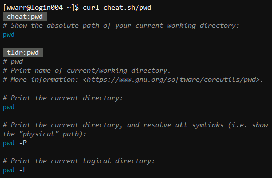

## Reference

### Command Concepts

Commands are entered at the prompt. The prompt can take many forms, typically something like one of the following. Common features are: (1) a prompt character, often the dollar sign `$`; (2) a caret to indicate where characters will be inserted when you type, typically a blinking underscore `_` or rectangle; (3) color to enhance meaning of various components.

- Bash on Cheaha...

    

- Git Bash on Windows Desktop...

    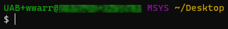

- Oh My Zsh on Debian...

    

Commands take the form `command [optional] <required>`. The word `command` should be replaced with the literal name of the command, such as `pwd`, `ls` and `cd`, among many others.

The text `[optional]` is for flags and inputs that are not required to run the command or that have default values. These flags can be useful for modifying the behavior or output of the command.

The text `[required]` is for flags and inputs that _are_ required to run the command. These must be supplied by the user or the command will not function or produce an error.

Flags start with the character `-` as with the `-l` flag in `ls -l` (see [ls](#list-files-and-directories-ls)). Flags that do not require input can be combined as `ls -al`. Flags that require input may not be combined as with the flags `-n` and `-m 2` in `grep -n -m 2 pattern textfile.txt` (see [grep](#search-for-text-grep)).

All inputs are separated by the space character ++space++. If you wish to or must use a space character in an input, that input must be surrounded by quotation marks. Note that single quotes and double quotes have different behavior. Single quotes `''` interpret all characters between them literally. Double quotes `""` interprets [special characters](#special-escaped-characters). In most cases, especially with [variable](#environment-concepts) contents, double quotes `""` are preferred.

All commands are run in a process. By default, commands run at the shell prompt are run in the shell process, and wait for execution to stop before returning control to you. It is possible to regain control earlier in a number of ways.

<!-- markdownlint-disable MD046 -->
!!! warning

    Copying commands from rich-text sources, such as `.pdf`, Microsoft Office and webpages, can result in copying special or invisible unicode characters. These characters can cause commands to behave unexpectedly and can be difficult to diagnose. Instead, please try pasting your command into a plain-text editor, like notepad, before copying to the shell prompt.
<!-- markdownlint-enable MD046 -->

#### How do I regain control of the prompt while a command is running?

- Running commands may be terminated using ++ctrl+c++. Pressing it once will request a graceful termination of the running command. Pressing it more than one will attempt to immediately kill the program.
- Open a new shell terminal and use that instead.
- Start the command as `command [optional] <required> &`. Note the trailing ampersand character `&`, which causes the command to be run asynchronously in the background.

#### How do I terminate a process running asynchronously?

<!-- markdownlint-disable MD046 -->
!!! danger

    The commands listed here can cause loss of work by termination of incorrect processes if not used carefully.
<!-- markdownlint-enable MD046 -->

To kill a process running in another shell terminal or running in the background, use either `kill` or `pkill` together with an appropriate signal flag. The flag `-15` sends `SIGTERM` which will allow the program to terminate itself gracefully. The flag `-9` sends `SIGKILL` and will immediately terminate the process, in case `-15` is not working.

- `kill <signal> <pid>` if you know the process id `<pid>` of the process. Use `ps -u <username>` to see your running processes. On Cheaha you can use `ps -u $USER` as a shortcut.
- `pkill <signal> <name-pattern>` if you know the name of the process.

<!-- markdownlint-disable MD046 -->
!!! warning

    Using `pkill` requires carefully thinking of an appropriate name pattern. An incorrect name pattern can cause unwanted termination of processes that may be important to you. Process termination cannot be stopped or undone.
<!-- markdownlint-enable MD046 -->

### Special (Escaped) Characters

Backslash `\` is used to write literal versions of certain special characters. Backslash is also called the escape character, and the special characters are also called escape sequences. Character escape sequences are useful in situations where you need a representation of a character, instead of the result of pressing the corresponding key on your keyboard. For example, if you want to store a newline character in a string then you can't just press ++enter++. If you did, you would immediately execute the command before you finished the string. Instead you can type `\n`, which is the escape sequence for a newline character.

- `\t` is interpreted as a tab character. The plain-text equivalent of pressing ++tab++.
- `\n` is interpreted as a newline character. The plain-text equivalent of pressing ++enter++.
- `\\` is interpreted as a single backslash.

At the shell prompt, double quotes `""` interpret newline characters, while single quotes `''` do not.

Below is an example file containing escaped characters (shown in [nano](#edit-plain-text-files-nano)), and its interpreted output (shown with [echo](#test-a-command-echo)).

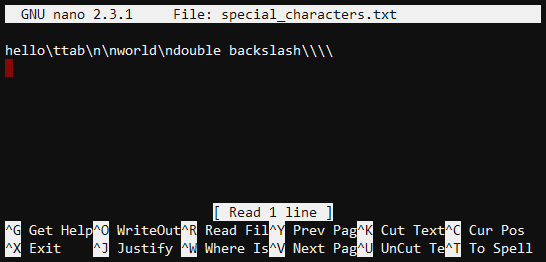


### Piping and Command Chains

Commands may be composed into chains using pipes with the pipe character `|`. For example, `ls -l | wc -l` counts the number of lines returned by `ls -l` (see [ls](#list-files-and-directories-ls) and [wc](#count-lines-words-and-characters-wc)). **Warning** This construct does not accurately count the number of items in a directory, and is only for demonstration purposes. Do not use this exact command chain in practice.

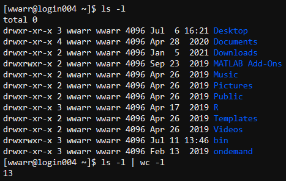

### Redirects

Command inputs and outputs may be redirected with the characters `<` for input and `>` for output. Output redirects using `>` overwrite the contents of existing files and are destructive. Using `>>` in place of `>` appends contents to a file, rather than overwriting the contents.

- Inputs come from `STDIN` or `0`.
- Typical output is written to `STDOUT` or `1` and errors are written to `STDERR` or `2`.
- `ls -l 1> dirlist` stores the directory listing to the file `dirlist`. In this case using `>` is the same as `1>`.

    

- `ls -l doesnotexist 1> error 2>&1` stores the error message to the file `error`. The text `2>&1` means write `STDERR` to `STDOUT`.

    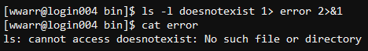

- `wc -l 0< lines` reads the contents of file `lines` and counts the number of lines. Note that for `wc` this is not needed, but may be needed for other commands. In this case using `<` is the same as `0<`.

    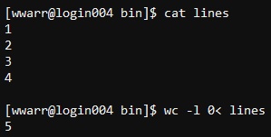

For more information on the commands used in the examples, see [ls](#list-files-and-directories-ls), [wc](#count-lines-words-and-characters-wc) and [cat](#display-file-contents-cat-less).

<!-- markdownlint-disable MD046 -->
!!! danger

    Output redirects using `>` are destructive. The contents of the target file are immediately overwritten when the command is executed. It is not possible to recover the contents of the file under any circumstances. Researchers are responsible for maintaining backups of their files.
<!-- markdownlint-enable MD046 -->

### Path Concepts

- The _working directory_ is the directory you are currently in and may be identified using the command `pwd`.
- Dot `.` is a shortcut for the working directory. This is only used in some contexts.
- Double dot `..` is a shortcut for the immediate parent directory of whatever comes before it.
- Twiddle `~` is a shortcut for your home directory.
- Forwardslash `/` is the path to the root directory of the filesystem, which has no parent.
- Files and directory names starting with `.` are hidden.
- Paths are formed of text-based directory names separated by `/`
    - _Absolute paths_ start at the root directory, e.g. `/home/user/documents/`.
    - _Relative paths_ start at the working directory, e.g. `bin`.

    Below are examples of constructed paths tested with [ls](#list-files-and-directories-ls).

    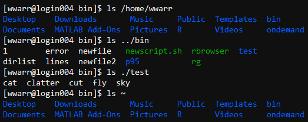

### Glob Syntax

- _Glob_ is a shorthand syntax for dealing with many files and directories matching simple patterns.
    - Question mark `?` matches a single character. `c?t` matches both `cat` and `cut`.
    - Star `*` matches any string. `c*` matches `cat`, `cut`, and `clatter`. `*.png` matches all `png` files.
    - Double star `**` matches any number of directories with any names. `**/*.png` matches all `png` files within any subdirectory of the working directory. This is not commonly used, but extremely useful for some applications.

    Below are examples of glob usage tested with [ls](#list-files-and-directories-ls).

    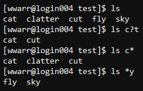

### Environment Concepts

- Environment variables may be assigned by using `var=value` where `var` is the variable name and `value` is its value. Below is an example tested with [echo](#test-a-command-echo).

    

- Environment variable values may be expanded by using `"${var}"` where `var` is the variable name.
    - On Cheaha...
        - `"${HOME}"` expands to the path to your home directory.
        - `"${USER_DATA}"` expands to the path to your `data/user/<username>` directory.
        - `"${USER}"` expands to your user name.
    - _Always_ use double quotes around variables. DO use `"${HOME}"`, do NOT use `${HOME}`. Double quotes ensure that space characters in expanded values are handled appropriately. Below, note the error occurring without double quotes due to the spaces in the directory name. Double quoting the variable fixes the error. The commands used to test are [ls](#list-files-and-directories-ls), [cd](#change-working-directory-cd) and [pwd](#show-working-directory-pwd).

        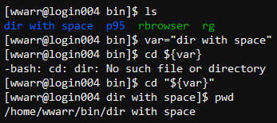

    - Expanding a variable that isn't defined returns an empty string and does _not_ produce an error, but may cause unexpected behavior.

- Environment variables may be expanded in paths and command arguments to save effort and time.
    - `"${USER_DATA}/project/inputs"`
    - `command ${VARIABLE}`

<!-- markdownlint-disable MD046 -->
!!! warning

    Modifying, changing or overwriting existing environment variables while in a shell session can result in unexpected behavior. The environment can be reset to its default starting state by exiting the shell session and starting a new session.
<!-- markdownlint-enable MD046 -->

### Script Concepts

- Scripts are a way to bundle many commands together and execute them in sequence.
- Scripts should start with the intended interpreter using a hash-bang like `#!/bin/bash`.
    - Most commonly `bash` is the intended interpreter on our systems.
    - Other shell interpreters may be installed and used, but are not necessary.
- To execute the script given by the hash-bang or she-bang (pronounced shih-bang) `#!`, use `./script.sh` in the folder containing the script. Executable permissions must be set to use a script this way, with `chmod u+x <script-path>`.
- To execute the script using a specific interpreter use `bash <script-path>`, or replace `bash` with your preferred interpreter. Beware that not all interpreters behave the same way. Executable permissions do not need to be set to use a script this way.
- Space-separated arguments may be passed to a script when executed in the same way as any other command.

### Script Arguments

Arguments or parameters are passed to a command or script as a space separated list. Arguments may be referred to using numeric variables. The following list contains examples of variable references to arguments.

- `"${0}"` is the execution path. If you use `./script.sh` then `"${0}"` will be `./script.sh`.
- `"${1}"`, `"${2}"`, etc., are the first, second, etc., space separated variables. Calling `./script.sh hello world` will have `$1 = hello` and `$2 = world`. Many arguments may be passed this way.
- `${@}` is all arguments except `"${0}"`. **Important!!** Note that double quotes `"` are not used! Double quoting would bind all the arguments together. If you need to pass a group of arguments to another script, be cautious about using quotes.
- `${@: 2}` is all arguments starting with `"${2}"`.
- `${@: 2:2}` is the second and third argument.
- `${@: -2}` is the last two arguments.
- `${@: -2:1}` is the second to last argument only.

Below is an example script file, hash-bang not shown, demonstrating how each argument variable works, and its interpreted output. The text editor [nano](#edit-plain-text-files-nano) is used to display the file and [chmod](#manage-permissions-of-files-and-directores-chmod) is used to modify file permissions.

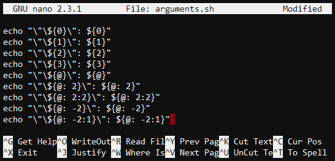

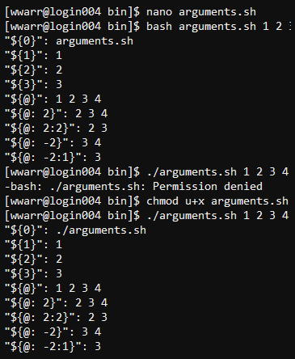

<!-- markdownlint-disable MD046 -->
!!! tip

    Using the shell requires some defensive techniques. Never use the space character ++space++ in variables, directory names, file names, etc. Instead, only use letters, numbers and the underscore character `_`. In `bash` it is also allowed to use the hyphen character `-`, but this may not be portable to other shell interpreters. Names should only start with one or more letters or numbers.

    Do protect yourself from others who might use the space character ++space++ by always double quoting your variables like `"${var}"` instead of `${var}` or `$var`.
<!-- markdownlint-enable MD046 -->

## Commands for Solutions to Common Problems

Below is a reference guide to various commands through the lens of problems to be solved.

<!-- markdownlint-disable MD046 -->
!!! note

    When you see words surrounded by angle brackets like `<name>`, you should not take that as a literal part of the command. In the case of `<name>` you would replace it with whatever name is appropriate.
<!-- markdownlint-enable MD046 -->

<!-- markdownlint-disable MD046 -->
!!! important

    If you are using Cheaha and working with more than a few files or directories, or the files are large, please run your shell commands in a [Job Context](../cheaha/slurm/submitting_jobs.md#interactive-jobs-with-srun).
<!-- markdownlint-enable MD046 -->

<!-- markdownlint-disable MD046 -->
!!! danger

    It is safest to assume that any command run at the shell _cannot_ be undone. Be especially aware of the `rm` command, which is destructive. We do not maintain backups of any files, so once those files are removed or deleted they cannot be recovered by us under any circumstances. Researchers are responsible for maintaining backups of their files.
<!-- markdownlint-enable MD046 -->

### Show working directory (`pwd`)

Use `pwd`, which stands for present working directory.


### List files and directories (`ls`)

Below are common uses of `ls`, short for "list", used to display directory contents and examine details of files and directories. It may be used to [check file permissions](#how-to-check-permissions) when using [chmod](#manage-permissions-of-files-and-directores-chmod).

- Visible files only, list: `ls`. Multiple entries per line.

    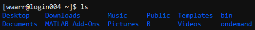

- Visible files only, table: `ls -l`. One entry per line and shows [permissions](#manage-permissions-of-files-and-directores-chmod), size in bytes on disk, and timestamp.

    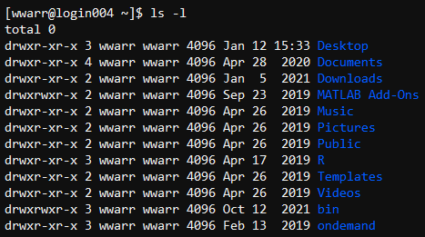

- Visible and hidden files, list `ls -a`. Same as `ls`, but has hidden files and directories and `.` and `..`. Example below is truncated to conserve page space.

    

- Visible and hidden files, table `ls -al`. Same as `ls -l` but has hidden files and directories and `.` and `..`. Example below is truncated to conserve page space.

    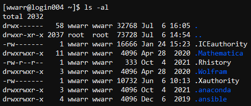

### Examine disk usage (`du`)

Use `du` to examine disk usage of files and directories. By default all values are given in bytes, use the [flag](#command-concepts) `-h` to give values in `K`, `M`, `G` and `T` for kilobytes, megabytes, gigabytes and terabytes, respectively. Use the [flag](#command-concepts) `-s` to summarize space used by directories. Below is an example of `du -sh`. Note that only directories with [read permissions](#manage-permissions-of-files-and-directores-chmod) can be examined by `du`.

When culling files to conserve storage space, it helps to find the largest files and directories. To find the ten largest, use the command `du -sh .[^.]* * | sort -hr | head -n10` in the top-level directory of your data. To better understand this command chain, see also [sort](#sort-file-contents-sort), [head](#examine-start-and-end-of-file-head-tail) and [piping](#piping-and-command-chains).

### Change working directory (`cd`)

- To change to a different directory, use `cd <directory-path>`.
    - The variable `<path>` may be relative, like `my/path`. This will move to the subdirectory `my/path` within the working directory. Relative directory paths may contain multiple `..` shortcuts to indicate parent directories.
    - Or `<path>` may be absolute, like `/my/path` which will move to the directory `/my/path`, starting at the root of the filesystem. Recall the root directory is just `/`.
- To move up to the parent of the working directory, use `cd ..`.

Below are examples of `cd` usage, tested with [ls](#list-files-and-directories-ls).

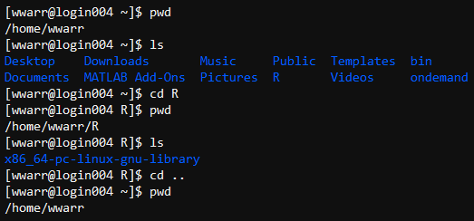

### Copy files and directories (`cp`)

Below are use cases with associated commands, and examples tested using [ls](#list-files-and-directories-ls).

- Single file, change name: `cp -a <source-file-path> <destination-file-path>`.

    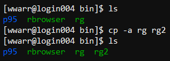

- Single file, keep name: `cp -a <source-file-path> <destination-directory-path>`.
- Directory: `cp -a <source-directory-path> <destination-directory-path>`.

    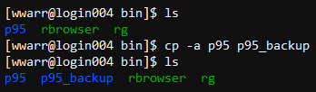

- Glob: `cp -a <source-path-glob> <destination-directory-path>`.

### Move files and directories `mv`

Below are use cases with associated commands, and examples tested using [ls](#list-files-and-directories-ls).

- Single file, change name: `mv <source-file-path> <destination-file-path>`.

    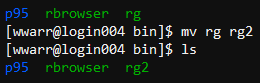

- Single file, keep name: `mv <source-file-path> <destination-directory-path>`.
- Directory: `mv <source-directory-path> <destination-directory-path>`.

    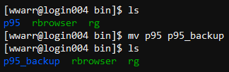

- Glob: `mv <source-path-glob> <destination-directory-path>`.

### Delete files and directories (`rm`, `rmdir`)

<!-- markdownlint-disable MD046 -->
!!! danger

    The `rm` command is destructive and cannot be undone. We do not maintain backups of any files, so files that are removed or deleted cannot be recovered by us under any circumstances. Researchers are responsible for maintaining backups of their files.
<!-- markdownlint-enable MD046 -->

Below are use cases with associated commands, and examples tested using [ls](#list-files-and-directories-ls).

- Single file: `rm <file-path>`.

    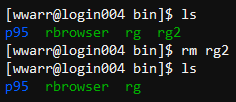

- Empty Directory: `rmdir <directory-path>`.
- Directory with Contents: `rm -r <directory-path>`.

    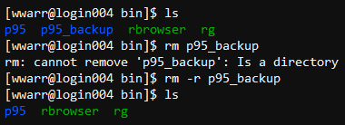

- Glob: `rm <file-path-glob>`.

<!-- markdownlint-disable MD046 -->
!!! warning

    Careless use of the directory and glob forms of `rm` can lead to unwanted data loss. Be sure to double check your commands before executing.
<!-- markdownlint-enable MD046 -->

### Download files from internet sources (curl)

Use `curl` to download files and webpages from internet sources. By default `curl` writes to `STDOUT`. If you wish to save the output to a file, use the `-o <file-path>` command. Note that `curl` does not transform, encode or decode the data in any way, and it is saved exactly as received from the supplied url.

By far the most common usage is to download a file. To do so use `curl -o <file-path> <url>`, where `<file-path>` is the desired local path to save and `<url>` is the web address of the source data.

### Create directories (`mkdir`)

Use `mkdir <directory-name>`. Example below is tested using [ls](#list-files-and-directories-ls).


### Create files (`touch`)

Use `touch <file-path>`. Example below is tested using [ls](#list-files-and-directories-ls).

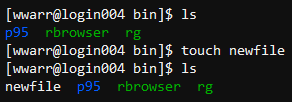

### Edit plain-text files (`nano`)

Use `nano <file-path>`. If the file exists, it will be opened. If the file does not exist, it will be stored in memory until saved. If the contents are not saved they will be discarded and cannot be recovered. You may also use just `nano`, without a file path, to create a new empty file.


The character `^` is the ++ctrl++ key, so `^y` would require pressing ++ctrl+y++. To save use ++ctrl+x++ to open the exit prompt.

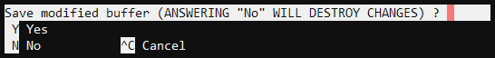

Press ++y++ for yes to bring up the save prompt.

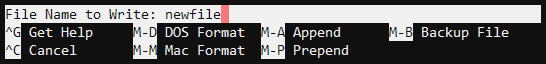

If you opened `nano` using an existing file, or passed in a file path, then the `File Name to Write` prompt will be autofilled with the given file name. If not, you will need to enter it here. When you have the file name entered as desired, press ++enter++ to save. Below is a demonstration of the shell with the new file listed using `ls`. Example below is tested using [ls](#list-files-and-directories-ls).

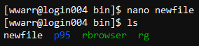

#### Searching for text in `nano`

Use the key combination ++ctrl+w++ to search for text. Follow the prompts as they appear to navigate.

### Count lines, words and characters (`wc`)

- Lines: `wc -l <file-path>`.
- Words: `wc -w <file-path>`.
- Characters: `wc -m <file-path>`.
- All: `wc <file-path>`.

Below are example outputs of a file named `newfile` containing the text `hello world` followed by a blank line. Note the file is [redirected](#redirects) to `wc` from `STDIN`.


### Display file contents (`cat`, `less`)

Use `cat <file-path>` to display the contents of the file at `<file-path>`.

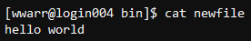

If the contents are too long to be displayed on one screen, you can pipe the output to `less` to add scrolling functionality by using `cat <file-path> | less`. Use the keyboard key ++q++ to stop using `less`.

Below are two images showing what `less` looks like. Note the last line of each image, which indicates you are using the `less` environment. The first image is an example where there is more text below the visible text. The second image is an example at the bottom of the text.

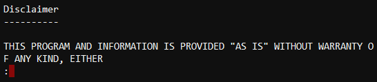


### Examine start and end of file (`head`, `tail`)

To display only the first two lines use `head -n 2 <file-path>`. Use `tail` instead of `head` for the last two lines.

Below is an image showing the use of `head` and `tail` on a file with four lines. The file was created by [redirecting](#redirects) the [echo command](#test-a-command-echo) to a file, using the [special newline character](#special-escaped-characters) to add line breaks.

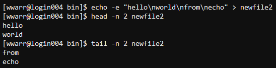

### Sort file contents (`sort`)

- Alphabetical: `sort <file-path>`.
- Numeric: `sort -n <file-path>`.
- Ignore case: `sort -i <file-path>`.

Lines in the input file are returned in sorted order. The results are displayed in stdout. To write the sorted result to a file use `sort <file-path> > <new-file-path>`.

Below is an image showing the use of `head` and `tail` on a file with four lines. The file was created by [redirecting](#redirects) the [echo command](#test-a-command-echo) to a file, using the [special newline character](#special-escaped-characters) to add line breaks.

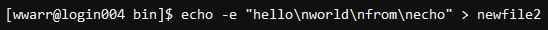

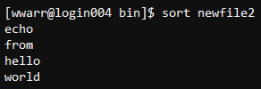

### Test a command (`echo`)

Use `echo "<command>"` to see the expanded command without executing it. For example

```bash
echo "cp -a $USER_DATA/mydir $HOME"
# prints
cp -a /data/user/<username>/mydir /home/<username>
```

Use the `-e` flag if you need to interpret escaped characters such as `\t` for tab or `\n` for new line. The command being examined in the example below is [cp](#copy-files-and-directories-cp)


### Search for text (`grep`)

Use `grep "<pattern>" "<file-path>"` to search for `<pattern>` in the file at `<file-path>`. Use the `-n` flag to display line numbers with results.

Below is an example of `grep -n` on a file. The number at the start of the result line is the line number of the pattern match. The matched portion is shown in red while other text on the same line is shown in white. The file was created by [redirecting](#redirects) the [echo command](#test-a-command-echo) to a file, using the [special newline character](#special-escaped-characters) to add line breaks. We are looking for the literal text "echo" within the file.

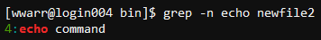

### Close the session (`exit`)

Use `exit`.

### Clear the shell display (`clear`)

Use `clear`.

### Where is a command located? (`which`)

Use `which <command-name>`. The command being searched for is [ls](#list-files-and-directories-ls).

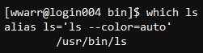

### What does a command do? (`whatis`, `man`)

For builtin command and aliases there are two distinct options for learning more. The command being examined is [ls](#list-files-and-directories-ls).

- Use `whatis <command-name>` to get a brief summary of the command.
- Use `man <command-name>` to get the full help file in a `less` environment. Use `q` on your keyboard to exit `less`.


### Remotely access shell on other machines (`ssh`)

See our [SSH Section](../uab_cloud/remote_access.md#command-line-via-ssh) for more detailed information.

### Remotely access or transfer files between machines (`sftp`)

See our [Remote Access - Data Transfer Section](../uab_cloud/remote_access.md#data-transfer) for more detailed information.

### Submit and manage jobs on Cheaha

See our [Slurm Section](../cheaha/slurm/introduction.md) for more detailed information.

### Manage permissions of files and directores (`chmod`)

Use `chmod` with the least permissions needed to accomplish a task.

Permission management is an important part of managing access and control of files and directories.

<!-- markdownlint-disable MD046 -->
!!! danger

    Please carefully consider security when working in shared spaces like Cheaha. Setting private directories or files as readable by other users can inadvertently expose sensitive or protected information and may violate IT policy, FERPA, HIPAA or some combination.

    There are legitimate use cases for truly shared spaces. Please [Contact Us](../index.md#how-to-contact-us) if you need to share information with other users or collaborators and aren't sure of how to do so securely.
<!-- markdownlint-enable MD046 -->

#### What Permissions Do

Setting the permissions of a file affect the _contents_ of only that file. A read-only file can still be deleted by users with write permissions in its parent directory.

- Read permissions allow viewing and copying contents of a file.
- Write permissions allow changing the contents of a file, including deleting all of the contents.
- Execute permissions allow using the file as an executable. Helpful for scripts and compiled programs. Scripts and interpreted language files, like Python, must also have read permission set.

Setting the permissions of directories affects what can be done with contained files and directories.

- Read permission allows the use of `ls` within the directory. `cp` may be used to copy files from the directory to somewhere else.
- Write permission allows creation of files and directories, as well as the use of `touch`, `mv` and `rm` on files and directories, within the directory. `cp` may be used to copy files into the directory.
- Executable permission allows setting the directory as working directory and the use of `cd` into the directory.

Permissions are _not_ inherited from their parent directory.

#### How to Check Permissions

Use `ls -ald <path>` to see the permissions on the file or directory at `<path>`. The `-d` flag lists directories instead of their contents.

#### Patterns for Setting Permissions

Two separate patterns can be used to set or change permissions on files and directories. Either may be used, but they cannot be combined in a single use of `chmod`. In the example images below, the command [ls](#list-files-and-directories-ls) is used to [check permissions](#how-to-check-permissions) and the command [cat](#display-file-contents-cat-less) is used to display the contents of the [script](#script-concepts).

1. Symbols

    The letter and symbol pattern is in the form `a=r`. There are three parts.

    1. A collection of letters denoting who, e.g. `a` in this case. Multiple letters may be used.

        - `u` the owner of the file or directory
        - `g` the owner's group members
        - `o` users outside the owner's group
        - `a` all users (same as `ugo`).

    1. A symbol indicating how to change the permissions

        - `=` set permissions
        - `-` remove permissions
        - `+` add permissions

    1. A collection of letters denoting which permissions to change. Multiple letters may be used.

        - `r` read
        - `w` write (change the contents)
        - `x` execute

    To add executable permission for only the owner `chmod u+x <file-path>`. Useful for custom scripts and compiled executables you will use directly from the command line. To set read-only permission for everyone use `chmod a=r <file-path>`.

    <!-- markdownlint-disable MD046 -->
    !!! note

        Using `=` to set permissions will both add _and_ remove permissions. Using `a=r` will take away existing write and execute permissions.
    <!-- markdownlint-enable MD046 -->

    Below is an example of `chmod` used symbolically to set user execute permissions on a script. Note the error before permissions are set.

    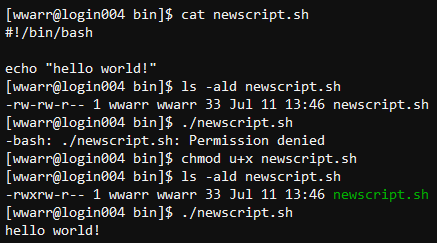

1. Numerals

    Bit mask patterns are in the form `755`. Each digit is the sum of three binary bits. The bits are

    - `4` read
    - `2` write
    - `1` execute

    The left digit is the owner's permissions. Middle digit is the owner's group. Right digit is users outside the owner's group.

    Setting `chmod 755` means the following:

    - For the owner, set `4` read, `2` write and `1` execute. `4+2+1=7`.
    - For the owner's group, set `4` read, `1` execute. `4+1=5`.
    - For other users, set `4` read, `1` execute. `4+1=5`.

    Setting `755` is a common pattern for system-wide scripts. Because the `4` read and `1` executable bits are set for all users, it can be called from anywhere by any other script, and not just the owner. However, the `2` write bit is set only for the owner, so other users cannot modify the contents of the script.

    Below is an example of `chmod` used numerically to add execution permissions to all users. Note the error before permissions are set.

    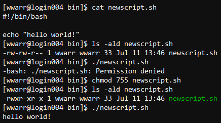

#### Examples

- `chmod u+x script.sh` adds execute permission for you, to a script.
- `chmod 755 script.sh` makes a script readable and executable by all, but only writeable by you. This is a common permission for non-sensitive files and directories.
- `chmod 740 sensitive_directory` make a directory readable by you and your group, and writeable and executable by only you. Other users cannot delete files in this folder.
- `chmod ug=r notes.txt` followed by `chmod o-rwx notes.txt` makes a file read-only for you and your group and removes all permissions for other users.

### Manage group ownership (`chgrp`)

To change group ownership of files and directories use `chgrp`.

The command `chgrp` may only be used on a file or directory if you own it, or if you are a member of its current group owner _and_ a member of its new group owner.

For single files use `chgrp <new-group> <file>`.

To change a directory and all of its contents recursively use `chgrp -hR <new-group> <file>`. The `-h` flag will avoid walking through the targets of symbolic links.

<!-- markdownlint-disable MD046 -->
!!! warning

    When using `chgrp -R`, the default behavior is to walk through the contents of symbolic links. If this is not desired, use `-hR`.
<!-- markdownlint-enable MD046 -->

### Manage researcher access to files and directories (`getfacl`, `setfacl`)

In research environments, managing access to files and directories is key for security and collaboration. While the [standard Linux permissions (`rwx`)](#manage-permissions-of-files-and-directores-chmod) are useful, they lack the flexibility required to set different levels of access. Access Control Lists (ACLs) offer a more flexible solution, allowing settings for individual users or groups based on specific needs without affecting the group structure of files and directories. ACLs are particularly useful in research settings, where multiple collaborators may require varying levels of access to the same data.

{{ read_csv('workflow_solutions/res/acls_and_standard_linux_permission.csv', keep_default_na=False) }}

**Key ACl commands**:

- `getfacl`: Command to get the ACL of a file or directory. This lets you view what the ACLs are set to and see the current permissions for users and groups.
- `setfacl`: Command to set or modify the ACL of a file or directory. This lets you change or assign specific permissions for individual users or groups without altering the file's ownership or group.

#### Viewing Current ACLs (`getfacl`)

The `getfacl` command is used to view the current ACLs set on a file or directory. When you run this command on a file, for example `test.txt`, the command `getfacl test.txt` will display detailed information about the ACLs, including who has access to the file and what permissions they have.

```bash
# file: test.txt
# owner: bhbelay
# group: rc-datasci
user::rw-
group::rw-
other::r--
```

The output shows that for the file `test.txt`, the owner is `bhbelay` and the group associated with the file is `rc-datasci`. Both the owner and group have the same read and write (`rw-`) permissions, so there is no difference in their access. The other lines of the output:

- `user::rw-`: specifies the permissions for the owner of the file, `bhbelay`. The owner has read (`r`) and write (`w`) permissions, but no execute permissions (`-`).

- `group::rw-`: specifies the permissions for the group associated with the file, `rc-datasci`. Members of the group have read (`r`) and write (`w`) permissions, but no execute permissions (`-`).

- `other::r--`: specifies the permissions for others (users who are neither the owner nor members of the group). Others have only read (`r`) permission, with no write or execute permissions (`--`).

#### Modifying ACLs (`setfacl`)

The `setfacl` command used to grant or restrict access to files and directories for individual users or groups. The general syntax for the `setfacl` command: `setfacl <options> <permissions> <file/directory>`.

- Options:
    - `-m`: Modify ACL (add or update permissions).
    - `-x`: Remove ACL.
    - `-b`: Remove all ACL entries.
    - `-d`: Set default ACL (applies to new files/directories).
    - `-R`: Apply changes recursively.
- Permissions:
    - `r`: read
    - `w`: write (change the contents)
    - `x`: execute

Below are examples of modifying ACLs (`setfacl`): `<USER>`, `<GROUP>`,and `<DIRY>` represent the user, group, and directory, respectively.

- Grant read and write permissions to a user with `setfacl -m u:<USER>:rw- test.txt`. The `-m` flag modifies the ACL, and `u:<USER>:rw-` grants read and write access to the specified user on the file `test.txt`.
- Grant read access to all users in the group, `<GROUP>`, with `setfacl -m g:<GROUP>:r-- test.txt`. The `g:<GROUP>:r--` grants read-only (`r`) access to the group `<GROUP>`.
- Remove ACL for a specific user with `setfacl -x u:<USER> test.txt`. The `-x` flag removes the ACL entry for the user `<USER>` on the file `test.txt`, so they `<USER>` no longer have any permissions on the file `test.txt`.
- Set default permissions for a directory (i.e it will apply to new files and directories created inside this directory)with `setfacl -d -m u:<USER>:rw- <DIRY>`. The `-d` flag sets a default ACL. Here, `u:<USER>:rw-` grants read (`r`) and write (`W`) access to the user `<USER>` for any new files or directories created within the `<DIRY>` directory ( but it does not apply to existing files in `<DIRY>`).
- Apply ACL changes recursively to all files and subdirectories within a directory with `setfacl -R -m u:<USER>:rw- <DIRY>`. The `-R` flag applies the ACL changes recursively. This command grants read and write access to the user `<USER>` for all files and subdirectories under `<DIRY>`.
- Remove all ACL entries for a file or directory with `setfacl -b test.txt`. The `-b` flag removes all ACL entries, restoring the default file system permissions to the file `test.txt`.
- To remove all ACL entries recursively for all files and subdirectories within a directory `<DIRY>`, use a command `setfacl -bR <DIRY>`. The `-b` flag removes all ACL entries, and `-R` applies it recursively to the directory `<DIRY>` and its contents.

If you need assistance setting permissions, feel free to contact us via <support@listserv.uab.edu>, providing the user's BlazerID and the directory or file you wish to modify, along with the permissions you want to grant or remove.
