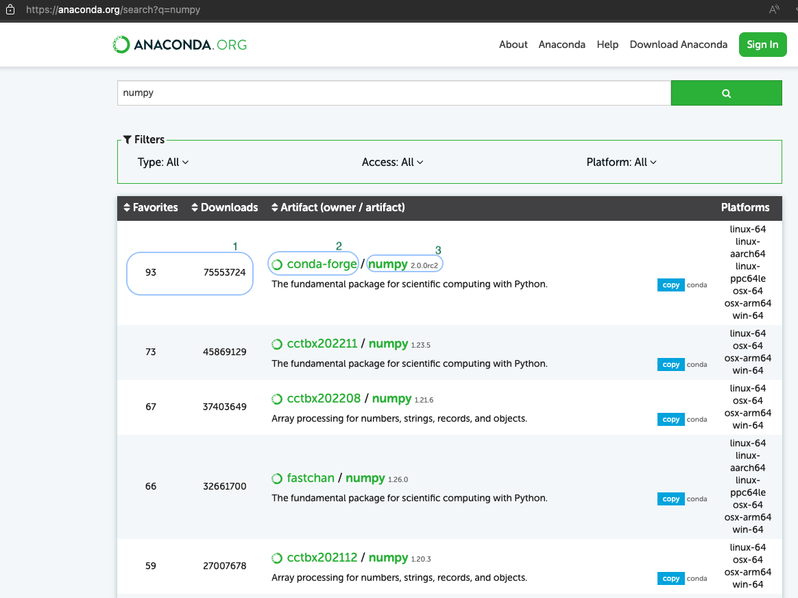
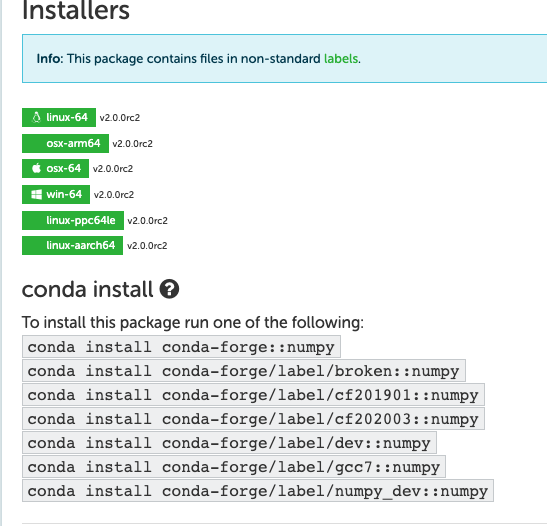
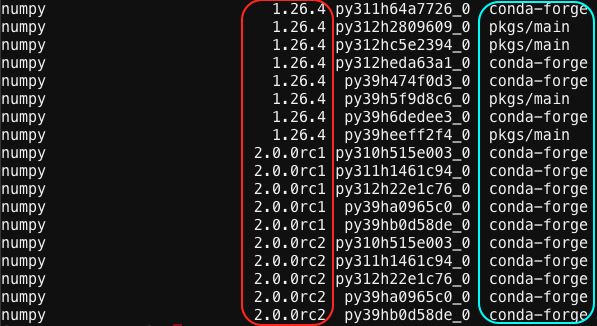

# Why use `conda`?

<!-- markdownlint-disable MD046 -->
!!! important

    Recent changes to the Anaconda Terms of Service have required all UAB researchers to change how they use `conda`. See our [Conda Migration FAQ](conda_migration_faq.md) for more information.
<!-- markdownlint-enable MD046 -->

Python is a high level programming language that is widely used in many branches of science. As a result, many scientific software packages have been developed in Python, leading to the development of a package manager called `conda`. `conda` is the most popular and widely-supported Python package management software for scientific research.

Benefits of `conda`:

- Shareability: environments can be shared via human-readable, text-based YAML files.
- Maintainability: the same YAML files can be version controlled using git.
- Repeatability: environments can be rebuilt using those same YAML files. Libraries are pre-built and stored on remote servers for download instead of being built on your local machine or on Cheaha, so two computers with the same operating system, requesting the same package version, will end up using the same executable.
- Simplicity: dependency matrices are computed and solved by `conda`, and
- Ubiquity: nearly all Python developers are aware of the usage of `conda`, especially in scientific research, so there are many resources available for learning how to use it, and what to do if something goes wrong.

`conda` can also install `pip` and record which `pip` packages are installed, so `conda` can do everything Pip can, and more.

<!-- markdownlint-disable MD046 -->
!!! important

    If using `conda` on Cheaha, please see our [`conda` on Cheaha page](../cheaha/software/software.md#conda-on-cheaha) for important details and restrictions.
<!-- markdownlint-enable MD046 -->

## Important Terms

- **`conda`**: Refers to the executable software program that researchers interact with to create and manage environements and install packages.
- **Conda**: Refers to a software distribution containing `conda` and related software and features.
- **package**: Reearch-related software installed and managed by `conda`, held in environments. Packages are selected from channels and downloaded from remote data servers.
- **environment**: A collection of packages that `conda` can manage. Users can switch between environments to allow for development of multiple projects that have different requirements.
- **YAML file**: A structured, human-friendly file definining a single environment. Sharing the file with others allows for replication of an environment. These files enhance collaboration when added to your project's [version control](../workflow_solutions/git.md), especially when shared on [GitHub or GitLab](../workflow_solutions/git_collaboration.md). YAML stands for [Yet Another Markup Language](https://yaml.org/).
- **channel**: A listing of packages available for download.
    - The `anaconda` and `r` channels are subject to the Anaconda Terms of Service and may not be used for UAB business.
    - The `conda-forge` and `bioconda` channels are free to use.
- **version**: A string of numbers and dots `.` denoting the version of a package. Often these are structured like `1.2.3` and most of the time follow [Semantic Versioning](https://semver.org/) conventions, but not always. Larger numbers indicate more recent versions. Some are structured using dates instead like `2024.08`, with more recent dates indicating more recent versions.

<!-- markdownlint-disable MD046 -->
!!! note

    We use CAPITAL LETTERS to denote where you will need to replace text with your own values, such as `ENVIRONMENT`, `PACKAGE`, `CHANNEL`, and `VERSION`.

    CAPITAL LETTERS prefixed by a dollar sign `$` are shell variables and do not need to be substituted.
<!-- markdownlint-enable MD046 -->

## Using `conda`

`conda` is a package manager, meaning it handles all of the difficult mathematics and logistics of figuring out exactly what versions of which packages should be downloaded to meet your needs, or inform you if there is a conflict.

`conda` is structured around environments. Environments are self-contained collections of researcher-selected packages. Environments can be changed out using a simple package without requiring tedious installing and uninstalling of packages or software, and avoiding dependency conflicts with each other. Environments allow researchers to work and collaborate on multiple projects, each with different requirements, all on the same computer. Environments can be installed from the command line, from pre-designed or shared YAML files, and can be modified or updated as needed.

The following subsections detail some of the more common commands and use cases for `conda` usage. More complete information on this process can be found at the [`conda` documentation](https://conda.io/projects/conda/en/latest/user-guide/tasks/manage-environments.html#). Need some hands-on experience? You can find instructions on how to install PyTorch and TensorFlow using `conda` in this [tutorial](../cheaha/tutorial/pytorch_tensorflow.md).

<!-- markdownlint-disable MD046 -->
!!! important

    If using `conda` on Cheaha, please see our [`conda` on Cheaha page](../cheaha/software/software.md#conda-on-cheaha) for important details and restrictions.
<!-- markdownlint-enable MD046 -->

### Create an Environment

In order to create an empty environment you can install packages into, use the `conda env create` command.

```bash
# Create an empty environment.
conda env create --name ENVIRONMENT
```

If you are trying to replicate a pipeline or analysis from another person, you can also recreate an environment using a YAML file, if one was provided.

```bash
# Replicate an environment from a YAML file named environment.yml.
conda env create --file environment.yml
```

On Cheaha all of your conda environments are stored in `/home/$USER/.conda/envs`, by default.

### Activate an Environment

From here, you can activate the environment using the `conda activate` command.

```bash
conda activate ENVIRONMENT
```

When your environment has loaded, your terminal prompt should change to look similar to the following.

```text
(ENVIRONMENT) [BlazerID@c0000 ~]$
```

Once the environment is activated, you are able to install any python libraries needed for your analysis.

### Install Packages

To install packages using `conda`, use the `conda install` command.

<!-- markdownlint-disable MD046 -->
!!! important

    The `anaconda` and `r` channels are subject to the Anaconda Terms of Service and may not be used for UAB business. The `conda-forge` and `bioconda` channels are free to use.
<!-- markdownlint-enable MD046 -->

```bash
# Install from default channels. NOT recommended!
conda install PACKAGE                   # most recent version possible
conda install PACKAGE=VERSION           # specified version

# Install from a specified channel. Recommended!
conda install CHANNEL::PACKAGE          # most recent version possible
conda install CHANNEL::PACKAGE=VERSION  # specified version
```

#### Installing Packages with Pip

When building a `conda` environment, prefer to get all of your packages through `conda` channels to maximize compatibility. Some packages are not available through `conda` channels. Often these packages are available via [PyPI](https://pypi.org/) and may be installed using the Pip package manager. Pip may also be used to install locally-available packages, and directly from GitHub and GitLab repositories.

<!-- markdownlint-disable MD046 -->
!!! important

    When using `conda` and `pip` on Cheaha, make sure you are using a custom `conda` environment and that `pip` is installed before installing `pip` packages to prevent severe [`pip` related issues](../cheaha/software/software.md#installing-pip-packages-outside-of-your-environments).
<!-- markdownlint-disable MD046 -->

<!-- markdownlint-disable MD046 -->
!!! warning

    There are some hard-to-diagnose error that occur when installing packages using `pip` on Windows. The errors occur for Python versions between `3.10.4` and `3.10.8`, and may impact others in the `3.10` series. To maximize shareability, it is recommended to avoid those versions of Python, if possible. The issue does not appear to occur with Python `3.10.14`.
<!-- markdownlint-enable MD046 -->

```bash
# Install packages using pip.
pip install PACKAGE           # most recent version possible
pip install PACKAGE==VERSIOn  # specified version, note the `==`
pip install -r packages.txt   # multiple packages from a list in a text file
```

#### Finding Packages

<!-- markdownlint-disable MD046 -->
!!! important

    The `anaconda` and `r` channels are subject to the Anaconda Terms of Service and may not be used for UAB business. The `conda-forge` and `bioconda` channels are free to use.
<!-- markdownlint-enable MD046 -->

To find packages available on `conda` channels, use a search engine like Google. Start by searching for `PACKAGE conda-forge`. Replace `PACKAGE` with the name of the package. You might also try `bioconda` instead of `conda-forge`. If the package has a name shared with non-software products or ideas, you may need to add `software` or `research`, or both, to the end of your search string. You can also search on <https://anaconda.org>, but be sure the package you find is not from a channel subject to the Anaconda Terms of Service.

For packages in PyPI, repeat the process above but use `pypi` in place of `conda-forge` in the search string, or search directly on <https://pypi.org/>.

#### Packages for Jupyter

For more information about using `conda` with Jupyter, see the section [Working with `conda` Environments](../cheaha/open_ondemand/ood_jupyter.md#working-with-conda-environments).

### Update packages in an environment

In research, there is a balance to be struck between keeping software up-to-date and ensuring replicability of outputs. Updating software regularly ensures you have the most recent bug fixes and the highest level of security. Not updating software means you can be sure the software will behave consistently across all of your data.

When coming up with a software analysis strategy, carefully consider the following questions.

- What parts of my workflow can be done all at once after experiments are done?
- What parts of my workflow must be done as data is acquired?
- What are the specific benefits of updating a software package?
    - Fixing a bug that causes incorrect output?
    - Major security holes patched?
- What are the costs of updating?
    - Will I have to re-run some or all of my analyses?
    - Will I have to update other parts of my workflow code?
- Will I have to update other packages, and what will those impacts be?
- Does a particular update change outputs? Why did the output change?

To perform an update on the currently [activated](#activate-an-environment) environment, use the `conda update` command.

```bash
conda update PACKAGE          # updates to the most recent version possible
conda update PACKAGE=VERSION  # updates (or downgrades) to a specific version
conda update -—all            # updates all packages to the most recent version possible
```

### Deactivating an Environment

An environment can be deactivated using the following command.

```bash
conda deactivate
```

Closing the terminal will also close out the environment.

### Deleting an Environment

To delete an environment, use the following command.

```bash
conda ENVIRONMENT remove --name <env>
```

### Working with Environment YAML Files

#### Exporting an Environment

To easily share environments with other researchers or replicate it on a new machine, it is useful to create an environment YAML file.

```bash
# activate the environment if it is not active already
conda activate ENVIRONMENT

# export the environment to a YAML file
conda env export > environment.yml
```

#### Creating an Environment from a YAML File

To create an environment from a YAML file `environment.yml`, use the following command.

```bash
conda env create --file environment.yml
```

#### Sharing your environment file

To share your environment for collaboration, there are three ways to export environments.

```bash
# Cross-platform compatible.
conda env export --name ENVIRONMENT --from-history > environment.yml

# Platform and package specific.
conda env export --name ENVIRONMENT > environment.yml

# Platform and package and channel specific
conda list --name ENVIRONMENT --explicit > environment.yml
```

#### Replicability versus Portability

An environment with only `python 3.10.4`, `numpy 1.21.5` and `jinja2 2.11.2` installed will output something like the following file when `conda env export` is used. This file may be used to precisely replicate the environment as it exists on the machine where `conda env export` was run. Note that the versioning for each package contains two `=` signs. The code like `he774522_0` after the second `=` sign contains hyper-specific build information for the compiled libraries for that package. Sharing this exact file with collaborators may result in frustration if they do not have the exact same operating system and hardware as you, and they would not be able to build this environment. We would say that this environment file is not very portable.

There are other portability issues:

- The `prefix: C:\...` line is not used by `conda` in any way and is deprecated. It also shares system information about file locations which is potentially sensitive information.
- The `channels:` group uses `- defaults`, which may vary depending on how you or your collaborator has customized their `conda` installation. It may result in packages not being found, resulting in environment creation failure.

```yaml
name: test-env
channels:
  - defaults
dependencies:
  - blas=1.0=mkl
  - bzip2=1.0.8=he774522_0
  - ca-certificates=2022.4.26=haa95532_0
  - certifi=2021.5.30=py310haa95532_0
  - intel-openmp=2021.4.0=haa95532_3556
  - jinja2=2.11.2=pyhd3eb1b0_0
  - libffi=3.4.2=h604cdb4_1
  - markupsafe=2.1.1=py310h2bbff1b_0
  - mkl=2021.4.0=haa95532_640
  - mkl-service=2.4.0=py310h2bbff1b_0
  - mkl_fft=1.3.1=py310ha0764ea_0
  - mkl_random=1.2.2=py310h4ed8f06_0
  - numpy=1.21.5=py310h6d2d95c_2
  - numpy-base=1.21.5=py310h206c741_2
  - openssl=1.1.1o=h2bbff1b_0
  - pip=21.2.4=py310haa95532_0
  - python=3.10.4=hbb2ffb3_0
  - setuptools=61.2.0=py310haa95532_0
  - six=1.16.0=pyhd3eb1b0_1
  - sqlite=3.38.3=h2bbff1b_0
  - tk=8.6.11=h2bbff1b_1
  - tzdata=2022a=hda174b7_0
  - vc=14.2=h21ff451_1
  - vs2015_runtime=14.27.29016=h5e58377_2
  - wheel=0.37.1=pyhd3eb1b0_0
  - wincertstore=0.2=py310haa95532_2
  - xz=5.2.5=h8cc25b3_1
  - zlib=1.2.12=h8cc25b3_2
prefix: C:\Users\user\miniforge3\envs\test-env
```

To make this a more portable file, suitable for collaboration, some planning is required. Instead of using `conda env export` we can build our own file. Create a new file called `environment.yml` using your favorite text editor and add the following. Note we've only listed exactly the packages we installed, and their version numbers, only. This allows `conda` the flexibility to choose dependencies which do not conflict and do not contain unusable hyper-specific library build information.

```yaml
name: test-env
channels:
  - anaconda
dependencies:
  - jinja2=2.11.2
  - numpy=1.21.5
  - python=3.10.4
```

This is a much more readable and portable file suitable for sharing with collaborators. We aren't quite finished though! Some scientific packages on the `conda-forge` channel, and on other channels, can contain dependency errors. Those packages may accidentally pull a version of a dependency that breaks their code.

For example, the package `markupsafe` made a not-backward-compatible change (a breaking change) to their code between `2.0.1` and `2.1.1`. Dependent packages expected `2.1.1` to be backward compatible, so their packages allowed `2.1.1` as a substitute for `2.0.1`. Since `conda` chooses the most recent version allowable, package installs broke. To work around this for our environment, we would need to modify the environment to "pin" that package at a specific version, even though we didn't explicitly install it.

```yaml
name: test-env
channels:
  - anaconda
dependencies:
  - jinja2=2.11.2
  - markupsafe=2.0.1
  - numpy=1.21.5
  - python=3.10.4
```

Now we can be sure that the correct versions of the software will be installed on our collaborator's machines.

It is important to be aware that by generalizing the YAML file in this way, the results you and your collaborator each generate may be different. This could be due to the previously-mentioned difference in hardware and operating system. If precise replication is required, more effort may be required such as using [Containers](getting_containers.md#create-your-own-docker-container) to ensure a consistent operating system environment.

<!-- markdownlint-disable MD046 -->
!!! note

    The example above is provided only for illustration purposes. The error has since been fixed, but the example above really happened and is helpful to explain version pinning.
<!-- markdownlint-enable MD046 -->

#### Good Practice for Finding Software Packages on `conda`

Finding `conda` software packages involves searching through the available channels and repositories to locate the specific packages that contain functions that you need for your environment. Channels instruct `conda` where to look for packages when installation is to be done. In the sections below, you will see information on how to locate packages important for your work, ensure the packages are up-to-date, figure out the best way to install them, and finally compose an environment file for portability and replicability.

##### Step-by-Step Guide to Finding `conda` Software Packages

If we find the package at one of the channel sources mentioned above, we can check the Platform version to ensure it is either "noarch" (if available) or linux. After noting the version, we can click the "source" or "repo" link (if available) or "homepage". Then we try to find the latest version. For a package found on GitHub, click "Releases" on the right-hand side. Verify that the latest Release is the same as, or very close to, the version on the `conda-forge` channel or PyPI. If so, the package is being maintained on `conda-forge` or PyPI and suitable for use. Note the exact software name, version, and channel (if not on PyPI). We prefer searching using the following methods, and usually have the most success in the order listed below.

- Using Google: You may already be familiar with the exact `conda` package name you require. In the event this is not the case, a simple web engine search with key words usually finds the package. For example, a web search for a `conda` package would be something along the lines of "conda package for `Generic Topic Name`". Your search results, should return popular package names related to the topic you have searched for. In the sections below, there is an attempt to provide a detailed step-by-step guide on how to find Anaconda packages using "numpy" as an example.

- Anaconda Cloud: Anaconda Cloud is the primary source for finding Anaconda packages. You can visit [Anaconda Cloud](https://anaconda.org/) and use the search bar to find the package you need. For example, when you get the package name from your web search (using numpy). You will enter name of the package in the search bar as shown below.


Review results of your search, it is advised to use "Artifacts" that are compatible with the platform you are working with, as well as have the most "Favorites" and "Downloads" numbers. Click on the portion that contains the name of the package (highlighted 3 in the image below). 1 highlights the Artifact, Favorite and Downloads numbers, the selection 2 highlights the channel where this package is stored.



Follow the installation instructions you see in the image below.



- Using the `conda` Search Command: You can use the `conda search <package_name>` command directly in your terminal to find packages. Replace `<package_name>` with the package you would like to search for. To do this on Cheaha, make sure to `module load Anaconda3` first, and follow the instructions to [activate](#activate-an-environment) an environment. Then do `conda search numpy`. You should get a long list of numpy packages. Review this output, but take note of the highlighted portions in the image. The section with a red selection shows the numpy versions that are available, The section with a blue selection shows the channel where each numpy version is stored.



You can then install numpy with a specific version and from a specific channel with.

```bash
    conda install -c conda-forge numpy=2.0.0rc2
```

- Using Specific channels: You can also get packages using specific `conda` channels listed below.

    - Anaconda Main channel: The default channel provided by Anaconda, Inc. Visit [Anaconda](https://anaconda.org)

    - Conda-Forge: A community-driven channel with a wide variety of packages.Visit [Conda-Forge](https://conda-forge.org/)

    - Bioconda: A channel specifically for bioinformatics packages. Visit [Bioconda](https://bioconda.github.io/)

You can specify a channel in your search, and it will show you a list of the packages available in that channel using `conda search -c <channel_name> <package_name>`, remember to replace <channel_name> and <package_name> with the channel and package names you are searching for respectively.

```bash
    conda search -c conda-forge numpy
```

If we find the package at one of these sources, we check the Platform version to ensure it is either noarch (if available) or linux for it to work on Cheaha ("noarch" is usually preferred for the sake of portability). Noting the version, we can click the "source" or "repo" link (if available) or "homepage". Then we try to find the latest version. For a package found on GitHub, click "Releases" on the right-hand side. Verify that the latest Release is the same as, or very close to, the version on `conda-forge` or PyPI. If so, the package is being maintained on `conda-forge` or PyPI and suitable for use. Note the exact software name, version, and channel (if not on PyPI).


If we don't find a package using Google, or the `conda-forge` and PyPI pages are out of date, then it may become very hard to use the software in a `conda` environment. It is possible to try installing a git repository using pip, but care must be taken to choose the right commit or tag. You can find more [info here](https://pip.pypa.io/en/stable/cli/pip_install/#examples). To search for a git repository try:

1. github "name".
1. gitlab "name".

Remember to replace name with name of Anaconda package.

<!-- markdownlint-disable MD046 -->
!!! note

There are issues with out-of-date software. It may have bugs that have since been fixed and so makes for less reproducible science. Documentation may be harder to find if it isn't also matched to the software version. Examining the README.md file for instructions may provide some good information on installing the package. You can also reach out to us for [support](../help/support.md) in installing a package.
<!-- markdownlint-enable MD046 -->

When we have a complete list of `conda` packages and channels, then we can create an environment from scratch with all the dependencies included. For `conda` packages, add one line to dependencies for each software. For PyPI packages add - pip: under dependencies. Then under - pip:add `==` to pin the version, see below. The advantage to using an environment file is that it can be stored with your project in GitHub or GitLab, giving it all the benefits of [version control](./git_collaboration.md).

```yaml
name: test-env
dependencies:
  - anaconda::matplotlib=3.8.4  # Pinned version from anaconda channel
  - conda-forge::python=3.10.4  # Pinned version from conda-forge channel
  - pip
  - pip:
    - numpy==1.26.4  # Pinned version for pip
    - git+https://github.com/user/repo.git  # Example of installing from a Git repo
    - http://insert_package_link_here  # For URL links
```

 For git repos, add them under `- pip:` based on examples [here](https://pip.pypa.io/en/stable/cli/pip_install/#examples). See the section [Replicability versus Portability](#replicability-versus-portability) for more information.

The above configuration is only for illustration purposes, to show how channels and dependencies can be used. It is best to install all of your packages from conda channels, to avoid your environment breaking. Only packages that are unavailable via conda, should be installed via pip. If you run into challenges please [contact us](../index.md#how-to-contact-us).

##### Key Things To Remember

1. Exploring Package Documentation: For each package, check the documentation to understand its features, version history, and compatibility. Documentation can often be found on the Anaconda Cloud package page under the "Documentation" or "Homepage" link shared above in this tutorial.

1. Regularly consider updating your environment file to manage dependencies and maintain compatible software environments. Also newer software tends to resolve older bugs, consequently improving the state of science.

1. Verify Package Version and Maintenance: Ensure you are getting the latest version of the package that is compatible with your environment. Verify that the package is actively maintained by checking the source repository (e.g., GitHub, GitLab). Look for recent commits, releases, and issue resolutions. The concepts of version pinning and semantic versioning, explain this in detail.

##### Version Pinning

Version pinning in `conda` environments involves specifying exact versions of packages to ensure consistency and compatibility. This practice is crucial for reproducibility, as it allows environments to be reproduced exactly, a critical component in research and collaborative projects. Version pinning also aids stability, by preventing unexpected changes that could break your environment, code or analysis. This practice also maintains compatibility between different packages that rely on specific dependencies. To implement version pinning, you can create a YAML file that lists the exact versions of all installed packages or specify versions directly when [creating](#create-an-environment) or updating environments using Conda commands.

##### Semantic Versioning

[Semantic versioning](https://semver.org) is a versioning scheme using a three-part format (MAJOR.MINOR.PATCH) to convey the significance of changes in a software package. In `conda` environments, it plays a role in managing compatibility, version pinning, dependency resolution, and updating packages. The MAJOR version indicates incompatible API changes, i.e. same software package but operation and interaction are mostly different from what you are accustomed to in the previous version. The MINOR version adds backward-compatible functionality, i.e. same version of software package but now contains new features and functionality. Operations and interactions are still mostly the same. While PATCH version includes backward-compatible bug fixes, i.e. same major and minor versions now have a slight change, perhaps a bug or some small change, still same features, operations and interactions, just the minor bug fix. Using semantic versioning helps maintain consistency and compatibility by ensuring that updates within the same major version are compatible, and by allowing precise control when specifying package versions.

In practice, updating a Major version of a package may break your workflow, but may increase software reliability, stability and fix bugs affecting your science. Changing the major version may also introduce new bugs, these concerns and some others are some of the tradeoffs that have to be taken into consideration. Semantic versioning helps with managing `conda` environments by facilitating precise [version pinning](#version-pinning) and dependency resolution. For instance, you can pin specific versions using Conda commands or specify version ranges to ensure compatibility as shown in the examples above. Semantic versioning also informs upgrade strategies, letting us know when to upgrade packages based on the potential impact of changes. By leveraging semantic versioning, you can maintain stable and consistent environments, which is essential for smooth research workflows.

#### Good Software Development Practice

Building on the example above, we can bring in good software development practices to ensure we don't lose track of how our environment is changing as we develop our software or our workflows. If you've ever lost a lot of hard work by accidentally deleting an important file, or forgetting what changes you've made that need to be rolled back, this section is for you.

Efficient software developers live the mantra "Don't repeat yourself". Part of not repeating yourself is keeping a detailed and meticulous record of changes made as your software grows over time. [Git](git_collaboration.md) is a way to have the computer keep track of those changes digitally. Git can be used to save changes to environment files as they change over time. Remember that each time your environment changes to commit the output of [Exporting your Environment](#exporting-an-environment) to a repository for your project.
